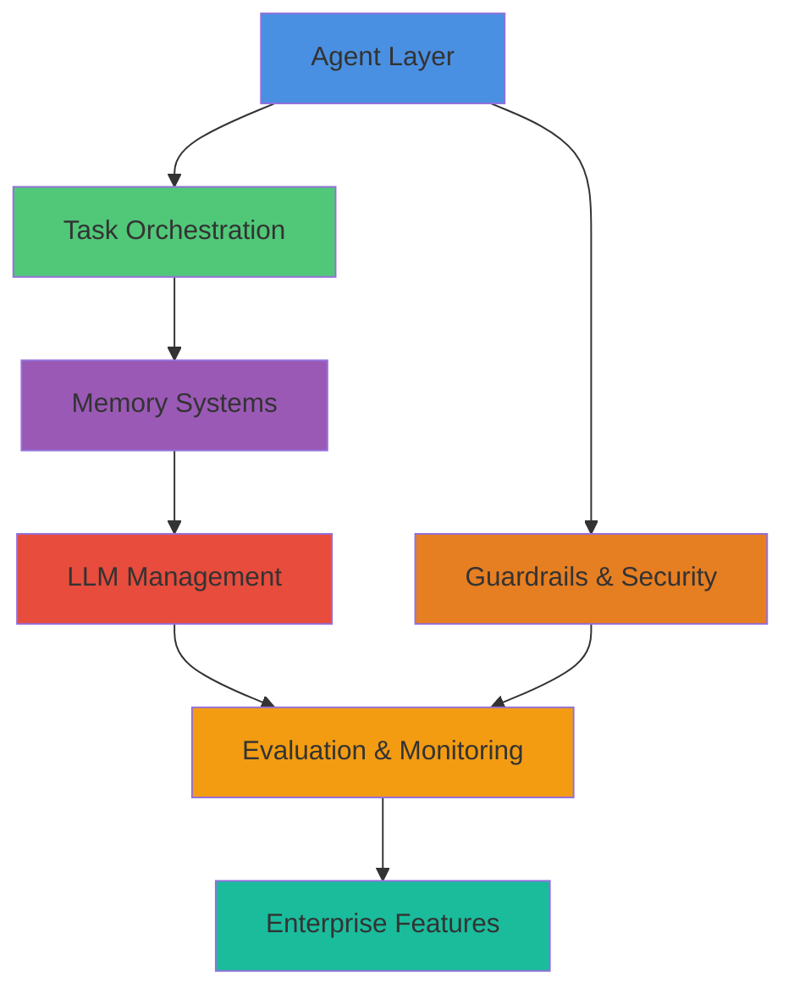

<div align="center">

<!-- Logo will be available once agenticaiframework.png is added to docs/assets/ -->
<!--  -->

# 🤖 AgenticAI Framework
### *Enterprise-Grade Multi-Agent Orchestration Platform*

[](https://www.python.org/downloads/)
[](https://opensource.org/licenses/MIT)
[](https://isathish.github.io/agenticaiframework/)
[](https://badge.fury.io/py/agenticaiframework)
[](https://github.com/isathish/agenticaiframework)
[](https://github.com/isathish/agenticaiframework)

**Production-ready Python SDK for building sophisticated AI agent systems with advanced orchestration, intelligent task management, comprehensive evaluation, and enterprise-grade monitoring.**

[📚 Documentation](https://isathish.github.io/agenticaiframework/) • [🚀 Quick Start](#-quick-start-examples) • [💡 Examples](https://isathish.github.io/agenticaiframework/EXAMPLES/) • [🤝 Contributing](#-community--support)

</div>

---

## 🎯 What Makes AgenticAI Framework Different?

<table>
<tr>
<td width="50%">

### 🚀 **Production-First Design**
Built for real-world workloads with comprehensive error handling, monitoring, resilience patterns, and a **66% test coverage** across **1036 tests**.

### 🧩 **Truly Modular**
Every component is independently composable, extensible, and replaceable. **35+ built-in tools** across file, web, database, and AI/ML categories.

### 🧠 **Intelligence Built-In**
Sophisticated memory management, multi-tier storage with TTL, and **12-tier evaluation framework** out of the box.

</td>
<td width="50%">

### 📊 **Enterprise-Ready**
**21 enterprise features** including distributed tracing, multi-region support, compliance monitoring, and tenant isolation.

### 🎓 **Developer Experience**
Intuitive APIs, comprehensive documentation, extensive examples, and powerful debugging tools make development enjoyable.

### 🌐 **Scale Effortlessly**
From single-agent prototypes to distributed multi-agent systems with built-in coordination and monitoring.

</td>
</tr>
</table>

---

## 🏗️ Architecture Overview

<div align="center">



</div>

### 🔧 Core Modules

| Module | Description |
|--------|-------------|
| **🤖 Agents** | Context engineering, multi-role agents, lifecycle management, performance monitoring |
| **📋 Tasks** | Task registration, execution tracking, workflow orchestration |
| **🧠 Memory** | Multi-tier architecture (short/long-term), TTL support, priority-based retention |
| **🔗 LLMs** | Circuit breaker pattern, automatic retry, response caching, model routing |
| **🛡️ Guardrails** | Content filtering, policy enforcement, semantic validation, tool use validation |
| **🔐 Security** | Prompt injection detection (15+ patterns), rate limiting, audit logging, PII filtering |
| **📊 Evaluation** | 12-tier assessment framework (model quality, RAG, safety, cost, business outcomes) |
| **📈 Monitoring** | Metrics recording, event logging, distributed tracing |
| **🎯 Prompts** | Template system, version control, prompt drift detection, vulnerability scanning |
| **📡 Communication** | HTTP, WebSocket, gRPC, message queues, pub/sub messaging |
| **⚙️ Processes** | Complex workflow patterns, dynamic adaptation, resource management |
| **🧩 Knowledge** | Semantic search, retrieval systems, knowledge graph integration |
| **🔧 Tools** | 35+ tools across 4 categories (file/document, web scraping, database, AI/ML) |
| **⚙️ Configurations** | Environment-specific configs, dynamic updates, versioning |

---

## 🔄 Framework Comparison

<div align="center">

| Feature | AgenticAI Framework | LangChain | CrewAI | AutoGen |
|:--------|:-------------------:|:---------:|:------:|:-------:|
| **Production Ready** | ✅ Enterprise | ⚠️ Experimental | ⚠️ Limited | ⚠️ Research |
| **Test Coverage** | ✅ 66% (1036 tests) | ⚠️ Variable | ❌ Limited | ⚠️ Basic |
| **Built-in Tools** | ✅ 35+ tools (4 categories) | ⚠️ Community | ❌ Limited | ⚠️ Basic |
| **Modular Architecture** | ✅ Fully composable | ⚠️ Monolithic | ❌ Fixed | ⚠️ Rigid |
| **Memory Management** | ✅ Multi-tier + TTL | ✅ Basic | ❌ None | ⚠️ Simple |
| **12-Tier Evaluation** | ✅ Built-in | ❌ None | ❌ None | ❌ None |
| **Task Orchestration** | ✅ Workflow execution | ⚠️ Linear chains | ✅ Role-based | ⚠️ Conversation |
| **Monitoring & Tracing** | ✅ Distributed tracing | ❌ None | ❌ None | ❌ None |
| **Error Handling** | ✅ Circuit breakers | ⚠️ Basic | ⚠️ Limited | ⚠️ Basic |
| **Multi-Agent Coordination** | ✅ Orchestration engine | ⚠️ Simple | ✅ Team-based | ✅ Group chat |
| **Guardrails & Safety** | ✅ Built-in + PII | ❌ Add-on | ❌ None | ❌ None |
| **Enterprise Features** | ✅ 21 features | ⚠️ Limited | ❌ None | ❌ None |

</div>

---

## 📦 Installation

<div align="center">

```bash
pip install agenticaiframework
```

</div>

<details>
<summary><b>📥 Installation Options</b></summary>

### Development Installation
```bash
git clone https://github.com/isathish/agenticaiframework.git
cd agenticaiframework
pip install -e .
```

### With Optional Dependencies
```bash
# Enhanced monitoring capabilities
pip install "agenticaiframework[monitoring]"

# Advanced memory features  
pip install "agenticaiframework[memory]"

# Documentation building
pip install "agenticaiframework[docs]"

# All optional dependencies
pip install "agenticaiframework[all]"
```

### Documentation Dependencies
```bash
pip install -r requirements-docs.txt
```

</details>

---

## ⚡ Quick Start Examples

### Simple Agent Creation
```python
from agenticaiframework import Agent

# Create a specialized agent
agent = Agent(
    name="DataAnalyst",
    role="Data Analysis Specialist", 
    capabilities=["data_processing", "visualization", "reporting"],
    config={
        "processing_timeout": 300,
        "output_format": "json",
        "enable_caching": True
    }
)

# Start the agent
agent.start()
print(f"Agent {agent.name} is ready and {agent.status}")
```

### Multi-Agent Collaboration
```python
from agenticaiframework import Agent, AgentManager

# Create specialized agents
data_collector = Agent(
    name="DataCollector",
    role="Data Collection Specialist",
    capabilities=["api_integration", "data_extraction"]
)

data_processor = Agent(
    name="DataProcessor", 
    role="Data Processing Specialist",
    capabilities=["data_cleaning", "transformation"]
)

report_generator = Agent(
    name="ReportGenerator",
    role="Report Generation Specialist", 
    capabilities=["analysis", "visualization", "reporting"]
)

# Manage agents
manager = AgentManager()
agents = [data_collector, data_processor, report_generator]

for agent in agents:
    manager.register_agent(agent)
    agent.start()

# Coordinate workflow
manager.coordinate_workflow(["collect_data", "process_data", "generate_report"])
```

### Advanced Task Management
```python
from agenticaiframework import Task, TaskManager

# Create task manager
task_manager = TaskManager()

# Define task executor function
def validate_data(data_source: str, rules: list) -> dict:
    """Validate data against rules."""
    return {"valid": True, "source": data_source, "rules_applied": len(rules)}

def process_data(batch_size: int) -> dict:
    """Process validated data."""
    return {"processed": batch_size, "status": "complete"}

# Create tasks with executors
data_validation = Task(
    name="data_validation",
    objective="Validate incoming data sources",
    executor=validate_data,
    inputs={"data_source": "api", "rules": ["not_null", "type_check"]}
)

data_processing = Task(
    name="data_processing", 
    objective="Process validated data",
    executor=process_data,
    inputs={"batch_size": 1000}
)

# Register and execute tasks
task_manager.register_task(data_validation)
task_manager.register_task(data_processing)

# Run all tasks
results = task_manager.run_all()
print(f"Results: {results}")
```

### Intelligent Memory Management
```python
from agenticaiframework import MemoryManager

# Create memory manager with tier limits
memory_manager = MemoryManager(
    short_term_limit=100,
    long_term_limit=1000
)

# Store with TTL and priority
memory_manager.store(
    key="user_preferences",
    value={
        "communication_style": "detailed_explanations",
        "preferred_format": "structured_json",
        "domain_expertise": ["data_science", "machine_learning"]
    },
    memory_type="long_term",
    ttl=86400,  # 24 hours
    priority=5,
    metadata={"source": "user_profile"}
)

# Retrieve memory
user_prefs = memory_manager.retrieve("user_preferences")
print(f"User preferences: {user_prefs}")

# Search memories
results = memory_manager.search("user", memory_type="long_term")
print(f"Found {len(results)} matching memories")
```

### Comprehensive Monitoring
```python
from agenticaiframework import MonitoringSystem

# Initialize monitoring
monitoring = MonitoringSystem()

# Record agent metrics
monitoring.record_metric("agent_response_time", 1.2)
monitoring.record_metric("agent_success_rate", 0.95)
monitoring.record_metric("memory_usage_mb", 128)

# Log events
monitoring.log_event("task_completed", {
    "task_name": "data_processing",
    "duration": 2.5,
    "status": "success"
})

# Log messages
monitoring.log_message("Processing pipeline started")

# Get metrics and events
metrics = monitoring.get_metrics()
events = monitoring.get_events()
print(f"Current metrics: {metrics}")
print(f"Logged events: {len(events)}")
```

---

## 🏢 Enterprise Features

AgenticAI Framework includes **21 enterprise-grade features** for production deployments:

### 🛠️ **Tools Framework (35+ Tools)**
| Category | Tools |
|----------|-------|
| **File & Document** | FileReadTool, FileWriteTool, DirectoryReadTool, OCRTool, PDFTextWritingTool, PDF/DOCX/MDX/XML/TXT/JSON/CSV RAG Search |
| **Web Scraping** | ScrapeWebsiteTool, SeleniumScraperTool, FirecrawlTool, ScrapflyScrapeWebsiteTool, BrowserbaseTool, OxylabsScraperTool, BrightDataTool |
| **Database** | MySQLRAGSearchTool, PostgreSQLRAGSearchTool, SnowflakeSearchTool, NL2SQLTool, Qdrant/Weaviate/MongoDB Vector Search |
| **AI/ML** | DALLETool, VisionTool, AIMindTool, LlamaIndexTool, LangChainTool, RAGTool, CodeInterpreterTool |

### 📊 **Observability & Metrics**
| Feature | Description |
|---------|-------------|
| **Agent Step Tracing** | Distributed tracing with span hierarchy and context propagation |
| **Latency Metrics** | Percentile-based latency tracking (P50, P95, P99) |

### 🔍 **Evaluation & Testing**
| Feature | Description |
|---------|-------------|
| **Model Quality Evaluation** | Hallucination detection, reasoning assessment, token efficiency |
| **Task & Skill Evaluation** | Success rates, retry tracking, completion percentages |
| **Tool & API Evaluation** | Tool invocation tracking, parameter validation, latency monitoring |
| **Workflow Evaluation** | Multi-agent orchestration, handoff tracking, deadlock detection |
| **Memory & Context Evaluation** | Context precision/recall, stale data detection, quality scoring |
| **RAG Evaluation** | Retrieval quality, faithfulness, groundedness, citation accuracy |
| **Autonomy & Planning** | Plan optimality, replanning tracking, human intervention |
| **Performance & Scalability** | Latency percentiles (P50/P95/P99), throughput, stability |
| **Cost & FinOps** | Token usage tracking, cost per request, budget optimization |
| **Human-in-the-Loop** | Acceptance rates, override tracking, trust scoring |
| **Business Outcomes** | ROI calculation, baseline comparison, impact metrics |
| **Security Risk Scoring** | Input/output risk assessment, PII detection, policy compliance |
| **A/B Testing Framework** | Experiment management with statistical significance |
| **Canary Deployments** | Gradual rollouts with automatic rollback |

### 📝 **Prompt Management**
| Feature | Description |
|---------|-------------|
| **Prompt Versioning** | Semantic versioning with draft→active→deprecated workflow |
| **Prompt Library** | Reusable components with template inheritance |

### 🎨 **Visual Tools APIs**
| Feature | Description |
|---------|-------------|
| **Agent Builder** | Component library and blueprint management |
| **Workflow Designer** | Visual workflow design with node/edge management |
| **Admin Console** | User management, configuration, and dashboards |

### 🔗 **Integrations**
| Feature | Description |
|---------|-------------|
| **ITSM (ServiceNow)** | Incident management and change requests |
| **Dev Tools (GitHub, ADO)** | Issues, PRs, pipelines integration |
| **Data Platforms** | Snowflake and Databricks connectors |
| **Webhooks** | Incoming/outgoing webhook management |

### 🏗️ **Infrastructure**
| Feature | Description |
|---------|-------------|
| **Serverless Execution** | Function deployment with auto-scaling |
| **Multi-Region Support** | Geographic load balancing and failover |
| **Tenant Isolation** | Multi-tenant resource isolation and quotas |

### 🔐 **Compliance & Governance**
| Feature | Description |
|---------|-------------|
| **Audit Trails** | Tamper-evident logging with hash chain integrity |
| **Policy Enforcement** | Rule-based policies with pattern matching |
| **Data Masking** | PII detection with multiple masking strategies |

---

## 🎯 Use Cases & Applications

| Domain | Applications |
|--------|-------------|
| **🏢 Enterprise Automation** | Document processing, workflow automation, compliance monitoring, resource optimization |
| **🔬 Research & Development** | Literature review, hypothesis generation, data analysis, experiment design |
| **💬 Customer Experience** | Intelligent support, personalization, sentiment analysis, predictive support |
| **🎓 Education & Training** | Adaptive learning, content generation, assessment, AI tutoring |
| **🏥 Healthcare** | Clinical decision support, drug discovery, patient monitoring, medical documentation |

---

## 🔧 Development & Deployment

### Development Workflow
```bash
# Clone and setup development environment
git clone https://github.com/isathish/agenticaiframework.git
cd agenticaiframework

# Create virtual environment
python -m venv .venv
source .venv/bin/activate  # On Windows: .venv\Scripts\activate

# Install development dependencies
pip install -e ".[dev]"

# Run tests
pytest tests/

# Run with coverage
pytest tests/ --cov=agenticaiframework --cov-report=html

# Build documentation locally
mkdocs serve  # View at http://127.0.0.1:8000
```

### Production Deployment
```python
from agenticaiframework import AgentManager, MonitoringSystem
from agenticaiframework.memory import DatabaseMemory

# Production-ready setup
memory = DatabaseMemory(
    db_path="/data/production/agent_memory.db",
    backup_interval=3600,
    max_connections=100
)

monitoring = MonitoringSystem(
    metrics_backend="prometheus",
    alerting_enabled=True,
    log_level="INFO"
)

manager = AgentManager(
    memory=memory,
    monitoring=monitoring,
    max_agents=50,
    auto_scaling=True
)
```

### Docker Deployment
```dockerfile
FROM python:3.11-slim

WORKDIR /app
COPY requirements.txt .
RUN pip install -r requirements.txt

COPY . .
RUN pip install -e .

EXPOSE 8000
CMD ["python", "-m", "agenticaiframework.server"]
```

---

## 📚 Documentation & Resources

### 📖 **Documentation**
- **[Complete Documentation](https://isathish.github.io/agenticaiframework/)** - Full framework documentation
- **[API Reference](https://isathish.github.io/agenticaiframework/API_REFERENCE/)** - Detailed API documentation
- **[Quick Start Guide](https://isathish.github.io/agenticaiframework/quick-start/)** - Get started in minutes
- **[Best Practices](https://isathish.github.io/agenticaiframework/best-practices/)** - Production-ready patterns

### 🎯 **Module Guides**
- **[Agents](https://isathish.github.io/agenticaiframework/agents/)** - Creating and managing intelligent agents
- **[Tasks](https://isathish.github.io/agenticaiframework/tasks/)** - Advanced task orchestration
- **[Memory](https://isathish.github.io/agenticaiframework/memory/)** - Sophisticated memory systems
- **[Monitoring](https://isathish.github.io/agenticaiframework/monitoring/)** - Comprehensive observability
- **[Guardrails](https://isathish.github.io/agenticaiframework/guardrails/)** - Safety and compliance

### 💡 **Examples**
- **[Basic Examples](https://isathish.github.io/agenticaiframework/EXAMPLES/)** - Simple usage patterns
- **[Advanced Examples](https://isathish.github.io/agenticaiframework/examples/)** - Complex real-world scenarios
- **[Integration Examples](https://isathish.github.io/agenticaiframework/integration/)** - Third-party integrations

---

## 📊 Test Coverage Summary

<div align="center">


</div>

<details>
<summary><b>🧪 Running Tests</b></summary>

```bash
# Run all tests
pytest tests/

# Run with coverage report
pytest tests/ --cov=agenticaiframework --cov-report=html

# Run specific test modules
pytest tests/test_agenticai.py -v              # Core framework tests
pytest tests/test_all_evaluation_types.py -v   # 12-tier evaluation tests
pytest tests/test_memory_coverage.py -v        # Memory system tests
pytest tests/test_agents_coverage.py -v        # Agent & context tests
```

</details>

<details>
<summary><b>📊 Module Coverage Details</b></summary>

| Module | Coverage | Status | Key Features |
|--------|----------|--------|--------------|
| **Evaluation (Advanced)** | 81% | 🟢 | 12-tier evaluation framework |
| **Communication** | 100% | 🟢 | Multi-protocol support |
| **Processes** | 100% | 🟢 | Workflow orchestration |
| **Knowledge** | 94% | 🟢 | Semantic search & retrieval |
| **Configurations** | 100% | 🟢 | Environment management |
| **Evaluation (Basic)** | 100% | 🟢 | Core evaluation system |
| **Integrations** | 95% | 🟢 | Third-party integrations |
| **Hub** | 85% | 🟢 | Agent coordination |
| **Monitoring** | 86% | 🟢 | Observability & tracing |
| **Memory** | 82% | 🟡 | Multi-tier memory systems |
| **Security** | 74% | 🟡 | Prompt injection protection |
| **Agents** | 83% | 🟡 | Context engineering |
| **MCP Tools** | 79% | 🟡 | Model Context Protocol |
| **Tasks** | 80% | 🟡 | Task orchestration |
| **Guardrails** | 75% | 🟡 | Safety enforcement |
| **Prompts** | 71% | 🟡 | Template & security |
| **LLMs** | 60% | 🟡 | Model routing & management |

</details>

<details>
<summary><b>🎯 Test Categories</b></summary>

| Category | Tests | Coverage |
|----------|-------|----------|
| **Evaluation Framework** | 162 | 12-tier evaluation system |
| **Core Functionality** | 180 | Basic operations |
| **Enterprise Features** | 150 | Compliance, integrations |
| **Security & Safety** | 120 | Injection protection |
| **Advanced Features** | 200 | Context engineering, orchestration |
| **Convenience Methods** | 50 | New API wrappers |
| **Edge Cases** | 174 | Error handling |

</details>

### ✅ Quality Metrics

| Metric | Status | Details |
|:-------|:------:|:--------|
| **Test Coverage** | ✅ 66% | 1036 passing tests across 17 modules |
| **Code Quality** | ✅ Production | Comprehensive testing & validation |
| **Evaluation** | ✅ 12-Tier | Industry-leading evaluation framework |
| **Security** | ✅ Enterprise | Prompt injection detection, PII protection |
| **Performance** | ✅ Optimized | Circuit breakers, caching, retry mechanisms |

---

## 🤝 Community & Support

<div align="center">

[](https://github.com/isathish/agenticaiframework/issues)
[](https://github.com/isathish/agenticaiframework/discussions)
[](https://isathish.github.io/agenticaiframework/)

</div>

<table>
<tr>
<td width="33%" align="center">

### 📞 **Getting Help**
- 🐛 [Report Bugs](https://github.com/isathish/agenticaiframework/issues)
- 💬 [Ask Questions](https://github.com/isathish/agenticaiframework/discussions)
- 📖 [Read Docs](https://isathish.github.io/agenticaiframework/)

</td>
<td width="33%" align="center">

### 🤝 **Contributing**
- 💻 [Code Contributions](https://github.com/isathish/agenticaiframework/pulls)
- ✨ [Feature Requests](https://github.com/isathish/agenticaiframework/issues/new)
- 📝 [Improve Docs](https://github.com/isathish/agenticaiframework)

</td>
<td width="33%" align="center">

### 🌟 **Support Project**
- ⭐ [Star on GitHub](https://github.com/isathish/agenticaiframework)
- 🔗 [Share Project](https://github.com/isathish/agenticaiframework)
- 📢 [Spread Word](https://twitter.com/intent/tweet?text=Check%20out%20AgenticAI%20Framework)

</td>
</tr>
</table>

### 📋 **Development Roadmap**
- **Q1 2026**: Enhanced multi-modal capabilities and advanced evaluation metrics
- **Q2 2026**: Distributed agent coordination and multi-region deployment
- **Q3 2026**: Advanced ML/AI integrations and self-healing capabilities
- **Q4 2026**: Enterprise security, compliance features, and plugin marketplace

---

<div align="center">

## 📄 License

**MIT License** - See [LICENSE](LICENSE) file for details

---

### 🌟 Star History

[](https://star-history.com/#isathish/agenticaiframework&Date)

---

## 🙏 Acknowledgments

<table>
<tr>
<td align="center">
<b>Built with ❤️ by the AgenticAI Framework Team</b><br>
<sub>Making AI agents accessible, reliable, and production-ready</sub><br><br>
<sub>Special thanks to all contributors who have helped make this framework better!</sub>
</td>
</tr>
</table>

**[⬆ Back to Top](#-agenticai-framework)**

---

<sub>© 2026 AgenticAI Framework. All rights reserved. | [Documentation](https://isathish.github.io/agenticaiframework/) | [GitHub](https://github.com/isathish/agenticaiframework) | [PyPI](https://pypi.org/project/agenticaiframework/)</sub>

</div>
