<div align="center">

# AgenticAI Framework

### *Enterprise-Grade Multi-Agent AI Orchestration Platform*

[](https://www.python.org/downloads/)
[](https://opensource.org/licenses/MIT)
[](https://isathish.github.io/agenticaiframework/)
[](https://badge.fury.io/py/agenticaiframework)
[](https://github.com/isathish/agenticaiframework)
[](https://github.com/isathish/agenticaiframework)
[](https://github.com/psf/black)

**The most comprehensive Python SDK for building production-ready AI agent systems with 400+ modules, 237 enterprise features, advanced orchestration, intelligent memory management, speech processing, state management, and enterprise-grade monitoring.**

[Documentation](https://isathish.github.io/agenticaiframework/) | [Quick Start](#quick-start) | [Examples](#examples) | [Contributing](#contributing)

---


</div>

---

## Table of Contents

- [Key Features](#key-features)
- [Architecture](#architecture)
- [Installation](#installation)
- [Quick Start](#quick-start)
- [Core Modules](#core-modules)
- [Advanced Features](#advanced-features)
- [Enterprise Features](#enterprise-features)
- [Evaluation Framework](#evaluation-framework)
- [Framework Comparison](#framework-comparison)
- [Documentation](#documentation)
- [Contributing](#contributing)
- [License](#license)

---

## Key Features

<table>
<tr>
<td width="50%">

### **Production-First Design**
- Enterprise-grade reliability with **66% test coverage**
- **1036+ tests** ensuring stability
- Circuit breaker patterns & automatic retry
- Comprehensive error handling

### **Modular Architecture**
- **400+ independently composable modules**
- **237 enterprise-grade modules**
- Plug-and-play component system
- Clean separation of concerns
- Easy customization & extension

### **Intelligent Memory**
- **7 specialized memory managers**
- Multi-tier storage with TTL
- Context compression & windowing
- Automatic memory consolidation

</td>
<td width="50%">

### **Multi-Agent Orchestration**
- Team-based coordination
- Supervisor & peer patterns
- Task handoff & delegation
- Shared context management

### **Speech Processing**
- STT/TTS integration
- Voice profile management
- Multi-language support
- Audio caching & optimization

### **12-Tier Evaluation**
- Model quality assessment
- RAG evaluation
- Security risk scoring
- Business outcome tracking

### **Enterprise Ready**
- 15+ API Management modules
- 18+ Security & Compliance modules
- 14+ ML/AI Infrastructure modules
- 12+ Domain-Driven Design patterns

</td>
</tr>
</table>

---

## Architecture

```mermaid
graph TB
    subgraph Framework["AgenticAI Framework -- 400+ Modules"]
        direction TB

        subgraph Core["Core Layer"]
            direction LR
            subgraph G1[" "]
                direction TB
                A["Agents\nContext - Memory - Tools"]
                W["Workflows\nSteps - Routing - State"]
            end
            subgraph G2[" "]
                direction TB
                O["Orchestration\nTeams - Handoffs - Messages"]
                SP["Speech\nSTT/TTS - Profiles - Cache"]
            end
        end

        subgraph Middle["Services Layer"]
            direction LR
            subgraph G3[" "]
                direction TB
                M["Memory\n7 Managers - Multi-tier - TTL"]
                S["State\n7 Managers - Persistence"]
            end
            subgraph G4[" "]
                direction TB
                C["Communication\nHTTP - WS - MQTT - gRPC - SSE - STDIO"]
                K["Knowledge\nRetrieval - RAG - Embedding - Search"]
            end
        end

        subgraph Safety["Safety and Quality Layer"]
            direction LR
            GR["Guardrails\nContent - Policy - Semantic"]
            SEC["Security\nInjection - PII - Rate Limiting"]
            EV["Evaluation\n12-Tier - A/B - Canary"]
            MON["Monitoring\nMetrics - Tracing - Events"]
        end

        subgraph Foundation["Foundation Layer"]
            direction LR
            LLM["LLMs\nRouting - Caching - Fallback"]
            T["Tools\n35+ Built-in - Registry - MCP"]
            P["Prompts\nVersioning - Templates - Security"]
            CO["Compliance\nAudit - Masking - Policy"]
        end

        subgraph Enterprise["Enterprise Layer -- 237 Modules"]
            direction LR
            subgraph E1[" "]
                direction TB
                API["API Management\nGateway - Versioning - Lifecycle"]
                ESEC["Security\nEncryption - Vault - Auth/RBAC"]
                DP["Data Processing\nPipeline - Lineage - ETL"]
            end
            subgraph E2[" "]
                direction TB
                ML["ML/AI Infra\nInference - Feature Store - RAG"]
                MSG["Messaging\nEvent Bus - Pub/Sub - CQRS"]
                INF["Infrastructure\nLoad Bal. - Circuit Brk - Mesh"]
            end
            subgraph E3[" "]
                direction TB
                DEV["DevOps\nCanary - Blue-Green - Chaos"]
                DDD["DDD\nAggregate - Saga - Repository"]
                CAC["Caching\nRedis - Distributed - Multi-tier"]
            end
            subgraph E4[" "]
                direction TB
                OBS["Observability\nTracing - Metrics - APM"]
                WF["Workflow\nEngine - Scheduler - State Machine"]
                INT["Integrations\nServiceNow - Cloud - Webhooks"]
            end
        end
    end

    Core --> Middle
    Middle --> Safety
    Safety --> Foundation
    Foundation --> Enterprise

    style Framework fill:#0d1117,stroke:#30363d,color:#c9d1d9
    style Core fill:#161b22,stroke:#58a6ff,color:#c9d1d9
    style Middle fill:#161b22,stroke:#3fb950,color:#c9d1d9
    style Safety fill:#161b22,stroke:#d29922,color:#c9d1d9
    style Foundation fill:#161b22,stroke:#bc8cff,color:#c9d1d9
    style Enterprise fill:#161b22,stroke:#f778ba,color:#c9d1d9
    style A fill:#1f6feb,stroke:#58a6ff,color:#fff
    style W fill:#1f6feb,stroke:#58a6ff,color:#fff
    style O fill:#1f6feb,stroke:#58a6ff,color:#fff
    style SP fill:#1f6feb,stroke:#58a6ff,color:#fff
    style M fill:#238636,stroke:#3fb950,color:#fff
    style S fill:#238636,stroke:#3fb950,color:#fff
    style C fill:#238636,stroke:#3fb950,color:#fff
    style K fill:#238636,stroke:#3fb950,color:#fff
    style GR fill:#9e6a03,stroke:#d29922,color:#fff
    style SEC fill:#9e6a03,stroke:#d29922,color:#fff
    style EV fill:#9e6a03,stroke:#d29922,color:#fff
    style MON fill:#9e6a03,stroke:#d29922,color:#fff
    style LLM fill:#6e40c9,stroke:#bc8cff,color:#fff
    style T fill:#6e40c9,stroke:#bc8cff,color:#fff
    style P fill:#6e40c9,stroke:#bc8cff,color:#fff
    style CO fill:#6e40c9,stroke:#bc8cff,color:#fff
    style API fill:#b62324,stroke:#f778ba,color:#fff
    style ESEC fill:#b62324,stroke:#f778ba,color:#fff
    style DP fill:#b62324,stroke:#f778ba,color:#fff
    style ML fill:#b62324,stroke:#f778ba,color:#fff
    style MSG fill:#b62324,stroke:#f778ba,color:#fff
    style INF fill:#b62324,stroke:#f778ba,color:#fff
    style DEV fill:#b62324,stroke:#f778ba,color:#fff
    style DDD fill:#b62324,stroke:#f778ba,color:#fff
    style CAC fill:#b62324,stroke:#f778ba,color:#fff
    style OBS fill:#b62324,stroke:#f778ba,color:#fff
    style WF fill:#b62324,stroke:#f778ba,color:#fff
    style INT fill:#b62324,stroke:#f778ba,color:#fff
```



---

## Installation

### Quick Install

```bash
pip install agenticaiframework
```

### Development Install

```bash
git clone https://github.com/isathish/agenticaiframework.git
cd agenticaiframework
pip install -e ".[dev]"
```

### Optional Dependencies

```bash
# Full installation with all features
pip install "agenticaiframework[all]"

# Specific feature sets
pip install "agenticaiframework[monitoring]" # Enhanced observability
pip install "agenticaiframework[memory]" # Advanced memory features
pip install "agenticaiframework[speech]" # Speech processing
pip install "agenticaiframework[docs]" # Documentation building
```

---

## Quick Start

### 1. Create an Agent

```python
from agenticaiframework import Agent, AgentManager

# Create a specialized agent
agent = Agent(
    name="ResearchAssistant",
    role="Research Specialist",
    capabilities=["web_search", "document_analysis", "summarization"],
    config={"model": "gpt-4", "temperature": 0.7}
)

# Start the agent
agent.start()
print(f"Agent {agent.name} is {agent.status}")
```

### 2. Multi-Agent Orchestration

```python
from agenticaiframework.orchestration import OrchestrationEngine, AgentTeam

# Create a team of agents
team = AgentTeam(
    name="ResearchTeam",
    agents=[researcher, analyst, writer],
    coordination_strategy="supervisor"
)

# Create orchestration engine
engine = OrchestrationEngine()
engine.register_team(team)

# Execute coordinated task
result = engine.execute_task(
    task="Research AI trends and write a comprehensive report",
    team_id="ResearchTeam"
)
```

### 3. Intelligent Memory Management

```python
from agenticaiframework.memory import (
    AgentMemoryManager,
    WorkflowMemoryManager,
    OrchestrationMemoryManager,
    KnowledgeMemoryManager,
    ToolMemoryManager,
    SpeechMemoryManager
)

# Agent-specific memory with 4 memory types
agent_memory = AgentMemoryManager("agent_001")
agent_memory.add_turn("user", "What's the weather like?")
agent_memory.add_turn("assistant", "It's sunny and 72°F.")
agent_memory.set_working("current_task", "weather_query", ttl_seconds=300)
agent_memory.learn_fact("User prefers Fahrenheit", "preference")
agent_memory.record_episode("weather_query", {"temp": 72}, "Successful query")

# Workflow memory with step tracking & checkpoints
workflow_memory = WorkflowMemoryManager()
ctx = workflow_memory.create_context("workflow_001", {"input": "data"})
workflow_memory.set_variable("workflow_001", "status", "processing")
workflow_memory.record_step_result("workflow_001", "step1", "Process", {"result": "ok"})
workflow_memory.create_checkpoint("workflow_001", "Before critical operation")

# Team shared memory with messaging
team_memory = OrchestrationMemoryManager()
team_memory.create_team_context("team_001", "Complete analysis task")
team_memory.send_message("agent_a", "agent_b", "Task completed", priority="high")
team_memory.record_contribution("team_001", "agent_a", {"output": "analysis"})

# Knowledge memory with embedding cache
knowledge_memory = KnowledgeMemoryManager()
knowledge_memory.cache_embedding("sample text", [0.1, 0.2, 0.3], "text-embedding-3")
knowledge_memory.cache_query_result("What is AI?", "kb_001", [{"doc": "AI is..."}], 5)

# Tool memory with result caching
tool_memory = ToolMemoryManager()
tool_memory.cache_result("calculator", {"x": 1, "y": 2}, {"sum": 3})
tool_memory.record_execution("calculator", {"x": 1}, {"sum": 3}, 50, True)

# Speech memory with voice profiles
speech_memory = SpeechMemoryManager()
speech_memory.store_transcription(audio_data, "Hello world", "en", 0.95)
speech_memory.store_synthesis("Hello world", audio_output, "voice_001", 120)
speech_memory.create_voice_profile("user_001", "User One", [0.1, 0.2], {"lang": "en"})
```

### 4. State Management

```python
from agenticaiframework.state import (
    AgentStateManager,
    WorkflowStateManager,
    OrchestrationStateManager,
    KnowledgeStateManager,
    ToolStateManager,
    SpeechStateManager
)

# Agent state with persistence & checkpoints
agent_state = AgentStateManager("agent_001", persist=True)
agent_state.transition("idle", "processing")
agent_state.update_context({"current_task": "analysis"})
agent_state.create_checkpoint("Before critical decision")

# Workflow state with step tracking
workflow_state = WorkflowStateManager("workflow_001")
workflow_state.set_current_step("data_processing")
workflow_state.record_step_completion("validation", {"passed": True})

# Orchestration state for team coordination
orch_state = OrchestrationStateManager("team_001")
orch_state.update_team_status("active")
orch_state.record_agent_contribution("agent_a", {"output": "analysis_result"})

# Knowledge state for index management
knowledge_state = KnowledgeStateManager("kb_001")
knowledge_state.set_index_status("ready")
knowledge_state.record_retrieval("query_001", ["doc1", "doc2"])

# Tool state with circuit breaker
tool_state = ToolStateManager("calculator")
tool_state.set_availability(True)
tool_state.record_execution(success=True, duration_ms=50)

# Speech state for session management
speech_state = SpeechStateManager("session_001")
speech_state.set_mode("listening")
speech_state.update_voice_context({"language": "en", "speaker": "user_001"})
```

### 5. Speech Processing

```python
from agenticaiframework.speech import SpeechProcessor

# Initialize speech processor
speech = SpeechProcessor(
    stt_provider="whisper",
    tts_provider="elevenlabs",
    default_language="en"
)

# Speech-to-Text
transcription = speech.transcribe(audio_data, language="en")
print(f"Transcribed: {transcription.text} (confidence: {transcription.confidence})")

# Text-to-Speech
audio = speech.synthesize("Hello, how can I help you today?", voice="professional")
speech.play(audio)

# Voice profile management
speech.register_voice("user_001", voice_sample, metadata={"language": "en"})
identified = speech.identify_speaker(audio_data)
```

### 6. Comprehensive Monitoring

```python
from agenticaiframework import MonitoringSystem

# Initialize monitoring
monitoring = MonitoringSystem()

# Record metrics
monitoring.record_metric("agent_response_time", 1.2)
monitoring.record_metric("agent_success_rate", 0.95)
monitoring.record_metric("memory_usage_mb", 128)

# Log events with context
monitoring.log_event("task_completed", {
    "task_name": "data_processing",
    "duration": 2.5,
    "status": "success"
})

# Distributed tracing
with monitoring.trace("process_request") as span:
    span.set_attribute("user_id", "user_001")
    # Your processing logic
    span.add_event("processing_complete")
```

---

## Core Modules

### Memory Management (7 Specialized Managers)

| Manager | Purpose | Key Features |
|---------|---------|--------------|
| **MemoryManager** | Core multi-tier memory | Short/long-term, TTL, LRU eviction, consolidation |
| **AgentMemoryManager** | Agent-specific memory | Conversation, working, episodic, semantic memory |
| **WorkflowMemoryManager** | Workflow execution memory | Step results, context passing, checkpoints |
| **OrchestrationMemoryManager** | Multi-agent shared memory | Team context, messaging, task handoffs |
| **KnowledgeMemoryManager** | Knowledge base memory | Embedding cache, query results, retrieval history |
| **ToolMemoryManager** | Tool execution memory | Result caching, patterns, performance stats |
| **SpeechMemoryManager** | Speech processing memory | Transcription/synthesis history, voice profiles |

### State Management (7 State Managers)

| Manager | Purpose | Key Features |
|---------|---------|--------------|
| **StateManager** | Core state management | State transitions, history, persistence |
| **AgentStateManager** | Agent lifecycle state | Status, context, checkpoints, metrics |
| **WorkflowStateManager** | Workflow execution state | Step tracking, routing, error handling |
| **OrchestrationStateManager** | Team coordination state | Team status, agent states, coordination |
| **KnowledgeStateManager** | Knowledge base state | Index status, sync state, retrieval state |
| **ToolStateManager** | Tool execution state | Availability, execution, circuit breakers |
| **SpeechStateManager** | Speech processing state | Session, voice, processing state |

### Communication Protocols (6 Protocols)

| Protocol | Use Case | Features |
|----------|----------|----------|
| **HTTP** | REST APIs | Request/response, webhooks |
| **WebSocket** | Real-time | Bidirectional, low-latency |
| **SSE** | Event streaming | Server-push, one-way |
| **MQTT** | IoT/Messaging | Pub/sub, lightweight |
| **gRPC** | High-performance | Streaming, strong typing |
| **STDIO** | Local processes | MCP compatibility |

### Context Management

```python
from agenticaiframework.context import (
    ContextManager,
    ContextWindow,
    ContextCompressor
)

# Manage context windows
context = ContextManager(max_tokens=8000)
context.add_message("user", "Hello!")
context.add_message("assistant", "Hi there!")

# Automatic compression when needed
compressor = ContextCompressor(strategy="summarize")
compressed = compressor.compress(context.messages, target_tokens=4000)

# Sliding window management
window = ContextWindow(size=10, overlap=2)
window.add(message)
recent = window.get_recent(5)
```

---

## Advanced Features

### Tools Framework (35+ Built-in Tools)

```python
from agenticaiframework.tools import (
    ToolRegistry,
    ToolExecutor,
    BaseTool,
    register_tool
)

# Register custom tool
@register_tool(category="analysis", version="1.0")
class DataAnalysisTool(BaseTool):
    name = "data_analysis"
    description = "Analyze data and generate insights"

    def execute(self, data: dict) -> dict:
        # Your analysis logic
        return {"insights": [...], "metrics": {...}}

# Use tool executor with caching
executor = ToolExecutor()
result = executor.execute("data_analysis", {"data": dataset})
```

**Tool Categories:**
| Category | Tools |
|----------|-------|
| **File & Document** | FileRead, FileWrite, PDF, DOCX, OCR, RAG Search |
| **Web Scraping** | Selenium, Firecrawl, BrightData, Oxylabs |
| **Database** | MySQL, PostgreSQL, Snowflake, MongoDB, Vector Search |
| **AI/ML** | DALL-E, Vision, Code Interpreter, LangChain, LlamaIndex |

### Guardrails & Safety

```python
from agenticaiframework.guardrails import GuardrailManager, ContentGuardrail

# Setup guardrails
guardrails = GuardrailManager()

# Add content filtering
guardrails.add(ContentGuardrail(
    blocked_topics=["violence", "hate_speech"],
    pii_detection=True,
    max_token_limit=4000
))

# Validate input/output
result = guardrails.validate(user_input)
if not result.passed:
    print(f"Blocked: {result.violations}")
```

### Human-in-the-Loop (HITL)

```python
from agenticaiframework.hitl import HITLManager

# Setup HITL manager
hitl = HITLManager(
    approval_required=["high_risk_actions"],
    timeout=300, # 5 minutes
    escalation_policy="notify_admin"
)

# Request human approval
approval = await hitl.request_approval(
    action="delete_records",
    context={"count": 1000, "table": "users"},
    urgency="high"
)

if approval.granted:
    execute_action()
```

### Conversation Management

```python
from agenticaiframework.conversations import ConversationManager

# Manage multi-turn conversations
conversation = ConversationManager(
    session_id="session_001",
    max_turns=50,
    context_strategy="sliding_window"
)

# Add turns with metadata
conversation.add_turn(
    role="user",
    content="Analyze this data",
    metadata={"intent": "analysis", "entities": ["data"]}
)

# Get conversation summary
summary = conversation.summarize()
```

### Response Formatting

```python
from agenticaiframework.formatting import ResponseFormatter

# Format responses consistently
formatter = ResponseFormatter(
    style="professional",
    format="markdown",
    max_length=2000
)

# Format agent response
formatted = formatter.format(
    response=raw_response,
    include_sources=True,
    add_disclaimer=True
)
```

---

## Enterprise Features

### 237 Enterprise-Grade Modules

The AgenticAI Framework includes a comprehensive enterprise module library organized into the following categories:

<table>
<tr>
<td width="50%">

** API Management (15 Modules)**
- API Gateway, Versioning, Lifecycle Manager
- API Client, Docs Generator, Rate Limiting
- GraphQL, REST, gRPC Support
- API Analytics, Monitoring, Testing

** Security & Compliance (18 Modules)**
- Encryption Service, Secret Manager, Vault
- Authentication (OAuth, JWT, SAML, SSO)
- Authorization (RBAC, ABAC, Policies)
- PII Detection, Data Masking, Audit Trails
- Prompt Injection Detection (15+ patterns)

** Data Processing (16 Modules)**
- Data Pipeline, ETL, Data Lineage
- Data Validator, Transformer, Aggregator
- Data Privacy Manager, Masking
- Data Quality, Profiling, Catalog
- Stream Processing, Batch Processing

** ML/AI Infrastructure (14 Modules)**
- ML Inference, Feature Store, Model Registry
- RAG, Embeddings, Recommendation Engine
- Vector Store, Semantic Search
- Model Versioning, A/B Testing
- LLM Gateway, Prompt Management

</td>
<td width="50%">

** Messaging & Events (12 Modules)**
- Message Broker, Pub/Sub, Event Bus
- Event Sourcing, Event Store, CQRS
- Message Queue, Kafka Integration
- Webhook Manager, Notification Hub
- Real-time Sync, Change Data Capture

** Infrastructure (20 Modules)**
- Load Balancer, Circuit Breaker, Rate Limiter
- Service Discovery, Service Registry, Mesh
- Health Check, Health Monitor
- Resource Manager, Cluster Manager
- Container Orchestration, Kubernetes
- Auto-scaling, Capacity Planning

** DevOps & Deployment (15 Modules)**
- Deployment Manager, Canary Releases
- Blue-Green Deployment, Rolling Updates
- Chaos Engineering, Fault Injection
- CI/CD Integration, GitOps
- Environment Manager, Config Manager

** Domain-Driven Design (12 Modules)**
- Aggregate, Aggregate Root, Entities
- Bounded Context, Domain Events, Saga
- Repository Pattern, Unit of Work
- Value Objects, Specifications
- Anti-Corruption Layer

</td>
</tr>
</table>

<table>
<tr>
<td width="50%">

** Storage & Caching (14 Modules)**
- Cache Manager, Redis, Memcached
- Database Abstraction, ORM Support
- Object Storage, File Manager
- Backup Manager, Archive
- Distributed Cache, Cache Sync

** Observability (16 Modules)**
- Distributed Tracing, Span Hierarchy
- Metrics Collector, Custom Dashboards
- Log Aggregator, Log Analysis
- Alerting, Anomaly Detection
- Performance Profiling, APM
- Latency Percentiles (P50, P95, P99)

** Workflow & Orchestration (12 Modules)**
- Workflow Engine, State Machine
- Task Scheduler, Job Queue Manager
- Process Orchestrator, Saga Pattern
- Retry Manager, Compensation
- Async Processing, Batch Jobs

</td>
<td width="50%">

** Integration Connectors (18 Modules)**
- ServiceNow (ITSM), GitHub/Azure DevOps
- Snowflake, Databricks, BigQuery
- Slack, Teams, Email Integration
- Salesforce, HubSpot CRM
- AWS, Azure, GCP Connectors
- Webhooks (Inbound/Outbound)

** Governance (10 Modules)**
- Policy Enforcer, Compliance Manager
- Governance Framework, Standards
- Access Control, Permission Manager
- Quota Manager, Usage Tracking
- License Manager, Cost Allocation

** Performance (15 Modules)**
- Request Router, Load Balancer
- Connection Pooling, Query Optimizer
- Lazy Loading, Eager Loading
- Batch Processor, Parallel Executor
- Throttle Manager, Backpressure

</td>
</tr>
</table>

### Compliance & Audit

```python
from agenticaiframework.compliance import (
    AuditLogger,
    PolicyEnforcer,
    DataMasker
)

# Audit logging with integrity
audit = AuditLogger(storage="database", integrity="hash_chain")
audit.log_action("data_access", user="admin", resource="customer_data")

# Policy enforcement
policy = PolicyEnforcer()
policy.add_rule("no_pii_in_logs", pattern=r"\b\d{3}-\d{2}-\d{4}\b")
policy.enforce(log_message)

# Data masking
masker = DataMasker(strategies=["pii", "credit_card", "email"])
masked = masker.mask("Contact: john@example.com, SSN: 123-45-6789")
# Output: "Contact: [EMAIL], SSN: [SSN]"
```

---

## Evaluation Framework

### 12-Tier Comprehensive Evaluation

```python
from agenticaiframework.evaluation import EvaluationSystem

# Initialize evaluation system
evaluator = EvaluationSystem()

# Run comprehensive evaluation
results = evaluator.evaluate(
    agent=my_agent,
    test_cases=test_suite,
    tiers=["model_quality", # Hallucination, reasoning, coherence
        "task_skill", # Success rates, completion
        "tool_api", # Tool usage, latency
        "workflow", # Orchestration, handoffs
        "memory_context", # Context quality, retrieval
        "rag", # Faithfulness, groundedness
        "autonomy_planning", # Plan optimality
        "performance", # Latency P50/P95/P99
        "cost_finops", # Token usage, cost
        "human_loop", # Acceptance rates
        "business_outcomes", # ROI, impact
        "security_risk" # Risk scoring
    ]
)

# A/B Testing
from agenticaiframework.evaluation import ABTestFramework

ab_test = ABTestFramework()
experiment = ab_test.create_experiment(
    name="prompt_optimization",
    variants=["control", "variant_a", "variant_b"],
    metrics=["success_rate", "latency", "cost"]
)
ab_test.run(experiment, sample_size=1000)
results = ab_test.analyze(experiment)

# Canary Deployments
from agenticaiframework.evaluation import CanaryDeployment

canary = CanaryDeployment()
canary.deploy(
    new_version="v2.0",
    initial_traffic=5,
    increment=10,
    rollback_threshold={"error_rate": 0.05}
)
```

---

## Framework Comparison

| Feature | AgenticAI | LangChain | CrewAI | AutoGen |
|:--------|:---------:|:---------:|:------:|:-------:|
| **Production Ready** | Enterprise | Experimental | Limited | Research |
| **Total Modules** | 400+ | ~50 | ~20 | ~30 |
| **Test Coverage** | 66% (1036 tests) | Variable | Limited | Basic |
| **Built-in Tools** | 35+ | Community | Limited | Basic |
| **Memory Managers** | 7 Specialized | 1 Basic | None | Simple |
| **State Managers** | 7 Specialized | None | None | None |
| **Speech Processing** | Full STT/TTS | None | None | None |
| **Communication Protocols** | 6 Protocols | HTTP only | None | Basic |
| **12-Tier Evaluation** | Built-in | None | None | None |
| **Multi-Agent Orchestration** | Advanced | Simple | Team-based | Group chat |
| **Enterprise Modules** | 237 Modules | Limited | None | None |
| **HITL Support** | Built-in | Manual | None | Basic |
| **Compliance/Audit** | Full | None | None | None |
| **ML/AI Infrastructure** | 14 Modules | Basic | None | Limited |
| **Domain-Driven Design** | 12 Modules | None | None | None |
| **Conversation Management** | Advanced | Basic | None | Basic |
| **Context Compression** | Built-in | Manual | None | None |

---

## Documentation

### Core Documentation
- **[Complete Documentation](https://isathish.github.io/agenticaiframework/)** - Full framework docs
- **[API Reference](https://isathish.github.io/agenticaiframework/API_REFERENCE/)** - Detailed API docs
- **[Quick Start Guide](https://isathish.github.io/agenticaiframework/quick-start/)** - Get started fast
- **[Best Practices](https://isathish.github.io/agenticaiframework/best-practices/)** - Production patterns

### Module Guides

| Module | Description | Link |
|--------|-------------|------|
| Agents | Creating intelligent agents | [Docs](https://isathish.github.io/agenticaiframework/agents/) |
| Memory | 7 specialized memory systems | [Docs](https://isathish.github.io/agenticaiframework/memory/) |
| State | 7 state management systems | [Docs](https://isathish.github.io/agenticaiframework/state/) |
| Orchestration | Multi-agent coordination | [Docs](https://isathish.github.io/agenticaiframework/orchestration/) |
| Speech | STT/TTS processing | [Docs](https://isathish.github.io/agenticaiframework/speech/) |
| Tools | 35+ built-in tools | [Docs](https://isathish.github.io/agenticaiframework/tools/) |
| Evaluation | 12-tier assessment | [Docs](https://isathish.github.io/agenticaiframework/evaluation/) |
| Guardrails | Safety & compliance | [Docs](https://isathish.github.io/agenticaiframework/guardrails/) |
| Monitoring | Observability & tracing | [Docs](https://isathish.github.io/agenticaiframework/monitoring/) |
| Communication | 6 protocol support | [Docs](https://isathish.github.io/agenticaiframework/communication/) |
| HITL | Human-in-the-loop | [Docs](https://isathish.github.io/agenticaiframework/hitl/) |
| Compliance | Audit & policy | [Docs](https://isathish.github.io/agenticaiframework/compliance/) |

### Enterprise Module Categories

| Category | Modules | Key Features |
|----------|---------|--------------|
| API Management | 15 | Gateway, Versioning, Lifecycle, Analytics |
| Security & Compliance | 18 | Encryption, Auth, RBAC, PII Detection |
| Data Processing | 16 | Pipeline, ETL, Lineage, Quality |
| ML/AI Infrastructure | 14 | Inference, Feature Store, RAG, Embeddings |
| Messaging & Events | 12 | Broker, Pub/Sub, Event Sourcing, CQRS |
| Infrastructure | 20 | Load Balancer, Circuit Breaker, Service Mesh |
| DevOps & Deployment | 15 | Canary, Blue-Green, Chaos Engineering |
| Domain-Driven Design | 12 | Aggregate, Saga, Bounded Context |
| Storage & Caching | 14 | Cache Manager, Redis, Distributed Cache |
| Observability | 16 | Tracing, Metrics, Alerting, APM |
| Workflow & Orchestration | 12 | Engine, Scheduler, State Machine |
| Integration Connectors | 18 | ServiceNow, GitHub, Slack, AWS/Azure/GCP |
| Governance | 10 | Policy, Access Control, Quota Manager |
| Performance | 15 | Router, Connection Pooling, Throttle |

---

## Testing

```bash
# Run all tests
pytest tests/

# Run with coverage
pytest tests/ --cov=agenticaiframework --cov-report=html

# Run specific test suites
pytest tests/unit/ -v # Unit tests
pytest tests/integration/ -v # Integration tests
pytest tests/test_memory_coverage.py -v # Memory tests
pytest tests/test_all_evaluation_types.py -v # Evaluation tests
```

### Test Coverage Summary

| Module | Coverage | Status |
|--------|----------|--------|
| Communication | 100% | Excellent |
| Processes | 100% | Excellent |
| Configurations | 100% | Excellent |
| Evaluation (Basic) | 100% | Excellent |
| Knowledge | 94% | Excellent |
| Integrations | 95% | Excellent |
| Monitoring | 86% | Good |
| Hub | 85% | Good |
| Agents | 83% | Good |
| Memory | 82% | Good |
| Evaluation (Advanced) | 81% | Good |
| Tasks | 80% | Good |
| MCP Tools | 79% | Fair |
| Guardrails | 75% | Fair |
| Security | 74% | Fair |
| Prompts | 71% | Fair |

---

## Contributing

We welcome contributions! See our [Contributing Guide](CONTRIBUTING.md) for details.

```bash
# Setup development environment
git clone https://github.com/isathish/agenticaiframework.git
cd agenticaiframework
python -m venv .venv
source .venv/bin/activate # Windows: .venv\Scripts\activate
pip install -e ".[dev]"

# Run tests before submitting
pytest tests/

# Build documentation locally
mkdocs serve
```

### Ways to Contribute

| Type | Description |
|------|-------------|
| Bug Reports | [Report issues](https://github.com/isathish/agenticaiframework/issues) |
| Feature Requests | [Request features](https://github.com/isathish/agenticaiframework/issues/new) |
| Documentation | [Improve docs](https://github.com/isathish/agenticaiframework) |
| Code | [Submit PRs](https://github.com/isathish/agenticaiframework/pulls) |
| Examples | [Add examples](https://github.com/isathish/agenticaiframework/tree/main/examples) |

---

## Roadmap

| Quarter | Focus Areas |
|---------|-------------|
| **Q1 2026** | Enhanced multi-modal capabilities, advanced evaluation metrics |
| **Q2 2026** | Distributed agent coordination, multi-region deployment |
| **Q3 2026** | Advanced ML/AI integrations, self-healing capabilities |
| **Q4 2026** | Enterprise security enhancements, plugin marketplace |

---

## License

This project is licensed under the **MIT License** - see the [LICENSE](LICENSE) file for details.

---

## Acknowledgments

<div align="center">

**Built with love by the AgenticAI Framework Team**

*Making AI agents accessible, reliable, and production-ready*

---

[](https://github.com/isathish/agenticaiframework)
[](https://github.com/isathish/agenticaiframework/fork)
[](https://twitter.com/agenticai)

**[Back to Top](#agenticai-framework)**

</div>

---

<div align="center">
<sub>© 2026 AgenticAI Framework. All rights reserved.</sub>
<br>
<sub>
<a href="https://isathish.github.io/agenticaiframework/">Documentation</a> •
<a href="https://github.com/isathish/agenticaiframework">GitHub</a> •
<a href="https://pypi.org/project/agenticaiframework/">PyPI</a>
</sub>
</div>
