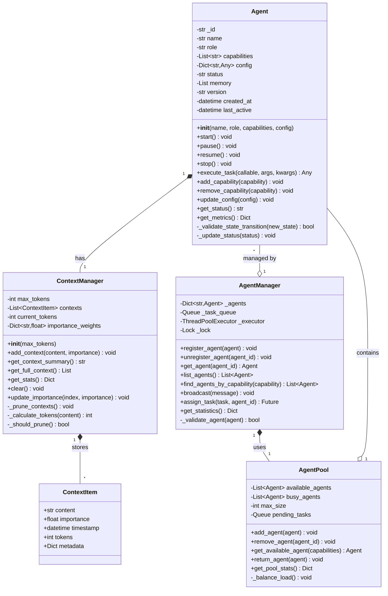
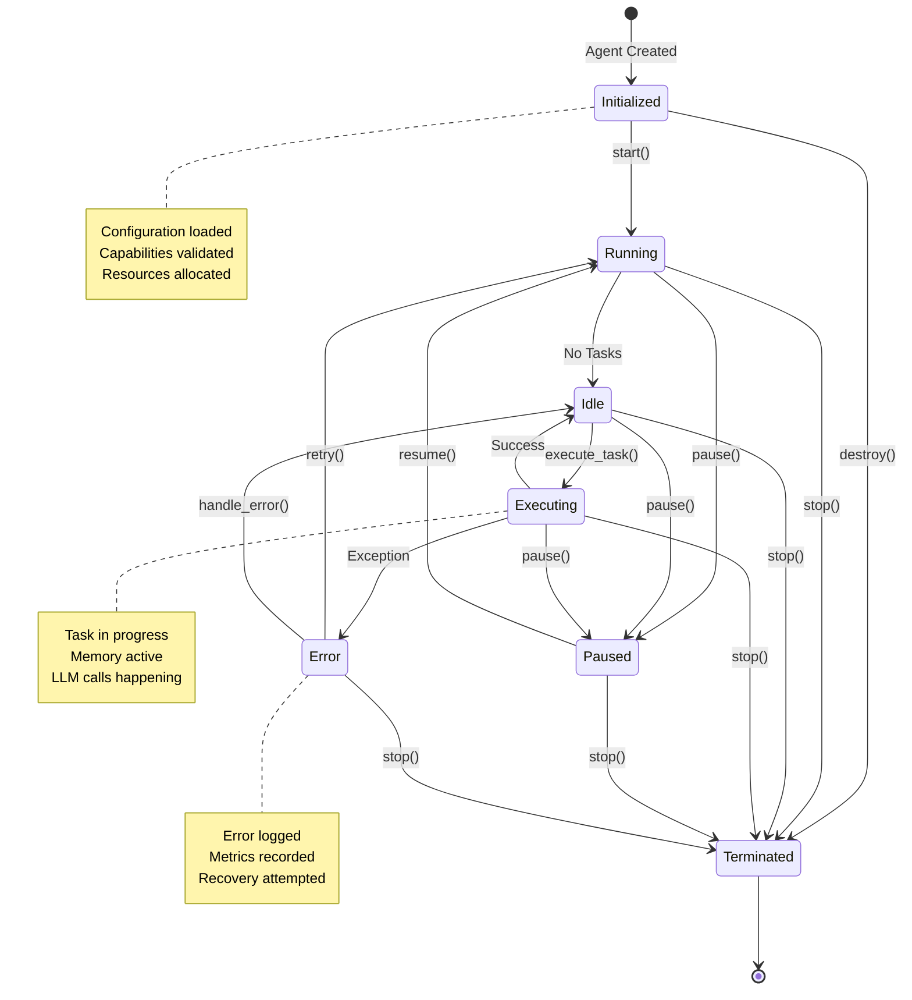
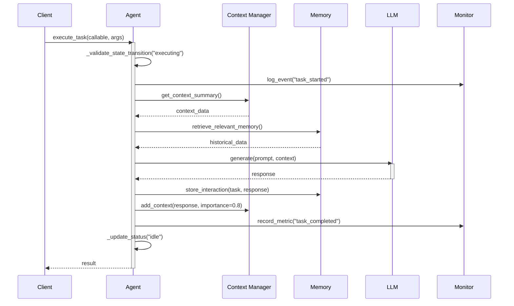
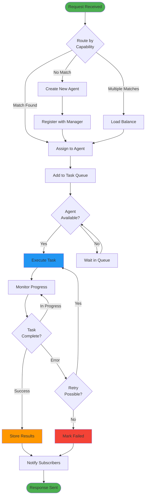
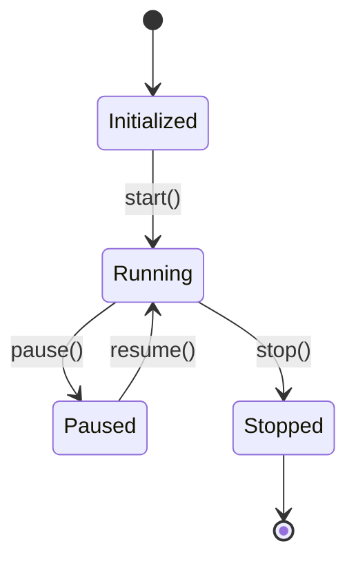

# :robot: Agents Module

<div class="annotate" markdown>

The Agents module is the cornerstone of the AgenticAI Framework, providing the foundation for creating intelligent, autonomous agents that can reason, interact, and execute tasks across various domains.

</div>

---

## :sparkles: Overview

!!! abstract "What are Agents?"
    
    Agents in AgenticAI Framework are autonomous entities with sophisticated capabilities:

<div class="grid" markdown>

:material-play-circle:{ .lg } **Execute Tasks**
:   Perform specific objectives with defined capabilities and success criteria

:material-database-check:{ .lg } **Maintain State**
:   Store and manage information through configurable memory systems

:material-chat-processing:{ .lg } **Communicate**
:   Interact with other agents and external services seamlessly

:material-brain:{ .lg } **Learn & Adapt**
:   Evolve based on interactions and feedback over time

:material-shield-check:{ .lg } **Operate Safely**
:   Function within defined guardrails and compliance constraints

:material-cog-sync:{ .lg } **Coordinate Workflows**
:   Collaborate with other agents for complex multi-step processes

</div>

---

## :gear: Core Components

### :material-robot-outline: Agent Class

The `Agent` class is the base implementation for all agent types in the framework.

!!! info "Constructor"

    ```python
    Agent(
        name: str,
        role: str,
        capabilities: List[str],
        config: Dict[str, Any]
    )
    ```

**Parameters:**

| Parameter | Type | Description |
|-----------|------|-------------|
| `name` | `str` | Unique identifier for the agent |
| `role` | `str` | Describes the agent's purpose and domain expertise |
| `capabilities` | `List[str]` | List of what the agent can do (e.g., `["text_generation", "data_analysis"]`) |
| `config` | `Dict[str, Any]` | Configuration parameters and settings |

#### Properties

| Property | Type | Description |
|----------|------|-------------|
| `id` | str | Auto-generated unique identifier |
| `name` | str | Agent's human-readable name |
| `role` | str | Agent's defined role or purpose |
| `capabilities` | List[str] | List of agent's capabilities |
| `config` | Dict[str, Any] | Configuration parameters |
| `status` | str | Current status (initialized, running, paused, stopped) |
| `memory` | List | Agent's memory storage |
| `version` | str | Agent version |

---

## :art: Low-Level Design (LLD)

### Agent Class Diagram

!!! info "Complete Agent Architecture"
    
    Detailed class relationships and interfaces:



### Agent State Machine



### Task Execution Flow



#### Core Methods

```python
def start() -> None
def pause() -> None
def resume() -> None
def stop() -> None
def execute_task(task_callable: Callable, *args, **kwargs) -> Any
```

### ContextManager Class

The `ContextManager` provides sophisticated context window management for agents with token tracking and intelligent pruning.

#### Constructor

```python
ContextManager(max_tokens: int = 4096)
```

**Parameters:**

- **`max_tokens`** *(int)*: Maximum tokens to maintain in context (default: 4096)

#### Key Methods

```python
def add_context(content: str, importance: float = 0.5) -> None
def get_context_summary() -> str
def get_stats() -> Dict[str, Any]
def clear() -> None
```

**Example:**

```python
from agenticaiframework.agents import ContextManager

# Create context manager
ctx = ContextManager(max_tokens=2048)

# Add context with importance weighting
ctx.add_context("Critical system instruction", importance=0.9)
ctx.add_context("Background information", importance=0.5)
ctx.add_context("Optional details", importance=0.3)

# Get context summary
summary = ctx.get_context_summary()
print(summary)

# Get statistics
stats = ctx.get_stats()
print(f"Context items: {stats['total_items']}")
print(f"Token utilization: {stats.get('utilization', 0):.2%}")
```

### AgentManager Class

The `AgentManager` orchestrates multiple agents and handles their coordination.

#### Key Methods

```python
def register_agent(agent: Agent) -> None
def get_agent(agent_id: str) -> Optional[Agent]
def list_agents() -> List[Agent]
def remove_agent(agent_id: str) -> None
def broadcast(message: str) -> None
```

#### Multi-Agent Coordination



---

## :rocket: Creating Agents

### :material-plus-circle: Basic Agent Creation

!!! example "Create Your First Agent"

    ```python
    from agenticaiframework import Agent
    
    # Create a basic agent
    agent = Agent(
        name="DataAnalyst",
        role="Data Analysis Specialist",
        capabilities=[
            "data_processing",
            "statistical_analysis",
            "visualization"
        ],
        config={
            "processing_timeout": 300,
            "output_format": "json",
            "precision": "high"
        }
    )
    
    # Start the agent
    agent.start()
    print(f"Agent {agent.name} is now {agent.status}")
    ```

### Agent Discovery & Registry Pattern

```mermaid
graph LR
    subgraph "Agent Registry"
        REG[(Registry<br/>Database)]
        INDEX[Search Index]
    end
    
    subgraph "Agents"
        A1["Agent 1<br/>cap: [A, B]"]
        A2["Agent 2<br/>cap: [B, C]"]
        A3["Agent 3<br/>cap: [A, C]"]
    end
    
    subgraph "Discovery"
        DISC[Discovery Service]
        MATCH[Capability Matcher]
        SCORE[Scoring Engine]
    end
    
    A1 & A2 & A3 -->|register| REG
    REG -->|index| INDEX
    
    CLIENT[Client Request] -->|find agent<br/>with cap: [A, C]| DISC
    DISC --> INDEX
    INDEX -->|candidates| MATCH
    MATCH -->|score| SCORE
    SCORE -->|best match| A3
    
    style REG fill:#4caf50
    style A3 fill:#ff9800
```

---

### :material-star-circle: Specialized Agent Types

=== ":material-headset: Customer Service"

    ```python
    customer_agent = Agent(
        name="CustomerSupport",
        role="Customer Service Representative",
        capabilities=[
            "natural_language_processing",
            "sentiment_analysis", 
            "response_generation",
            "escalation_handling"
        ],
        config={
            "response_tone": "professional_friendly",
            "max_response_length": 500,
            "escalation_threshold": 0.8,
            "supported_languages": ["en", "es", "fr"]
        }
    )
    ```
    
    !!! tip "Use Case"
        Perfect for automated customer support with intelligent escalation to human agents.

=== ":material-book-search: Research"

    ```python
    research_agent = Agent(
        name="ResearchAssistant",
        role="Academic Research Specialist", 
        capabilities=[
            "literature_search",
            "data_extraction",
            "citation_management",
            "summary_generation"
        ],
        config={
            "search_depth": "comprehensive",
            "citation_style": "APA",
            "fact_checking": True,
            "source_credibility_threshold": 0.9
        }
    )
    ```
    
    !!! tip "Use Case"
        Ideal for academic research, literature reviews, and knowledge synthesis.

=== ":material-code-braces: Code Generation"

    ```python
    code_agent = Agent(
        name="CodeGenerator",
        role="Software Development Assistant",
        capabilities=[
            "code_generation",
            "code_review",
            "testing",
            "documentation_generation"
        ],
        config={
            "programming_languages": ["python", "javascript", "java"],
            "code_style": "pep8",
            "test_coverage_target": 90,
        "documentation_format": "sphinx"
    }
)
```

## Agent Lifecycle Management

### Lifecycle States



### Lifecycle Methods

```python
# Create and start an agent
agent = Agent("WorkerAgent", "Task Processor", ["processing"], {})

# Lifecycle management
agent.start()        # Status: "running"
agent.pause()        # Status: "paused" 
agent.resume()       # Status: "running"
agent.stop()         # Status: "stopped"

# Check status at any time
print(f"Agent status: {agent.status}")
```

### Event Handling

```python
def on_agent_started(agent):
    print(f"Agent {agent.name} has started successfully")

def on_agent_error(agent, error):
    print(f"Agent {agent.name} encountered error: {error}")

# Register event handlers (conceptual - would need implementation)
agent.on("started", on_agent_started)
agent.on("error", on_agent_error)
```

## Multi-Agent Management

### AgentManager Usage

```python
from agenticaiframework import Agent, AgentManager

# Create agent manager
manager = AgentManager()

# Create multiple agents
agents = [
    Agent("Agent1", "Data Collector", ["data_collection"], {}),
    Agent("Agent2", "Data Processor", ["data_processing"], {}),
    Agent("Agent3", "Data Analyzer", ["data_analysis"], {})
]

# Register all agents
for agent in agents:
    manager.register_agent(agent)
    agent.start()

# Broadcast message to all agents
manager.broadcast("Starting batch processing job #1234")

# Get specific agent
data_collector = manager.get_agent("agent_id_here")

# List all active agents
active_agents = manager.list_agents()
print(f"Managing {len(active_agents)} agents")
```

### Agent Coordination Patterns

#### Sequential Processing

```python
class SequentialWorkflow:
    def __init__(self, manager: AgentManager):
        self.manager = manager
    
    def execute_sequential(self, data, agent_chain):
        result = data
        for agent_name in agent_chain:
            agent = self.manager.get_agent_by_name(agent_name)
            result = agent.execute_task(lambda x: process_data(x), result)
        return result

# Usage
workflow = SequentialWorkflow(manager)
result = workflow.execute_sequential(
    initial_data, 
    ["DataCollector", "DataProcessor", "DataAnalyzer"]
)
```

#### Parallel Processing

```python
import asyncio

class ParallelWorkflow:
    def __init__(self, manager: AgentManager):
        self.manager = manager
    
    async def execute_parallel(self, data, agent_names):
        tasks = []
        for agent_name in agent_names:
            agent = self.manager.get_agent_by_name(agent_name)
            task = asyncio.create_task(self.run_agent_task(agent, data))
            tasks.append(task)
        
        results = await asyncio.gather(*tasks)
        return results
    
    async def run_agent_task(self, agent, data):
        return agent.execute_task(lambda x: process_data(x), data)
```

## Advanced Agent Features

### Custom Agent Behaviors

```python
class AdvancedAgent(Agent):
    def __init__(self, name, role, capabilities, config):
        super().__init__(name, role, capabilities, config)
        self.learning_rate = config.get("learning_rate", 0.01)
        self.experience_buffer = []
    
    def learn_from_feedback(self, feedback):
        """Custom learning mechanism"""
        self.experience_buffer.append(feedback)
        if len(self.experience_buffer) > 100:
            self.optimize_behavior()
    
    def optimize_behavior(self):
        """Implement behavior optimization logic"""
        # Analyze experience buffer and adjust parameters
        positive_feedback = [f for f in self.experience_buffer if f.rating > 0.8]
        if len(positive_feedback) > 50:
            # Increase confidence in current approach
            self.config["confidence"] = min(1.0, self.config.get("confidence", 0.5) + 0.1)
    
    def execute_with_learning(self, task_callable, *args, **kwargs):
        """Execute task and learn from results"""
        result = self.execute_task(task_callable, *args, **kwargs)
        
        # Simulate feedback (in real implementation, this would come externally)
        feedback = self.evaluate_result(result)
        self.learn_from_feedback(feedback)
        
        return result
```

### Agent Communication

```python
class CommunicatingAgent(Agent):
    def __init__(self, name, role, capabilities, config):
        super().__init__(name, role, capabilities, config)
        self.message_queue = []
        self.subscribers = []
    
    def send_message(self, recipient_agent, message):
        """Send message to another agent"""
        recipient_agent.receive_message(self, message)
    
    def receive_message(self, sender_agent, message):
        """Receive message from another agent"""
        self.message_queue.append({
            "sender": sender_agent.name,
            "message": message,
            "timestamp": time.time()
        })
        self.process_message(message)
    
    def process_message(self, message):
        """Process received message"""
        # Implement message processing logic
        pass
    
    def subscribe_to_events(self, event_type, callback):
        """Subscribe to specific event types"""
        self.subscribers.append({"type": event_type, "callback": callback})
    
    def emit_event(self, event_type, data):
        """Emit event to subscribers"""
        for subscriber in self.subscribers:
            if subscriber["type"] == event_type:
                subscriber["callback"](data)
```

## Integration with Other Modules

### Memory Integration

```python
from agenticaiframework.memory import MemoryManager

class MemoryEnabledAgent(Agent):
    def __init__(self, name, role, capabilities, config):
        super().__init__(name, role, capabilities, config)
        self.memory_manager = MemoryManager()
    
    def remember(self, key, value, memory_type="short_term"):
        """Store information in agent's memory"""
        self.memory_manager.store(key, value, memory_type)
    
    def recall(self, key):
        """Retrieve information from agent's memory"""
        return self.memory_manager.retrieve(key)
    
    def execute_with_memory(self, task_callable, *args, **kwargs):
        """Execute task with memory context"""
        # Retrieve relevant context
        context = self.recall(f"context_{task_callable.__name__}")
        
        # Execute task with context
        result = self.execute_task(task_callable, context, *args, **kwargs)
        
        # Store result for future reference
        self.remember(f"result_{task_callable.__name__}", result)
        
        return result
```

### LLM Integration

```python
from agenticaiframework.llms import LLMManager

class LLMAgent(Agent):
    def __init__(self, name, role, capabilities, config):
        super().__init__(name, role, capabilities, config)
        self.llm = LLMManager()
        self.setup_llm()
    
    def setup_llm(self):
        """Configure LLM for this agent"""
        model_config = self.config.get("llm", {})
        model_name = model_config.get("model", "default")
        
        if model_name not in self.llm.models:
            # Register default model if not exists
            self.llm.register_model(model_name, self.default_llm_function)
        
        self.llm.set_active_model(model_name)
    
    def default_llm_function(self, prompt, kwargs):
        """Default LLM implementation"""
        return f"[Agent {self.name}] Processed: {prompt}"
    
    def generate_response(self, prompt):
        """Generate response using LLM"""
        return self.llm.generate(prompt)
    
    def intelligent_execute(self, task_description):
        """Execute task using natural language description"""
        prompt = f"As a {self.role}, please {task_description}"
        return self.generate_response(prompt)
```

## Best Practices

### Agent Design Principles

1. **Single Responsibility**: Each agent should have a clear, focused purpose
2. **Loose Coupling**: Agents should be independent and communicate through well-defined interfaces
3. **Configuration-Driven**: Use configuration to control behavior rather than hard-coding
4. **Observability**: Implement comprehensive logging and monitoring
5. **Error Handling**: Gracefully handle failures and provide meaningful feedback

### Performance Optimization

```python
class OptimizedAgent(Agent):
    def __init__(self, name, role, capabilities, config):
        super().__init__(name, role, capabilities, config)
        self.task_cache = {}
        self.performance_metrics = {
            "tasks_executed": 0,
            "total_execution_time": 0,
            "cache_hits": 0
        }
    
    def cached_execute(self, task_callable, *args, **kwargs):
        """Execute task with caching"""
        # Create cache key
        cache_key = self.create_cache_key(task_callable, args, kwargs)
        
        # Check cache
        if cache_key in self.task_cache:
            self.performance_metrics["cache_hits"] += 1
            return self.task_cache[cache_key]
        
        # Execute and cache
        start_time = time.time()
        result = self.execute_task(task_callable, *args, **kwargs)
        execution_time = time.time() - start_time
        
        # Update metrics
        self.performance_metrics["tasks_executed"] += 1
        self.performance_metrics["total_execution_time"] += execution_time
        
        # Cache result
        self.task_cache[cache_key] = result
        
        return result
    
    def create_cache_key(self, task_callable, args, kwargs):
        """Create cache key for task"""
        import hashlib
        key_data = f"{task_callable.__name__}_{str(args)}_{str(kwargs)}"
        return hashlib.md5(key_data.encode()).hexdigest()
    
    def get_performance_stats(self):
        """Get agent performance statistics"""
        avg_time = (self.performance_metrics["total_execution_time"] / 
                   max(1, self.performance_metrics["tasks_executed"]))
        
        return {
            **self.performance_metrics,
            "average_execution_time": avg_time,
            "cache_hit_rate": (self.performance_metrics["cache_hits"] / 
                              max(1, self.performance_metrics["tasks_executed"]))
        }
```

### Error Handling

```python
class RobustAgent(Agent):
    def __init__(self, name, role, capabilities, config):
        super().__init__(name, role, capabilities, config)
        self.error_count = 0
        self.max_errors = config.get("max_errors", 10)
    
    def safe_execute(self, task_callable, *args, **kwargs):
        """Execute task with comprehensive error handling"""
        try:
            return self.execute_task(task_callable, *args, **kwargs)
        except Exception as e:
            self.error_count += 1
            self.handle_error(e, task_callable)
            
            if self.error_count >= self.max_errors:
                self.emergency_shutdown()
            
            return None
    
    def handle_error(self, error, task_callable):
        """Handle and log errors"""
        error_info = {
            "error_type": type(error).__name__,
            "error_message": str(error),
            "task": task_callable.__name__,
            "agent": self.name,
            "error_count": self.error_count
        }
        
        # Log error (would integrate with monitoring system)
        print(f"Agent error: {error_info}")
        
        # Implement recovery strategies
        if "timeout" in str(error).lower():
            self.handle_timeout_error()
        elif "memory" in str(error).lower():
            self.handle_memory_error()
    
    def emergency_shutdown(self):
        """Emergency shutdown due to too many errors"""
        print(f"Agent {self.name} shutting down due to {self.error_count} errors")
        self.stop()
```

## Troubleshooting

### Common Issues

1. **Agent Not Starting**: Check configuration parameters and ensure all dependencies are available
2. **Memory Leaks**: Monitor agent memory usage and implement proper cleanup
3. **Communication Failures**: Verify network connectivity and message formats
4. **Performance Issues**: Use caching and optimize task execution

### Debugging Tools

```python
class DebuggableAgent(Agent):
    def __init__(self, name, role, capabilities, config):
        super().__init__(name, role, capabilities, config)
        self.debug_mode = config.get("debug", False)
        self.execution_trace = []
    
    def debug_execute(self, task_callable, *args, **kwargs):
        """Execute task with debug information"""
        if self.debug_mode:
            start_time = time.time()
            
        result = self.execute_task(task_callable, *args, **kwargs)
        
        if self.debug_mode:
            execution_time = time.time() - start_time
            trace_entry = {
                "task": task_callable.__name__,
                "args": str(args),
                "kwargs": str(kwargs),
                "result": str(result)[:100],  # Truncate for readability
                "execution_time": execution_time,
                "timestamp": time.time()
            }
            self.execution_trace.append(trace_entry)
            print(f"DEBUG: {trace_entry}")
        
        return result
    
    def get_debug_info(self):
        """Get comprehensive debug information"""
        return {
            "agent_info": {
                "name": self.name,
                "role": self.role,
                "status": self.status,
                "capabilities": self.capabilities
            },
            "execution_trace": self.execution_trace[-10:],  # Last 10 executions
            "memory_usage": len(self.memory),
            "config": self.config
        }
```

This comprehensive guide covers the Agents module's core functionality, advanced features, and best practices for building robust agentic applications.
5. **Execution** — Perform actions until stopped.

---

## Best Practices

- Keep agent responsibilities focused (Single Responsibility Principle).
- Use guardrails to enforce safety and compliance.
- Leverage the `hub` module to register and retrieve agents dynamically.

---

## Related Documentation
- [Hub Module](hub.md)
- [Memory Module](memory.md)
- [Processes Module](processes.md)
