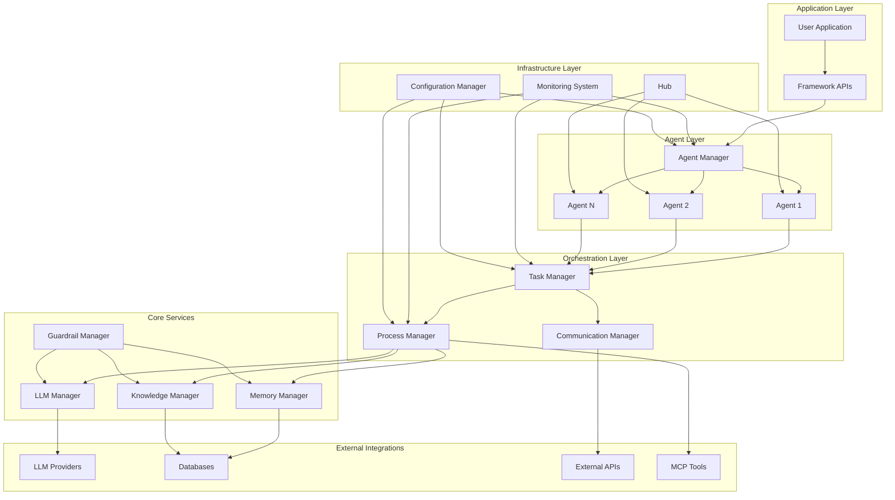
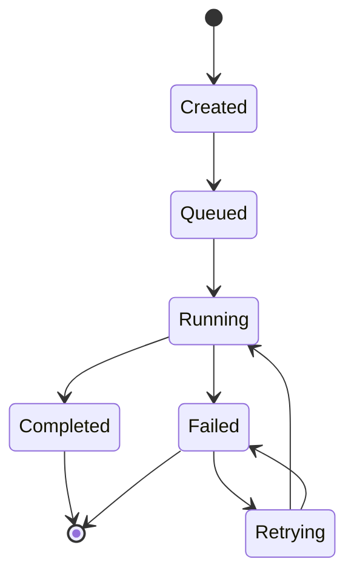
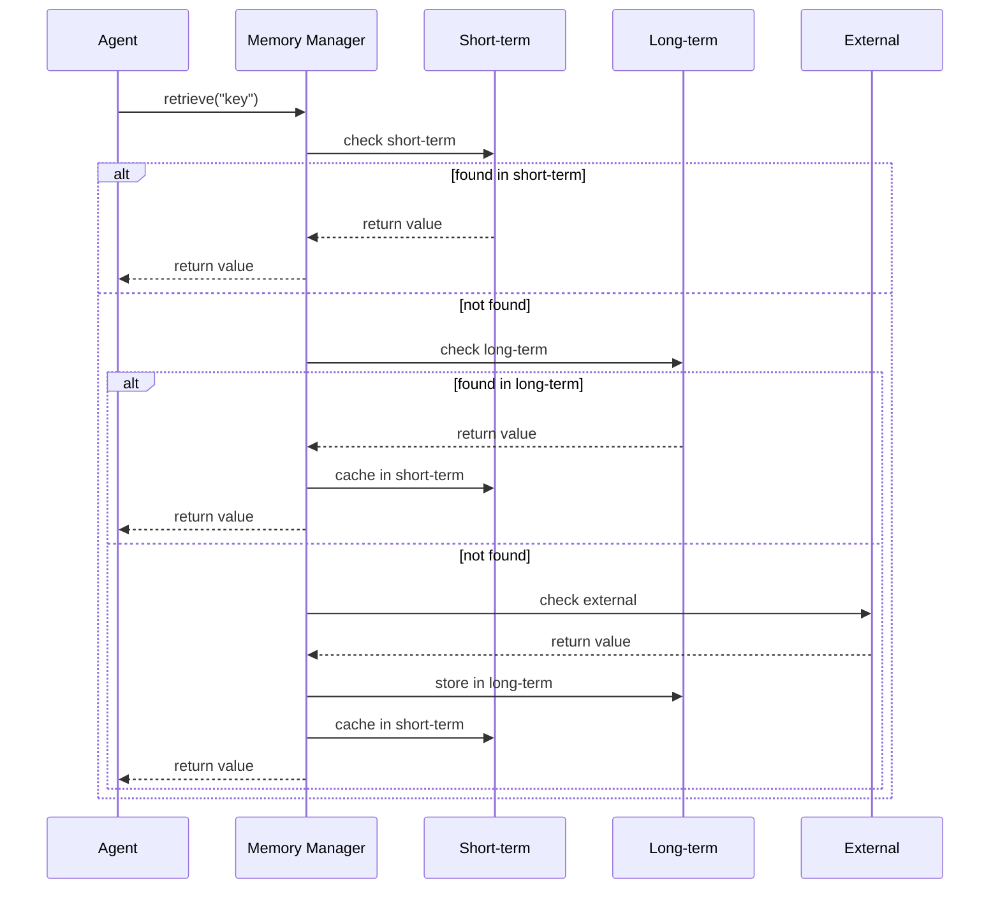

# Architecture Guide

This guide provides an in-depth look at the AgenticAI Framework architecture, design principles, and component interactions.

## Overview

AgenticAI Framework is built on a modular, event-driven architecture that enables scalable and maintainable agentic applications. The framework follows these core design principles:

- **Modularity**: Each component has a single responsibility
- **Extensibility**: Easy to add new capabilities and integrations
- **Observability**: Built-in monitoring and logging throughout
- **Safety**: Guardrails and validation at every layer
- **Performance**: Optimized for both single and multi-agent scenarios

## Architecture Diagram



## Core Components

### Agent Manager
The central orchestrator for all agents in the system.

**Responsibilities:**
- Agent lifecycle management (create, start, stop, destroy)
- Agent registration and discovery
- Inter-agent communication coordination
- Resource allocation and load balancing

**Key Interfaces:**
```python
class AgentManager:
    def register_agent(self, agent: Agent) -> None
    def get_agent(self, agent_id: str) -> Optional[Agent]
    def list_agents(self) -> List[Agent]
    def broadcast(self, message: str) -> None
    def remove_agent(self, agent_id: str) -> None
```

### Agent
Individual autonomous entities that execute tasks and make decisions.

**Properties:**
- **Identity**: Unique ID, name, and role
- **Capabilities**: List of what the agent can do
- **Configuration**: Runtime parameters and settings
- **State**: Current status and execution context
- **Memory**: Access to short-term and long-term storage

**Lifecycle:**
1. **Initialization**: Agent is created with configuration
2. **Registration**: Agent registers with AgentManager
3. **Activation**: Agent becomes ready to receive tasks
4. **Execution**: Agent processes tasks and communicates
5. **Deactivation**: Agent stops processing new tasks
6. **Cleanup**: Agent releases resources

### Task Manager
Coordinates task execution across agents and manages dependencies.

**Features:**
- Task queuing and prioritization
- Dependency resolution
- Parallel and sequential execution
- Task result aggregation
- Error handling and retry logic

**Task Lifecycle:**


### Memory Manager
Provides multi-tiered storage for agents and the system.

**Memory Types:**
- **Short-term**: Fast access, temporary data (RAM)
- **Long-term**: Persistent storage (disk/database)
- **External**: Distributed storage systems

**Features:**
- Automatic memory management
- Cache optimization
- Memory compression
- Data lifecycle policies

### LLM Manager
Abstracts language model interactions and provides a unified interface.

**Capabilities:**
- Multi-provider support (OpenAI, Anthropic, etc.)
- Model switching and load balancing
- Request/response caching
- Rate limiting and quota management
- Model performance monitoring

### Knowledge Manager
Handles information retrieval and knowledge base integration.

**Components:**
- **Retrieval Engine**: Search and ranking algorithms
- **Indexing System**: Document processing and storage
- **Cache Layer**: Fast access to frequently used information
- **Integration APIs**: Connect to external knowledge sources

### Guardrail Manager
Ensures safe and compliant agent behavior.

**Guardrail Types:**
- **Input validation**: Check incoming data
- **Output filtering**: Validate generated content
- **Behavior monitoring**: Track agent actions
- **Compliance checking**: Ensure regulatory adherence

## Communication Patterns

### Agent-to-Agent Communication
```python
# Direct communication
agent1.send_message(agent2, "Hello from Agent 1")

# Broadcast communication
agent_manager.broadcast("System maintenance in 5 minutes")

# Event-driven communication
agent1.emit_event("task_completed", {"task_id": "123"})
agent2.on_event("task_completed", handle_completion)
```

### Task Coordination
```python
# Sequential execution
process = Process("DataPipeline", strategy="sequential")
process.add_task(collect_data)
process.add_task(process_data)
process.add_task(analyze_data)

# Parallel execution
process = Process("ParallelAnalysis", strategy="parallel")
process.add_task(analyze_sentiment)
process.add_task(extract_entities)
process.add_task(classify_topic)
```

## Data Flow

### Request Processing Flow
1. **Input Validation**: Guardrails check incoming requests
2. **Task Creation**: Request converted to executable tasks
3. **Agent Selection**: Appropriate agent(s) chosen for execution
4. **Execution**: Agent processes the task using available resources
5. **Result Validation**: Output checked by guardrails
6. **Response Generation**: Results formatted and returned

### Memory Access Pattern


## Scalability Patterns

### Horizontal Scaling
- **Agent Distribution**: Spread agents across multiple processes/machines
- **Load Balancing**: Distribute tasks based on agent capacity
- **Service Mesh**: Microservice architecture for large deployments

### Vertical Scaling
- **Resource Optimization**: Efficient memory and CPU usage
- **Caching Strategies**: Reduce redundant computations
- **Connection Pooling**: Reuse database and API connections

## Security Architecture

### Multi-Layer Security
1. **Input Layer**: Validate and sanitize all inputs
2. **Processing Layer**: Monitor agent behavior and resource usage
3. **Output Layer**: Filter and validate all outputs
4. **Storage Layer**: Encrypt data at rest and in transit
5. **Communication Layer**: Secure inter-agent and external communications

### Access Control
```python
# Role-based access control
agent = Agent(
    name="SecureAgent",
    role="DataProcessor",
    capabilities=["read_data", "process_data"],  # No write permissions
    config={
        "security_level": "high",
        "allowed_resources": ["database_read", "api_public"]
    }
)
```

## Error Handling Strategy

### Error Categories
- **System Errors**: Infrastructure failures, network issues
- **Agent Errors**: Logic errors, capability mismatches
- **Data Errors**: Invalid inputs, corrupted data
- **Security Errors**: Unauthorized access, policy violations

### Recovery Mechanisms
- **Retry Logic**: Automatic retry with exponential backoff
- **Fallback Strategies**: Alternative execution paths
- **Circuit Breakers**: Prevent cascade failures
- **Graceful Degradation**: Reduced functionality when components fail

## Performance Considerations

### Optimization Strategies
1. **Lazy Loading**: Load resources only when needed
2. **Batch Processing**: Group similar operations
3. **Asynchronous Execution**: Non-blocking operations
4. **Resource Pooling**: Reuse expensive resources
5. **Monitoring-Driven Optimization**: Use metrics to guide improvements

### Bottleneck Identification
- **CPU Bound**: Long-running computations
- **I/O Bound**: Database and API calls
- **Memory Bound**: Large data processing
- **Network Bound**: External service dependencies

## Extension Points

### Custom Components
```python
# Custom agent
class MyCustomAgent(Agent):
    def __init__(self, name, specialized_config):
        super().__init__(name, "CustomRole", ["custom_capability"], specialized_config)
    
    def custom_method(self):
        # Custom implementation
        pass

# Custom guardrail
class BusinessLogicGuardrail(Guardrail):
    def __init__(self):
        super().__init__("BusinessLogic", self.validate_business_rules)
    
    def validate_business_rules(self, data):
        # Custom validation logic
        return True
```

### Plugin Architecture
```python
# Register custom tools
hub = Hub()
hub.register_service("CustomTool", my_custom_tool)

# Register custom LLM provider
llm_manager = LLMManager()
llm_manager.register_model("custom-model", my_custom_llm_function)
```

## Deployment Patterns

### Single-Node Deployment
- All components run in a single process
- Suitable for development and small applications
- Easy to debug and monitor

### Multi-Node Deployment
- Components distributed across multiple machines
- Better scalability and fault tolerance
- Requires service discovery and coordination

### Containerized Deployment
```dockerfile
# Example Dockerfile for AgenticAI application
FROM python:3.9-slim

WORKDIR /app
COPY requirements.txt .
RUN pip install -r requirements.txt

COPY . .
CMD ["python", "app.py"]
```

### Cloud-Native Deployment
- Kubernetes orchestration
- Auto-scaling based on load
- Service mesh for communication
- Observability stack integration

This architecture provides a solid foundation for building scalable, maintainable, and secure agentic applications while remaining flexible enough to accommodate diverse use cases and requirements.