---
tags:
  - architecture
  - design
  - overview
  - system-design
---

# 🏛️ Architecture Guide

<div class="annotate" markdown>

**Comprehensive architectural overview**

Understand the design and structure of AgenticAI Framework

</div>

## 🎯 Quick Navigation

<div class="grid cards" markdown>

-   :material-layers:{ .lg } **System Layers**
    
    5-layer architecture
    
    [:octicons-arrow-right-24: Explore](#high-level-design-hld)

-   :material-vector-triangle:{ .lg } **Components**
    
    Core building blocks
    
    [:octicons-arrow-right-24: View](#core-components)

-   :material-chart-timeline:{ .lg } **Data Flow**
    
    Request lifecycle
    
    [:octicons-arrow-right-24: Understand](#data-flow)

-   :material-chart-box:{ .lg } **Diagrams**
    
    Visual architecture
    
    [:octicons-arrow-right-24: View All](diagrams.md)

</div>

## :sparkles: Overview

!!! abstract "Design Philosophy"
    
    AgenticAI Framework is built on a **modular, event-driven architecture** that enables scalable and maintainable agentic applications.

### :star: Core Design Principles

<div class="grid" markdown>

:material-puzzle:{ .lg } **Modularity**
:   Each component has a single, well-defined responsibility

:material-plus-circle:{ .lg } **Extensibility**
:   Easy to add new capabilities and integrations

:material-eye:{ .lg } **Observability**
:   Built-in monitoring and logging throughout

:material-shield-check:{ .lg } **Safety**
:   Guardrails and validation at every layer

:material-lightning-bolt:{ .lg } **Performance**
:   Optimized for single and multi-agent scenarios

:material-scale-balance:{ .lg } **Scalability**
:   Horizontal and vertical scaling capabilities

</div>

## :art: High-Level Design (HLD)

### System Overview

!!! info "Architecture Layers"
    
    The framework is organized into 5 distinct layers, each with specific responsibilities:

```mermaid
graph TB
    subgraph "Layer 1: Application Layer"
        UA["👤 User Application<br/>Custom AI Applications"]
        API["🔌 Framework APIs<br/>Python SDK Interface"]
    end
    
    subgraph "Layer 2: Agent Orchestration"
        AM["🤖 Agent Manager<br/>Lifecycle & Coordination"]
        A1["🎯 Specialized Agent 1<br/>Domain Expert"]
        A2["🎯 Specialized Agent 2<br/>Task Executor"]
        AN["🎯 Agent N<br/>Custom Role"]
    end
    
    subgraph "Layer 3: Task & Process Management"
        TM["✅ Task Manager<br/>Task Queue & Scheduling"]
        PM["🔄 Process Manager<br/>Workflow Orchestration"]
        CM["💬 Communication Manager<br/>Inter-Agent Messages"]
    end
    
    subgraph "Layer 4: Core Intelligence Services"
        LM["🧠 LLM Manager<br/>Model Integration"]
        MM["💾 Memory Manager<br/>State Persistence"]
        KM["📚 Knowledge Manager<br/>Information Retrieval"]
        GM["🛡️ Guardrail Manager<br/>Safety & Compliance"]
    end
    
    subgraph "Layer 5: Infrastructure & Integration"
        MON["📊 Monitoring System<br/>Metrics & Logs"]
        CONFIG["⚙️ Configuration Manager<br/>Settings & Secrets"]
        HUB["🌐 Hub<br/>Agent Discovery"]
        SEC["🔒 Security Manager<br/>Auth & Validation"]
    end
    
    subgraph "External Systems"
        LLMS["🤖 LLM Providers<br/>OpenAI, Anthropic, Azure"]
        DB["💾 Databases<br/>Redis, PostgreSQL, MongoDB"]
        APIS["🌐 External APIs<br/>REST, GraphQL"]
        TOOLS["🔧 MCP Tools<br/>External Tools"]
    end
    
    UA --> API
    API --> AM
    AM --> A1 & A2 & AN
    A1 & A2 & AN --> TM
    TM --> PM & CM
    PM --> LM & MM & KM
    GM -."validates".-> LM & MM & KM
    MON -."observes".-> AM & TM & PM
    CONFIG --> AM & TM & PM
    HUB --> A1 & A2 & AN
    SEC -."protects".-> API & AM
    LM --> LLMS
    MM & KM --> DB
    CM --> APIS
    PM --> TOOLS
    
    classDef layer1 fill:#e3f2fd,stroke:#1976d2,stroke-width:2px
    classDef layer2 fill:#f3e5f5,stroke:#7b1fa2,stroke-width:2px
    classDef layer3 fill:#e8f5e9,stroke:#388e3c,stroke-width:2px
    classDef layer4 fill:#fff3e0,stroke:#f57c00,stroke-width:2px
    classDef layer5 fill:#fce4ec,stroke:#c2185b,stroke-width:2px
    classDef external fill:#eceff1,stroke:#455a64,stroke-width:2px
    
    class UA,API layer1
    class AM,A1,A2,AN layer2
    class TM,PM,CM layer3
    class LM,MM,KM,GM layer4
    class MON,CONFIG,HUB,SEC layer5
    class LLMS,DB,APIS,TOOLS external
```



### Component Interaction Diagram

!!! example "Request Flow Through the System"
    
    This sequence diagram demonstrates how a **typical user request flows through all layers** of the AgenticAI Framework, showcasing the interaction between components.
    
    **Request Flow Steps:**
    
    1. **User Submits Request** (Step 1-2)
       - User sends request through API
       - API validates and routes to Agent Manager
    
    2. **Agent Assignment** (Step 3-4)
       - Agent Manager selects appropriate agent based on capabilities
       - Agent receives task assignment
       - Task created in Task Manager queue
    
    3. **Input Validation** (Step 5-6)
       - Guardrails validates user input for safety
       - Checks for malicious content, PII, policy violations
       - Returns validation result (pass/fail)
    
    4. **Context Retrieval** (Step 7-8)
       - Task Manager queries Memory for relevant historical data
       - Retrieves past interactions, user preferences, learned patterns
       - Provides context for better response generation
    
    5. **Response Generation** (Step 9-12)
       - LLM Manager called to generate response
       - Before returning, output passes through Guardrails
       - Guardrails ensures response is safe, compliant, and appropriate
       - Approved output returned to Task Manager
    
    6. **Result Storage & Monitoring** (Step 13-14)
       - Generated response stored in Memory for future context
       - Metrics logged to Monitoring system:
         - Latency, token usage, cost
         - Agent performance, success rate
         - Resource utilization
    
    7. **Response Return** (Step 15-18)
       - Task marked as complete
       - Agent reports status to Agent Manager
       - Response flows back through API
       - User receives final result
    
    **Continuous Monitoring:**
    - All operations continuously observed by Monitoring system
    - Real-time metrics, alerts, and health checks
    - Full traceability for debugging and optimization
    
    **Key Principles:**
    - \ud83d\udd12 **Security First**: Guardrails validate at input and output
    - \ud83d\udcbe **Context-Aware**: Memory provides historical context
    - \ud83d\udcca **Observable**: Every step monitored and logged
    - \ud83d\udd04 **Asynchronous**: Non-blocking operations where possible
    - \ud83d\udee1\ufe0f **Resilient**: Error handling at every layer


### Data Flow Architecture

!!! info "End-to-End Data Processing Pipeline"
    
    This flowchart illustrates how **data flows from input to output** through various processing stages and storage layers.
    
    **Input Stage:**
    - \ud83d\udc65 **User Input**: Direct user requests via UI/API
    - \ud83c\udf10 **External Data**: Third-party APIs, webhooks, integrations
    
    **Processing Pipeline:**
    
    1. **Input Validation**
       - Schema validation
       - Type checking
       - Sanitization
       - Security scanning
    
    2. **Context Enrichment**
       - Add user profile data
       - Inject relevant historical context
       - Append system state
    
    3. **Task Processing**
       - Execute business logic
       - Coordinate with other services
       - Apply transformations
    
    4. **Response Generation**
       - LLM invocation
       - Template rendering
       - Data formatting
    
    5. **Output Filtering**
       - PII masking
       - Content moderation
       - Quality checks
    
    **Storage Layers:**
    
    - **Cache Layer**: Hot data for <1ms access
      - Active sessions
      - Frequently accessed data
      - LLM response cache
    
    - **Short-term Memory**: Fast access (1-10ms)
      - Recent interactions
      - Session state
      - Temporary results
    
    - **Long-term Storage**: Persistent data (10-100ms)
      - User profiles
      - Historical records
      - Audit trail
    
    **Output Channels:**
    - \u2705 **User Response**: Primary output to user
    - \ud83d\udcdd **Audit Logs**: Compliance and security tracking
    - \ud83d\udcca **Metrics**: Performance and business analytics
    
    **Data Flow Guarantees:**
    - \ud83d\udd12 All sensitive data encrypted in transit and at rest
    - \ud83d\udcbe All state changes persisted to durable storage
    - \ud83d\udcdd All operations logged for audit trail
    - \ud83d\udd04 Failed operations automatically retried with exponential backoff


### Deployment Architecture

!!! tip "Scalability Options"
    
    The framework supports multiple deployment patterns:

```mermaid
graph TB
    subgraph "Development Environment"
        DEV["💻 Local Development<br/>Single Process<br/>In-Memory Storage"]
    end
    
    subgraph "Production - Single Node"
        API1["🌐 API Server<br/>FastAPI/Flask"]
        AGENT1["🤖 Agent Pool<br/>ThreadPool Executor"]
        REDIS1[("💾 Redis<br/>Memory & Cache")]
        DB1[("🗄️ PostgreSQL<br/>Persistent Storage")]
        
        API1 --> AGENT1
        AGENT1 --> REDIS1
        AGENT1 --> DB1
    end
    
    subgraph "Production - Distributed"
        LB["⚖️ Load Balancer<br/>nginx/ALB"]
        
        subgraph "API Tier"
            API2["🌐 API 1"]
            API3["🌐 API 2"]
            API4["🌐 API N"]
        end
        
        subgraph "Agent Tier"
            WORKER1["🤖 Worker 1<br/>Agent Pool"]
            WORKER2["🤖 Worker 2<br/>Agent Pool"]
            WORKER3["🤖 Worker N<br/>Agent Pool"]
        end
        
        subgraph "Message Queue"
            MQ["📬 RabbitMQ/Redis Queue<br/>Task Distribution"]
        end
        
        subgraph "Storage Tier"
            REDIS2[("💾 Redis Cluster<br/>Distributed Cache")]
            DB2[("🗄️ PostgreSQL<br/>Primary DB")]
            DB3[("🗄️ PostgreSQL<br/>Replica")]
            VECTOR[("🔍 Vector DB<br/>Pinecone/Weaviate")]
        end
        
        subgraph "Monitoring"
            PROM["📊 Prometheus<br/>Metrics"]
            GRAF["📈 Grafana<br/>Dashboards"]
            ELK["📋 ELK Stack<br/>Logs"]
        end
        
        LB --> API2 & API3 & API4
        API2 & API3 & API4 --> MQ
        MQ --> WORKER1 & WORKER2 & WORKER3
        WORKER1 & WORKER2 & WORKER3 --> REDIS2
        WORKER1 & WORKER2 & WORKER3 --> DB2
        DB2 -."replication".-> DB3
        WORKER1 & WORKER2 & WORKER3 --> VECTOR
        
        API2 & API3 & API4 --> PROM
        WORKER1 & WORKER2 & WORKER3 --> PROM
        PROM --> GRAF
        API2 & API3 & API4 --> ELK
        WORKER1 & WORKER2 & WORKER3 --> ELK
    end
    
    DEV -."evolves to".-> API1
    API1 -."scales to".-> LB
    
    classDef dev fill:#e1f5fe,stroke:#01579b
    classDef prod fill:#f3e5f5,stroke:#4a148c
    classDef storage fill:#e8f5e9,stroke:#1b5e20
    classDef monitor fill:#fff3e0,stroke:#e65100
    
    class DEV dev
    class API1,AGENT1 prod
    class REDIS1,DB1 storage
    class LB,API2,API3,API4,WORKER1,WORKER2,WORKER3,MQ prod
    class REDIS2,DB2,DB3,VECTOR storage
    class PROM,GRAF,ELK monitor
```




## :gear: Core Components

### Agent Manager

!!! abstract "Central Orchestration"
    
    The Agent Manager is the central orchestrator for all agents in the system.agents in the system.agents in the system.

#### Class Diagram - Agent Management


**Responsibilities:**
- Agent lifecycle management (create, start, stop, destroy)
- Agent registration and discovery
- Inter-agent communication coordination
- Resource allocation and load balancing

**Key Interfaces:**
```python
class AgentManager:
    def register_agent(self, agent: Agent) -> None
    def get_agent(self, agent_id: str) -> Optional[Agent]
    def list_agents(self) -> List[Agent]
    def broadcast(self, message: str) -> None
    def remove_agent(self, agent_id: str) -> None
```

### Agent
Individual autonomous entities that execute tasks and make decisions.

**Properties:**
- **Identity**: Unique ID, name, and role
- **Capabilities**: List of what the agent can do
- **Configuration**: Runtime parameters and settings
- **State**: Current status and execution context
- **Memory**: Access to short-term and long-term storage

**Lifecycle:**
1. **Initialization**: Agent is created with configuration
2. **Registration**: Agent registers with AgentManager
3. **Activation**: Agent becomes ready to receive tasks
4. **Execution**: Agent processes tasks and communicates
5. **Deactivation**: Agent stops processing new tasks
6. **Cleanup**: Agent releases resources

### Task Manager
Coordinates task execution across agents and manages dependencies.

**Features:**
- Task queuing and prioritization
- Dependency resolution
- Parallel and sequential execution
- Task result aggregation
- Error handling and retry logic

**Task Lifecycle:**


### Memory Manager
Provides multi-tiered storage for agents and the system.

**Memory Types:**
- **Short-term**: Fast access, temporary data (RAM)
- **Long-term**: Persistent storage (disk/database)
- **External**: Distributed storage systems

**Features:**
- Automatic memory management
- Cache optimization
- Memory compression
- Data lifecycle policies

### LLM Manager
Abstracts language model interactions and provides a unified interface.

**Capabilities:**
- Multi-provider support (OpenAI, Anthropic, etc.)
- Model switching and load balancing
- Request/response caching
- Rate limiting and quota management
- Model performance monitoring

### Knowledge Manager
Handles information retrieval and knowledge base integration.

**Components:**
- **Retrieval Engine**: Search and ranking algorithms
- **Indexing System**: Document processing and storage
- **Cache Layer**: Fast access to frequently used information
- **Integration APIs**: Connect to external knowledge sources

### Guardrail Manager
Ensures safe and compliant agent behavior.

**Guardrail Types:**
- **Input validation**: Check incoming data
- **Output filtering**: Validate generated content
- **Behavior monitoring**: Track agent actions
- **Compliance checking**: Ensure regulatory adherence

## Communication Patterns

### Agent-to-Agent Communication
```python
# Direct communication
agent1.send_message(agent2, "Hello from Agent 1")

# Broadcast communication
agent_manager.broadcast("System maintenance in 5 minutes")

# Event-driven communication
agent1.emit_event("task_completed", {"task_id": "123"})
agent2.on_event("task_completed", handle_completion)
```

### Task Coordination
```python
# Sequential execution
process = Process("DataPipeline", strategy="sequential")
process.add_task(collect_data)
process.add_task(process_data)
process.add_task(analyze_data)

# Parallel execution
process = Process("ParallelAnalysis", strategy="parallel")
process.add_task(analyze_sentiment)
process.add_task(extract_entities)
process.add_task(classify_topic)
```

## Data Flow

### Request Processing Flow
1. **Input Validation**: Guardrails check incoming requests
2. **Task Creation**: Request converted to executable tasks
3. **Agent Selection**: Appropriate agent(s) chosen for execution
4. **Execution**: Agent processes the task using available resources
5. **Result Validation**: Output checked by guardrails
6. **Response Generation**: Results formatted and returned

### Memory Access Pattern


## Scalability Patterns

### Horizontal Scaling
- **Agent Distribution**: Spread agents across multiple processes/machines
- **Load Balancing**: Distribute tasks based on agent capacity
- **Service Mesh**: Microservice architecture for large deployments

### Vertical Scaling
- **Resource Optimization**: Efficient memory and CPU usage
- **Caching Strategies**: Reduce redundant computations
- **Connection Pooling**: Reuse database and API connections

## Security Architecture

### Multi-Layer Security
1. **Input Layer**: Validate and sanitize all inputs
2. **Processing Layer**: Monitor agent behavior and resource usage
3. **Output Layer**: Filter and validate all outputs
4. **Storage Layer**: Encrypt data at rest and in transit
5. **Communication Layer**: Secure inter-agent and external communications

### Access Control
```python
# Role-based access control
agent = Agent(
    name="SecureAgent",
    role="DataProcessor",
    capabilities=["read_data", "process_data"],  # No write permissions
    config={
        "security_level": "high",
        "allowed_resources": ["database_read", "api_public"]
    }
)
```

## Error Handling Strategy

### Error Categories
- **System Errors**: Infrastructure failures, network issues
- **Agent Errors**: Logic errors, capability mismatches
- **Data Errors**: Invalid inputs, corrupted data
- **Security Errors**: Unauthorized access, policy violations

### Recovery Mechanisms
- **Retry Logic**: Automatic retry with exponential backoff
- **Fallback Strategies**: Alternative execution paths
- **Circuit Breakers**: Prevent cascade failures
- **Graceful Degradation**: Reduced functionality when components fail

## Performance Considerations

### Optimization Strategies
1. **Lazy Loading**: Load resources only when needed
2. **Batch Processing**: Group similar operations
3. **Asynchronous Execution**: Non-blocking operations
4. **Resource Pooling**: Reuse expensive resources
5. **Monitoring-Driven Optimization**: Use metrics to guide improvements

### Bottleneck Identification
- **CPU Bound**: Long-running computations
- **I/O Bound**: Database and API calls
- **Memory Bound**: Large data processing
- **Network Bound**: External service dependencies

## Extension Points

### Custom Components
```python
# Custom agent
class MyCustomAgent(Agent):
    def __init__(self, name, specialized_config):
        super().__init__(name, "CustomRole", ["custom_capability"], specialized_config)
    
    def custom_method(self):
        # Custom implementation
        pass

# Custom guardrail
class BusinessLogicGuardrail(Guardrail):
    def __init__(self):
        super().__init__("BusinessLogic", self.validate_business_rules)
    
    def validate_business_rules(self, data):
        # Custom validation logic
        return True
```

### Plugin Architecture
```python
# Register custom tools
hub = Hub()
hub.register_service("CustomTool", my_custom_tool)

# Register custom LLM provider
llm_manager = LLMManager()
llm_manager.register_model("custom-model", my_custom_llm_function)
```

## Deployment Patterns

### Single-Node Deployment
- All components run in a single process
- Suitable for development and small applications
- Easy to debug and monitor

### Multi-Node Deployment
- Components distributed across multiple machines
- Better scalability and fault tolerance
- Requires service discovery and coordination

### Containerized Deployment
```dockerfile
# Example Dockerfile for AgenticAI application
FROM python:3.9-slim

WORKDIR /app
COPY requirements.txt .
RUN pip install -r requirements.txt

COPY . .
CMD ["python", "app.py"]
```

### Cloud-Native Deployment
- Kubernetes orchestration
- Auto-scaling based on load
- Service mesh for communication
- Observability stack integration

This architecture provides a solid foundation for building scalable, maintainable, and secure agentic applications while remaining flexible enough to accommodate diverse use cases and requirements.