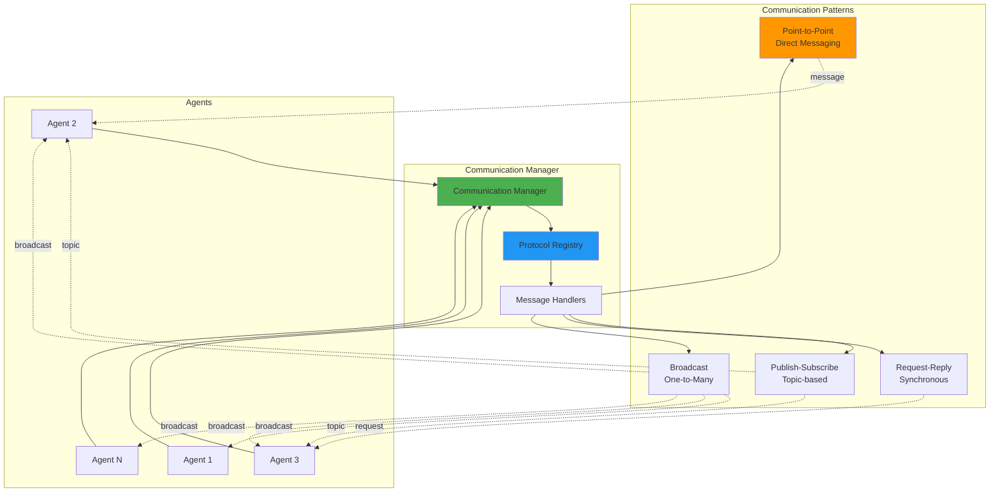
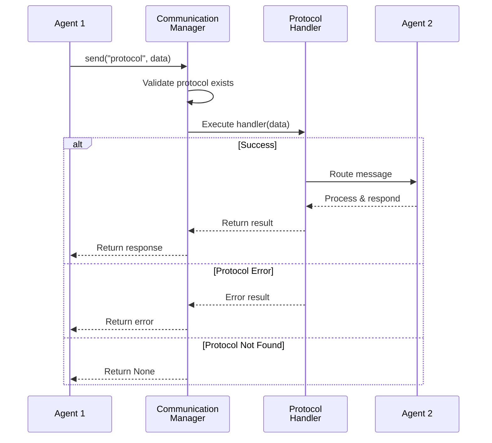

---
tags:
  - communication
  - protocols
  - messaging
  - core-modules
---

# 💬 Communication Module

<div class="annotate" markdown>

**Flexible messaging system for agent-to-agent communication**

Multiple protocols and communication patterns

</div>

## 🎯 Quick Navigation

<div class="grid cards" markdown>

-   :material-message:{ .lg } **Messaging**
    
    Point-to-point communication
    
    [:octicons-arrow-right-24: Learn More](#point-to-point)

-   :material-broadcast:{ .lg } **Pub/Sub**
    
    Topic-based messaging
    
    [:octicons-arrow-right-24: Configure](#publish-subscribe)

-   :material-swap-horizontal:{ .lg } **Request/Reply**
    
    Synchronous communication
    
    [:octicons-arrow-right-24: Implement](#request-reply)

-   :material-book-open:{ .lg } **Examples**
    
    Communication patterns
    
    [:octicons-arrow-right-24: View Examples](#examples)

</div>


## 📊 Overview

The Communication module provides a flexible, protocol-based messaging system for agent-to-agent and agent-to-system communication. It supports multiple communication patterns and protocols.


## 🎯 Communication Architecture




## 🚀 Quick Start

### Basic Usage

```python
from agenticaiframework.communication import CommunicationManager

# Initialize communication manager
comm = CommunicationManager()

# Register a simple protocol
def http_handler(data):
    """HTTP communication protocol"""
    print(f"Sending via HTTP: {data}")
    return {"status": "sent", "protocol": "http"}

comm.register_protocol("http", http_handler)

# Send message
result = comm.send("http", {"message": "Hello from Agent 1"})
print(result)

# List available protocols
protocols = comm.list_protocols()
print(f"Available protocols: {protocols}")
```


## 📖 Core API

### CommunicationManager

Main class for managing communication between agents and systems.

#### Methods

##### `register_protocol(name: str, handler_fn: Callable)`

Register a communication protocol with a handler function.

```python
def custom_protocol_handler(data):
    """Custom protocol implementation"""
    # Process data
    processed_data = process(data)
    # Send via custom channel
    send_custom(processed_data)
    return {"status": "success"}

comm.register_protocol("custom", custom_protocol_handler)
```

##### `register_handler(handler_fn: Callable, name: str = None)`

Alternative method for registering handlers (alias for `register_protocol`).

```python
def my_handler(data):
    return {"received": data}

# Auto-generate name
comm.register_handler(my_handler)

# Or specify name
comm.register_handler(my_handler, name="my_protocol")
```

##### `send(protocol: str, data: Any) -> Any`

Send data using a specific protocol.

```python
response = comm.send("http", {
    "to": "agent_2",
    "message": "Process this data",
    "priority": "high"
})
```

##### `send_message(message: Any, protocol: str = None) -> Any`

Send a message using specified protocol or first available protocol.

```python
# Use specific protocol
result = comm.send_message({"data": "value"}, protocol="http")

# Use first available protocol
result = comm.send_message({"data": "value"})
```

##### `list_protocols() -> List[str]`

Get list of all registered protocols.

```python
protocols = comm.list_protocols()
# Returns: ['http', 'websocket', 'custom']
```

## 🔄 Communication Patterns

### 1. Point-to-Point Communication

Direct messaging between two agents.

```python
from agenticaiframework.agents import Agent
from agenticaiframework.communication import CommunicationManager

class CommunicatingAgent(Agent):
    """Agent with communication capabilities"""
    
    def __init__(self, name: str, comm_manager: CommunicationManager):
        super().__init__(name=name, role="communicator", capabilities=["messaging"])
        self.comm = comm_manager
    
    def send_to_agent(self, target_agent: str, message: dict):
        """Send message to specific agent"""
        return self.comm.send("p2p", {
            "from": self.name,
            "to": target_agent,
            "message": message,
            "timestamp": time.time()
        })

# Setup
comm = CommunicationManager()

def p2p_handler(data):
    """Handle point-to-point messages"""
    sender = data.get("from")
    recipient = data.get("to")
    message = data.get("message")
    
    print(f"{sender} → {recipient}: {message}")
    
    # Route to recipient
    # ...
    
    return {"delivered": True}

comm.register_protocol("p2p", p2p_handler)

# Usage
agent1 = CommunicatingAgent("agent_1", comm)
agent1.send_to_agent("agent_2", {"task": "analyze_data"})
```

### 2. Publish-Subscribe Pattern

Topic-based messaging for one-to-many communication.

```python
class PubSubCommunicationManager(CommunicationManager):
    """Communication manager with pub-sub support"""
    
    def __init__(self):
        super().__init__()
        self.subscribers = {}  # topic -> [handlers]
    
    def subscribe(self, topic: str, handler: Callable):
        """Subscribe to a topic"""
        if topic not in self.subscribers:
            self.subscribers[topic] = []
        self.subscribers[topic].append(handler)
    
    def publish(self, topic: str, message: Any):
        """Publish message to topic"""
        if topic in self.subscribers:
            for handler in self.subscribers[topic]:
                try:
                    handler(message)
                except Exception as e:
                    print(f"Error in subscriber: {e}")
    
    def unsubscribe(self, topic: str, handler: Callable):
        """Unsubscribe from topic"""
        if topic in self.subscribers:
            self.subscribers[topic].remove(handler)

# Usage
pubsub = PubSubCommunicationManager()

# Define subscribers
def agent1_handler(message):
    print(f"Agent1 received: {message}")

def agent2_handler(message):
    print(f"Agent2 received: {message}")

# Subscribe to topics
pubsub.subscribe("task_updates", agent1_handler)
pubsub.subscribe("task_updates", agent2_handler)

# Publish message
pubsub.publish("task_updates", {
    "task_id": "task_001",
    "status": "completed"
})
```

### 3. Request-Reply Pattern

Synchronous request-response communication.

```python
import asyncio
from typing import Dict

class RequestReplyManager(CommunicationManager):
    """Communication manager with request-reply support"""
    
    def __init__(self):
        super().__init__()
        self.pending_requests = {}
    
    async def request(self, target: str, message: dict, timeout: int = 30) -> dict:
        """Send request and wait for reply"""
        request_id = str(uuid.uuid4())
        
        # Create future for reply
        future = asyncio.Future()
        self.pending_requests[request_id] = future
        
        # Send request
        self.send("request", {
            "request_id": request_id,
            "target": target,
            "message": message
        })
        
        # Wait for reply with timeout
        try:
            reply = await asyncio.wait_for(future, timeout=timeout)
            return reply
        except asyncio.TimeoutError:
            del self.pending_requests[request_id]
            raise TimeoutError(f"Request {request_id} timed out")
    
    def reply(self, request_id: str, response: dict):
        """Send reply to request"""
        if request_id in self.pending_requests:
            future = self.pending_requests[request_id]
            if not future.done():
                future.set_result(response)
            del self.pending_requests[request_id]

# Usage
req_rep = RequestReplyManager()

# Register request handler
def handle_request(data):
    request_id = data["request_id"]
    message = data["message"]
    
    # Process request
    result = process_request(message)
    
    # Send reply
    req_rep.reply(request_id, {"result": result})

req_rep.register_protocol("request", handle_request)

# Send request and wait for reply
async def main():
    response = await req_rep.request(
        target="data_agent",
        message={"action": "fetch_data", "id": "123"}
    )
    print(f"Response: {response}")
```

### 4. Broadcast Pattern

Send message to all agents.

```python
class BroadcastManager(CommunicationManager):
    """Communication manager with broadcast support"""
    
    def __init__(self):
        super().__init__()
        self.listeners = []
    
    def register_listener(self, handler: Callable):
        """Register broadcast listener"""
        self.listeners.append(handler)
    
    def broadcast(self, message: Any):
        """Broadcast message to all listeners"""
        for listener in self.listeners:
            try:
                listener(message)
            except Exception as e:
                print(f"Error broadcasting to listener: {e}")

# Usage
broadcast = BroadcastManager()

# Register listeners
broadcast.register_listener(lambda msg: print(f"Agent1: {msg}"))
broadcast.register_listener(lambda msg: print(f"Agent2: {msg}"))
broadcast.register_listener(lambda msg: print(f"Agent3: {msg}"))

# Broadcast message
broadcast.broadcast({
    "type": "system_alert",
    "message": "System maintenance in 10 minutes"
})
```


### HTTP Protocol

```python
import requests

def http_protocol_handler(data):
    """HTTP REST API protocol"""
    url = data.get("url")
    method = data.get("method", "POST")
    payload = data.get("payload")
    
    try:
        if method == "GET":
            response = requests.get(url, params=payload)
        elif method == "POST":
            response = requests.post(url, json=payload)
        elif method == "PUT":
            response = requests.put(url, json=payload)
        else:
            return {"error": "Unsupported method"}
        
        return {
            "status_code": response.status_code,
            "data": response.json()
        }
    except Exception as e:
        return {"error": str(e)}

comm.register_protocol("http", http_protocol_handler)

# Usage
result = comm.send("http", {
    "url": "https://api.example.com/agents",
    "method": "POST",
    "payload": {"agent_id": "agent_001", "status": "active"}
})
```

### WebSocket Protocol

```python
import websockets
import asyncio
import json

class WebSocketProtocol:
    """WebSocket communication protocol"""
    
    def __init__(self, uri: str):
        self.uri = uri
        self.connection = None
    
    async def connect(self):
        """Establish WebSocket connection"""
        self.connection = await websockets.connect(self.uri)
    
    async def send(self, data: dict):
        """Send data over WebSocket"""
        if not self.connection:
            await self.connect()
        
        await self.connection.send(json.dumps(data))
        response = await self.connection.recv()
        return json.loads(response)
    
    async def close(self):
        """Close WebSocket connection"""
        if self.connection:
            await self.connection.close()

# Usage
ws_protocol = WebSocketProtocol("ws://localhost:8765")

async def websocket_handler(data):
    """WebSocket protocol handler"""
    return await ws_protocol.send(data)

# Register protocol
comm.register_protocol("websocket", websocket_handler)
```

### gRPC Protocol

```python
import grpc
from concurrent import futures

# Define gRPC service (from .proto file)
class AgentServicer:
    """gRPC service implementation"""
    
    def SendMessage(self, request, context):
        """Handle incoming gRPC message"""
        print(f"Received: {request.message}")
        return MessageResponse(status="received")

def grpc_protocol_handler(data):
    """gRPC communication protocol"""
    channel = grpc.insecure_channel('localhost:50051')
    stub = AgentServiceStub(channel)
    
    request = MessageRequest(
        sender=data.get("from"),
        recipient=data.get("to"),
        message=data.get("message")
    )
    
    response = stub.SendMessage(request)
    return {"status": response.status}

comm.register_protocol("grpc", grpc_protocol_handler)
```

### Message Queue Protocol

```python
import pika

def rabbitmq_protocol_handler(data):
    """RabbitMQ protocol"""
    connection = pika.BlockingConnection(
        pika.ConnectionParameters('localhost')
    )
    channel = connection.channel()
    
    # Declare queue
    queue_name = data.get("queue", "agent_messages")
    channel.queue_declare(queue=queue_name, durable=True)
    
    # Publish message
    channel.basic_publish(
        exchange='',
        routing_key=queue_name,
        body=json.dumps(data.get("message")),
        properties=pika.BasicProperties(
            delivery_mode=2,  # Persistent
        )
    )
    
    connection.close()
    return {"status": "queued"}

comm.register_protocol("rabbitmq", rabbitmq_protocol_handler)
```

### 1. Error Handling

```python
def resilient_handler(data):
    """Protocol handler with error handling"""
    try:
        # Validate input
        if not isinstance(data, dict):
            raise ValueError("Data must be a dictionary")
        
        # Process message
        result = process_message(data)
        
        return {"status": "success", "result": result}
        
    except ValueError as e:
        return {"status": "error", "message": str(e)}
    except Exception as e:
        logging.error(f"Unexpected error: {e}")
        return {"status": "error", "message": "Internal error"}

comm.register_protocol("resilient", resilient_handler)
```

### 2. Message Validation

```python
from pydantic import BaseModel, ValidationError

class Message(BaseModel):
    sender: str
    recipient: str
    content: dict
    priority: str = "normal"

def validated_handler(data):
    """Protocol with message validation"""
    try:
        # Validate message structure
        message = Message(**data)
        
        # Process validated message
        return process_validated_message(message)
        
    except ValidationError as e:
        return {"status": "error", "errors": e.errors()}

comm.register_protocol("validated", validated_handler)
```

### 3. Async Communication

```python
import asyncio

class AsyncCommunicationManager(CommunicationManager):
    """Async communication manager"""
    
    async def send_async(self, protocol: str, data: Any) -> Any:
        """Send data asynchronously"""
        if protocol in self.protocols:
            handler = self.protocols[protocol]
            
            # Check if handler is async
            if asyncio.iscoroutinefunction(handler):
                return await handler(data)
            else:
                # Run sync handler in executor
                loop = asyncio.get_event_loop()
                return await loop.run_in_executor(None, handler, data)
        
        return None

# Usage
async def main():
    async_comm = AsyncCommunicationManager()
    
    async def async_handler(data):
        await asyncio.sleep(1)  # Simulate async operation
        return {"processed": data}
    
    async_comm.register_protocol("async", async_handler)
    
    result = await async_comm.send_async("async", {"message": "hello"})
    print(result)
```




## 📚 Related Documentation
- [Integration Patterns](integration.md) - External integrations
- [Best Practices](best-practices.md) - Development guidelines


