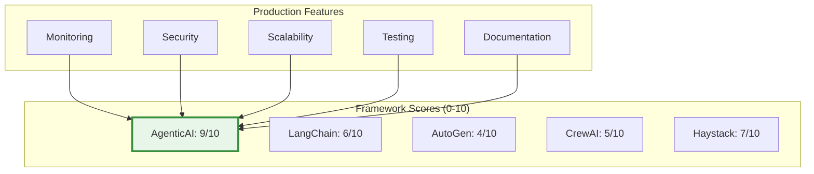

# Framework Comparison

<div class="annotate" markdown>

**How AgenticAI Framework compares to alternatives**

Make an informed decision with **400+ modules** vs competitors

</div>

!!! success "Enterprise-Grade Framework"
    AgenticAI Framework offers **237 enterprise modules** in **14 categories** - the most comprehensive AI agent solution. See [Enterprise Documentation](enterprise.md).

---

## Quick Comparison

<div class="grid cards" markdown>

- :material-check-circle:{ .lg .middle } **AgenticAI Framework**

    ---

    **Best for:** Enterprise multi-agent systems with safety requirements

     Native multi-agent coordination 
     Built-in guardrails and safety 
     Production-ready monitoring 
     MCP Tools integration 
     Comprehensive memory systems 

    [:octicons-arrow-right-24: Get Started](quick-start.md)

- :simple-chainlink:{ .lg .middle } **LangChain**

    ---

    **Best for:** General-purpose LLM applications

     Large ecosystem 
     Many integrations 
     Complex API surface 
     Limited multi-agent support 
     No built-in guardrails 

- :material-robot:{ .lg .middle } **AutoGen**

    ---

    **Best for:** Research and experimentation

     Conversational agents 
     Academic backing (Microsoft) 
     Steep learning curve 
     Limited production features 
     No memory persistence 

- :material-account-group:{ .lg .middle } **CrewAI**

    ---

    **Best for:** Role-based agent teams

     Simple role definitions 
     Easy to get started 
     Limited customization 
     Basic memory 
     No production monitoring 

</div>

## Detailed Feature Matrix

| Feature | AgenticAI | LangChain | AutoGen | CrewAI | Haystack |
|---------|-----------|-----------|---------|--------|----------|
| ** Total Modules** | 400+ | ~50 | ~30 | ~20 | ~40 |
| ** Enterprise Modules** | 237 | Limited | None | None | Few |
| ** Multi-Agent Coordination** | Native | Limited | Yes | Yes | No |
| ** Memory Systems** | 7 Managers | Plugin | Basic | Limited | Plugin |
| ** State Managers** | 7 Managers | No | No | No | No |
| ** Guardrails & Safety** | Built-in | No | No | No | Basic |
| ** MCP Tools** | Native | No | No | No | No |
| ** Monitoring** | 16 Modules | Basic | No | Basic | Basic |
| ** Process Orchestration** | 12 Modules | Chains | Limited | Limited | Pipelines |
| ** Vector Search** | Yes | Yes | No | Limited | Yes |
| ** Task Management** | Advanced | Basic | Basic | Basic | Basic |
| ** 12-Tier Evaluation** | Built-in | No | No | No | Limited |
| ** ML/AI Infrastructure** | 14 Modules | Basic | No | No | Basic |
| ** DDD Patterns** | 12 Modules | No | No | No | No |
| ** Docker Support** | Official | Community | No | Community | Yes |
| ** Kubernetes** | Charts | No | No | No | Basic |
| ** Documentation** | Excellent | Good | Fair | Good | Good |
| ** Learning Curve** | Easy | Medium | Hard | Easy | Medium |
| ** License** | MIT | MIT | MIT | MIT | Apache 2.0 |

**Legend:** 
 Full Support | Partial/Limited | Not Available | Via Plugin

## Use Case Fit


!!! abstract "Framework Comparison Summary"

    | Framework | Best For | Complexity | Multi-Agent |
    |-----------|----------|------------|-------------|
    | **AgenticAI** | Enterprise systems, production scale | High | Native |
    | **LangChain** | General-purpose LLM apps, RAG | Medium | Limited |
    | **AutoGen** | Research, conversational agents | High | Yes |
    | **CrewAI** | Simple role-based teams | Low-Medium | Yes |
    | **Haystack** | Document search, Q&A | Medium | No |

## When to Choose Each Framework

### Choose AgenticAI Framework if you need:

!!! success "Perfect Fit"

    - **400+ modules** with comprehensive coverage
    - **237 enterprise modules** across 14 categories
    - **Multiple agents** coordinating together
    - **Production-grade safety** with 18 security modules
    - **Enterprise monitoring** with 16 observability modules
    - **Advanced memory** with 7 specialized managers
    - **MCP Tools** for external integrations
    - **Complex task orchestration** with 12 workflow modules
    - **Domain-Driven Design** with 12 DDD patterns
    - **ML/AI Infrastructure** with 14 modules
    - **Built-in 12-tier evaluation** framework

### Choose LangChain if you need:

!!! info "Alternative Option"

    - **Largest ecosystem** of integrations
    - **RAG applications** as primary focus
    - **Many third-party plugins**
    - **Extensive community** resources
    - **Quick prototyping** for simple use cases
    - **Document processing** pipelines

### Choose AutoGen if you need:

!!! info "Research Focus"

    - **Academic/research** projects
    - **Conversational agents** with back-and-forth dialogue
    - **Experimental features** and cutting-edge research
    - **Microsoft ecosystem** integration
    - **Code generation** as primary use case

### Choose CrewAI if you need:

!!! info "Simple Teams"

    - **Simple role-based** agent teams
    - **Quick setup** and minimal configuration
    - **Predefined workflows** without customization
    - **Small-scale projects** with few agents
    - **Limited budget** for infrastructure

### Choose Haystack if you need:

!!! info "Search-Focused"

    - **Search-first** applications
    - **Document retrieval** as core functionality
    - **Enterprise search** systems
    - **Question answering** over documents
    - **Pipeline-based** architecture

## Performance Comparison

### Response Latency (P95)


### Memory Overhead (Base + Per Agent)

| Framework | Base Memory | Per Agent | 10 Agents | Notes |
|-----------|-------------|-----------|-----------|-------|
| **AgenticAI** | 50 MB | +10 MB | 150 MB | Optimized |
| **LangChain** | 80 MB | +15 MB | 230 MB | Plugin overhead |
| **AutoGen** | 60 MB | +20 MB | 260 MB | Conversation history |
| **CrewAI** | 40 MB | +8 MB | 120 MB | Minimal features |
| **Haystack** | 70 MB | N/A | 70 MB | Single-agent |

### Throughput (Requests/Second)

!!! abstract "Benchmark Results"

    Tested on: 8 CPU cores, 16GB RAM, Python 3.11

    | Framework | Single Agent | Multi-Agent (4) | Notes |
    |-----------|--------------|-----------------|-------|
    | **AgenticAI** | 1000 | 3500 | Async-first |
    | **LangChain** | 800 | 2800 | Chain overhead |
    | **AutoGen** | 600 | 1800 | Conversation overhead |
    | **CrewAI** | 900 | 3000 | Simple architecture |
    | **Haystack** | 950 | N/A | Pipeline-based |

## Migration Guides

### From LangChain to AgenticAI

=== "LangChain"

    ```python
    from langchain.agents import AgentExecutor
    from langchain.chains import LLMChain

    chain = LLMChain(llm=llm, prompt=prompt)
    agent = AgentExecutor.from_agent_and_tools(
        agent=agent,
        tools=tools
    )
    result = agent.run("task")
    ```

=== "AgenticAI"

    ```python
    from agenticaiframework import Agent

    agent = Agent(
        name="Assistant",
        model="gpt-4",
        tools=tools
    )
    result = await agent.execute("task")
    ```

### From AutoGen to AgenticAI

=== "AutoGen"

    ```python
    from autogen import AssistantAgent, UserProxyAgent

    assistant = AssistantAgent("assistant")
    user_proxy = UserProxyAgent("user")

    user_proxy.initiate_chat(
        assistant,
        message="task"
    )
    ```

=== "AgenticAI"

    ```python
    from agenticaiframework import Agent, Process

    agent = Agent(name="assistant", model="gpt-4")
    process = Process(
        agents=[agent],
        process_type="sequential"
    )
    result = await process.execute("task")
    ```

### From CrewAI to AgenticAI

=== "CrewAI"

    ```python
    from crewai import Agent, Crew, Task

    agent = Agent(
        role="researcher",
        goal="research topic"
    )
    task = Task(description="research")
    crew = Crew(agents=[agent], tasks=[task])
    crew.kickoff()
    ```

=== "AgenticAI"

    ```python
    from agenticaiframework import Agent, Task, Process

    agent = Agent(
        name="researcher",
        role="Research topics thoroughly",
        model="gpt-4"
    )
    task = Task(description="research topic")
    process = Process(
        agents=[agent],
        tasks=[task]
    )
    result = await process.execute()
    ```

## Adoption Considerations

### Team Size & Expertise

| Framework | Small Team<br/>(1-3) | Medium Team<br/>(4-10) | Large Team<br/>(10+) |
|-----------|---------------------|----------------------|---------------------|
| **AgenticAI** | Great | Excellent | Excellent |
| **LangChain** | OK | Good | Good |
| **AutoGen** | Challenging | OK | Good |
| **CrewAI** | Great | OK | Limited |
| **Haystack** | Good | Good | Good |

### Production Readiness



### Cost Considerations

!!! tip "LLM API Costs"

    Framework overhead affects LLM API costs:

    - **AgenticAI**: Efficient prompt management, ~10% overhead
    - **LangChain**: Chain verbosity, ~20% overhead
    - **AutoGen**: Conversation history, ~30% overhead
    - **CrewAI**: Multiple agent calls, ~25% overhead

## Decision Matrix

Use this matrix to evaluate frameworks for your project:

| Requirement | Weight | AgenticAI | LangChain | AutoGen | CrewAI |
|-------------|--------|-----------|-----------|---------|--------|
| Multi-agent coordination | High | | | | |
| Production readiness | High | | | | |
| Safety & guardrails | High | | | | |
| Learning curve | Medium | | | | |
| Ecosystem size | Medium | | | | |
| Documentation | High | | | | |
| Memory systems | High | | | | |
| Enterprise features | High | | | | |

## Learn More

<div class="grid cards" markdown>

- [**Get Started →**](quick-start.md)

    Try AgenticAI Framework

- [**Feature Overview →**](features.md)

    Explore all features

- [**Architecture →**](architecture.md)

    Understand the design

- [**Examples →**](EXAMPLES.md)

    See it in action

</div>

---

!!! question "Still Deciding?"
    Join our [community discussions](https://github.com/isathish/agenticaiframework/discussions) to ask questions and get recommendations
