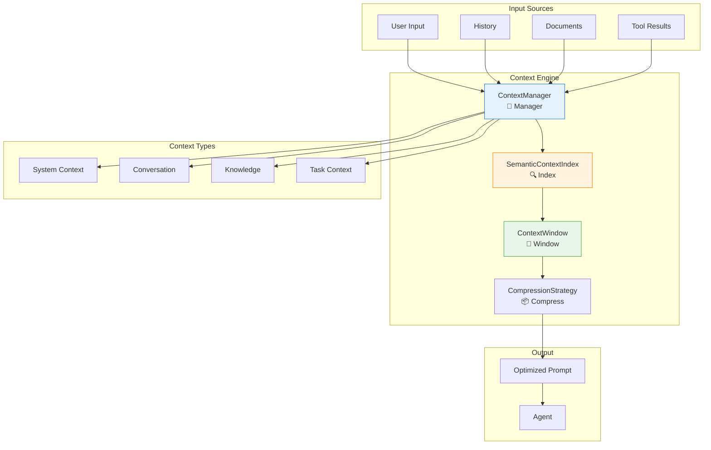

---
tags:
  - context
  - context-engineering
  - semantic-search
  - compression
  - memory
---

# 🧠 Context Engineering

<div class="annotate" markdown>

**Advanced context management for AI agents**

Semantic indexing, context windows, compression strategies, and intelligent retrieval

</div>

## 🎯 Quick Navigation

<div class="grid cards" markdown>

-   :material-brain:{ .lg } **Context Manager**
    
    Central management
    
    [:octicons-arrow-right-24: Manage](#context-manager)

-   :material-magnify:{ .lg } **Semantic Index**
    
    Similarity search
    
    [:octicons-arrow-right-24: Search](#semantic-context-index)

-   :material-window-maximize:{ .lg } **Context Window**
    
    Token management
    
    [:octicons-arrow-right-24: Optimize](#context-window)

-   :material-archive:{ .lg } **Compression**
    
    Context compression
    
    [:octicons-arrow-right-24: Compress](#context-compression)

</div>

## 📊 Overview

!!! success "Part of 380+ Modules"
    
    Context engineering works seamlessly with **7 memory managers**, **7 state managers**, and **14 ML/AI infrastructure modules**.

!!! abstract "Context Engineering Framework"
    
    The Context module provides sophisticated tools for managing and optimizing the context provided to AI agents, ensuring relevant information is available while staying within token limits.

### Architecture



---

## 🧠 Context Manager

The `ContextManager` is the central hub for context operations.

### Basic Usage

```python
from agenticaiframework.context import (
    ContextManager,
    ContextType,
    ContextPriority,
    ContextItem
)

# Create context manager
context_mgr = ContextManager(
    max_tokens=8000,
    model="gpt-4"  # For accurate token counting
)

# Add context items
context_mgr.add(
    ContextItem(
        content="You are a helpful AI assistant.",
        type=ContextType.SYSTEM,
        priority=ContextPriority.CRITICAL
    )
)

context_mgr.add(
    ContextItem(
        content="User is asking about Python programming.",
        type=ContextType.TASK,
        priority=ContextPriority.HIGH
    )
)
```

### Context Types

```python
from agenticaiframework.context import ContextType

# Available context types
ContextType.SYSTEM         # System instructions
ContextType.CONVERSATION   # Chat history
ContextType.KNOWLEDGE      # Retrieved knowledge
ContextType.TASK           # Current task details
ContextType.TOOL_RESULT    # Tool execution results
ContextType.USER_PROFILE   # User preferences
ContextType.METADATA       # Additional metadata
```

### Priority Levels

```python
from agenticaiframework.context import ContextPriority

# Priority determines what stays during compression
ContextPriority.CRITICAL   # Never removed (system prompts)
ContextPriority.HIGH       # Removed last (recent conversation)
ContextPriority.MEDIUM     # Normal priority
ContextPriority.LOW        # Removed first (old history)
```

### Build Context

```python
# Build optimized context for prompt
context = context_mgr.build_context(
    query="How do I create a class in Python?",
    max_tokens=4000,
    include_types=[
        ContextType.SYSTEM,
        ContextType.CONVERSATION,
        ContextType.KNOWLEDGE
    ]
)

# Get as messages for chat API
messages = context.to_messages()

# Get as single string
text = context.to_text()

# Get token count
print(f"Context tokens: {context.token_count}")
```

### Context Sessions

```python
# Create session for conversation
session = context_mgr.create_session(
    session_id="user-123-conv-456",
    ttl_minutes=60
)

# Add to session
session.add_message("user", "Hello!")
session.add_message("assistant", "Hi there! How can I help?")

# Retrieve session context
session_context = session.get_context()
```

---

## 🔍 Semantic Context Index

The `SemanticContextIndex` enables semantic similarity search.

### Basic Usage

```python
from agenticaiframework.context import (
    SemanticContextIndex,
    IndexConfig
)

# Create semantic index
index = SemanticContextIndex(
    config=IndexConfig(
        embedding_model="text-embedding-3-small",
        dimension=1536,
        similarity_metric="cosine"
    )
)

# Index documents
index.add_documents([
    {"id": "doc1", "content": "Python is a programming language..."},
    {"id": "doc2", "content": "Machine learning uses algorithms..."},
    {"id": "doc3", "content": "Data structures include arrays..."}
])
```

### Semantic Search

```python
# Search for relevant context
results = index.search(
    query="How do I train a model?",
    top_k=5,
    min_score=0.7
)

for result in results:
    print(f"Document: {result.id}")
    print(f"Score: {result.score:.3f}")
    print(f"Content: {result.content[:100]}...")
```

### Hybrid Search

```python
# Combine semantic + keyword search
results = index.hybrid_search(
    query="Python machine learning",
    semantic_weight=0.7,
    keyword_weight=0.3,
    top_k=10
)
```

### Context Retrieval Strategies

```python
from agenticaiframework.context import ContextRetrievalStrategy

# Different retrieval strategies
strategy = ContextRetrievalStrategy.SEMANTIC  # Pure semantic
strategy = ContextRetrievalStrategy.KEYWORD   # Keyword matching
strategy = ContextRetrievalStrategy.HYBRID    # Combined
strategy = ContextRetrievalStrategy.RECENT    # Most recent
strategy = ContextRetrievalStrategy.MMR       # Maximum Marginal Relevance

# Use with context manager
context_mgr.set_retrieval_strategy(
    ContextRetrievalStrategy.MMR,
    diversity_factor=0.3  # Balance relevance vs diversity
)
```

### Index Management

```python
# Update documents
index.update_document("doc1", {"content": "Updated content..."})

# Delete documents
index.delete_document("doc3")

# Get index statistics
stats = index.get_stats()
print(f"Total documents: {stats.document_count}")
print(f"Index size: {stats.size_mb} MB")

# Persist index
index.save("/path/to/index")

# Load index
index = SemanticContextIndex.load("/path/to/index")
```

---

## 📐 Context Window

The `ContextWindow` manages token limits and context fitting.

### Basic Usage

```python
from agenticaiframework.context import (
    ContextWindow,
    WindowConfig
)

# Create context window
window = ContextWindow(
    config=WindowConfig(
        max_tokens=8192,
        reserved_output_tokens=1024,  # Reserve for response
        model="gpt-4"
    )
)

# Add items to window
window.add("System prompt...", priority="critical")
window.add("Recent message 1", priority="high")
window.add("Recent message 2", priority="high")
window.add("Old message", priority="low")

# Check if fits
if not window.fits():
    window.compact()  # Remove low priority items
```

### Token Management

```python
# Get token counts
print(f"Used tokens: {window.used_tokens}")
print(f"Available tokens: {window.available_tokens}")
print(f"Utilization: {window.utilization:.1%}")

# Token-aware truncation
truncated = window.truncate_to_fit(
    content="Very long content...",
    max_tokens=500,
    truncation_side="end"  # or "start", "middle"
)
```

### Sliding Window

```python
# Configure sliding window for conversations
window.configure_sliding(
    keep_recent=10,        # Keep last 10 messages
    keep_system=True,      # Always keep system prompt
    summary_threshold=20   # Summarize after 20 messages
)

# Add messages (auto-manages window)
for message in conversation_history:
    window.add_message(message)
    # Automatically removes old messages and creates summaries
```

### Model-Specific Windows

```python
# Auto-configure for model
window = ContextWindow.for_model("gpt-4-turbo")
print(f"Max tokens: {window.max_tokens}")  # 128000

window = ContextWindow.for_model("claude-3-opus")
print(f"Max tokens: {window.max_tokens}")  # 200000

window = ContextWindow.for_model("gpt-4")
print(f"Max tokens: {window.max_tokens}")  # 8192
```

---

## 📦 Context Compression

Reduce context size while preserving meaning.

### Basic Compression

```python
from agenticaiframework.context import (
    ContextCompressor,
    CompressionStrategy,
    CompressionConfig
)

# Create compressor
compressor = ContextCompressor(
    config=CompressionConfig(
        target_ratio=0.5,  # Compress to 50% of original
        preserve_key_info=True
    )
)

# Compress text
original = "Long context with lots of details..."
compressed = compressor.compress(original)
print(f"Original: {len(original)} chars")
print(f"Compressed: {len(compressed)} chars")
```

### Compression Strategies

```python
from agenticaiframework.context import CompressionStrategy

# Summarization (LLM-based)
compressor.set_strategy(CompressionStrategy.SUMMARIZE)

# Extraction (key points only)
compressor.set_strategy(CompressionStrategy.EXTRACT)

# Truncation (simple cutoff)
compressor.set_strategy(CompressionStrategy.TRUNCATE)

# Selective (keep relevant parts)
compressor.set_strategy(
    CompressionStrategy.SELECTIVE,
    relevance_query="Python programming"
)
```

### Conversation Compression

```python
# Compress conversation history
compressed_history = compressor.compress_conversation(
    messages=[
        {"role": "user", "content": "..."},
        {"role": "assistant", "content": "..."},
        # ... many messages
    ],
    strategy=CompressionStrategy.SUMMARIZE,
    keep_recent=5  # Keep last 5 messages uncompressed
)
```

### Progressive Compression

```python
# Compress progressively as context grows
context_mgr.enable_progressive_compression(
    trigger_threshold=0.8,  # Compress at 80% utilization
    target_utilization=0.6,  # Compress down to 60%
    strategy=CompressionStrategy.SELECTIVE
)
```

---

## 🎯 Complete Example

```python
from agenticaiframework import Agent
from agenticaiframework.context import (
    ContextManager,
    SemanticContextIndex,
    ContextWindow,
    ContextCompressor,
    ContextType,
    ContextPriority,
    ContextItem,
    CompressionStrategy,
    ContextRetrievalStrategy
)

# Initialize context components
context_mgr = ContextManager(max_tokens=8000, model="gpt-4")
semantic_index = SemanticContextIndex()
context_window = ContextWindow.for_model("gpt-4")
compressor = ContextCompressor(target_ratio=0.5)

# Index knowledge base
knowledge_docs = load_knowledge_base()
semantic_index.add_documents(knowledge_docs)

# Create context-aware agent
class ContextAwareAgent:
    def __init__(self, agent: Agent):
        self.agent = agent
        self.session_history = []
    
    async def process(self, user_input: str) -> str:
        # 1. Add system context
        context_mgr.add(ContextItem(
            content=self.agent.instructions,
            type=ContextType.SYSTEM,
            priority=ContextPriority.CRITICAL
        ))
        
        # 2. Retrieve relevant knowledge
        relevant_docs = semantic_index.search(
            query=user_input,
            top_k=3,
            min_score=0.7
        )
        
        for doc in relevant_docs:
            context_mgr.add(ContextItem(
                content=doc.content,
                type=ContextType.KNOWLEDGE,
                priority=ContextPriority.MEDIUM
            ))
        
        # 3. Add conversation history
        for msg in self.session_history[-10:]:  # Last 10 messages
            context_mgr.add(ContextItem(
                content=f"{msg['role']}: {msg['content']}",
                type=ContextType.CONVERSATION,
                priority=ContextPriority.HIGH
            ))
        
        # 4. Add current user input
        context_mgr.add(ContextItem(
            content=f"User: {user_input}",
            type=ContextType.TASK,
            priority=ContextPriority.HIGH
        ))
        
        # 5. Build optimized context
        context = context_mgr.build_context(
            query=user_input,
            max_tokens=6000  # Leave room for response
        )
        
        # 6. Check if compression needed
        if context.token_count > 6000:
            context = compressor.compress_context(
                context,
                target_tokens=5000
            )
        
        # 7. Generate response
        response = await self.agent.run(
            messages=context.to_messages()
        )
        
        # 8. Update history
        self.session_history.append({"role": "user", "content": user_input})
        self.session_history.append({"role": "assistant", "content": response})
        
        # 9. Clear context for next turn
        context_mgr.clear()
        
        return response

# Usage
agent = Agent(
    name="KnowledgeAgent",
    model="gpt-4",
    instructions="You are a helpful assistant with access to a knowledge base."
)

context_agent = ContextAwareAgent(agent)

# Conversation with context management
response1 = await context_agent.process("What is machine learning?")
response2 = await context_agent.process("How does it relate to AI?")
response3 = await context_agent.process("Can you give me an example?")
```

---

## 📋 Context Optimization Tips

### Token Efficiency

```python
# 1. Use semantic retrieval instead of stuffing
relevant_context = index.search(query, top_k=3)

# 2. Compress old conversation
compressed = compressor.compress_conversation(
    history,
    keep_recent=5
)

# 3. Prioritize context items
context_mgr.add(item, priority=ContextPriority.HIGH)

# 4. Set appropriate limits
window = ContextWindow(max_tokens=4000)
```

### Quality vs Quantity

| Strategy | Token Usage | Quality | Use Case |
|----------|-------------|---------|----------|
| Full context | High | Best | Short conversations |
| Semantic retrieval | Medium | Good | Knowledge-heavy tasks |
| Summarization | Low | Good | Long conversations |
| Truncation | Low | Fair | Simple tasks |

---

## 🎯 Best Practices

!!! tip "Context Guidelines"
    
    1. **Start with retrieval** - Only include relevant context
    2. **Prioritize properly** - Critical > High > Medium > Low
    3. **Compress strategically** - Summarize, don't just truncate
    4. **Monitor token usage** - Track utilization metrics
    5. **Test different strategies** - Find optimal balance

!!! warning "Common Pitfalls"
    
    - Don't stuff all available context
    - Avoid losing critical information during compression
    - Remember to account for output tokens
    - Test with various conversation lengths

---

## 📚 Related Documentation

- [Memory](memory.md) - Long-term memory storage
- [Knowledge](knowledge.md) - Knowledge base management
- [Prompts](prompts.md) - Prompt engineering
- [Performance](performance.md) - Performance optimization
