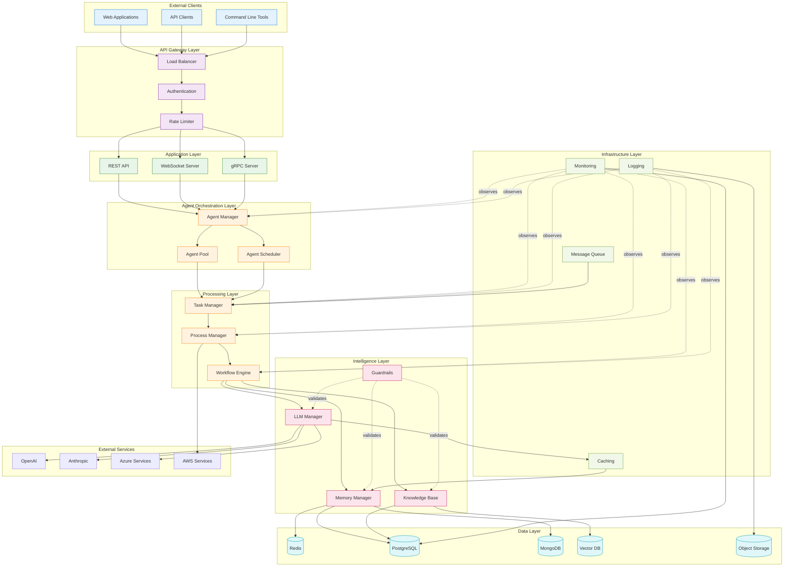
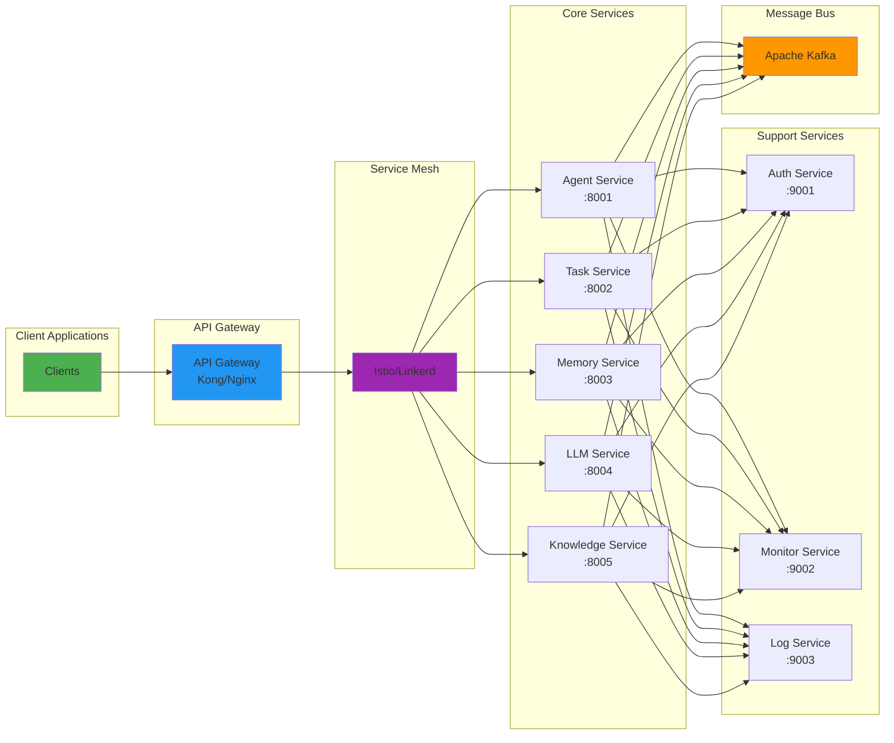
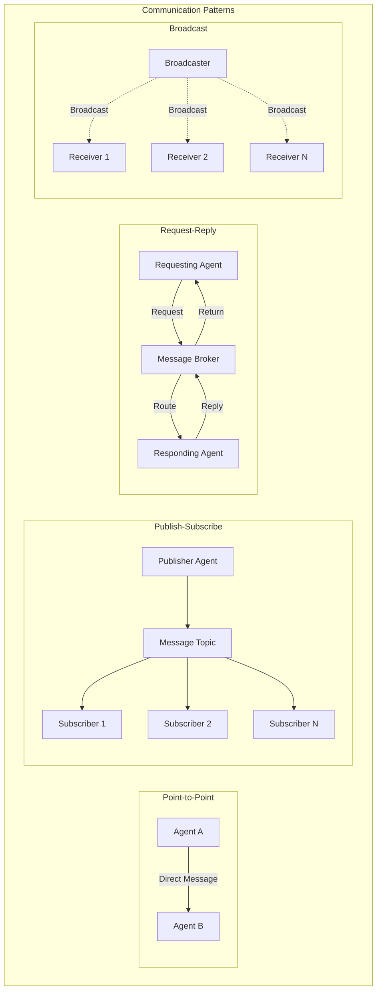
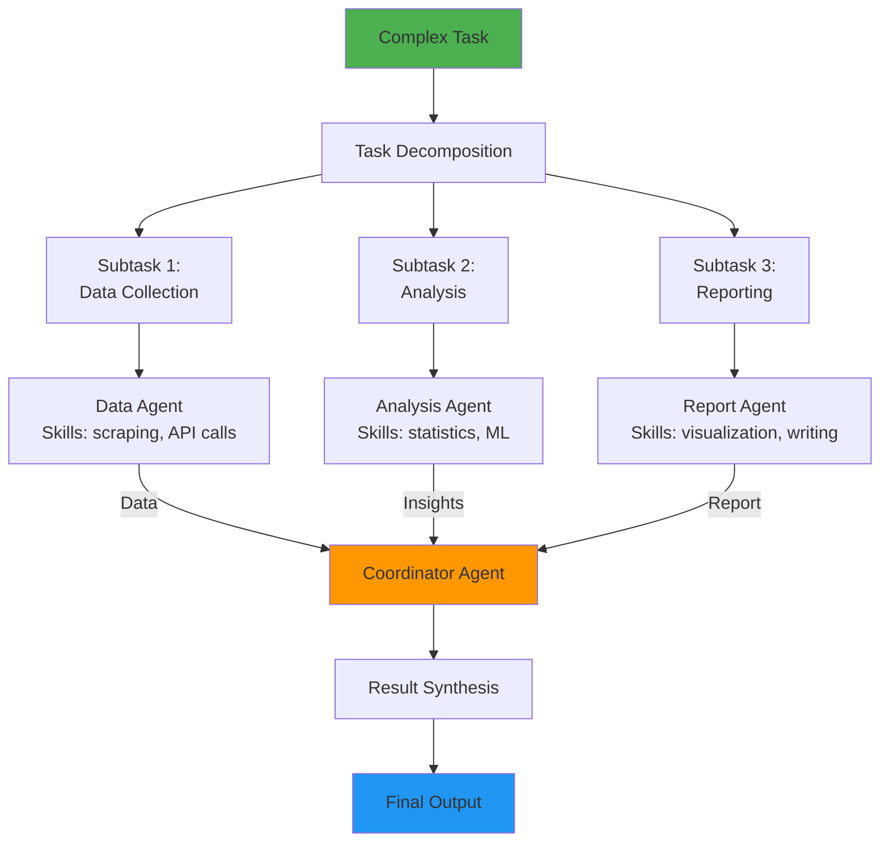
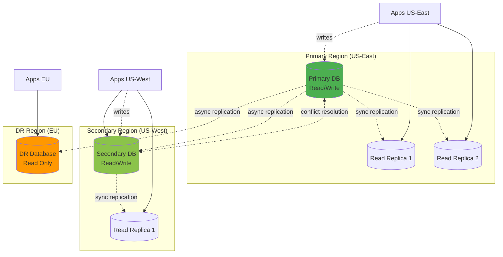
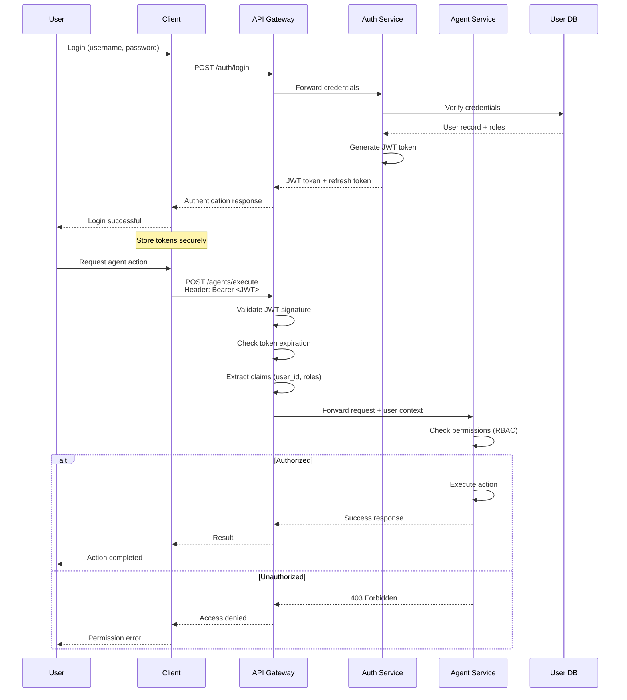
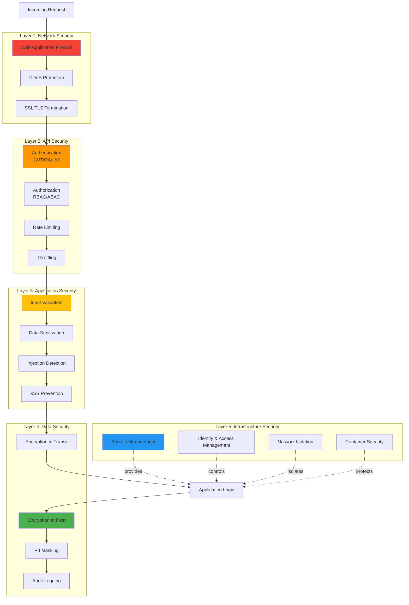
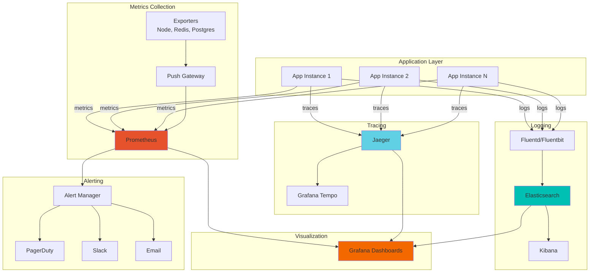

# :art: Architecture Diagrams Reference

<div class="annotate" markdown>

Comprehensive collection of High-Level Design (HLD) and Low-Level Design (LLD) diagrams for AgenticAI Framework. All diagrams are created using Mermaid.js and are fully compatible with GitHub wiki.

</div>

---

## :sparkles: Overview

This page provides a complete reference of all architectural diagrams used throughout the AgenticAI Framework documentation. These diagrams help visualize system design, component interactions, data flows, and operational patterns.

!!! tip "Using These Diagrams"
    
    All diagrams use **Mermaid.js** syntax, which is natively supported by:
    
    - :octicons-mark-github-16: GitHub (Markdown files, Wiki, Issues, PRs)
    - :material-book-open: MkDocs with Material theme
    - :material-file-document: Confluence, Notion, and many other platforms
    
    Simply copy the diagram code blocks into your documentation!

---

## :building_construction: System Architecture

### Complete System Overview



### Microservices Architecture



---

## :robot: Agent Architecture

### Agent Communication Patterns



### Agent Collaboration Model



---

## :material-database: Data Architecture

### Multi-Tier Storage Strategy

```mermaid
graph LR
    subgraph "Hot Tier (Milliseconds)"
        REDIS_CACHE[Redis Cache<br/>TTL: Seconds-Minutes<br/>Size: 1-10 GB]
        MEMORY[In-Memory<br/>TTL: Session<br/>Size: 100-500 MB]
    end
    
    subgraph "Warm Tier (Sub-second)"
        REDIS_PERSIST[Redis Persistent<br/>TTL: Hours-Days<br/>Size: 10-100 GB]
        POSTGRES_HOT[PostgreSQL Hot<br/>Indexed Tables<br/>Size: 100 GB - 1 TB]
    end
    
    subgraph "Cold Tier (1-5 seconds)"
        POSTGRES_ARCHIVE[PostgreSQL Archive<br/>Partitioned Tables<br/>Size: 1-10 TB]
        MONGO[MongoDB<br/>Document Store<br/>Size: 1-10 TB]
    end
    
    subgraph "Frozen Tier (5+ seconds)"
        S3[S3/Blob Storage<br/>Compressed Archives<br/>Size: 10+ TB]
        GLACIER[Glacier/Archive<br/>Long-term Storage<br/>Size: Unlimited]
    end
    
    APP[Application] --> MEMORY
    MEMORY -.promote.-> REDIS_CACHE
    REDIS_CACHE -.persist.-> REDIS_PERSIST
    REDIS_PERSIST -.archive.-> POSTGRES_HOT
    POSTGRES_HOT -.partition.-> POSTGRES_ARCHIVE
    POSTGRES_ARCHIVE -.compress.-> S3
    S3 -.archive.-> GLACIER
    
    GLACIER -.restore.-> S3
    S3 -.load.-> POSTGRES_ARCHIVE
    POSTGRES_ARCHIVE -.promote.-> POSTGRES_HOT
    
    style MEMORY fill:#4caf50
    style REDIS_CACHE fill:#8bc34a
    style REDIS_PERSIST fill:#ffc107
    style POSTGRES_HOT fill:#ff9800
    style POSTGRES_ARCHIVE fill:#ff5722
    style S3 fill:#9e9e9e
    style GLACIER fill:#607d8b
```



### Data Replication Strategy



---

## :material-security: Security Architecture

### Authentication & Authorization Flow



### Security Layers



---

## :material-monitor: Observability

### Monitoring Stack



---

## :material-check-all: Best Practices

### CI/CD Pipeline

```mermaid
graph LR
    CODE[Code Push] --> GIT[GitHub]
    GIT --> TRIGGER[Webhook Trigger]
    
    TRIGGER --> BUILD[Build Stage]
    BUILD --> TEST[Test Stage]
    TEST --> SCAN[Security Scan]
    SCAN --> DOCKER[Docker Build]
    DOCKER --> PUSH[Push to Registry]
    
    PUSH --> DEV[Deploy to Dev]
    DEV --> INT_TEST[Integration Tests]
    INT_TEST --> STAGING[Deploy to Staging]
    
    STAGING --> APPROVAL{Manual<br/>Approval}
    APPROVAL -->|Approved| PROD[Deploy to Production]
    APPROVAL -->|Rejected| NOTIFY[Notify Team]
    
    PROD --> HEALTH[Health Check]
    HEALTH --> SMOKE[Smoke Tests]
    SMOKE --> MONITOR[Monitor Metrics]
    
    style CODE fill:#4caf50
    style PROD fill:#2196f3
    style APPROVAL fill:#ff9800
```



---

## :material-file-document: Diagram Usage Tips

!!! tip "Copy & Paste"
    
    All diagrams are ready to use:
    
    1. Copy the entire code block (including ` ```mermaid` markers)
    2. Paste into GitHub Markdown, Wiki, or MkDocs
    3. The diagram will render automatically!

!!! info "Customization"
    
    Modify diagrams by:
    
    - Changing node labels
    - Adding/removing connections
    - Adjusting colors with `style` directives
    - Updating layout with different Mermaid diagram types

!!! example "Diagram Types"
    
    - **flowchart/graph**: Process flows, system architecture
    - **sequenceDiagram**: Interaction flows, API calls
    - **stateDiagram**: State machines, lifecycles
    - **classDiagram**: Object models, class relationships
    - **gantt**: Timelines, project schedules
    - **erDiagram**: Database schemas, entity relationships

---

## :material-link: Related Documentation

- [Architecture Guide](architecture.md) - Complete architectural documentation
- [Agents Module](agents.md) - Agent design and implementation
- [Tasks Module](tasks.md) - Task management architecture
- [Memory Module](memory.md) - Memory system design
- [LLMs Module](llms.md) - LLM integration architecture
- [Best Practices](best-practices.md) - Development guidelines
