# :art: Architecture Diagrams

<div class="annotate" markdown>

**Comprehensive HLD and LLD diagrams**

Visualize system design across **380+ modules** and **237 enterprise features**

</div>

!!! success "Enterprise Diagrams"
    Part of **237 enterprise modules** with comprehensive architecture documentation. See [Enterprise Documentation](enterprise.md).

---

## :sparkles: Overview

This page provides a complete reference of all architectural diagrams used throughout the AgenticAI Framework documentation. These diagrams help visualize system design, component interactions, data flows, and operational patterns.

!!! tip "Using These Diagrams"
    
    All diagrams use **Mermaid.js** syntax, which is natively supported by:
    
    - :octicons-mark-github-16: GitHub (Markdown files, Wiki, Issues, PRs)
    - :material-book-open: MkDocs with Material theme
    - :material-file-document: Confluence, Notion, and many other platforms
    
    Simply copy the diagram code blocks into your documentation!


## :building_construction: System Architecture

### Complete System Overview

!!! info "System Architecture Overview"
    
    This diagram illustrates the complete **end-to-end system architecture** of the AgenticAI Framework, showing all layers from client applications to data storage.
    
    **Key Components:**
    
    - **External Clients Layer**: Entry points for web, API, and CLI users
    - **API Gateway Layer**: Handles authentication, rate limiting, and load balancing
    - **Application Layer**: Protocol-specific servers (REST, WebSocket, gRPC)
    - **Agent Orchestration**: Manages agent lifecycle, pooling, and scheduling
    - **Processing Layer**: Task execution, workflow orchestration, and process management
    - **Intelligence Layer**: Core AI capabilities (LLM, Memory, Knowledge, Guardrails)
    - **Infrastructure Layer**: Cross-cutting concerns (monitoring, logging, caching, queuing)
    - **Data Layer**: Persistent storage across multiple database types
    - **External Services**: Third-party AI providers and cloud services
    
    **Data Flow:**
    1. Clients send requests through the load balancer
    2. Requests pass through authentication and rate limiting
    3. Routed to appropriate protocol handler (REST/WebSocket/gRPC)
    4. Agent Manager orchestrates agent selection and task assignment
    5. Tasks are executed through the workflow engine
    6. Intelligence layer provides AI capabilities (LLM, memory, knowledge)
    7. Guardrails validate all AI operations for safety
    8. Results are stored in appropriate databases
    9. Monitoring and logging capture all operations
    
    **Color Coding:**
    - 🔵 Blue: External systems and clients
    - 🟣 Purple: Gateway and security
    - 🟢 Green: Application and orchestration
    - 🟠 Orange: Processing and workflows
    - 🔴 Red: Intelligence and AI services
    - 🟡 Yellow-Green: Infrastructure services
    - 💠 Cyan: Data storage

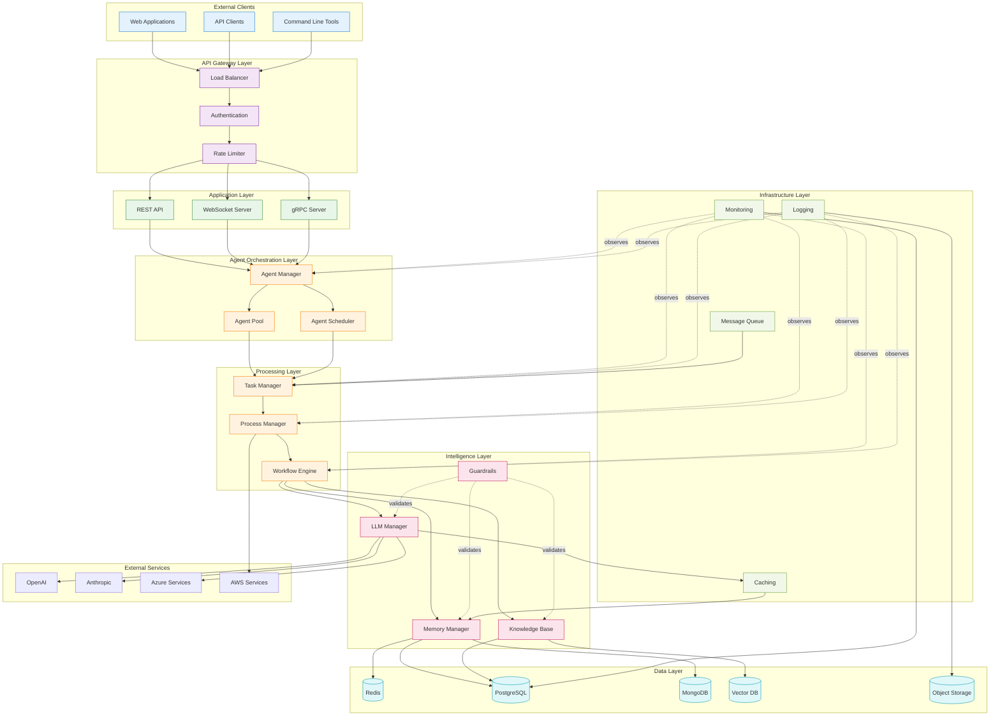
```mermaid
graph TB
    subgraph "External Clients"
        WEB[Web Applications]
        API_CLIENTS[API Clients]
        CLI[Command Line Tools]
    end
    
    subgraph "API Gateway Layer"
        LB[Load Balancer]
        AUTH[Authentication]
        RATE[Rate Limiter]
    end
    
    subgraph "Application Layer"
        REST[REST API]
        WEBSOCKET[WebSocket Server]
        GRPC[gRPC Server]
    end
    
    subgraph "Agent Orchestration Layer"
        AM[Agent Manager]
        AP[Agent Pool]
        AS[Agent Scheduler]
    end
    
    subgraph "Processing Layer"
        TM[Task Manager]
        PM[Process Manager]
        WF[Workflow Engine]
    end
    
    subgraph "Intelligence Layer"
        LLM[LLM Manager]
        MEM[Memory Manager]
        KNOW[Knowledge Base]
        GUARD[Guardrails]
    end
    
    subgraph "Infrastructure Layer"
        MON[Monitoring]
        LOG[Logging]
        CACHE[Caching]
        QUEUE[Message Queue]
    end
    
    subgraph "Data Layer"
        REDIS[(Redis)]
        POSTGRES[(PostgreSQL)]
        MONGO[(MongoDB)]
        VECTOR[(Vector DB)]
        S3[(Object Storage)]
    end
    
    subgraph "External Services"
        OPENAI[OpenAI]
        ANTHROPIC[Anthropic]
        AZURE[Azure Services]
        AWS[AWS Services]
    end
    
    WEB & API_CLIENTS & CLI --> LB
    LB --> AUTH --> RATE
    RATE --> REST & WEBSOCKET & GRPC
    
    REST & WEBSOCKET & GRPC --> AM
    AM --> AP & AS
    AP & AS --> TM
    TM --> PM --> WF
    
    WF --> LLM & MEM & KNOW
    GUARD -.validates.-> LLM & MEM & KNOW
    
    MON & LOG -.observes.-> AM & TM & PM & WF
    QUEUE --> TM
    CACHE --> MEM
    
    MEM --> REDIS & POSTGRES & MONGO
    KNOW --> VECTOR & POSTGRES
    LLM --> CACHE
    
    LLM --> OPENAI & ANTHROPIC & AZURE
    PM --> AWS
    
    MON --> POSTGRES
    LOG --> S3
    
    classDef external fill:#e3f2fd,stroke:#1976d2
    classDef gateway fill:#f3e5f5,stroke:#7b1fa2
    classDef app fill:#e8f5e9,stroke:#388e3c
    classDef processing fill:#fff3e0,stroke:#f57c00
    classDef intel fill:#fce4ec,stroke:#c2185b
    classDef infra fill:#f1f8e9,stroke:#689f38
    classDef data fill:#e0f7fa,stroke:#0097a7
    
    class WEB,API_CLIENTS,CLI external
    class LB,AUTH,RATE gateway
    class REST,WEBSOCKET,GRPC app
    class AM,AP,AS,TM,PM,WF processing
    class LLM,MEM,KNOW,GUARD intel
    class MON,LOG,CACHE,QUEUE infra
    class REDIS,POSTGRES,MONGO,VECTOR,S3 data
```

### Microservices Architecture

!!! info "Microservices Design Pattern"
    
    This diagram shows the **distributed microservices architecture** for deploying AgenticAI at scale.
    
    **Service Breakdown:**
    
    - **Agent Service (Port 8001)**: Manages agent lifecycle, registration, and state
    - **Task Service (Port 8002)**: Handles task creation, scheduling, and execution
    - **Memory Service (Port 8003)**: Provides distributed memory storage and retrieval
    - **LLM Service (Port 8004)**: Manages LLM provider connections and request routing
    - **Knowledge Service (Port 8005)**: Handles knowledge base operations and vector search
    
    **Support Services:**
    
    - **Auth Service (Port 9001)**: Centralized authentication and authorization
    - **Monitor Service (Port 9002)**: Metrics collection and health checks
    - **Log Service (Port 9003)**: Centralized logging aggregation
    
    **Infrastructure Components:**
    
    - **API Gateway (Kong/Nginx)**: Single entry point with routing, rate limiting, SSL
    - **Service Mesh (Istio/Linkerd)**: Service-to-service communication, observability, security
    - **Message Bus (Kafka)**: Asynchronous event-driven communication between services
    
    **Benefits of This Architecture:**
    
    - ✅ **Independent Scaling**: Scale each service based on its specific load
    - ✅ **Fault Isolation**: Failures in one service don't cascade to others
    - ✅ **Technology Flexibility**: Each service can use optimal technology stack
    - ✅ **Easier Updates**: Deploy services independently without full system downtime
    - ✅ **Team Autonomy**: Different teams can own and develop separate services
    
    **Service Communication:**
    1. Synchronous: Direct HTTP/gRPC calls through service mesh
    2. Asynchronous: Events published to Kafka for eventual consistency
    3. Authentication: All services verify requests with Auth Service
    4. Observability: All traffic flows through service mesh for monitoring

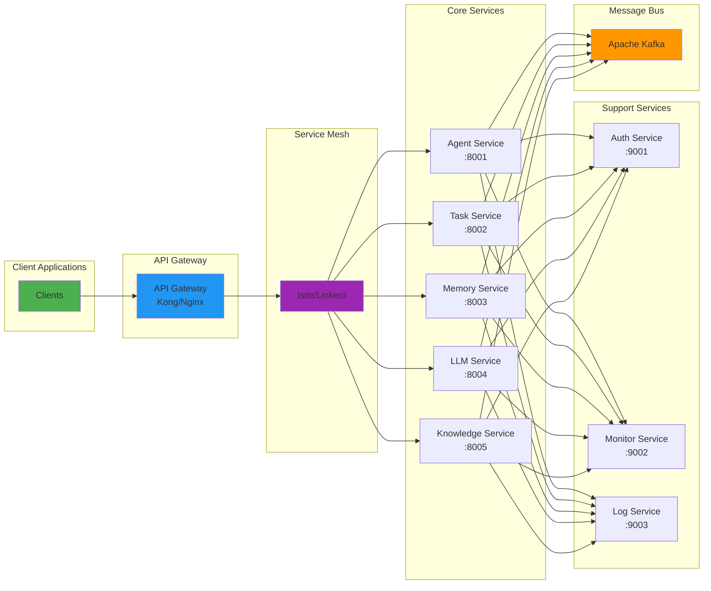
```mermaid
graph LR
    subgraph "Client Applications"
        CLIENT[Clients]
    end
    
    subgraph "API Gateway"
        GW[API Gateway<br/>Kong/Nginx]
    end
    
    subgraph "Core Services"
        AS[Agent Service<br/>:8001]
        TS[Task Service<br/>:8002]
        MS[Memory Service<br/>:8003]
        LS[LLM Service<br/>:8004]
        KS[Knowledge Service<br/>:8005]
    end
    
    subgraph "Support Services"
        AUTH_SVC[Auth Service<br/>:9001]
        MON_SVC[Monitor Service<br/>:9002]
        LOG_SVC[Log Service<br/>:9003]
    end
    
    subgraph "Message Bus"
        KAFKA[Apache Kafka]
    end
    
    subgraph "Service Mesh"
        ISTIO[Istio/Linkerd]
    end
    
    CLIENT --> GW
    GW --> ISTIO
    ISTIO --> AS & TS & MS & LS & KS
    
    AS & TS & MS & LS & KS --> KAFKA
    AS & TS & MS & LS & KS --> AUTH_SVC
    AS & TS & MS & LS & KS --> MON_SVC
    AS & TS & MS & LS & KS --> LOG_SVC
    
    style CLIENT fill:#4caf50
    style GW fill:#2196f3
    style KAFKA fill:#ff9800
    style ISTIO fill:#9c27b0
```


## :robot: Agent Architecture

### Agent Communication Patterns

!!! info "Inter-Agent Communication Patterns"
    
    This diagram illustrates the **four primary communication patterns** supported by AgenticAI for agent-to-agent interaction.
    
    **Pattern 1: Point-to-Point (Direct Messaging)**
    
    - **Use Case**: When one agent needs to send a specific message to another agent
    - **Characteristics**: Direct, synchronous, guaranteed delivery
    - **Example**: Agent A requests data processing from Agent B
    - **Best For**: Simple, targeted interactions between two agents
    
    **Pattern 2: Publish-Subscribe (Pub-Sub)**
    
    - **Use Case**: Broadcasting events to multiple interested agents
    - **Characteristics**: Asynchronous, one-to-many, decoupled
    - **Example**: Agent publishes "data_updated" event, multiple agents subscribe
    - **Best For**: Event-driven architectures, notifications, state changes
    - **Benefits**: Publishers don't need to know subscribers, easy to add new subscribers
    
    **Pattern 3: Request-Reply (RPC-style)**
    
    - **Use Case**: When an agent needs a response from another agent
    - **Characteristics**: Synchronous, bidirectional, correlation tracking
    - **Example**: Agent requests analysis from another agent and waits for result
    - **Best For**: Service-oriented interactions, API-like calls between agents
    - **Flow**: Request → Broker routes to handler → Handler processes → Reply
    
    **Pattern 4: Broadcast (Fan-Out)**
    
    - **Use Case**: Sending messages to all agents without subscription
    - **Characteristics**: Fire-and-forget, no acknowledgment, all agents receive
    - **Example**: Emergency shutdown signal sent to all agents
    - **Best For**: System-wide announcements, alerts, coordination signals
    
    **Choosing the Right Pattern:**
    
    | Pattern | Latency | Coupling | Reliability | Use When |
    |---------|---------|----------|-------------|----------|
    | Point-to-Point | Low | High | High | Direct, targeted communication |
    | Pub-Sub | Medium | Low | Medium | Multiple consumers needed |
    | Request-Reply | Medium | Medium | High | Response required |
    | Broadcast | Low | Low | Low | System-wide notifications |

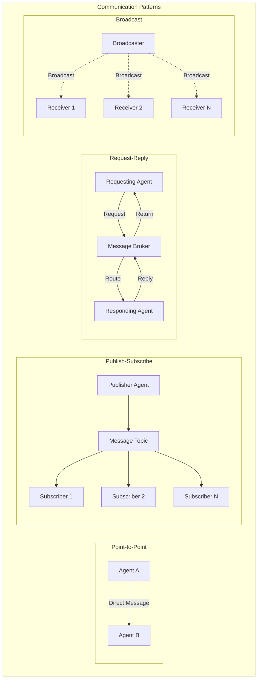
```mermaid
graph TB
    subgraph "Communication Patterns"
        subgraph "Point-to-Point"
            A1[Agent A] -->|Direct Message| A2[Agent B]
        end
        
        subgraph "Publish-Subscribe"
            PUB[Publisher Agent]
            TOPIC[Message Topic]
            SUB1[Subscriber 1]
            SUB2[Subscriber 2]
            SUB3[Subscriber N]
            
            PUB --> TOPIC
            TOPIC --> SUB1 & SUB2 & SUB3
        end
        
        subgraph "Request-Reply"
            REQ[Requesting Agent] -->|Request| BROKER[Message Broker]
            BROKER -->|Route| RESP[Responding Agent]
            RESP -->|Reply| BROKER
            BROKER -->|Return| REQ
        end
        
        subgraph "Broadcast"
            BCAST[Broadcaster]
            R1[Receiver 1]
            R2[Receiver 2]
            R3[Receiver N]
            
            BCAST -.->|Broadcast| R1 & R2 & R3
        end
    end
```

### Agent Collaboration Model

!!! info "Multi-Agent Collaboration Workflow"
    
    This diagram demonstrates how **multiple specialized agents collaborate** to solve complex tasks through task decomposition and coordination.
    
    **Collaboration Flow:**
    
    1. **Complex Task Arrival**
       - A high-level task that's too complex for a single agent
       - Example: "Generate a comprehensive market analysis report"
    
    2. **Task Decomposition**
       - Coordinator breaks down the task into manageable subtasks
       - Each subtask matches the capabilities of specialized agents
    
    3. **Specialized Agent Assignment**
       - **Data Agent**: Skilled in web scraping, API calls, data collection
       - **Analysis Agent**: Expert in statistics, machine learning, pattern recognition
       - **Report Agent**: Specializes in data visualization, report writing, formatting
    
    4. **Parallel Execution**
       - Each agent works independently on their subtask
       - Agents may communicate if dependencies exist
    
    5. **Result Coordination**
       - All agents report completed work to Coordinator Agent
       - Coordinator ensures all subtasks are complete
       - Handles any failures or retries
    
    6. **Result Synthesis**
       - Coordinator merges all results intelligently
       - Resolves conflicts or inconsistencies
       - Creates cohesive final output
    
    **Coordinator Agent Responsibilities:**
    - 🎯 Task planning and decomposition
    - 🤝 Agent selection and assignment
    - 📊 Progress monitoring
    - ⚠️ Error handling and recovery
    - 🔄 Result aggregation
    - ✅ Quality validation
    
    **Benefits of This Model:**
    - ✅ **Specialization**: Each agent focuses on what it does best
    - ✅ **Parallelism**: Subtasks executed concurrently for faster completion
    - ✅ **Scalability**: Add more specialized agents as needed
    - ✅ **Maintainability**: Easier to update individual agent capabilities
    - ✅ **Reusability**: Agents can participate in multiple workflows
    
    **Color Coding:**
    - 🟢 Green: Input task
    - 🟠 Orange: Coordination and orchestration
    - 🔵 Blue: Final output

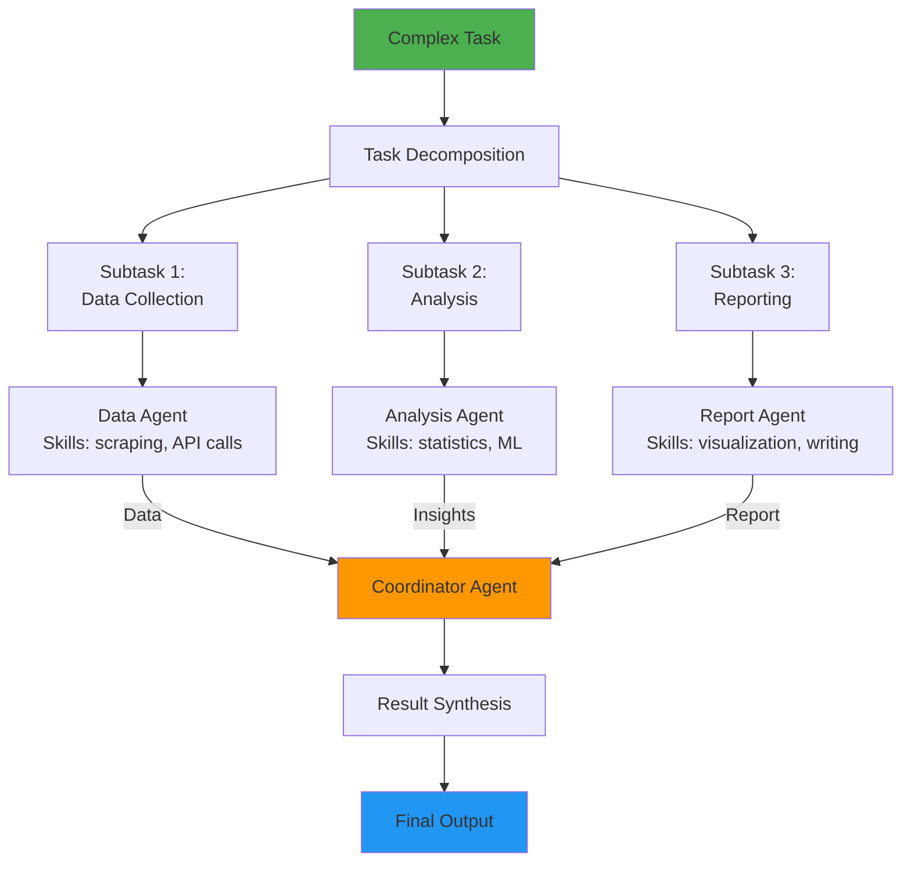
```mermaid
graph TB
    TASK[Complex Task] --> DECOMP[Task Decomposition]
    
    DECOMP --> SUB1[Subtask 1:<br/>Data Collection]
    DECOMP --> SUB2[Subtask 2:<br/>Analysis]
    DECOMP --> SUB3[Subtask 3:<br/>Reporting]
    
    SUB1 --> A1[Data Agent<br/>Skills: scraping, API calls]
    SUB2 --> A2[Analysis Agent<br/>Skills: statistics, ML]
    SUB3 --> A3[Report Agent<br/>Skills: visualization, writing]
    
    A1 -->|Data| COORD[Coordinator Agent]
    A2 -->|Insights| COORD
    A3 -->|Report| COORD
    
    COORD --> MERGE[Result Synthesis]
    MERGE --> RESULT[Final Output]
    
    style TASK fill:#4caf50
    style COORD fill:#ff9800
    style RESULT fill:#2196f3
```


## :material-database: Data Architecture

### Multi-Tier Storage Strategy

!!! info "Intelligent Data Tiering for Performance & Cost"
    
    This diagram illustrates the **multi-tier storage architecture** that automatically manages data based on access patterns, optimizing both performance and cost.
    
    **Tier 1: Hot Tier (Milliseconds Access)**
    
    - **In-Memory Cache**: Session-level data, ultra-fast access
      - Size: 100-500 MB per instance
      - TTL: Duration of session
      - Use: Active agent state, current task context
    
    - **Redis Cache**: Distributed caching layer
      - Size: 1-10 GB
      - TTL: Seconds to minutes
      - Use: Frequently accessed data, LLM response cache, rate limiting
    
    **Tier 2: Warm Tier (Sub-second Access)**
    
    - **Redis Persistent**: Durable Redis with AOF/RDB
      - Size: 10-100 GB
      - TTL: Hours to days
      - Use: Agent memory, session data, task queues
    
    - **PostgreSQL Hot**: Actively queried relational data
      - Size: 100 GB - 1 TB
      - Indexed tables for fast queries
      - Use: Agent metadata, task definitions, user data
    
    **Tier 3: Cold Tier (1-5 seconds Access)**
    
    - **PostgreSQL Archive**: Partitioned historical data
      - Size: 1-10 TB
      - Partitioned by date for efficient queries
      - Use: Historical task results, audit logs, agent history
    
    - **MongoDB**: Flexible document storage
      - Size: 1-10 TB
      - Use: Unstructured data, logs, agent outputs, knowledge base
    
    **Tier 4: Frozen Tier (5+ seconds Access)**
    
    - **S3/Blob Storage**: Compressed archives
      - Size: 10+ TB
      - Use: Long-term backups, large files, model artifacts
    
    - **Glacier/Archive**: Ultra-cheap archival
      - Size: Unlimited
      - Access time: Minutes to hours
      - Use: Compliance data, long-term retention
    
    **Data Lifecycle:**
    
    1. **Creation**: New data starts in Hot Tier (memory/Redis)
    2. **Promotion**: Frequently accessed data stays in Hot Tier
    3. **Aging**: Less accessed data moves to Warm Tier
    4. **Archival**: Old data moves to Cold Tier
    5. **Retention**: Compliance data moves to Frozen Tier
    6. **Retrieval**: On-demand data fetched from lower tiers
    
    **Access Pattern Optimization:**
    
    | Access Frequency | Target Tier | Expected Latency | Cost per GB |
    |-----------------|-------------|------------------|-------------|
    | Multiple/sec | Hot (Redis) | < 1ms | $$$$$ |
    | Multiple/min | Warm (Redis Persist) | < 10ms | $$$$ |
    | Few times/day | Warm (PostgreSQL) | < 100ms | $$$ |
    | Weekly/Monthly | Cold (Archive) | 1-5s | $$ |
    | Rarely | Frozen (Glacier) | Minutes | $ |
    
    **Cost Optimization Strategy:**
    - Hot tier: 5-10% of data, 80-90% of reads
    - Warm tier: 20-30% of data, 10-15% of reads
    - Cold tier: 50-60% of data, 3-5% of reads
    - Frozen tier: 10-20% of data, < 1% of reads


```mermaid
graph LR
    subgraph "Hot Tier (Milliseconds)"
        REDIS_CACHE[Redis Cache<br/>TTL: Seconds-Minutes<br/>Size: 1-10 GB]
        MEMORY[In-Memory<br/>TTL: Session<br/>Size: 100-500 MB]
    end
    
    subgraph "Warm Tier (Sub-second)"
        REDIS_PERSIST[Redis Persistent<br/>TTL: Hours-Days<br/>Size: 10-100 GB]
        POSTGRES_HOT[PostgreSQL Hot<br/>Indexed Tables<br/>Size: 100 GB - 1 TB]
    end
    
    subgraph "Cold Tier (1-5 seconds)"
        POSTGRES_ARCHIVE[PostgreSQL Archive<br/>Partitioned Tables<br/>Size: 1-10 TB]
        MONGO[MongoDB<br/>Document Store<br/>Size: 1-10 TB]
    end
    
    subgraph "Frozen Tier (5+ seconds)"
        S3[S3/Blob Storage<br/>Compressed Archives<br/>Size: 10+ TB]
        GLACIER[Glacier/Archive<br/>Long-term Storage<br/>Size: Unlimited]
    end
    
    APP[Application] --> MEMORY
    MEMORY -.promote.-> REDIS_CACHE
    REDIS_CACHE -.persist.-> REDIS_PERSIST
    REDIS_PERSIST -.archive.-> POSTGRES_HOT
    POSTGRES_HOT -.partition.-> POSTGRES_ARCHIVE
    POSTGRES_ARCHIVE -.compress.-> S3
    S3 -.archive.-> GLACIER
    
    GLACIER -.restore.-> S3
    S3 -.load.-> POSTGRES_ARCHIVE
    POSTGRES_ARCHIVE -.promote.-> POSTGRES_HOT
    
    style MEMORY fill:#4caf50
    style REDIS_CACHE fill:#8bc34a
    style REDIS_PERSIST fill:#ffc107
    style POSTGRES_HOT fill:#ff9800
    style POSTGRES_ARCHIVE fill:#ff5722
    style S3 fill:#9e9e9e
    style GLACIER fill:#607d8b
```

### Data Replication Strategy

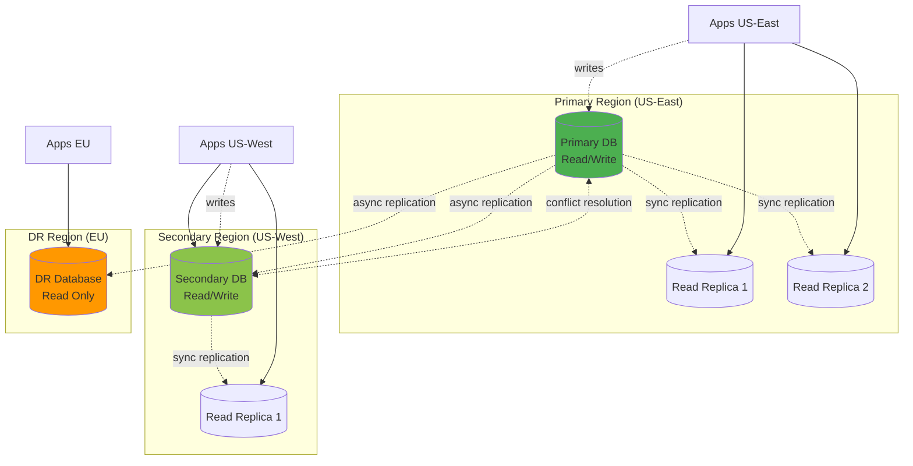
```mermaid
graph TB
    subgraph "Primary Region (US-East)"
        PRIMARY[(Primary DB<br/>Read/Write)]
        REPLICA1[(Read Replica 1)]
        REPLICA2[(Read Replica 2)]
        
        PRIMARY -.sync replication.-> REPLICA1
        PRIMARY -.sync replication.-> REPLICA2
    end
    
    subgraph "Secondary Region (US-West)"
        SECONDARY[(Secondary DB<br/>Read/Write)]
        REPLICA3[(Read Replica 1)]
        
        SECONDARY -.sync replication.-> REPLICA3
    end
    
    subgraph "DR Region (EU)"
        DR[(DR Database<br/>Read Only)]
    end
    
    PRIMARY -.async replication.-> SECONDARY
    PRIMARY -.async replication.-> DR
    
    APP_EAST[Apps US-East] --> REPLICA1 & REPLICA2
    APP_WEST[Apps US-West] --> SECONDARY & REPLICA3
    APP_EU[Apps EU] --> DR
    
    APP_EAST -.writes.-> PRIMARY
    APP_WEST -.writes.-> SECONDARY
    
    PRIMARY <-.conflict resolution.-> SECONDARY
    
    style PRIMARY fill:#4caf50
    style SECONDARY fill:#8bc34a
    style DR fill:#ff9800
```


## :material-security: Security Architecture

### Authentication & Authorization Flow

!!! info "End-to-End Security Flow"
    
    This sequence diagram shows the **complete authentication and authorization flow** for securing AgenticAI operations.
    
    **Phase 1: Login & Token Issuance (Steps 1-8)**
    
    1. User initiates login through client application
    2. Client sends credentials to API Gateway
    3. Gateway forwards to dedicated Auth Service
    4. Auth Service queries database to verify credentials
    5. Database returns user record with assigned roles
    6. Auth Service generates JWT token with embedded claims:
       - User ID
       - Roles and permissions
       - Expiration time (typically 15-60 minutes)
       - Refresh token (for re-authentication)
    7. Tokens returned through Gateway to Client
    8. User sees successful login
    
    **Phase 2: Secure Token Storage**
    
    - Client stores JWT securely (httpOnly cookie or secure storage)
    - Refresh token stored separately for token renewal
    - Never store tokens in localStorage (XSS vulnerability)
    
    **Phase 3: Authenticated Request (Steps 9-14)**
    
    1. User requests agent action
    2. Client includes JWT in Authorization header: `Bearer <token>`
    3. Gateway validates token:
       - Verifies cryptographic signature
       - Checks expiration timestamp
       - Extracts user claims (ID, roles)
    4. Request forwarded to Agent Service with user context
    5. Agent performs Role-Based Access Control (RBAC) check
    
    **Phase 4: Authorization Decision**
    
    - **If Authorized**: Agent executes action, returns result
    - **If Unauthorized**: Agent returns 403 Forbidden, client shows error
    
    **Security Features:**
    
    - 🔒 **JWT Signing**: Cryptographically signed tokens prevent tampering
    - ⏱️ **Token Expiration**: Short-lived tokens limit exposure window
    - 🔄 **Refresh Tokens**: Renew access without re-entering credentials
    - 🔑 **RBAC**: Fine-grained permission control based on user roles
    - 📝 **Audit Trail**: All security events logged for compliance
    
    **Token Claims Example:**
    ```json
    {
      "sub": "user_12345",
      "roles": ["agent_creator", "task_executor"],
      "permissions": ["agents:read", "agents:write", "tasks:execute"],
      "exp": 1703001600,
      "iat": 1703000000
    }
    ```

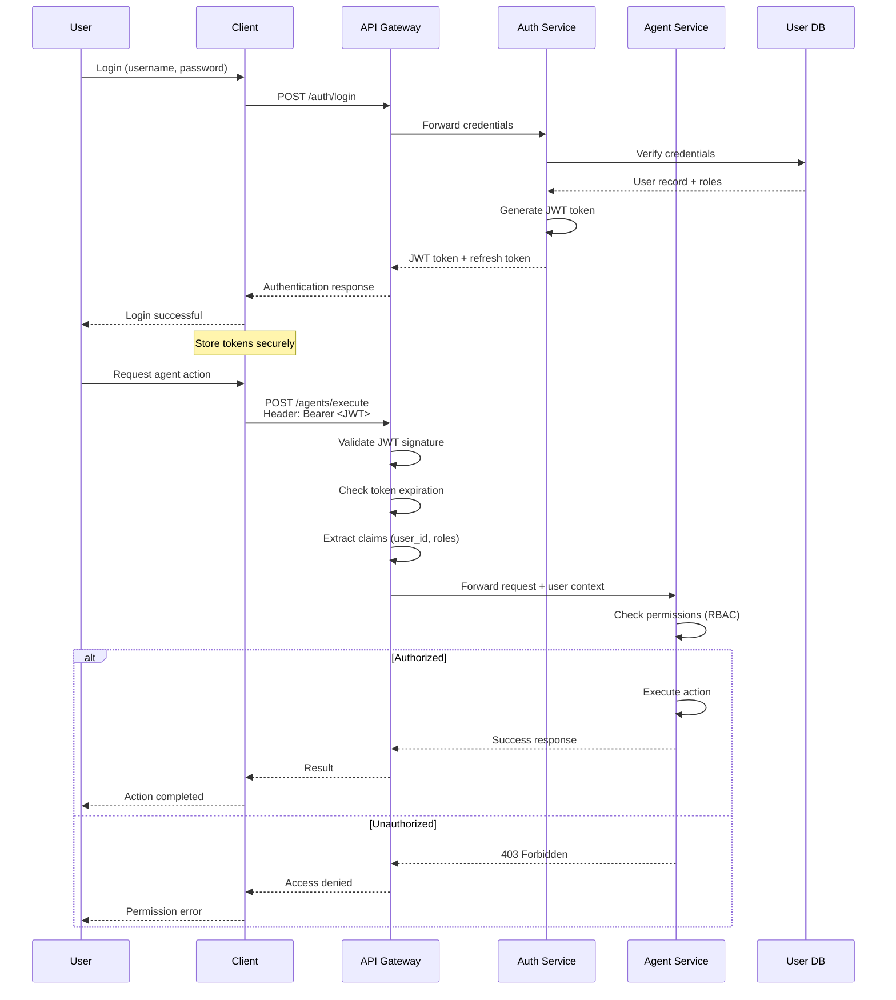
```mermaid
sequenceDiagram
    participant User
    participant Client
    participant Gateway as API Gateway
    participant Auth as Auth Service
    participant Agent as Agent Service
    participant DB as User DB
    
    User->>Client: Login (username, password)
    Client->>Gateway: POST /auth/login
    Gateway->>Auth: Forward credentials
    
    Auth->>DB: Verify credentials
    DB-->>Auth: User record + roles
    
    Auth->>Auth: Generate JWT token
    Auth-->>Gateway: JWT token + refresh token
    Gateway-->>Client: Authentication response
    Client-->>User: Login successful
    
    Note over Client: Store tokens securely
    
    User->>Client: Request agent action
    Client->>Gateway: POST /agents/execute<br/>Header: Bearer <JWT>
    
    Gateway->>Gateway: Validate JWT signature
    Gateway->>Gateway: Check token expiration
    Gateway->>Gateway: Extract claims (user_id, roles)
    
    Gateway->>Agent: Forward request + user context
    Agent->>Agent: Check permissions (RBAC)
    
    alt Authorized
        Agent->>Agent: Execute action
        Agent-->>Gateway: Success response
        Gateway-->>Client: Result
        Client-->>User: Action completed
    else Unauthorized
        Agent-->>Gateway: 403 Forbidden
        Gateway-->>Client: Access denied
        Client-->>User: Permission error
    end
```

### Security Layers

!!! info "Defense in Depth Security Architecture"
    
    This diagram illustrates the **multi-layered security approach** that protects AgenticAI at every level of the stack.
    
    **Layer 1: Network Security (Perimeter Defense)**
    
    - **Web Application Firewall (WAF)**
      - Blocks common web attacks (SQL injection, XSS)
      - Custom rules for API protection
      - Managed rule sets from OWASP Top 10
    
    - **DDoS Protection**
      - Rate-based rules to detect volumetric attacks
      - Traffic shaping and throttling
      - CloudFlare/AWS Shield integration
    
    - **SSL/TLS Termination**
      - All traffic encrypted with TLS 1.3
      - Certificate management and auto-renewal
      - Forward secrecy enabled
    
    **Layer 2: API Security (Access Control)**
    
    - **Authentication (JWT/OAuth2)**
      - Token-based authentication
      - Multi-factor authentication (MFA) support
      - Session management
    
    - **Authorization (RBAC/ABAC)**
      - Role-Based Access Control for user roles
      - Attribute-Based Access Control for fine-grained permissions
      - Policy enforcement points
    
    - **Rate Limiting & Throttling**
      - Per-user, per-IP rate limits
      - Adaptive throttling based on load
      - Quota management for API usage
    
    **Layer 3: Application Security (Input Protection)**
    
    - **Input Validation**
      - Schema validation for all requests
      - Type checking and range validation
      - Whitelist-based validation
    
    - **Data Sanitization**
      - Remove malicious payloads
      - Encode special characters
      - Normalize input formats
    
    - **Injection Detection**
      - SQL injection prevention
      - Command injection detection
      - LDAP/NoSQL injection guards
    
    - **XSS Prevention**
      - Content Security Policy (CSP)
      - Output encoding
      - DOM sanitization
    
    **Layer 4: Data Security (Information Protection)**
    
    - **Encryption at Rest**
      - AES-256 encryption for databases
      - Encrypted file systems
      - Key rotation policies
    
    - **Encryption in Transit**
      - TLS for all network communication
      - mTLS for service-to-service
      - VPN for admin access
    
    - **PII Masking**
      - Automatic detection of sensitive data
      - Tokenization for credit cards, SSNs
      - Masking in logs and exports
    
    - **Audit Logging**
      - Comprehensive security event logging
      - Tamper-proof log storage
      - SIEM integration
    
    **Layer 5: Infrastructure Security (Foundation)**
    
    - **Secrets Management**
      - HashiCorp Vault, AWS Secrets Manager
      - API keys, passwords, certificates
      - Automatic rotation
    
    - **Identity & Access Management (IAM)**
      - Principle of least privilege
      - Service accounts for automation
      - Regular access reviews
    
    - **Network Isolation**
      - VPC/VNET segmentation
      - Private subnets for data tier
      - Security groups and NACLs
    
    - **Container Security**
      - Image scanning for vulnerabilities
      - Runtime protection
      - Pod security policies
    
    **Security Posture:**
    
    | Layer | Protects Against | Key Controls |
    |-------|------------------|-------------|
    | Network | DDoS, Man-in-middle | WAF, SSL, DDoS protection |
    | API | Unauthorized access | Authentication, Authorization |
    | Application | Injection, XSS | Input validation, Sanitization |
    | Data | Data breaches | Encryption, Masking, Audit |
    | Infrastructure | Privilege escalation | IAM, Secrets, Isolation |
    
    **Color Coding by Severity:**
    - 🔴 Red: Critical (Network perimeter)
    - 🟠 Orange: High (Authentication)
    - 🟡 Yellow: Medium (Input validation)
    - 🟢 Green: Important (Data protection)
    - 🔵 Blue: Foundation (Infrastructure)

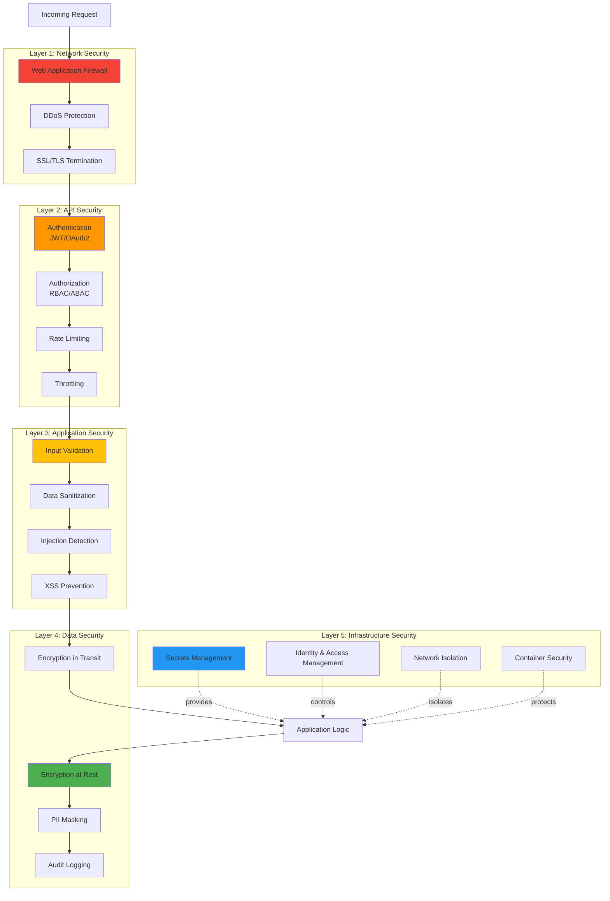
```mermaid
graph TB
    subgraph "Layer 1: Network Security"
        WAF[Web Application Firewall]
        DDoS[DDoS Protection]
        SSL[SSL/TLS Termination]
    end
    
    subgraph "Layer 2: API Security"
        AUTHN[Authentication<br/>JWT/OAuth2]
        AUTHZ[Authorization<br/>RBAC/ABAC]
        RATE_LIMIT[Rate Limiting]
        THROTTLE[Throttling]
    end
    
    subgraph "Layer 3: Application Security"
        INPUT_VAL[Input Validation]
        SANITIZE[Data Sanitization]
        INJECTION_GUARD[Injection Detection]
        XSS_GUARD[XSS Prevention]
    end
    
    subgraph "Layer 4: Data Security"
        ENCRYPT_REST[Encryption at Rest]
        ENCRYPT_TRANSIT[Encryption in Transit]
        PII_MASK[PII Masking]
        AUDIT[Audit Logging]
    end
    
    subgraph "Layer 5: Infrastructure Security"
        SECRETS[Secrets Management]
        IAM[Identity & Access Management]
        NETWORK_ISO[Network Isolation]
        CONTAINER_SEC[Container Security]
    end
    
    REQUEST[Incoming Request] --> WAF
    WAF --> DDoS --> SSL
    SSL --> AUTHN --> AUTHZ
    AUTHZ --> RATE_LIMIT --> THROTTLE
    THROTTLE --> INPUT_VAL --> SANITIZE
    SANITIZE --> INJECTION_GUARD --> XSS_GUARD
    XSS_GUARD --> ENCRYPT_TRANSIT
    ENCRYPT_TRANSIT --> APP[Application Logic]
    APP --> ENCRYPT_REST --> PII_MASK
    PII_MASK --> AUDIT
    
    SECRETS -.provides.-> APP
    IAM -.controls.-> APP
    NETWORK_ISO -.isolates.-> APP
    CONTAINER_SEC -.protects.-> APP
    
    style WAF fill:#f44336
    style AUTHN fill:#ff9800
    style INPUT_VAL fill:#ffc107
    style ENCRYPT_REST fill:#4caf50
    style SECRETS fill:#2196f3
```


## :material-monitor: Observability

### Monitoring Stack

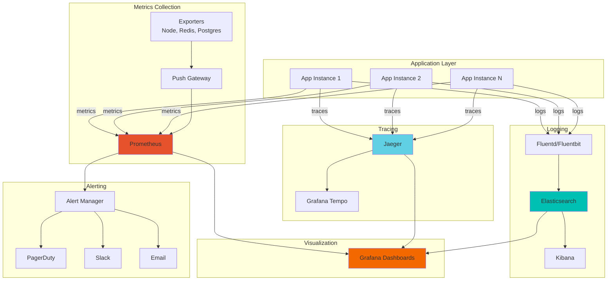
```mermaid
graph TB
    subgraph "Application Layer"
        APP1[App Instance 1]
        APP2[App Instance 2]
        APP3[App Instance N]
    end
    
    subgraph "Metrics Collection"
        PROM[Prometheus]
        PUSHGW[Push Gateway]
        EXPORTERS[Exporters<br/>Node, Redis, Postgres]
    end
    
    subgraph "Logging"
        FLUENTD[Fluentd/Fluentbit]
        ELASTIC[Elasticsearch]
        KIBANA[Kibana]
    end
    
    subgraph "Tracing"
        JAEGER[Jaeger]
        TEMPO[Grafana Tempo]
    end
    
    subgraph "Visualization"
        GRAFANA[Grafana Dashboards]
    end
    
    subgraph "Alerting"
        ALERT_MGR[Alert Manager]
        PAGERDUTY[PagerDuty]
        SLACK[Slack]
        EMAIL[Email]
    end
    
    APP1 & APP2 & APP3 -->|metrics| PROM
    APP1 & APP2 & APP3 -->|logs| FLUENTD
    APP1 & APP2 & APP3 -->|traces| JAEGER
    
    EXPORTERS --> PUSHGW --> PROM
    
    PROM --> GRAFANA
    PROM --> ALERT_MGR
    
    FLUENTD --> ELASTIC
    ELASTIC --> KIBANA
    ELASTIC --> GRAFANA
    
    JAEGER --> GRAFANA
    JAEGER --> TEMPO
    
    ALERT_MGR --> PAGERDUTY & SLACK & EMAIL
    
    style PROM fill:#e6522c
    style ELASTIC fill:#00bfb3
    style GRAFANA fill:#f46800
    style JAEGER fill:#60d0e4
```


## :material-check-all: Best Practices

### CI/CD Pipeline


```mermaid
graph LR
    CODE[Code Push] --> GIT[GitHub]
    GIT --> TRIGGER[Webhook Trigger]
    
    TRIGGER --> BUILD[Build Stage]
    BUILD --> TEST[Test Stage]
    TEST --> SCAN[Security Scan]
    SCAN --> DOCKER[Docker Build]
    DOCKER --> PUSH[Push to Registry]
    
    PUSH --> DEV[Deploy to Dev]
    DEV --> INT_TEST[Integration Tests]
    INT_TEST --> STAGING[Deploy to Staging]
    
    STAGING --> APPROVAL{Manual<br/>Approval}
    APPROVAL -->|Approved| PROD[Deploy to Production]
    APPROVAL -->|Rejected| NOTIFY[Notify Team]
    
    PROD --> HEALTH[Health Check]
    HEALTH --> SMOKE[Smoke Tests]
    SMOKE --> MONITOR[Monitor Metrics]
    
    style CODE fill:#4caf50
    style PROD fill:#2196f3
    style APPROVAL fill:#ff9800
```


## :material-file-document: Diagram Usage Tips

!!! tip "Copy & Paste"
    
    All diagrams are ready to use:
    
    1. Copy the entire code block (including ` ```mermaid` markers)
    2. Paste into GitHub Markdown, Wiki, or MkDocs
    3. The diagram will render automatically!

!!! info "Customization"
    
    Modify diagrams by:
    
    - Changing node labels
    - Adding/removing connections
    - Adjusting colors with `style` directives
    - Updating layout with different Mermaid diagram types

!!! example "Diagram Types"
    
    - **flowchart/graph**: Process flows, system architecture
    - **sequenceDiagram**: Interaction flows, API calls
    - **stateDiagram**: State machines, lifecycles
    - **classDiagram**: Object models, class relationships
    - **gantt**: Timelines, project schedules
    - **erDiagram**: Database schemas, entity relationships


## :material-cloud: Cloud Architecture Diagrams

### Multi-Region Deployment

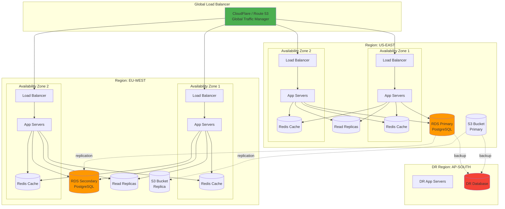
```mermaid
graph TB
    subgraph "Global Load Balancer"
        GLB[CloudFlare / Route 53<br/>Global Traffic Manager]
    end
    
    subgraph "Region: US-EAST"
        subgraph "Availability Zone 1"
            LB1_AZ1[Load Balancer]
            APP1_AZ1[App Servers]
            CACHE1_AZ1[(Redis Cache)]
        end
        
        subgraph "Availability Zone 2"
            LB1_AZ2[Load Balancer]
            APP1_AZ2[App Servers]
            CACHE1_AZ2[(Redis Cache)]
        end
        
        RDS1[(RDS Primary<br/>PostgreSQL)]
        RDS1_READ[(Read Replicas)]
        S3_1[(S3 Bucket<br/>Primary)]
    end
    
    subgraph "Region: EU-WEST"
        subgraph "Availability Zone 1"
            LB2_AZ1[Load Balancer]
            APP2_AZ1[App Servers]
            CACHE2_AZ1[(Redis Cache)]
        end
        
        subgraph "Availability Zone 2"
            LB2_AZ2[Load Balancer]
            APP2_AZ2[App Servers]
            CACHE2_AZ2[(Redis Cache)]
        end
        
        RDS2[(RDS Secondary<br/>PostgreSQL)]
        RDS2_READ[(Read Replicas)]
        S3_2[(S3 Bucket<br/>Replica)]
    end
    
    subgraph "DR Region: AP-SOUTH"
        DR_APP[DR App Servers]
        DR_DB[(DR Database)]
    end
    
    GLB --> LB1_AZ1 & LB1_AZ2 & LB2_AZ1 & LB2_AZ2
    
    LB1_AZ1 --> APP1_AZ1
    LB1_AZ2 --> APP1_AZ2
    LB2_AZ1 --> APP2_AZ1
    LB2_AZ2 --> APP2_AZ2
    
    APP1_AZ1 & APP1_AZ2 --> CACHE1_AZ1 & CACHE1_AZ2
    APP2_AZ1 & APP2_AZ2 --> CACHE2_AZ1 & CACHE2_AZ2
    
    APP1_AZ1 & APP1_AZ2 --> RDS1 & RDS1_READ
    APP2_AZ1 & APP2_AZ2 --> RDS2 & RDS2_READ
    
    RDS1 -.replication.-> RDS2
    S3_1 -.replication.-> S3_2
    
    RDS1 -.backup.-> DR_DB
    S3_1 -.backup.-> DR_DB
    
    style GLB fill:#4caf50
    style RDS1 fill:#ff9800
    style RDS2 fill:#ff9800
    style DR_DB fill:#f44336
```

### Container Orchestration (Kubernetes)

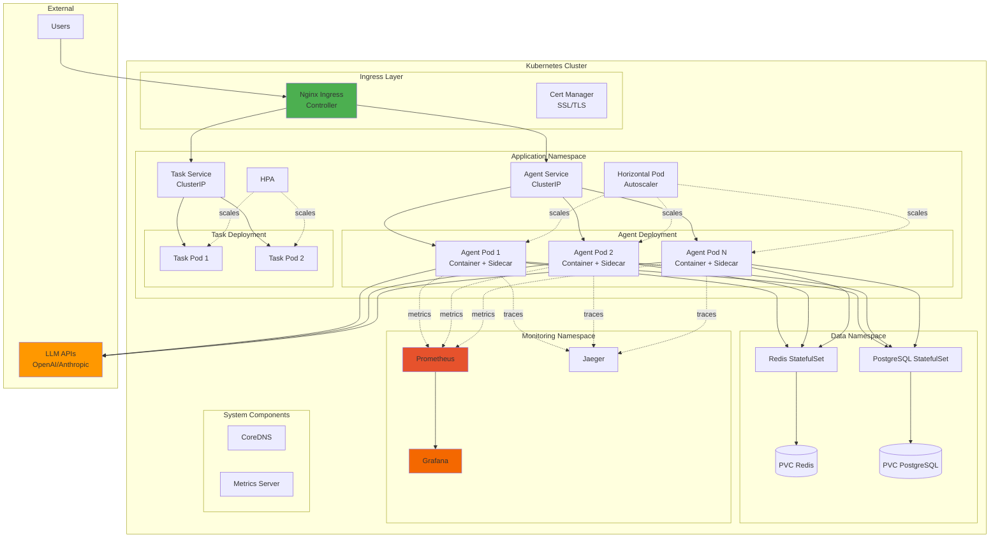
```mermaid
graph TB
    subgraph "Kubernetes Cluster"
        subgraph "Ingress Layer"
            INGRESS[Nginx Ingress<br/>Controller]
            CERT[Cert Manager<br/>SSL/TLS]
        end
        
        subgraph "Application Namespace"
            subgraph "Agent Deployment"
                AGENT_POD1[Agent Pod 1<br/>Container + Sidecar]
                AGENT_POD2[Agent Pod 2<br/>Container + Sidecar]
                AGENT_POD3[Agent Pod N<br/>Container + Sidecar]
            end
            
            subgraph "Task Deployment"
                TASK_POD1[Task Pod 1]
                TASK_POD2[Task Pod 2]
            end
            
            SVC_AGENT[Agent Service<br/>ClusterIP]
            SVC_TASK[Task Service<br/>ClusterIP]
            
            HPA_AGENT[Horizontal Pod<br/>Autoscaler]
            HPA_TASK[HPA]
        end
        
        subgraph "Data Namespace"
            REDIS_STATEFUL[Redis StatefulSet]
            POSTGRES_STATEFUL[PostgreSQL StatefulSet]
            
            PVC_REDIS[(PVC Redis)]
            PVC_PG[(PVC PostgreSQL)]
        end
        
        subgraph "Monitoring Namespace"
            PROMETHEUS[Prometheus]
            GRAFANA[Grafana]
            JAEGER[Jaeger]
        end
        
        subgraph "System Components"
            KUBE_DNS[CoreDNS]
            METRICS[Metrics Server]
        end
    end
    
    subgraph "External"
        USERS[Users]
        LLM_API[LLM APIs<br/>OpenAI/Anthropic]
    end
    
    USERS --> INGRESS
    INGRESS --> SVC_AGENT & SVC_TASK
    
    SVC_AGENT --> AGENT_POD1 & AGENT_POD2 & AGENT_POD3
    SVC_TASK --> TASK_POD1 & TASK_POD2
    
    HPA_AGENT -.scales.-> AGENT_POD1 & AGENT_POD2 & AGENT_POD3
    HPA_TASK -.scales.-> TASK_POD1 & TASK_POD2
    
    AGENT_POD1 & AGENT_POD2 & AGENT_POD3 --> REDIS_STATEFUL
    AGENT_POD1 & AGENT_POD2 & AGENT_POD3 --> POSTGRES_STATEFUL
    
    REDIS_STATEFUL --> PVC_REDIS
    POSTGRES_STATEFUL --> PVC_PG
    
    AGENT_POD1 & AGENT_POD2 & AGENT_POD3 -.metrics.-> PROMETHEUS
    PROMETHEUS --> GRAFANA
    
    AGENT_POD1 & AGENT_POD2 & AGENT_POD3 -.traces.-> JAEGER
    
    AGENT_POD1 & AGENT_POD2 & AGENT_POD3 --> LLM_API
    
    style INGRESS fill:#4caf50
    style PROMETHEUS fill:#e6522c
    style GRAFANA fill:#f46800
    style LLM_API fill:#ff9800
```


## :material-state-machine: State Diagrams

### Agent Lifecycle State Machine

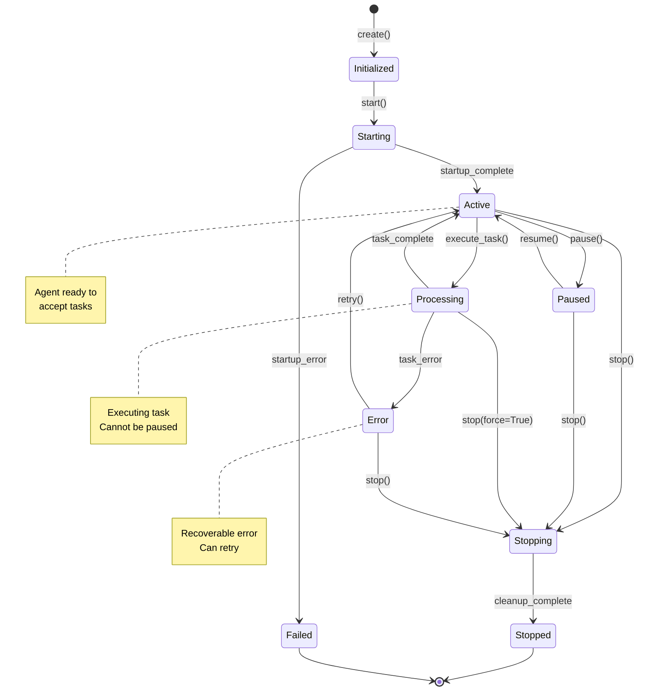
```mermaid
stateDiagram-v2
    [*] --> Initialized: create()
    
    Initialized --> Starting: start()
    Starting --> Active: startup_complete
    Starting --> Failed: startup_error
    
    Active --> Processing: execute_task()
    Processing --> Active: task_complete
    Processing --> Error: task_error
    
    Active --> Paused: pause()
    Paused --> Active: resume()
    
    Active --> Stopping: stop()
    Paused --> Stopping: stop()
    Processing --> Stopping: stop(force=True)
    
    Error --> Active: retry()
    Error --> Stopping: stop()
    
    Stopping --> Stopped: cleanup_complete
    Stopped --> [*]
    
    Failed --> [*]
    
    note right of Active
        Agent ready to
        accept tasks
    end note
    
    note right of Processing
        Executing task
        Cannot be paused
    end note
    
    note right of Error
        Recoverable error
        Can retry
    end note
```

### Task Execution State Machine

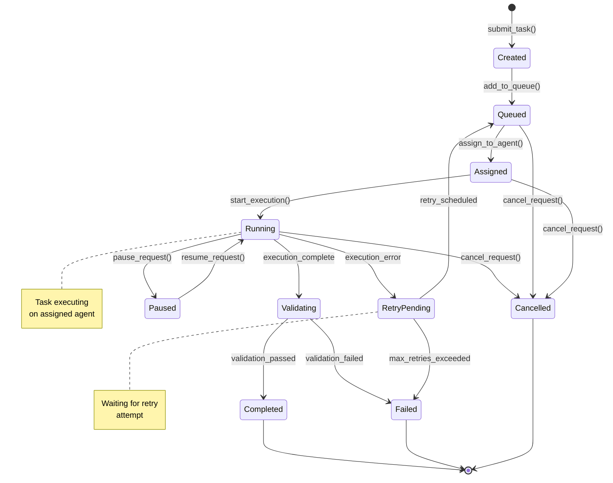
```mermaid
stateDiagram-v2
    [*] --> Created: submit_task()
    
    Created --> Queued: add_to_queue()
    Queued --> Assigned: assign_to_agent()
    
    Assigned --> Running: start_execution()
    Running --> Validating: execution_complete
    
    Validating --> Completed: validation_passed
    Validating --> Failed: validation_failed
    
    Running --> Paused: pause_request()
    Paused --> Running: resume_request()
    
    Running --> Cancelled: cancel_request()
    Queued --> Cancelled: cancel_request()
    Assigned --> Cancelled: cancel_request()
    
    Running --> RetryPending: execution_error
    RetryPending --> Queued: retry_scheduled
    RetryPending --> Failed: max_retries_exceeded
    
    Completed --> [*]
    Failed --> [*]
    Cancelled --> [*]
    
    note right of Running
        Task executing
        on assigned agent
    end note
    
    note right of RetryPending
        Waiting for retry
        attempt
    end note
```


## :material-chart-gantt: Sequence Diagrams

### Complete Agent Task Execution Flow

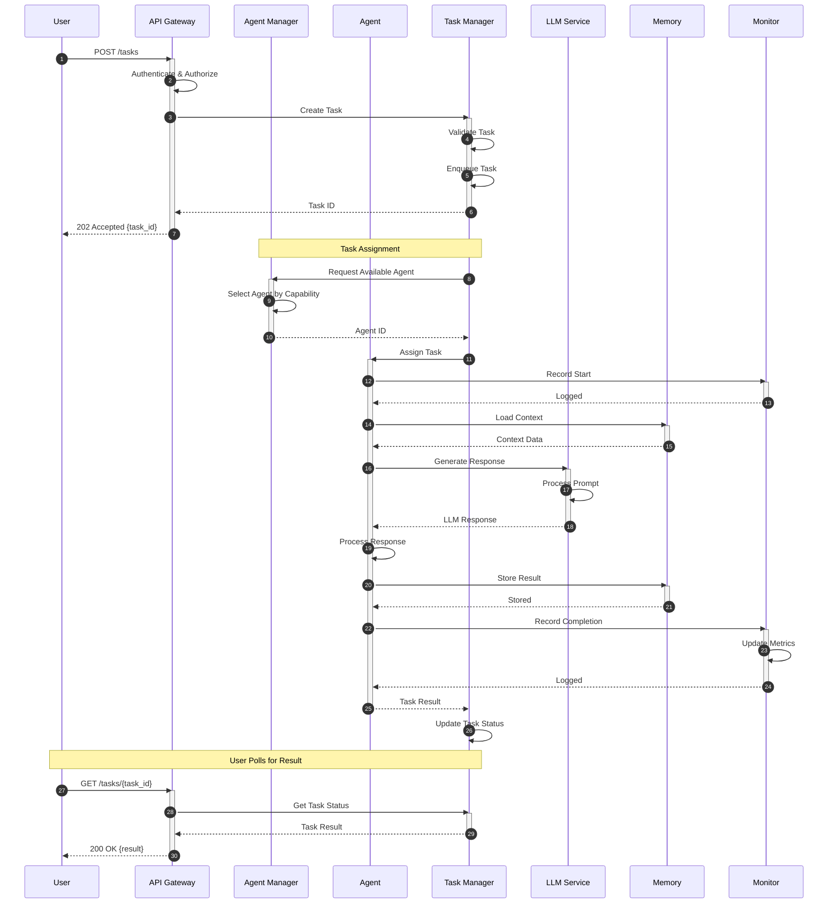
```mermaid
sequenceDiagram
    autonumber
    
    participant User
    participant API as API Gateway
    participant AM as Agent Manager
    participant Agent
    participant TM as Task Manager
    participant LLM as LLM Service
    participant Memory
    participant Monitor
    
    User->>API: POST /tasks
    activate API
    
    API->>API: Authenticate & Authorize
    API->>TM: Create Task
    activate TM
    
    TM->>TM: Validate Task
    TM->>TM: Enqueue Task
    TM-->>API: Task ID
    deactivate TM
    
    API-->>User: 202 Accepted {task_id}
    deactivate API
    
    Note over TM,AM: Task Assignment
    
    TM->>AM: Request Available Agent
    activate AM
    
    AM->>AM: Select Agent by Capability
    AM-->>TM: Agent ID
    deactivate AM
    
    TM->>Agent: Assign Task
    activate Agent
    
    Agent->>Monitor: Record Start
    activate Monitor
    Monitor-->>Agent: Logged
    deactivate Monitor
    
    Agent->>Memory: Load Context
    activate Memory
    Memory-->>Agent: Context Data
    deactivate Memory
    
    Agent->>LLM: Generate Response
    activate LLM
    
    LLM->>LLM: Process Prompt
    LLM-->>Agent: LLM Response
    deactivate LLM
    
    Agent->>Agent: Process Response
    
    Agent->>Memory: Store Result
    activate Memory
    Memory-->>Agent: Stored
    deactivate Memory
    
    Agent->>Monitor: Record Completion
    activate Monitor
    Monitor->>Monitor: Update Metrics
    Monitor-->>Agent: Logged
    deactivate Monitor
    
    Agent-->>TM: Task Result
    deactivate Agent
    
    TM->>TM: Update Task Status
    
    Note over User,TM: User Polls for Result
    
    User->>API: GET /tasks/{task_id}
    activate API
    API->>TM: Get Task Status
    activate TM
    TM-->>API: Task Result
    deactivate TM
    API-->>User: 200 OK {result}
    deactivate API
```

### Multi-Agent Collaboration Flow

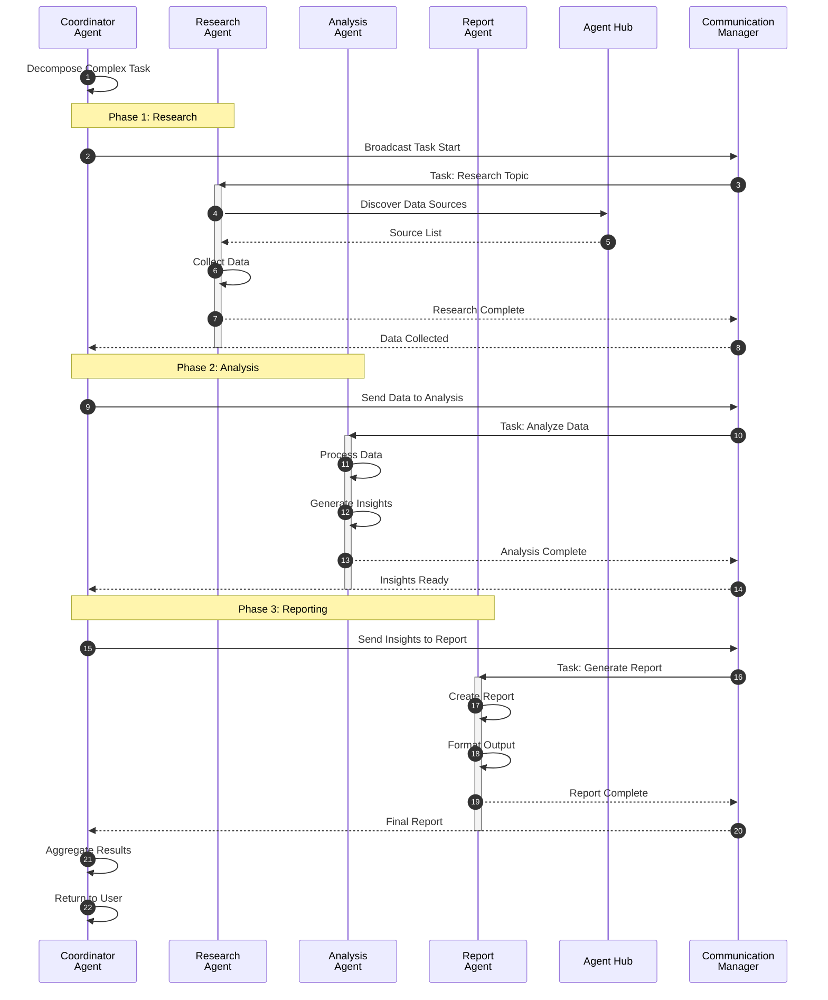
```mermaid
sequenceDiagram
    autonumber
    
    participant Coord as Coordinator<br/>Agent
    participant A1 as Research<br/>Agent
    participant A2 as Analysis<br/>Agent
    participant A3 as Report<br/>Agent
    participant Hub as Agent Hub
    participant Comm as Communication<br/>Manager
    
    Coord->>Coord: Decompose Complex Task
    
    Note over Coord,A1: Phase 1: Research
    
    Coord->>Comm: Broadcast Task Start
    Comm->>A1: Task: Research Topic
    activate A1
    
    A1->>Hub: Discover Data Sources
    Hub-->>A1: Source List
    
    A1->>A1: Collect Data
    A1-->>Comm: Research Complete
    Comm-->>Coord: Data Collected
    deactivate A1
    
    Note over Coord,A2: Phase 2: Analysis
    
    Coord->>Comm: Send Data to Analysis
    Comm->>A2: Task: Analyze Data
    activate A2
    
    A2->>A2: Process Data
    A2->>A2: Generate Insights
    A2-->>Comm: Analysis Complete
    Comm-->>Coord: Insights Ready
    deactivate A2
    
    Note over Coord,A3: Phase 3: Reporting
    
    Coord->>Comm: Send Insights to Report
    Comm->>A3: Task: Generate Report
    activate A3
    
    A3->>A3: Create Report
    A3->>A3: Format Output
    A3-->>Comm: Report Complete
    Comm-->>Coord: Final Report
    deactivate A3
    
    Coord->>Coord: Aggregate Results
    Coord->>Coord: Return to User
```


## :material-chart-timeline: Deployment Timeline

### CI/CD Pipeline Flow


```mermaid
graph LR
    subgraph "Development"
        DEV_CODE[Write Code]
        DEV_TEST[Local Tests]
        DEV_COMMIT[Git Commit]
    end
    
    subgraph "CI Pipeline"
        CI_TRIGGER[Webhook Trigger]
        CI_BUILD[Build]
        CI_LINT[Lint & Format]
        CI_TEST[Run Tests]
        CI_SECURITY[Security Scan]
        CI_DOCKER[Build Docker]
    end
    
    subgraph "CD Pipeline"
        CD_PUSH[Push to Registry]
        CD_DEV[Deploy to Dev]
        CD_INT_TEST[Integration Tests]
        CD_STAGE[Deploy to Staging]
        CD_SMOKE[Smoke Tests]
        CD_APPROVAL{Manual<br/>Approval}
        CD_PROD[Deploy to Production]
        CD_MONITOR[Monitor]
    end
    
    DEV_CODE --> DEV_TEST --> DEV_COMMIT
    DEV_COMMIT --> CI_TRIGGER
    
    CI_TRIGGER --> CI_BUILD
    CI_BUILD --> CI_LINT
    CI_LINT --> CI_TEST
    CI_TEST --> CI_SECURITY
    CI_SECURITY --> CI_DOCKER
    
    CI_DOCKER --> CD_PUSH
    CD_PUSH --> CD_DEV
    CD_DEV --> CD_INT_TEST
    CD_INT_TEST --> CD_STAGE
    CD_STAGE --> CD_SMOKE
    CD_SMOKE --> CD_APPROVAL
    
    CD_APPROVAL -->|Approved| CD_PROD
    CD_APPROVAL -->|Rejected| DEV_CODE
    
    CD_PROD --> CD_MONITOR
    CD_MONITOR -.feedback.-> DEV_CODE
    
    style DEV_CODE fill:#4caf50
    style CI_TRIGGER fill:#2196f3
    style CD_APPROVAL fill:#ff9800
    style CD_PROD fill:#f44336
```


## :material-chart-box: Entity Relationship Diagrams

### Core Data Model

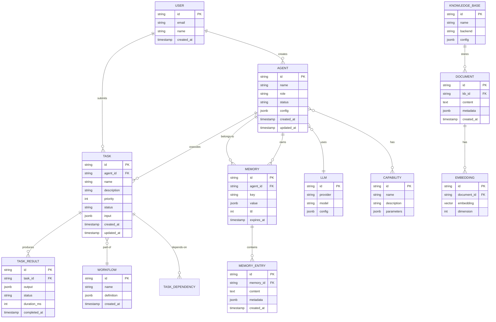
```mermaid
erDiagram
    AGENT ||--o{ TASK : executes
    AGENT ||--o{ MEMORY : owns
    AGENT }o--|| LLM : uses
    AGENT }o--o{ CAPABILITY : has
    
    TASK ||--o{ TASK_RESULT : produces
    TASK }o--|| WORKFLOW : "part-of"
    TASK ||--o{ TASK_DEPENDENCY : depends-on
    
    MEMORY }o--|| AGENT : "belongs-to"
    MEMORY ||--o{ MEMORY_ENTRY : contains
    
    KNOWLEDGE_BASE ||--o{ DOCUMENT : stores
    DOCUMENT ||--o{ EMBEDDING : has
    
    USER ||--o{ AGENT : creates
    USER ||--o{ TASK : submits
    
    AGENT {
        string id PK
        string name
        string role
        string status
        jsonb config
        timestamp created_at
        timestamp updated_at
    }
    
    TASK {
        string id PK
        string agent_id FK
        string name
        string description
        int priority
        string status
        jsonb input
        timestamp created_at
        timestamp updated_at
    }
    
    TASK_RESULT {
        string id PK
        string task_id FK
        jsonb output
        string status
        int duration_ms
        timestamp completed_at
    }
    
    MEMORY {
        string id PK
        string agent_id FK
        string key
        jsonb value
        int ttl
        timestamp expires_at
    }
    
    MEMORY_ENTRY {
        string id PK
        string memory_id FK
        text content
        jsonb metadata
        timestamp created_at
    }
    
    LLM {
        string id PK
        string provider
        string model
        jsonb config
    }
    
    CAPABILITY {
        string id PK
        string name
        string description
        jsonb parameters
    }
    
    WORKFLOW {
        string id PK
        string name
        jsonb definition
        timestamp created_at
    }
    
    USER {
        string id PK
        string email
        string name
        timestamp created_at
    }
    
    KNOWLEDGE_BASE {
        string id PK
        string name
        string backend
        jsonb config
    }
    
    DOCUMENT {
        string id PK
        string kb_id FK
        text content
        jsonb metadata
        timestamp created_at
    }
    
    EMBEDDING {
        string id PK
        string document_id FK
        vector embedding
        int dimension
    }
```


## :material-link: Related Documentation

- [Architecture Guide](architecture.md) - Complete architectural documentation
- [Agents Module](agents.md) - Agent design and implementation
- [Tasks Module](tasks.md) - Task management architecture
- [Memory Module](memory.md) - Memory system design
- [LLMs Module](llms.md) - LLM integration architecture
- [Deployment Guide](deployment.md) - Production deployment
- [Best Practices](best-practices.md) - Development guidelines
