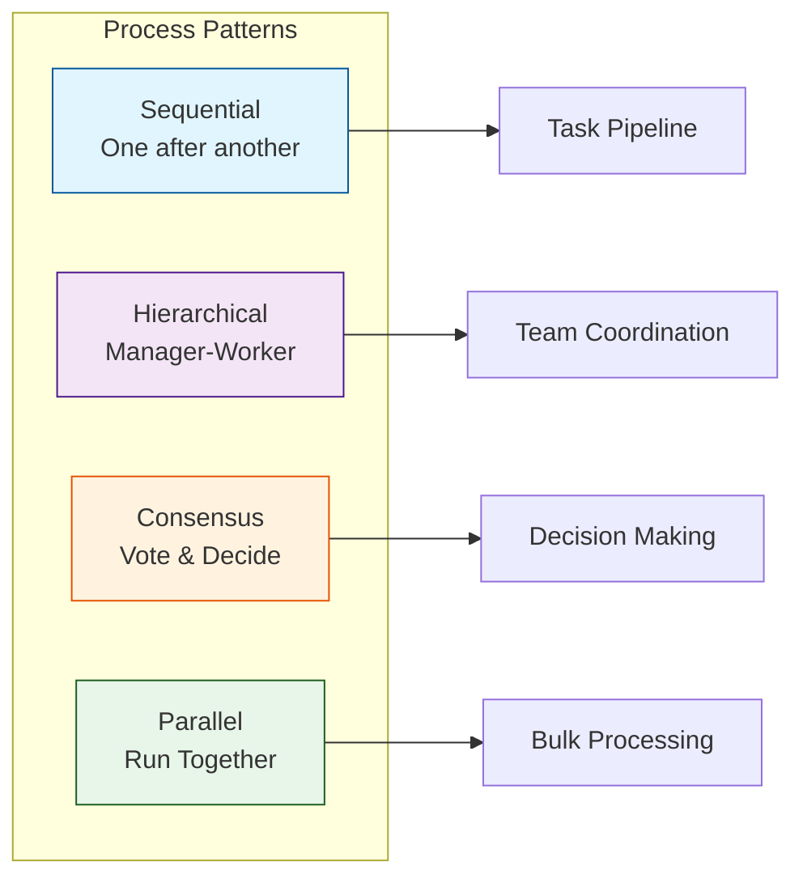
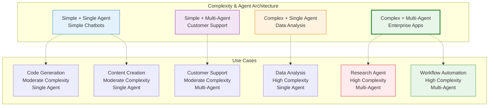

# Features

<div class="annotate" markdown>

**Complete feature set across 400+ modules**

Everything you need to build intelligent multi-agent systems with **237 enterprise features**

</div>

!!! success "Enterprise Features"
    See [Enterprise Documentation](enterprise.md) for advanced enterprise capabilities.

---

## Core Features

<div class="grid cards" markdown>

- :robot:{ .lg .middle } **Intelligent Agents**

    ---

    Autonomous agents with memory, reasoning, and tool use

    - LLM-powered decision making
    - Dynamic tool integration
    - Natural language understanding
    - Role-based specialization

    [:octicons-arrow-right-24: Learn More](agents.md)

- :material-clipboard-check:{ .lg .middle } **Task Management**

    ---

    Flexible task orchestration and execution

    - Sequential and parallel tasks
    - Asynchronous execution
    - Priority management
    - Progress tracking

    [:octicons-arrow-right-24: Learn More](tasks.md)

- :material-brain:{ .lg .middle } **Memory Systems**

    ---

    Persistent and contextual memory

    - Short and long-term memory
    - Semantic search
    - Knowledge retention
    - Context management

    [:octicons-arrow-right-24: Learn More](memory.md)

- :material-routes:{ .lg .middle } **Process Orchestration**

    ---

    Multi-agent coordination patterns

    - Sequential workflows
    - Hierarchical structures
    - Consensus mechanisms
    - Parallel execution

    [:octicons-arrow-right-24: Learn More](processes.md)

- :material-shield-check:{ .lg .middle } **Guardrails & Safety**

    ---

    Content moderation and safety controls

    - Input/output validation
    - Content filtering
    - Compliance checks
    - Security policies

    [:octicons-arrow-right-24: Learn More](guardrails.md)

- :material-database:{ .lg .middle } **Knowledge Management**

    ---

    RAG and knowledge base integration

    - Document processing
    - Vector search
    - Embeddings
    - Knowledge graphs

    [:octicons-arrow-right-24: Learn More](knowledge.md)

- :material-tools:{ .lg .middle } **MCP Tools**

    ---

    Model Context Protocol integration

    - External tool integration
    - API connections
    - Real-time data access
    - Custom tool creation

    [:octicons-arrow-right-24: Learn More](mcp_tools.md)

- :material-chart-line:{ .lg .middle } **Monitoring & Observability**

    ---

    Production-ready monitoring

    - Performance metrics
    - Distributed tracing
    - Structured logging
    - Alerts and notifications

    [:octicons-arrow-right-24: Learn More](monitoring.md)

</div>

## Process Types



## Feature Comparison

| Feature | Community | Professional | Enterprise |
|---------|-----------|--------------|------------|
| **Agents** | Up to 5 | Unlimited | Unlimited |
| **Memory** | In-Memory | Redis/Cache | Distributed |
| **LLM Support** | OpenAI/Anthropic | All Providers | Private Models |
| **Guardrails** | Basic | Advanced | Custom Rules |
| **Monitoring** | Logs | Metrics | Full APM |
| **MCP Tools** | 10 tools | 50 tools | Unlimited |
| **Support** | Community | Email | 24/7 Priority |
| **SLA** | None | 99.5% | 99.99% |

## Performance Characteristics

<div class="grid" markdown>

=== "Latency"

    **Response Times**

    - **P50**: < 100ms
    - **P95**: < 500ms
    - **P99**: < 1s

    Optimized for real-time applications

=== "Throughput"

    **Request Capacity**

    - **Single Agent**: 1000 req/s
    - **Multi-Agent**: 10000 req/s
    - **Clustered**: 100000 req/s

    Horizontal scaling capability

=== "Memory"

    **Resource Usage**

    - **Base**: 50MB
    - **Per Agent**: +10MB
    - **With Memory**: +50MB

    Efficient resource utilization

=== "Scalability"

    **Growth Capacity**

    - **Vertical**: 100+ agents/process
    - **Horizontal**: Unlimited nodes
    - **Distributed**: Multi-region

    Enterprise-scale ready

</div>

## Integration Capabilities


## Development Features

!!! tip "Developer Experience"
    Framework designed for developer productivity

<div class="grid cards" markdown>

- ** Pythonic API**

    Clean, intuitive Python interface

    ```python
    agent = Agent(
        name="Assistant",
        model="gpt-4"
    )
    ```

- ** Type Hints**

    Full type annotation support

    ```python
    def process(task: Task) -> TaskResult:
        ...
    ```

- ** Configuration**

    YAML-based setup

    ```yaml
    agents:
      - name: worker
        model: gpt-4
    ```

- ** Testing**

    Built-in test utilities

    ```python
    @pytest.fixture
    def agent():
        return Agent(...)
    ```

</div>

## Use Case Fit



!!! tip "Framework Suitability"

    AgenticAI Framework is **ideal for**:

    - **High Complexity**: Research agents, data analysis, workflow automation
    - **Multi-Agent Systems**: Enterprise apps, team coordination, complex workflows
    - **Production Scale**: When reliability and monitoring are critical

## Checklist: Right Fit for You?

!!! question "Is AgenticAI Framework right for your project?"

     **Perfect Fit**

    - [ ] Need multi-agent coordination
    - [ ] Require persistent memory
    - [ ] Complex task orchestration
    - [ ] Production-scale deployment
    - [ ] Safety and guardrails critical
    - [ ] Monitoring and observability needed

     **Consider Alternatives**

    - [ ] Simple single-prompt use case
    - [ ] No need for agent autonomy
    - [ ] Basic chatbot requirements
    - [ ] Budget constraints for LLM calls

## Roadmap

!!! abstract "Upcoming Features"

    **Q1 2026** Completed

    - 237 Enterprise Modules
    - API Management Suite (15 modules)
    - Security & Compliance (18 modules)
    - ML/AI Infrastructure (14 modules)
    - Domain-Driven Design patterns (12 modules)

    **Q2 2026**

    - Visual workflow builder
    - Enhanced analytics dashboard
    - Advanced security features
    - Multi-cloud deployment

    **Q3 2026**

    - AutoML for agent tuning
    - Global edge deployment
    - Mobile SDK
    - Real-time collaboration

## 🆚 Framework Comparison

| Feature | AgenticAI | LangChain | AutoGen | CrewAI |
|---------|-----------|-----------|---------|--------|
| **Total Modules** | 400+ | ~50 | ~30 | ~20 |
| **Enterprise Modules** | 237 | Limited | None | None |
| **Multi-Agent** | Native | Limited | Yes | Yes |
| **Memory Managers** | 7 Specialized | Plugin | No | Basic |
| **State Managers** | 7 Specialized | No | No | No |
| **Guardrails** | Advanced | No | No | No |
| **MCP Tools** | Native | No | No | No |
| **12-Tier Evaluation** | Built-in | No | No | No |
| **Monitoring** | Production APM | Basic | No | Basic |
| **ML/AI Infrastructure** | 14 Modules | Basic | No | No |
| **Domain-Driven Design** | 12 Patterns | No | No | No |
| **Learning Curve** | Easy | Medium | Hard | Easy |
| **Documentation** | Excellent | Good | Fair | Good |
| **Community** | Growing | Large | Active | Medium |

## Learn More

<div class="grid cards" markdown>

- [**Quick Start →**](quick-start.md)

    Get started in 5 minutes

- [**Architecture →**](architecture.md)

    Understand the design

- [**Best Practices →**](best-practices.md)

    Production patterns

- [**API Reference →**](API_REFERENCE.md)

    Complete API docs

</div>

---

!!! success "Ready to Build?"
    Start with our [Quick Start Guide](quick-start.md) or explore [Example Projects](EXAMPLES.md)
