---
tags:
  - features
  - capabilities
  - overview
  - comparison
---

# ✨ Feature Overview

<div class="annotate" markdown>

**Complete feature set of AgenticAI Framework**

Everything you need to build intelligent multi-agent systems

</div>

## 🎯 Core Features

<div class="grid cards" markdown>

-   :robot:{ .lg .middle } **Intelligent Agents**
    
    ---
    
    Autonomous agents with memory, reasoning, and tool use
    
    - 🧠 LLM-powered decision making
    - 🔧 Dynamic tool integration
    - 💬 Natural language understanding
    - 🎭 Role-based specialization
    
    [:octicons-arrow-right-24: Learn More](agents.md)

-   :material-clipboard-check:{ .lg .middle } **Task Management**
    
    ---
    
    Flexible task orchestration and execution
    
    - 📋 Sequential and parallel tasks
    - 🔄 Asynchronous execution
    - 🎯 Priority management
    - 📊 Progress tracking
    
    [:octicons-arrow-right-24: Learn More](tasks.md)

-   :material-brain:{ .lg .middle } **Memory Systems**
    
    ---
    
    Persistent and contextual memory
    
    - 💾 Short and long-term memory
    - 🔍 Semantic search
    - 📚 Knowledge retention
    - 🧩 Context management
    
    [:octicons-arrow-right-24: Learn More](memory.md)

-   :material-routes:{ .lg .middle } **Process Orchestration**
    
    ---
    
    Multi-agent coordination patterns
    
    - 🔀 Sequential workflows
    - 🌳 Hierarchical structures
    - 🔄 Consensus mechanisms
    - ⚡ Parallel execution
    
    [:octicons-arrow-right-24: Learn More](processes.md)

-   :material-shield-check:{ .lg .middle } **Guardrails & Safety**
    
    ---
    
    Content moderation and safety controls
    
    - 🛡️ Input/output validation
    - 🚫 Content filtering
    - ⚖️ Compliance checks
    - 🔒 Security policies
    
    [:octicons-arrow-right-24: Learn More](guardrails.md)

-   :material-database:{ .lg .middle } **Knowledge Management**
    
    ---
    
    RAG and knowledge base integration
    
    - 📖 Document processing
    - 🔎 Vector search
    - 🧠 Embeddings
    - 📚 Knowledge graphs
    
    [:octicons-arrow-right-24: Learn More](knowledge.md)

-   :material-tools:{ .lg .middle } **MCP Tools**
    
    ---
    
    Model Context Protocol integration
    
    - 🔌 External tool integration
    - 🌐 API connections
    - 📡 Real-time data access
    - 🔧 Custom tool creation
    
    [:octicons-arrow-right-24: Learn More](mcp_tools.md)

-   :material-chart-line:{ .lg .middle } **Monitoring & Observability**
    
    ---
    
    Production-ready monitoring
    
    - 📊 Performance metrics
    - 🔍 Distributed tracing
    - 📝 Structured logging
    - 🚨 Alerts and notifications
    
    [:octicons-arrow-right-24: Learn More](monitoring.md)

</div>

## 🔄 Process Types

```mermaid
graph LR
    subgraph "Process Patterns"
        SEQ[🔢 Sequential<br/>One after another]
        HIE[🌳 Hierarchical<br/>Manager-Worker]
        CON[🤝 Consensus<br/>Vote & Decide]
        PAR[⚡ Parallel<br/>Run Together]
    end
    
    SEQ --> USE1[Task Pipeline]
    HIE --> USE2[Team Coordination]
    CON --> USE3[Decision Making]
    PAR --> USE4[Bulk Processing]
    
    style SEQ fill:#e1f5ff,stroke:#01579b
    style HIE fill:#f3e5f5,stroke:#4a148c
    style CON fill:#fff3e0,stroke:#e65100
    style PAR fill:#e8f5e9,stroke:#1b5e20
```



## 📊 Feature Comparison

| Feature | Community | Professional | Enterprise |
|---------|-----------|--------------|------------|
| **Agents** | ✅ Up to 5 | ✅ Unlimited | ✅ Unlimited |
| **Memory** | ✅ In-Memory | ✅ Redis/Cache | ✅ Distributed |
| **LLM Support** | ✅ OpenAI/Anthropic | ✅ All Providers | ✅ Private Models |
| **Guardrails** | ✅ Basic | ✅ Advanced | ✅ Custom Rules |
| **Monitoring** | ✅ Logs | ✅ Metrics | ✅ Full APM |
| **MCP Tools** | ✅ 10 tools | ✅ 50 tools | ✅ Unlimited |
| **Support** | 🌐 Community | 📧 Email | 📞 24/7 Priority |
| **SLA** | ❌ None | ✅ 99.5% | ✅ 99.99% |

## 🚀 Performance Characteristics

<div class="grid" markdown>

=== "Latency"

    **Response Times**
    
    - 🟢 **P50**: < 100ms
    - 🟡 **P95**: < 500ms
    - 🟠 **P99**: < 1s
    
    Optimized for real-time applications

=== "Throughput"

    **Request Capacity**
    
    - 📊 **Single Agent**: 1000 req/s
    - 🚀 **Multi-Agent**: 10000 req/s
    - ⚡ **Clustered**: 100000 req/s
    
    Horizontal scaling capability

=== "Memory"

    **Resource Usage**
    
    - 💾 **Base**: 50MB
    - 📦 **Per Agent**: +10MB
    - 🧠 **With Memory**: +50MB
    
    Efficient resource utilization

=== "Scalability"

    **Growth Capacity**
    
    - 📈 **Vertical**: 100+ agents/process
    - 📊 **Horizontal**: Unlimited nodes
    - 🌐 **Distributed**: Multi-region
    
    Enterprise-scale ready

</div>

## 🔌 Integration Capabilities

```mermaid
graph TB
    subgraph "External Systems"
        LLM[🤖 LLM Providers<br/>OpenAI, Anthropic, etc.]
        DB[💾 Databases<br/>PostgreSQL, MongoDB, Redis]
        API[🌐 APIs<br/>REST, GraphQL, gRPC]
        TOOL[🔧 Tools<br/>MCP, Custom]
    end
    
    subgraph "AgenticAI Framework"
        AGENT[Agent System]
        MEMORY[Memory Layer]
        TASK[Task Engine]
        GUARD[Guardrails]
    end
    
    LLM --> AGENT
    DB --> MEMORY
    API --> TOOL
    TOOL --> AGENT
    AGENT --> TASK
    TASK --> GUARD
    
    style AGENT fill:#e3f2fd,stroke:#1976d2,stroke-width:3px
    style MEMORY fill:#f3e5f5,stroke:#7b1fa2
    style TASK fill:#fff3e0,stroke:#f57c00
    style GUARD fill:#e8f5e9,stroke:#388e3c
```



## 🛠️ Development Features

!!! tip "Developer Experience"
    Framework designed for developer productivity

<div class="grid cards" markdown>

-   **🐍 Pythonic API**
    
    Clean, intuitive Python interface
    
    ```python
    agent = Agent(
        name="Assistant",
        model="gpt-4"
    )
    ```

-   **📝 Type Hints**
    
    Full type annotation support
    
    ```python
    def process(task: Task) -> TaskResult:
        ...
    ```

-   **🔧 Configuration**
    
    YAML-based setup
    
    ```yaml
    agents:
      - name: worker
        model: gpt-4
    ```

-   **🧪 Testing**
    
    Built-in test utilities
    
    ```python
    @pytest.fixture
    def agent():
        return Agent(...)
    ```

</div>

## 🎯 Use Case Fit

```mermaid
graph TB
    subgraph "Complexity & Agent Architecture"
        SIMPLE_SINGLE[Simple + Single Agent<br/>💬 Simple Chatbots]
        SIMPLE_MULTI[Simple + Multi-Agent<br/>👥 Customer Support]
        COMPLEX_SINGLE[Complex + Single Agent<br/>📊 Data Analysis]
        COMPLEX_MULTI[Complex + Multi-Agent<br/>🏭 Enterprise Apps]
    end
    
    subgraph "Use Cases"
        UC1[💬 Customer Support<br/>Moderate Complexity<br/>Multi-Agent]
        UC2[💻 Code Generation<br/>Moderate Complexity<br/>Single Agent]
        UC3[🔍 Research Agent<br/>High Complexity<br/>Multi-Agent]
        UC4[✍️ Content Creation<br/>Moderate Complexity<br/>Single Agent]
        UC5[📊 Data Analysis<br/>High Complexity<br/>Single Agent]
        UC6[⚙️ Workflow Automation<br/>High Complexity<br/>Multi-Agent]
    end
    
    SIMPLE_MULTI -.-> UC1
    SIMPLE_SINGLE -.-> UC2
    COMPLEX_MULTI -.-> UC3
    SIMPLE_SINGLE -.-> UC4
    COMPLEX_SINGLE -.-> UC5
    COMPLEX_MULTI -.-> UC6
    
    style SIMPLE_SINGLE fill:#e3f2fd,stroke:#1976d2
    style SIMPLE_MULTI fill:#f3e5f5,stroke:#7b1fa2
    style COMPLEX_SINGLE fill:#fff3e0,stroke:#f57c00
    style COMPLEX_MULTI fill:#e8f5e9,stroke:#388e3c,stroke-width:3px
    style UC3 fill:#ffebee,stroke:#c62828
    style UC6 fill:#e8f5e9,stroke:#388e3c
```



!!! tip "Framework Suitability"
    
    AgenticAI Framework is **ideal for**:
    
    - ✅ **High Complexity**: Research agents, data analysis, workflow automation
    - ✅ **Multi-Agent Systems**: Enterprise apps, team coordination, complex workflows
    - ✅ **Production Scale**: When reliability and monitoring are critical

## 📋 Checklist: Right Fit for You?

!!! question "Is AgenticAI Framework right for your project?"

    ✅ **Perfect Fit**
    
    - [ ] Need multi-agent coordination
    - [ ] Require persistent memory
    - [ ] Complex task orchestration
    - [ ] Production-scale deployment
    - [ ] Safety and guardrails critical
    - [ ] Monitoring and observability needed
    
    ⚠️ **Consider Alternatives**
    
    - [ ] Simple single-prompt use case
    - [ ] No need for agent autonomy
    - [ ] Basic chatbot requirements
    - [ ] Budget constraints for LLM calls

## 🔮 Roadmap

!!! abstract "Upcoming Features"

    **Q1 2026** ✅ Completed
    
    - ✅ 237 Enterprise Modules
    - ✅ API Management Suite (15 modules)
    - ✅ Security & Compliance (18 modules)
    - ✅ ML/AI Infrastructure (14 modules)
    - ✅ Domain-Driven Design patterns (12 modules)
    
    **Q2 2026**
    
    - 🎨 Visual workflow builder
    - 📊 Enhanced analytics dashboard
    - 🔐 Advanced security features
    - 🌐 Multi-cloud deployment
    
    **Q3 2026**
    
    - 🤖 AutoML for agent tuning
    - 🌍 Global edge deployment
    - 📱 Mobile SDK
    - 🔄 Real-time collaboration

## 🆚 Framework Comparison

| Feature | AgenticAI | LangChain | AutoGen | CrewAI |
|---------|-----------|-----------|---------|--------|
| **Total Modules** | ✅ 380+ | ⚠️ ~50 | ⚠️ ~30 | ⚠️ ~20 |
| **Enterprise Modules** | ✅ 237 | ⚠️ Limited | ❌ None | ❌ None |
| **Multi-Agent** | ✅ Native | ⚠️ Limited | ✅ Yes | ✅ Yes |
| **Memory Managers** | ✅ 7 Specialized | 🔌 Plugin | ❌ No | ⚠️ Basic |
| **State Managers** | ✅ 7 Specialized | ❌ No | ❌ No | ❌ No |
| **Guardrails** | ✅ Advanced | ❌ No | ❌ No | ❌ No |
| **MCP Tools** | ✅ Native | ❌ No | ❌ No | ❌ No |
| **12-Tier Evaluation** | ✅ Built-in | ❌ No | ❌ No | ❌ No |
| **Monitoring** | ✅ Production APM | ⚠️ Basic | ❌ No | ⚠️ Basic |
| **ML/AI Infrastructure** | ✅ 14 Modules | ⚠️ Basic | ❌ No | ❌ No |
| **Domain-Driven Design** | ✅ 12 Patterns | ❌ No | ❌ No | ❌ No |
| **Learning Curve** | 🟢 Easy | 🟡 Medium | 🔴 Hard | 🟢 Easy |
| **Documentation** | 🟢 Excellent | 🟢 Good | 🟡 Fair | 🟢 Good |
| **Community** | 🟡 Growing | 🟢 Large | 🟢 Active | 🟡 Medium |

## 📚 Learn More

<div class="grid cards" markdown>

-   [**Quick Start →**](quick-start.md)
    
    Get started in 5 minutes

-   [**Architecture →**](architecture.md)
    
    Understand the design

-   [**Best Practices →**](best-practices.md)
    
    Production patterns

-   [**API Reference →**](API_REFERENCE.md)
    
    Complete API docs

</div>

---

!!! success "Ready to Build?"
    Start with our [Quick Start Guide](quick-start.md) or explore [Example Projects](EXAMPLES.md)
