# 🌐 Hub

<div class="annotate" markdown>

**Central registry for agents, tools, and processes**

Share and discover reusable components across **380+ modules**

</div>

!!! success "Enterprise Hub"
    Part of **237 enterprise modules** enabling sharing across the entire framework. See [Enterprise Documentation](enterprise.md).

---

## 🎯 Quick Navigation

<div class="grid cards" markdown>

-   :material-robot:{ .lg } **Agents**
    
    Register and discover agents
    
    [:octicons-arrow-right-24: Manage](#key-functions)

-   :material-toolbox:{ .lg } **Tools**
    
    Share reusable tools
    
    [:octicons-arrow-right-24: Register](#hub-architecture)

-   :material-workflow:{ .lg } **Processes**
    
    Workflow templates
    
    [:octicons-arrow-right-24: Browse](#use-cases)

-   :material-book-open:{ .lg } **Examples**
    
    Hub usage patterns
    
    [:octicons-arrow-right-24: View Examples](#example-usage)

</div>

## 📖 Overview

!!! success "Part of 380+ Modules"
    
    The Hub enables sharing and discovery across the entire framework with 237 enterprise modules.

!!! abstract "What is the Hub?"
    
    The Hub module acts as a central registry for agents, tools, and processes. It enables dynamic registration, retrieval, and management of these components, allowing for flexible and modular system design.

<div class="grid" markdown>

:material-database:{ .lg } **Registry**
:   Centralized component storage

:material-magnify:{ .lg } **Discovery**
:   Find and retrieve components

:material-share-variant:{ .lg } **Sharing**
:   Share with the community

:material-update:{ .lg } **Versioning**
:   Track component versions

</div>

## 🏛️ Hub Architecture

```mermaid
graph TB
    subgraph "Developers"
        DEV1[Developer 1]
        DEV2[Developer 2]
        DEVN[Developer N]
    end
    
    subgraph "Hub Registry"
        HUB[Hub Manager<br/>🌐 Central Registry]
        AGENT_REG[Agent Registry<br/>🤖 Agents]
        TOOL_REG[Tool Registry<br/>🔧 Tools]
        PROC_REG[Process Registry<br/>🔄 Workflows]
    end
    
    subgraph "Applications"
        APP1[Application 1]
        APP2[Application 2]
        APPN[Application N]
    end
    
    DEV1 & DEV2 & DEVN -->|Register| HUB
    HUB --> AGENT_REG
    HUB --> TOOL_REG
    HUB --> PROC_REG
    
    AGENT_REG & TOOL_REG & PROC_REG -->|Retrieve| APP1 & APP2 & APPN
    
    style HUB fill:#e3f2fd,stroke:#1976d2,stroke-width:3px
    style AGENT_REG fill:#f3e5f5,stroke:#7b1fa2
    style TOOL_REG fill:#fff3e0,stroke:#f57c00
    style PROC_REG fill:#e8f5e9,stroke:#388e3c
```




## Key Functions

### Agent Management
- `register_agent(name, cls)` — Register an agent class with a unique name.
- `get_agent(name)` — Retrieve an instance of a registered agent.

### Tool Management
- `register_tool(name, func)` — Register a tool function with a unique name.
- `get_tool(name)` — Retrieve a registered tool function.

### Process Management
- `register_process(name, func)` — Register a process function.
- `get_process(name)` — Retrieve a registered process function.


## Example Usage

### Registering and Retrieving an Agent
```python
from agenticaiframework.hub import register_agent, get_agent
from agenticaiframework.agents import Agent

class MyAgent(Agent):
    def act(self, input_data):
        return f"Processed: {input_data}"

register_agent("my_agent", MyAgent)
agent = get_agent("my_agent")
print(agent.act("Hello"))
```

### Registering and Using a Tool
```python
from agenticaiframework.hub import register_tool, get_tool

def word_count_tool(text):
    return {"word_count": len(text.split())}

register_tool("word_count", word_count_tool)
tool = get_tool("word_count")
print(tool("This is a test sentence."))
```


## Use Cases

- **Dynamic Agent Loading** — Load agents at runtime without hardcoding.
- **Tool Sharing** — Share tools between multiple agents.
- **Process Orchestration** — Centralize process definitions for reuse.


## Best Practices

- Use descriptive names for agents, tools, and processes to avoid conflicts.
- Register components during application initialization.
- Keep tools and processes stateless for easier reuse.


## Related Documentation
- [Agents Module](agents.md)
- [Processes Module](processes.md)
- [Memory Module](memory.md)
