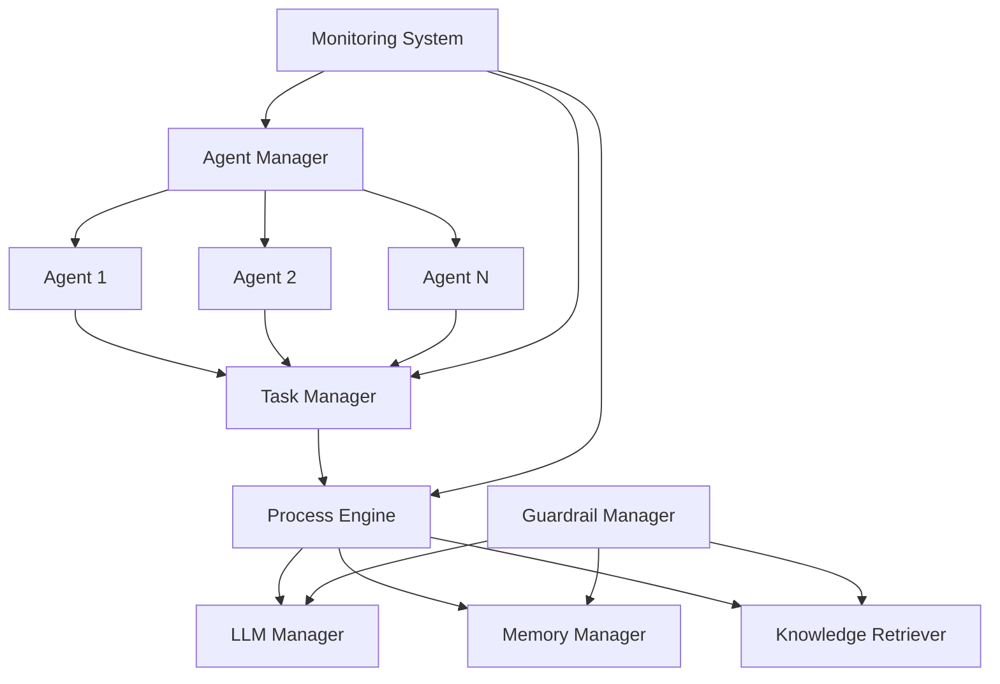

<!-- PROJECT LOGO -->
<br />
<div align="center">
  <a href="https://isathish.github.io/agenticaiframework/">
    
  </a>
  <a href="https://pypi.org/project/agenticaiframework/">
    
  </a>
  <a href="https://github.com/isathish/agenticaiframework/actions">
    
  </a>
  <a href="https://isathish.github.io/agenticaiframework/">
    
  </a>
</div>

# AgenticAI Framework

**A comprehensive Python SDK for building intelligent agentic applications with advanced orchestration, monitoring, and enterprise-grade scalability.**

AgenticAI Framework empowers developers, researchers, and enterprises to create sophisticated AI agents that can reason, interact, and execute complex tasks across multiple domains with unprecedented ease and reliability.

---

## 🚀 Why AgenticAI Framework?

!!! success "Enterprise-Ready"
    Production-ready framework with built-in security, monitoring, and scalability features.

!!! tip "Developer-Friendly"
    Intuitive APIs and comprehensive documentation make building AI agents effortless.

!!! info "Flexible Architecture"
    Modular design allows you to mix and match components based on your needs.

### Key Benefits

- **🎯 Rapid Development**: Get from idea to production in minutes, not weeks
- **🔒 Enterprise Security**: Built-in guardrails and compliance features
- **📊 Full Observability**: Comprehensive monitoring and logging out of the box
- **🔧 Highly Extensible**: Easy integration with existing systems and tools
- **⚡ High Performance**: Optimized for both single-agent and multi-agent scenarios
- **🌐 Multi-Modal**: Support for text, images, audio, and video processing

---

## 📦 Installation

=== "PyPI (Recommended)"
    ```bash
    pip install agenticaiframework
    ```

=== "Development Version"
    ```bash
    pip install git+https://github.com/isathish/agenticaiframework.git
    ```

=== "From Source"
    ```bash
    git clone https://github.com/isathish/agenticaiframework.git
    cd agenticaiframework
    pip install -e .
    ```

### System Requirements

- **Python**: 3.8 or higher
- **OS**: Windows, macOS, Linux
- **Memory**: Minimum 2GB RAM (4GB+ recommended)

---

## ⚡ Quick Start

### Your First Agent

```python
from agenticaiframework import Agent, Task, LLMManager

# 1. Set up the LLM
llm = LLMManager()
llm.register_model("gpt-4", your_llm_function)
llm.set_active_model("gpt-4")

# 2. Create an agent
agent = Agent(
    name="AssistantAgent",
    role="AI Assistant",
    capabilities=["text_generation", "analysis"],
    config={"llm": llm}
)

# 3. Define a task
task = Task(
    name="GreetingTask",
    objective="Generate a friendly greeting",
    executor=lambda: llm.generate("Say hello to the user!")
)

# 4. Execute the task
agent.start()
result = task.run()
print(result)  # Output: A friendly greeting!
```

### Multi-Agent Collaboration

```python
from agenticaiframework import Agent, AgentManager, Task

# Create specialized agents
data_agent = Agent(
    name="DataCollector",
    role="Data Collection Specialist",
    capabilities=["data_retrieval", "web_scraping"],
    config={"max_requests": 100}
)

analysis_agent = Agent(
    name="DataAnalyzer", 
    role="Data Analysis Expert",
    capabilities=["statistical_analysis", "visualization"],
    config={"precision": "high"}
)

# Manage agents
manager = AgentManager()
manager.register_agent(data_agent)
manager.register_agent(analysis_agent)

# Coordinate workflow
data_agent.start()
analysis_agent.start()

# Broadcast instructions
manager.broadcast("Starting data processing pipeline...")
```

---

## 🏗️ Core Architecture



### Core Components

| Component | Purpose | Key Features |
|-----------|---------|--------------|
| **Agents** | Core AI entities | Role-based, configurable, extensible |
| **Tasks** | Work units | Async execution, dependency management |
| **Processes** | Workflow orchestration | Sequential, parallel, hybrid strategies |
| **Memory** | Data persistence | Short-term, long-term, external storage |
| **LLMs** | Language model integration | Multi-provider, model switching |
| **Knowledge** | Information retrieval | Vector search, caching, indexing |
| **Guardrails** | Safety & compliance | Input validation, output filtering |
| **Monitoring** | Observability | Metrics, logs, alerts, tracing |

---

## � Use Cases

### 🏢 Enterprise Applications
- **Customer Support Automation**: Intelligent chatbots with escalation
- **Document Processing**: Automated analysis and summarization
- **Business Intelligence**: Data analysis and reporting agents

### 🔬 Research & Development
- **Research Assistants**: Literature review and synthesis
- **Data Science Pipelines**: Automated ML workflows
- **Experiment Management**: Hypothesis testing and validation

### 💻 Software Development
- **Code Generation**: Automated programming assistance
- **Testing & QA**: Intelligent test case generation
- **DevOps Automation**: Deployment and monitoring agents

### 🎓 Education & Training
- **Personalized Tutoring**: Adaptive learning systems
- **Content Creation**: Automated curriculum generation
- **Assessment Tools**: Intelligent grading and feedback

---

## 📚 Key Concepts

### Agents
Autonomous entities that can perform tasks, make decisions, and interact with other agents or systems.

```python
agent = Agent(
    name="SpecialistAgent",
    role="Domain Expert", 
    capabilities=["analysis", "reasoning"],
    config={
        "temperature": 0.7,
        "max_iterations": 10,
        "memory_type": "long_term"
    }
)
```

### Tasks
Discrete units of work that agents can execute with specific objectives and success criteria.

```python
task = Task(
    name="AnalysisTask",
    objective="Analyze customer feedback",
    executor=analysis_function,
    inputs={"data": customer_data}
)
```

### Memory Management
Sophisticated memory systems for storing and retrieving information across different time horizons.

```python
from agenticaiframework.memory import MemoryManager

memory = MemoryManager()
memory.store("customer_preference", "prefers_email", memory_type="long_term")
preference = memory.retrieve("customer_preference")
```

### Guardrails
Safety mechanisms that ensure agents operate within defined boundaries and compliance requirements.

```python
from agenticaiframework.guardrails import Guardrail, GuardrailManager

# Create a data privacy guardrail
privacy_guardrail = Guardrail(
    name="DataPrivacy",
    validation_fn=lambda text: not contains_pii(text),
    severity="high"
)

guardrail_manager = GuardrailManager()
guardrail_manager.register_guardrail(privacy_guardrail)

# Enforce guardrails
result = guardrail_manager.enforce_guardrails(user_input)
```

### Security
Comprehensive security features protect your AI applications from threats and ensure compliance.

```python
from agenticaiframework.security import SecurityManager

# Initialize security with all features enabled
security = SecurityManager(
    enable_injection_detection=True,
    enable_input_validation=True,
    enable_rate_limiting=True,
    enable_content_filtering=True,
    enable_audit_logging=True
)

# Validate user input with all security checks
result = security.validate_input(user_input, user_id="user123")

if result['is_safe']:
    # Process safe input
    process_request(result['sanitized_text'])
else:
    # Handle security issues
    log_security_event(result['issues'])
```

---

## 🔧 Configuration

### Environment Variables
```bash
export AGENTICAI_LOG_LEVEL=INFO
export AGENTICAI_MAX_AGENTS=50
export AGENTICAI_MEMORY_BACKEND=redis
```

### Configuration File
```python
from agenticaiframework.configurations import ConfigurationManager

config = ConfigurationManager()
config.set_config("LLM", {
    "provider": "openai",
    "model": "gpt-4",
    "temperature": 0.7,
    "max_tokens": 2048
})
```

---

## 📊 Monitoring & Observability

```python
from agenticaiframework.monitoring import MonitoringSystem

monitor = MonitoringSystem()

# Record metrics
monitor.record_metric("task_completion_time", 1.23)
monitor.record_metric("agent_success_rate", 0.95)

# Log events
monitor.log_event("TaskStarted", {"task_id": "task_001", "agent": "agent_001"})

# Get insights
metrics = monitor.get_metrics()
events = monitor.get_events()
```

---

## 🛡️ Security Features

- **Input Validation**: Automatic sanitization of user inputs
- **Output Filtering**: Content screening before responses
- **Access Control**: Role-based permissions for agents
- **Audit Logging**: Comprehensive activity tracking
- **Encryption**: Data protection in transit and at rest

---

## 🚀 Performance Optimization

### Best Practices

1. **Agent Pooling**: Reuse agents for similar tasks
2. **Memory Optimization**: Use appropriate memory types for data lifecycle
3. **Async Processing**: Leverage asynchronous execution for I/O operations
4. **Caching**: Cache frequently accessed knowledge and computations
5. **Resource Management**: Monitor and limit resource consumption

### Scalability Features

- **Horizontal Scaling**: Distribute agents across multiple processes/machines
- **Load Balancing**: Automatic task distribution
- **Resource Monitoring**: Built-in performance tracking
- **Auto-scaling**: Dynamic agent provisioning based on load

---

## 🔗 Integrations

### LLM Providers
- OpenAI (GPT-3.5, GPT-4, GPT-4 Turbo)
- Anthropic (Claude, Claude-2)
- Google (Gemini, PaLM)
- HuggingFace Transformers
- Azure OpenAI Service
- AWS Bedrock

### Communication Protocols
- HTTP/HTTPS REST APIs
- WebSocket connections
- gRPC for high-performance scenarios
- Message queues (Redis, RabbitMQ)
- Server-Sent Events (SSE)
- Standard I/O (STDIO)

### Storage & Databases
- PostgreSQL, MySQL (relational data)
- MongoDB (document storage)
- Redis (caching and pub/sub)
- Elasticsearch (search and analytics)
- Vector databases (Pinecone, Weaviate, Chroma)

---

## 📖 Documentation

| Section | Description |
|---------|-------------|
| [Quick Start](quick-start.md) | Get up and running in 5 minutes |
| [API Reference](API_REFERENCE.md) | Complete API documentation |
| [Examples](EXAMPLES.md) | Real-world usage examples |
| [Best Practices](best-practices.md) | Production deployment guidelines |
| [Troubleshooting](TROUBLESHOOTING.md) | Common issues and solutions |

---

## 🤝 Community & Support

- **GitHub Issues**: [Bug reports and feature requests](https://github.com/isathish/agenticaiframework/issues)
- **Discussions**: [Community forum](https://github.com/isathish/agenticaiframework/discussions)
- **Documentation**: [Complete guides and API reference](https://isathish.github.io/agenticaiframework/)
- **PyPI**: [Package distribution](https://pypi.org/project/agenticaiframework/)

---

## 📜 License

This project is licensed under the MIT License - see the [LICENSE](https://github.com/isathish/agenticaiframework/blob/main/LICENSE) file for details.

---

## 🙏 Acknowledgments

Built with ❤️ by the AgenticAI team and amazing contributors from the open-source community.

```python
from agenticaiframework import Agent, AgentManager

# Create an agent
agent = Agent(
    name="ExampleAgent",
    role="assistant",
    capabilities=["text"],
    config={"temperature": 0.7}
)

# Manage agents
manager = AgentManager()
manager.register_agent(agent)

# Start the agent
agent.start()
```

---

## 📚 Core Concepts

### 1. Agents
Agents are the core building blocks. They have:
- **Name** – Unique identifier.
- **Role** – Defines their purpose.
- **Capabilities** – What they can do (e.g., text generation, image analysis).
- **Configuration** – Parameters like temperature, max tokens, etc.

### 2. Agent Manager
The `AgentManager` handles:
- Registration of agents.
- Starting and stopping agents.
- Coordinating multi-agent workflows.

### 3. Memory
Agents can store and retrieve information using the `Memory` module.

```python
from agenticaiframework.memory import Memory

memory = Memory()
memory.store("user_name", "Alice")
print(memory.retrieve("user_name"))  # Output: Alice
```

### 4. Processes
Run synchronous or asynchronous processes:

```python
from agenticaiframework.processes import run_process

def greet():
    return "Hello, World!"

print(run_process(greet))
```

### 5. Communication
Supports multiple protocols:
- HTTP
- WebSockets
- gRPC
- Message Queues (MQ)
- Server-Sent Events (SSE)
- STDIO

### 6. Guardrails
Define safety and compliance rules for agents:
```python
from agenticaiframework.guardrails import add_guardrail

def no_sensitive_data(input_text):
    return "password" not in input_text.lower()

add_guardrail(no_sensitive_data)
```

---

## 🛠 Configuration

You can configure the framework via:
- **Code** – Using `set_config` from `agenticaiframework.configurations`.
- **Environment Variables**.
- **Configuration Files**.

Example:
```python
from agenticaiframework.configurations import set_config
set_config("max_concurrent_tasks", 5)
```

---

## 🔌 Integrations

AgenticAI Framework supports:
- **LLMs** – OpenAI, Anthropic, HuggingFace, etc.
- **Communication Protocols** – HTTP, WebSockets, gRPC, MQ.
- **Custom Tools** – Easily add your own.
- **Knowledge Retrieval** – Integrate with vector databases and search engines.
- **MCP Tools** – Extend capabilities with Model Context Protocol integrations.

---

## 🧪 Testing

AgenticAI Framework includes comprehensive test coverage (80%+) to ensure reliability.

### Running Tests

```bash
# Run all tests
pytest tests/

# Run with coverage
pytest tests/ --cov=agenticaiframework --cov-report=html

# Run specific test categories
pytest tests/ -m unit          # Unit tests only
pytest tests/ -m integration   # Integration tests only
pytest tests/ -m "not slow"    # Fast tests only
```

### Test Coverage

**Current Coverage: 80.06%** (166 passing tests)

| Module | Coverage |
|--------|----------|
| communication.py | 100% ✅ |
| configurations.py | 100% ✅ |
| evaluation.py | 100% ✅ |
| processes.py | 97% |
| knowledge.py | 94% |
| monitoring.py | 86% |

For detailed testing guide, see [Testing Guide](TESTING.md).

---

## 📄 Documentation Sections

- [Quick Start](quick-start.md) - Get started in 5 minutes
- [API Reference](API_REFERENCE.md) - Complete API documentation
- [Usage Guide](USAGE.md) - Comprehensive usage patterns
- [Testing Guide](TESTING.md) - Testing strategies and best practices
- [Configuration](CONFIGURATION.md) - Configuration options
- [Examples](EXAMPLES.md) - Real-world examples
- [Best Practices](best-practices.md) - Production best practices
- [Security](security.md) - Security features and guidelines
- [Extending the Framework](EXTENDING.md) - Customization guide
- [Troubleshooting](TROUBLESHOOTING.md) - Common issues and solutions

---

## 📘 Advanced Topics

### Multi-Agent Orchestration
Coordinate multiple agents for complex workflows:
```python
from agenticaiframework import Agent, AgentManager

agent1 = Agent(name="DataCollector", role="collector", capabilities=["data"])
agent2 = Agent(name="DataAnalyzer", role="analyzer", capabilities=["analysis"])

manager = AgentManager()
manager.register_agent(agent1)
manager.register_agent(agent2)

# Example orchestration logic
agent1.start()
agent2.start()
```

### Monitoring and Logging
```python
from agenticaiframework.monitoring import log_event

log_event("Agent started", level="INFO")
```

### MCP Tools Integration
```python
from agenticaiframework.mcp_tools import load_tool

tool = load_tool("weather")
result = tool.run({"location": "New York"})
print(result)
```

### Knowledge Base Integration
```python
from agenticaiframework.knowledge import KnowledgeBase

kb = KnowledgeBase()
kb.add_document("doc1", "This is a sample document.")
print(kb.search("sample"))
```

---

## 📊 Performance Tips

- Use asynchronous processes for I/O-bound tasks.
- Limit concurrent agents to avoid resource contention.
- Cache frequently used data in memory.
- Use guardrails to prevent invalid or unsafe operations.

---

## 🤝 Contributing

We welcome contributions!  
1. Fork the repo.  
2. Create a feature branch.  
3. Submit a pull request.  
4. Ensure all tests pass before submission.

---

## 📜 License

© 2025 AgenticAI Framework. Licensed under the MIT License.
