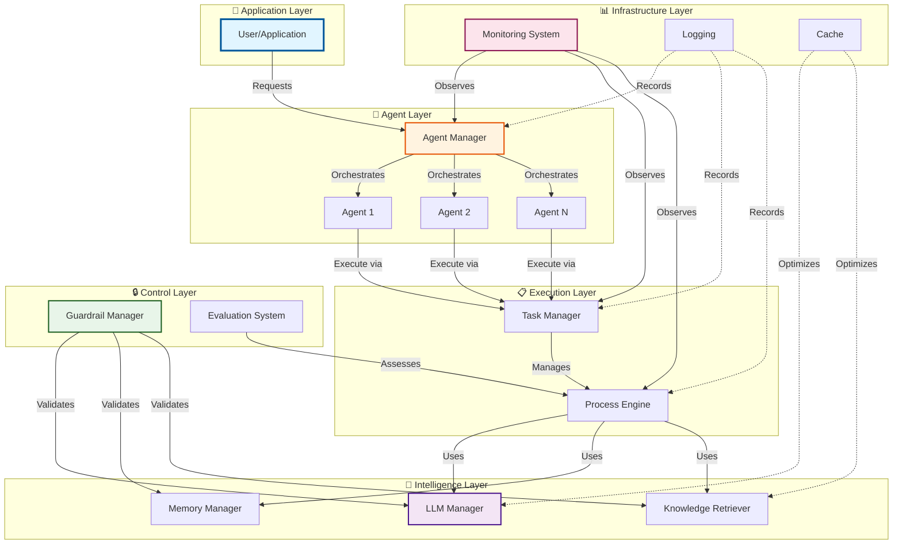

---
tags:
  - home
  - overview
  - getting-started
---

<div align="center" markdown>

# :robot: AgenticAI Framework

**A comprehensive Python SDK for building intelligent agentic applications**

<p class="hero-subtitle">Enterprise-ready • Developer-friendly • Production-tested</p>

[:octicons-rocket-24: Get Started](quick-start.md){ .md-button .md-button--primary }
[:octicons-download-24: Install](USAGE.md){ .md-button }
[:octicons-mark-github-16: GitHub](https://github.com/isathish/agenticaiframework){ .md-button }

<p align="center">
  <a href="https://pypi.org/project/agenticaiframework/"></a>
  <a href="https://pypi.org/project/agenticaiframework/"></a>
  <a href="https://github.com/isathish/agenticaiframework/actions"></a>
  <a href="https://github.com/isathish/agenticaiframework"></a>
  <a href="https://github.com/isathish/agenticaiframework"></a>
</p>

!!! success "Latest Release: v1.2.13"
    🎉 New features: Documentation cleanup, Enhanced examples, Improved testing
    [:octicons-arrow-right-24: See What's New](changelog.md)

</div>

---

## :sparkles: Why Choose AgenticAI Framework?

AgenticAI Framework empowers developers, researchers, and enterprises to create sophisticated AI agents that can reason, interact, and execute complex tasks across multiple domains with unprecedented ease and reliability.

<div class="grid cards" markdown>

-   :material-rocket-launch:{ .lg .middle } __Enterprise-Ready__

    
    Production-ready framework with built-in security, monitoring, and scalability features for mission-critical applications.

    [:octicons-arrow-right-24: Learn more](best-practices.md)

-   :material-code-braces:{ .lg .middle } __Developer-Friendly__

    
    Intuitive APIs and comprehensive documentation make building AI agents effortless. Get started in minutes.

    [:octicons-arrow-right-24: Quick Start](quick-start.md)

-   :material-puzzle:{ .lg .middle } __Flexible Architecture__

    
    Modular design allows you to mix and match components based on your needs. Extend with ease.

    [:octicons-arrow-right-24: Architecture](architecture.md)

-   :material-lightning-bolt:{ .lg .middle } __High Performance__

    
    Optimized for both single-agent and multi-agent scenarios with built-in async support and caching.

    [:octicons-arrow-right-24: Performance](performance.md)

</div>

### :star: Key Features

<div class="grid" markdown>

:octicons-zap-24:{ .lg } **Rapid Development**
:   Get from idea to production in minutes, not weeks with intuitive APIs

:octicons-shield-check-24:{ .lg } **Enterprise Security**
:   Built-in guardrails, input validation, and compliance features

:octicons-graph-24:{ .lg } **Full Observability**
:   Comprehensive monitoring, logging, and metrics out of the box

:octicons-checklist-24:{ .lg } **12-Tier Evaluation**
:   Industry-leading evaluation from model quality to business outcomes

:octicons-plug-24:{ .lg } **Highly Extensible**
:   Easy integration with existing systems and tools via MCP protocol

:octicons-people-24:{ .lg } **Multi-Agent**
:   Orchestrate complex workflows with multiple specialized agents

:octicons-globe-24:{ .lg } **Multi-Modal**
:   Support for text, images, audio, and video processing

</div>


## :package: Installation

=== ":simple-python: PyPI (Recommended)"

    ```bash
    pip install agenticaiframework
    ```

    Install with specific extras:

    ```bash
    # With all optional dependencies
    pip install agenticaiframework[all]
    
    # With specific features
    pip install agenticaiframework[security,monitoring]
    ```

=== ":material-git: Development Version"

    ```bash
    pip install git+https://github.com/isathish/agenticaiframework.git
    ```

=== ":material-source-branch: From Source"

    ```bash
    git clone https://github.com/isathish/agenticaiframework.git
    cd agenticaiframework
    pip install -e .
    ```

!!! info "System Requirements"
    
    - :fontawesome-brands-python: **Python**: 3.8 or higher
    - :fontawesome-solid-desktop: **OS**: Windows, macOS, Linux
    - :fontawesome-solid-memory: **Memory**: Minimum 2GB RAM (4GB+ recommended)


## :zap: Quick Start

!!! example "Your First Agent in 30 Seconds"

    === "Step 1: Setup"
    
        ```python
        from agenticaiframework import Agent, Task, LLMManager
        
        # Set up the LLM
        llm = LLMManager()
        llm.register_model("gpt-4", your_llm_function)
        llm.set_active_model("gpt-4")
        ```
    
    === "Step 2: Create Agent"
    
        ```python
        # Create an intelligent agent
        agent = Agent(
            name="AssistantAgent",
            role="AI Assistant",
            capabilities=["text_generation", "analysis"],
            config={"llm": llm}
        )
        ```
    
    === "Step 3: Define Task"
    
        ```python
        # Define what the agent should do
        task = Task(
            name="GreetingTask",
            objective="Generate a friendly greeting",
            executor=lambda: llm.generate("Say hello!")
        )
        ```
    
    === "Step 4: Execute"
    
        ```python
        # Run the agent
        agent.start()
        result = task.run()
        print(result)  # Output: A friendly greeting!
        ```

    [:octicons-arrow-right-24: Full Tutorial](quick-start.md)

!!! tip "Multi-Agent Collaboration"

    Create teams of specialized agents that work together:

    ```python
    from agenticaiframework import Agent, AgentManager
    
    # Create specialized agents
    data_agent = Agent(
        name="DataCollector",
        role="Data Collection Specialist",
        capabilities=["data_retrieval", "web_scraping"],
        config={"max_requests": 100}
    )
    
    analysis_agent = Agent(
        name="DataAnalyzer", 
        role="Data Analysis Expert",
        capabilities=["statistical_analysis", "visualization"],
        config={"precision": "high"}
    )
    
    # Manage and coordinate
    manager = AgentManager()
    manager.register_agent(data_agent)
    manager.register_agent(analysis_agent)
    
    # Start collaborative workflow
    data_agent.start()
    analysis_agent.start()
    manager.broadcast("Starting data processing pipeline...")
    ```

    [:octicons-arrow-right-24: Advanced Examples](EXAMPLES.md)


## :building_construction: Core Architecture

<div class="annotate" markdown>

!!! abstract "System Components"
    Modular architecture with clear separation of concerns



</div>

[:octicons-arrow-right-24: Detailed Architecture Guide](architecture.md){ .md-button }
[:octicons-arrow-right-24: View All Diagrams](diagrams.md){ .md-button }

### :gear: Core Components

<div class="grid cards" markdown>

-   :material-robot:{ .lg .middle } __Agents__

    
    Core AI entities with role-based capabilities
    
    - Configurable behaviors
    - State management
    - Extensible design
    
    [:octicons-arrow-right-24: Learn more](agents.md)

-   :material-checkbox-marked-circle:{ .lg .middle } __Tasks__

    
    Discrete work units with clear objectives
    
    - Async execution
    - Dependency management
    - Result tracking
    
    [:octicons-arrow-right-24: Learn more](tasks.md)

-   :material-cog-sync:{ .lg .middle } __Processes__

    
    Workflow orchestration and coordination
    
    - Sequential pipelines
    - Parallel execution
    - Hybrid strategies
    
    [:octicons-arrow-right-24: Learn more](processes.md)

-   :material-brain:{ .lg .middle } __LLMs__

    
    Language model integration layer
    
    - Multi-provider support
    - Model switching
    - Circuit breaker pattern
    
    [:octicons-arrow-right-24: Learn more](llms.md)

-   :material-database:{ .lg .middle } __Memory__

    
    Sophisticated data persistence
    
    - Short-term memory
    - Long-term storage
    - External backends
    
    [:octicons-arrow-right-24: Learn more](memory.md)

-   :material-book-open:{ .lg .middle } __Knowledge__

    
    Information retrieval system
    
    - Vector search
    - Semantic caching
    - Index management
    
    [:octicons-arrow-right-24: Learn more](knowledge.md)

-   :material-shield-check:{ .lg .middle } __Guardrails__

    
    Safety and compliance layer
    
    - Input validation
    - Output filtering
    - Policy enforcement
    
    [:octicons-arrow-right-24: Learn more](guardrails.md)

-   :material-chart-line:{ .lg .middle } __Monitoring__

    
    Full observability stack
    
    - Metrics collection
    - Event logging
    - Alert system
    
    [:octicons-arrow-right-24: Learn more](monitoring.md)

</div>


## :material-lightbulb-on: Use Cases

<div class="grid cards" markdown>

-   :material-office-building:{ .lg } __Enterprise Applications__

    
    - **Customer Support**: Intelligent chatbots with escalation
    - **Document Processing**: Automated analysis and summarization
    - **Business Intelligence**: Data analysis and reporting

-   :material-flask:{ .lg } __Research & Development__

    
    - **Research Assistants**: Literature review and synthesis
    - **Data Science**: Automated ML workflows
    - **Experiment Management**: Hypothesis testing

-   :material-code-tags:{ .lg } __Software Development__

    
    - **Code Generation**: Automated programming assistance
    - **Testing & QA**: Intelligent test case generation
    - **DevOps**: Deployment and monitoring automation

-   :material-school:{ .lg } __Education & Training__

    
    - **Personalized Tutoring**: Adaptive learning systems
    - **Content Creation**: Automated curriculum generation
    - **Assessment Tools**: Intelligent grading and feedback

</div>

[:octicons-arrow-right-24: More Examples](EXAMPLES.md){ .md-button }


## 📚 Key Concepts

### Agents
Autonomous entities that can perform tasks, make decisions, and interact with other agents or systems.

```python
agent = Agent(
    name="SpecialistAgent",
    role="Domain Expert", 
    capabilities=["analysis", "reasoning"],
    config={
        "temperature": 0.7,
        "max_iterations": 10,
        "memory_type": "long_term"
    }
)
```

### Tasks
Discrete units of work that agents can execute with specific objectives and success criteria.

```python
task = Task(
    name="AnalysisTask",
    objective="Analyze customer feedback",
    executor=analysis_function,
    inputs={"data": customer_data}
)
```

### Memory Management
Sophisticated memory systems for storing and retrieving information across different time horizons.

```python
from agenticaiframework.memory import MemoryManager

memory = MemoryManager()
memory.store("customer_preference", "prefers_email", memory_type="long_term")
preference = memory.retrieve("customer_preference")
```

### Guardrails
Safety mechanisms that ensure agents operate within defined boundaries and compliance requirements.

```python
from agenticaiframework.guardrails import Guardrail, GuardrailManager

# Create a data privacy guardrail
privacy_guardrail = Guardrail(
    name="DataPrivacy",
    validation_fn=lambda text: not contains_pii(text),
    severity="high"
)

guardrail_manager = GuardrailManager()
guardrail_manager.register_guardrail(privacy_guardrail)

# Enforce guardrails
result = guardrail_manager.enforce_guardrails(user_input)
```

### Security
Comprehensive security features protect your AI applications from threats and ensure compliance.

```python
from agenticaiframework.security import SecurityManager

# Initialize security with all features enabled
security = SecurityManager(
    enable_injection_detection=True,
    enable_input_validation=True,
    enable_rate_limiting=True,
    enable_content_filtering=True,
    enable_audit_logging=True
)

# Validate user input with all security checks
result = security.validate_input(user_input, user_id="user123")

if result['is_safe']:
    # Process safe input
    process_request(result['sanitized_text'])
else:
    # Handle security issues
    log_security_event(result['issues'])
```


## 🔧 Configuration

### Environment Variables
```bash
export AGENTICAI_LOG_LEVEL=INFO
export AGENTICAI_MAX_AGENTS=50
export AGENTICAI_MEMORY_BACKEND=redis
```

### Configuration File
```python
from agenticaiframework.configurations import ConfigurationManager

config = ConfigurationManager()
config.set_config("LLM", {
    "provider": "openai",
    "model": "gpt-4",
    "temperature": 0.7,
    "max_tokens": 2048
})
```


## 📊 Monitoring & Observability

```python
from agenticaiframework.monitoring import MonitoringSystem

monitor = MonitoringSystem()

# Record metrics
monitor.record_metric("task_completion_time", 1.23)
monitor.record_metric("agent_success_rate", 0.95)

# Log events
monitor.log_event("TaskStarted", {"task_id": "task_001", "agent": "agent_001"})

# Get insights
metrics = monitor.get_metrics()
events = monitor.get_events()
```


## 🛡️ Security Features

- **Input Validation**: Automatic sanitization of user inputs
- **Output Filtering**: Content screening before responses
- **Access Control**: Role-based permissions for agents
- **Audit Logging**: Comprehensive activity tracking
- **Encryption**: Data protection in transit and at rest


## 🚀 Performance Optimization

### Best Practices

1. **Agent Pooling**: Reuse agents for similar tasks
2. **Memory Optimization**: Use appropriate memory types for data lifecycle
3. **Async Processing**: Leverage asynchronous execution for I/O operations
4. **Caching**: Cache frequently accessed knowledge and computations
5. **Resource Management**: Monitor and limit resource consumption

### Scalability Features

- **Horizontal Scaling**: Distribute agents across multiple processes/machines
- **Load Balancing**: Automatic task distribution
- **Resource Monitoring**: Built-in performance tracking
- **Auto-scaling**: Dynamic agent provisioning based on load


## 🔗 Integrations

### LLM Providers
- OpenAI (GPT-3.5, GPT-4, GPT-4 Turbo)
- Anthropic (Claude, Claude-2)
- Google (Gemini, PaLM)
- HuggingFace Transformers
- Azure OpenAI Service
- AWS Bedrock

### Communication Protocols
- HTTP/HTTPS REST APIs
- WebSocket connections
- gRPC for high-performance scenarios
- Message queues (Redis, RabbitMQ)
- Server-Sent Events (SSE)
- Standard I/O (STDIO)

### Storage & Databases
- PostgreSQL, MySQL (relational data)
- MongoDB (document storage)
- Redis (caching and pub/sub)
- Elasticsearch (search and analytics)
- Vector databases (Pinecone, Weaviate, Chroma)


## 📖 Documentation

| Section | Description |
|---------|-------------|
| [Quick Start](quick-start.md) | Get up and running in 5 minutes |
| [API Reference](API_REFERENCE.md) | Complete API documentation |
| [Examples](EXAMPLES.md) | Real-world usage examples |
| [Best Practices](best-practices.md) | Production deployment guidelines |
| [Troubleshooting](TROUBLESHOOTING.md) | Common issues and solutions |


## 🤝 Community & Support

- **GitHub Issues**: [Bug reports and feature requests](https://github.com/isathish/agenticaiframework/issues)
- **Discussions**: [Community forum](https://github.com/isathish/agenticaiframework/discussions)
- **Documentation**: [Complete guides and API reference](https://isathish.github.io/agenticaiframework/)
- **PyPI**: [Package distribution](https://pypi.org/project/agenticaiframework/)


## 📜 License

This project is licensed under the MIT License - see the [LICENSE](https://github.com/isathish/agenticaiframework/blob/main/LICENSE) file for details.


## 🙏 Acknowledgments

Built with ❤️ by the AgenticAI team and amazing contributors from the open-source community.

```python
from agenticaiframework import Agent, AgentManager

# Create an agent
agent = Agent(
    name="ExampleAgent",
    role="assistant",
    capabilities=["text"],
    config={"temperature": 0.7}
)

# Manage agents
manager = AgentManager()
manager.register_agent(agent)

# Start the agent
agent.start()
```


## 📚 Core Concepts

### 1. Agents
Agents are the core building blocks. They have:
- **Name** – Unique identifier.
- **Role** – Defines their purpose.
- **Capabilities** – What they can do (e.g., text generation, image analysis).
- **Configuration** – Parameters like temperature, max tokens, etc.

### 2. Agent Manager
The `AgentManager` handles:
- Registration of agents.
- Starting and stopping agents.
- Coordinating multi-agent workflows.

### 3. Memory
Agents can store and retrieve information using the `Memory` module.

```python
from agenticaiframework.memory import Memory

memory = Memory()
memory.store("user_name", "Alice")
print(memory.retrieve("user_name"))  # Output: Alice
```

### 4. Processes
Run synchronous or asynchronous processes:

```python
from agenticaiframework.processes import run_process

def greet():
    return "Hello, World!"

print(run_process(greet))
```

### 5. Communication
Supports multiple protocols:
- HTTP
- WebSockets
- gRPC
- Message Queues (MQ)
- Server-Sent Events (SSE)
- STDIO

### 6. Guardrails
Define safety and compliance rules for agents:
```python
from agenticaiframework.guardrails import add_guardrail

def no_sensitive_data(input_text):
    return "password" not in input_text.lower()

add_guardrail(no_sensitive_data)
```


## 🛠 Configuration

You can configure the framework via:
- **Code** – Using `set_config` from `agenticaiframework.configurations`.
- **Environment Variables**.
- **Configuration Files**.

Example:
```python
from agenticaiframework.configurations import set_config
set_config("max_concurrent_tasks", 5)
```


## 🔌 Integrations

AgenticAI Framework supports:
- **LLMs** – OpenAI, Anthropic, HuggingFace, etc.
- **Communication Protocols** – HTTP, WebSockets, gRPC, MQ.
- **Custom Tools** – Easily add your own.
- **Knowledge Retrieval** – Integrate with vector databases and search engines.
- **MCP Tools** – Extend capabilities with Model Context Protocol integrations.


## 🧪 Testing

AgenticAI Framework includes comprehensive test coverage (66%, 1036 tests) to ensure reliability.

### Running Tests

```bash
# Run all tests
pytest tests/

# Run with coverage
pytest tests/ --cov=agenticaiframework --cov-report=html

# Run specific test categories
pytest tests/ -m unit          # Unit tests only
pytest tests/ -m integration   # Integration tests only
pytest tests/ -m "not slow"    # Fast tests only
```

### Test Coverage

**Current Coverage: 66%** (1036 passing tests)

| Module | Coverage |
|--------|----------|
| communication.py | 100% ✅ |
| configurations.py | 100% ✅ |
| evaluation.py | 100% ✅ |
| evaluation_advanced.py | 81% ✅ |
| processes.py | 100% ✅ |
| knowledge.py | 94% |
| monitoring.py | 86% |
| guardrails.py | 75% |
| llms.py | 60% |
| integrations.py | 95% |

For detailed testing guide, see [Testing Guide](TESTING.md).


## 📄 Documentation Sections

- [Quick Start](quick-start.md) - Get started in 5 minutes
- [API Reference](API_REFERENCE.md) - Complete API documentation
- [Usage Guide](USAGE.md) - Comprehensive usage patterns
- [Testing Guide](TESTING.md) - Testing strategies and best practices
- [Configuration](CONFIGURATION.md) - Configuration options
- [Examples](EXAMPLES.md) - Real-world examples
- [Best Practices](best-practices.md) - Production best practices
- [Security](security.md) - Security features and guidelines
- [Extending the Framework](EXTENDING.md) - Customization guide
- [Troubleshooting](TROUBLESHOOTING.md) - Common issues and solutions


## 📘 Advanced Topics

### Multi-Agent Orchestration
Coordinate multiple agents for complex workflows:
```python
from agenticaiframework import Agent, AgentManager

agent1 = Agent(name="DataCollector", role="collector", capabilities=["data"])
agent2 = Agent(name="DataAnalyzer", role="analyzer", capabilities=["analysis"])

manager = AgentManager()
manager.register_agent(agent1)
manager.register_agent(agent2)

# Example orchestration logic
agent1.start()
agent2.start()
```

### Monitoring and Logging
```python
from agenticaiframework.monitoring import log_event

log_event("Agent started", level="INFO")
```

### MCP Tools Integration
```python
from agenticaiframework.mcp_tools import load_tool

tool = load_tool("weather")
result = tool.run({"location": "New York"})
print(result)
```

### Knowledge Base Integration
```python
from agenticaiframework.knowledge import KnowledgeBase

kb = KnowledgeBase()
kb.add_document("doc1", "This is a sample document.")
print(kb.search("sample"))
```


## 📊 Performance Tips

- Use asynchronous processes for I/O-bound tasks.
- Limit concurrent agents to avoid resource contention.
- Cache frequently used data in memory.
- Use guardrails to prevent invalid or unsafe operations.


## 🤝 Contributing

We welcome contributions!  
1. Fork the repo.  
2. Create a feature branch.  
3. Submit a pull request.  
4. Ensure all tests pass before submission.


## 📜 License

© 2026 AgenticAI Framework. Licensed under the MIT License.
