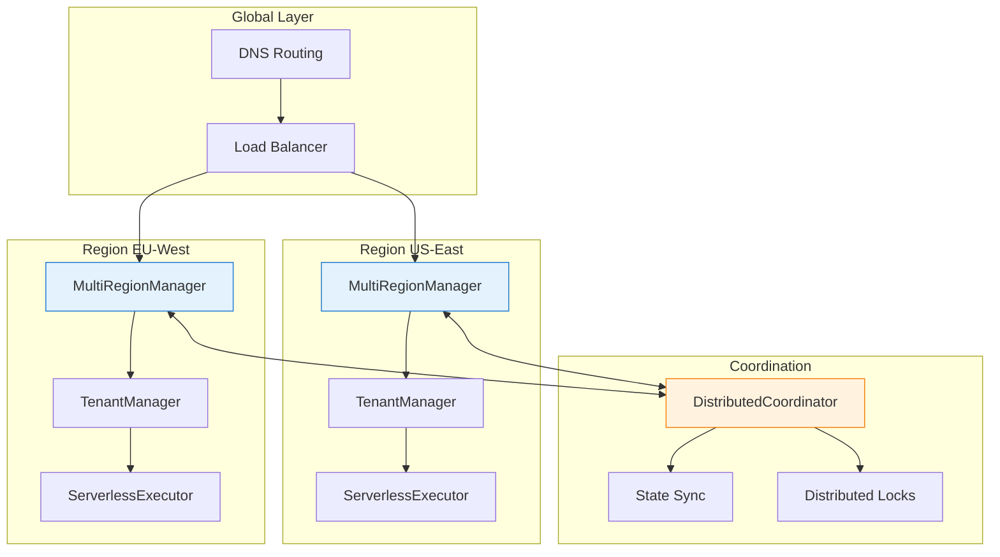

# 🏗️ Infrastructure

<div class="annotate" markdown>

**Enterprise-scale infrastructure management**

Multi-region deployment, tenant isolation, serverless execution, and distributed coordination across **400+ modules**

</div>

!!! success "Enterprise Infrastructure"
    Part of **237 enterprise modules** with **20 infrastructure features** including load balancing, circuit breakers, and service mesh. See [Enterprise Documentation](enterprise.md).

---

## 🎯 Quick Navigation

<div class="grid cards" markdown>

-   :material-earth:{ .lg } **Multi-Region**
    
    Geographic distribution
    
    [:octicons-arrow-right-24: Deploy](#multi-region-manager)

-   :material-account-group:{ .lg } **Multi-Tenant**
    
    Tenant isolation
    
    [:octicons-arrow-right-24: Isolate](#tenant-manager)

-   :material-cloud-outline:{ .lg } **Serverless**
    
    Function execution
    
    [:octicons-arrow-right-24: Execute](#serverless-executor)

-   :material-sitemap:{ .lg } **Coordination**
    
    Distributed systems
    
    [:octicons-arrow-right-24: Coordinate](#distributed-coordinator)

</div>

## 📊 Overview

!!! abstract "Infrastructure Framework"
    
    The Infrastructure module provides **20 enterprise-grade infrastructure modules** for deploying and managing AI agents at scale across multiple regions, tenants, and execution environments.

### Architecture



---

## 🌍 Multi-Region Manager

The `MultiRegionManager` handles geographic distribution and failover.

### Basic Usage

```python
from agenticaiframework.infrastructure import (
    MultiRegionManager,
    Region,
    RegionConfig
)

# Create multi-region manager
manager = MultiRegionManager()

# Define regions
us_east = RegionConfig(
    name="us-east-1",
    endpoint="https://us-east.api.example.com",
    priority=1,
    capacity=1000,
    latency_threshold_ms=100
)

eu_west = RegionConfig(
    name="eu-west-1",
    endpoint="https://eu-west.api.example.com",
    priority=2,
    capacity=800,
    latency_threshold_ms=150
)

# Register regions
manager.register_region(us_east)
manager.register_region(eu_west)
```

### Routing Strategies

```python
from agenticaiframework.infrastructure import RoutingStrategy

# Latency-based routing
manager.set_routing_strategy(RoutingStrategy.LOWEST_LATENCY)

# Geographic routing
manager.set_routing_strategy(
    RoutingStrategy.GEOGRAPHIC,
    config={"default_region": "us-east-1"}
)

# Round-robin
manager.set_routing_strategy(RoutingStrategy.ROUND_ROBIN)

# Weighted
manager.set_routing_strategy(
    RoutingStrategy.WEIGHTED,
    weights={"us-east-1": 70, "eu-west-1": 30}
)
```

### Execute with Failover

```python
# Execute operation with automatic failover
async def process_request(request):
    result = await manager.execute_with_failover(
        operation=lambda region: region.process(request),
        timeout_seconds=30,
        max_retries=3
    )
    return result

# Get optimal region for request
region = manager.get_optimal_region(
    client_location="New York, US",
    requirements={"min_capacity": 100}
)
```

### Health Monitoring

```python
import logging

logger = logging.getLogger(__name__)

# Monitor region health
health_status = manager.get_health_status()
for region_name, status in health_status.items():
    logger.info(f"{region_name}:")
    logger.info(f"  Status: {status.state}")
    logger.info(f"  Latency: {status.avg_latency_ms}ms")
    logger.info(f"  Capacity: {status.available_capacity}/{status.total_capacity}")
    logger.info(f"  Error Rate: {status.error_rate}%")

# Set health check configuration
manager.configure_health_checks(
    interval_seconds=30,
    timeout_seconds=5,
    unhealthy_threshold=3,
    healthy_threshold=2
)
```

### Failover Configuration

```python
# Configure automatic failover
manager.configure_failover(
    enabled=True,
    failover_threshold_ms=500,     # Trigger if latency > 500ms
    failover_error_rate=0.1,       # Trigger if error rate > 10%
    cooldown_seconds=60,           # Wait before failing back
    notification_webhook="https://alerts.example.com/failover"
)
```

---

## 👥 Tenant Manager

The `TenantManager` provides complete tenant isolation and management.

### Basic Usage

```python
from agenticaiframework.infrastructure import (
    TenantManager,
    Tenant,
    TenantConfig,
    IsolationLevel
)

# Create tenant manager
tenant_mgr = TenantManager()

# Create a tenant
tenant = Tenant(
    id="tenant-acme",
    name="ACME Corporation",
    config=TenantConfig(
        isolation_level=IsolationLevel.DATABASE,
        resource_limits={
            "max_agents": 100,
            "max_requests_per_minute": 1000,
            "max_storage_gb": 50
        },
        features=["advanced_analytics", "custom_models"]
    )
)

# Register tenant
tenant_mgr.register_tenant(tenant)
```

### Isolation Levels

```python
from agenticaiframework.infrastructure import IsolationLevel

# Available isolation levels
IsolationLevel.NAMESPACE    # Logical separation (schemas)
IsolationLevel.DATABASE     # Separate databases
IsolationLevel.CONTAINER    # Separate containers
IsolationLevel.CLUSTER      # Dedicated clusters
IsolationLevel.REGION       # Separate regions
```

### Tenant Context

```python
# Execute in tenant context
async with tenant_mgr.tenant_context("tenant-acme") as ctx:
    # All operations scoped to tenant
    agents = ctx.list_agents()
    data = ctx.query_data("SELECT * FROM logs")
    
    # Tenant-specific configuration
    config = ctx.get_config()

# Decorator for tenant scoping
from agenticaiframework.infrastructure import tenant_scope

@tenant_scope
async def get_tenant_data(tenant_id: str, query: str):
    """Operations automatically scoped to tenant."""
    return await database.query(query)
```

### Resource Quotas

```python
import logging

logger = logging.getLogger(__name__)

# Check tenant quota
quota = tenant_mgr.get_quota("tenant-acme")
logger.info(f"Agents: {quota.agents_used}/{quota.agents_limit}")
logger.info(f"Storage: {quota.storage_used_gb}/{quota.storage_limit_gb}")
logger.info(f"Requests: {quota.requests_used}/{quota.requests_limit}")

# Update quotas
tenant_mgr.update_quota(
    "tenant-acme",
    max_agents=200,
    max_storage_gb=100
)

# Enforce quotas
try:
    await tenant_mgr.create_agent_for_tenant(
        "tenant-acme",
        agent_config
    )
except QuotaExceededError as e:
    logger.info(f"Quota exceeded: {e.resource} ({e.current}/{e.limit})")
```

### Tenant Metrics

```python
import logging

logger = logging.getLogger(__name__)

# Get tenant usage metrics
metrics = tenant_mgr.get_metrics("tenant-acme")
logger.info(f"Active agents: {metrics.active_agents}")
logger.info(f"Total requests: {metrics.total_requests}")
logger.info(f"Avg latency: {metrics.avg_latency_ms}ms")
logger.info(f"Error rate: {metrics.error_rate}%")
logger.info(f"Cost this month: ${metrics.monthly_cost}")

# List all tenants with usage
for tenant in tenant_mgr.list_tenants():
    usage = tenant_mgr.get_usage(tenant.id)
    logger.info(f"{tenant.name}: {usage.requests_today} requests")
```

---

## ☁️ Serverless Executor

The `ServerlessExecutor` enables function-as-a-service execution.

### Basic Usage

```python
import logging

logger = logging.getLogger(__name__)

from agenticaiframework.infrastructure import (
    ServerlessExecutor,
    ServerlessFunction,
    FunctionConfig
)

# Create executor
executor = ServerlessExecutor(
    provider="aws_lambda",  # or "azure_functions", "gcp_functions"
    credentials=credentials
)

# Define a function
function = ServerlessFunction(
    name="process-document",
    handler="handlers.process_document",
    runtime="python3.11",
    memory_mb=512,
    timeout_seconds=30,
    config=FunctionConfig(
        environment={"LOG_LEVEL": "INFO"},
        vpc_config=vpc_settings
    )
)

# Deploy function
deployed = await executor.deploy(function)
logger.info(f"Deployed: {deployed.arn}")
```

### Invoke Functions

```python
import logging

logger = logging.getLogger(__name__)

# Synchronous invocation
result = await executor.invoke(
    function_name="process-document",
    payload={"document_id": "doc-123"},
    invocation_type="sync"
)
logger.info(f"Result: {result.payload}")

# Asynchronous invocation
invocation = await executor.invoke(
    function_name="process-document",
    payload={"document_id": "doc-456"},
    invocation_type="async"
)
logger.info(f"Invocation ID: {invocation.id}")

# Check async result
status = await executor.get_invocation_status(invocation.id)
if status.completed:
    logger.info(f"Result: {status.result}")
```

### Function Scaling

```python
# Configure auto-scaling
await executor.configure_scaling(
    function_name="process-document",
    min_instances=1,
    max_instances=100,
    target_utilization=0.7,
    scale_up_cooldown=60,
    scale_down_cooldown=300
)

# Warm function (keep instances ready)
await executor.warm(
    function_name="process-document",
    instances=5
)
```

### Function Monitoring

```python
import logging

logger = logging.getLogger(__name__)

# Get function metrics
metrics = await executor.get_metrics(
    function_name="process-document",
    time_range="1h"
)
logger.info(f"Invocations: {metrics.invocation_count}")
logger.info(f"Duration avg: {metrics.duration_avg_ms}ms")
logger.info(f"Duration p99: {metrics.duration_p99_ms}ms")
logger.info(f"Errors: {metrics.error_count}")
logger.info(f"Throttles: {metrics.throttle_count}")

# Stream logs
async for log_entry in executor.stream_logs("process-document"):
    logger.info(f"{log_entry.timestamp}: {log_entry.message}")
```

### Agent as Function

```python
from agenticaiframework import Agent
from agenticaiframework.infrastructure import ServerlessExecutor

# Deploy agent as serverless function
agent = Agent(
    name="DocumentProcessor",
    model="gpt-4",
    instructions="Process and summarize documents"
)

# Package and deploy
deployment = await executor.deploy_agent(
    agent=agent,
    function_name="document-processor-agent",
    config=FunctionConfig(
        memory_mb=1024,
        timeout_seconds=60
    )
)

# Invoke agent function
result = await executor.invoke(
    function_name="document-processor-agent",
    payload={"task": "Summarize this document", "document": doc_content}
)
```

---

## 🔗 Distributed Coordinator

The `DistributedCoordinator` manages distributed state and coordination.

### Basic Usage

```python
from agenticaiframework.infrastructure import (
    DistributedCoordinator,
    CoordinatorConfig
)

# Create coordinator
coordinator = DistributedCoordinator(
    backend="redis",  # or "etcd", "zookeeper", "consul"
    config=CoordinatorConfig(
        hosts=["redis1:6379", "redis2:6379", "redis3:6379"],
        cluster_name="agent-cluster"
    )
)

# Connect to cluster
await coordinator.connect()
```

### Distributed Locks

```python
import logging

logger = logging.getLogger(__name__)

# Acquire distributed lock
async with coordinator.lock("resource-123", timeout=30) as lock:
    # Exclusive access to resource
    await process_resource("resource-123")

# Try lock with immediate return
lock = await coordinator.try_lock("resource-456")
if lock:
    try:
        await process_resource("resource-456")
    finally:
        await lock.release()
else:
    logger.info("Resource is locked by another process")
```

### Leader Election

```python
import logging

logger = logging.getLogger(__name__)

# Participate in leader election
async with coordinator.leader_election("agent-leaders") as election:
    if election.is_leader:
        logger.info("I am the leader")
        await perform_leader_tasks()
    else:
        logger.info(f"Leader is: {election.leader_id}")
        await perform_follower_tasks()

# Watch for leader changes
@coordinator.on_leader_change("agent-leaders")
async def handle_leader_change(new_leader: str, is_self: bool):
    if is_self:
        await initialize_leader_state()
    else:
        await sync_with_leader(new_leader)
```

### Distributed State

```python
import logging

logger = logging.getLogger(__name__)

# Set distributed state
await coordinator.set_state("config/model", "gpt-4")
await coordinator.set_state("config/temperature", 0.7)

# Get state
model = await coordinator.get_state("config/model")

# Watch for state changes
@coordinator.watch("config/*")
async def on_config_change(key: str, value: any):
    logger.info(f"Config changed: {key} = {value}")
    await reload_config()

# Atomic operations
await coordinator.atomic_increment("counters/requests")
await coordinator.compare_and_swap(
    key="state/version",
    expected=1,
    new_value=2
)
```

### Service Discovery

```python
import logging

logger = logging.getLogger(__name__)

# Register service
await coordinator.register_service(
    name="agent-service",
    instance_id="agent-1",
    address="10.0.0.1",
    port=8080,
    metadata={"version": "1.0", "region": "us-east"}
)

# Discover services
services = await coordinator.discover_services("agent-service")
for svc in services:
    logger.info(f"{svc.instance_id}: {svc.address}:{svc.port}")

# Health-aware routing
healthy_service = await coordinator.get_healthy_service("agent-service")
```

### Distributed Queues

```python
# Create distributed queue
queue = coordinator.queue("task-queue")

# Enqueue task
await queue.put({"task_id": "123", "action": "process"})

# Dequeue task
task = await queue.get(timeout=30)
if task:
    try:
        await process_task(task)
        await queue.ack(task)
    except Exception:
        await queue.nack(task)  # Return to queue

# Priority queue
priority_queue = coordinator.priority_queue("priority-tasks")
await priority_queue.put({"urgent": True}, priority=10)
await priority_queue.put({"urgent": False}, priority=1)
```

---

## 🎯 Complete Example

```python
import logging

logger = logging.getLogger(__name__)

from agenticaiframework import Agent, AgentRunner
from agenticaiframework.infrastructure import (
    MultiRegionManager,
    TenantManager,
    ServerlessExecutor,
    DistributedCoordinator,
    RegionConfig,
    Tenant,
    TenantConfig,
    IsolationLevel,
    RoutingStrategy
)

# Initialize infrastructure
async def setup_infrastructure():
    # 1. Multi-region setup
    region_mgr = MultiRegionManager()
    region_mgr.register_region(RegionConfig(
        name="us-east-1",
        endpoint="https://us-east.example.com",
        priority=1
    ))
    region_mgr.register_region(RegionConfig(
        name="eu-west-1",
        endpoint="https://eu-west.example.com",
        priority=2
    ))
    region_mgr.set_routing_strategy(RoutingStrategy.LOWEST_LATENCY)
    
    # 2. Multi-tenant setup
    tenant_mgr = TenantManager()
    tenant_mgr.register_tenant(Tenant(
        id="enterprise-client",
        name="Enterprise Client",
        config=TenantConfig(
            isolation_level=IsolationLevel.DATABASE,
            resource_limits={"max_agents": 50}
        )
    ))
    
    # 3. Serverless setup
    executor = ServerlessExecutor(provider="aws_lambda")
    
    # 4. Distributed coordination
    coordinator = DistributedCoordinator(backend="redis")
    await coordinator.connect()
    
    return region_mgr, tenant_mgr, executor, coordinator

# Global agent service
class GlobalAgentService:
    def __init__(self, region_mgr, tenant_mgr, executor, coordinator):
        self.region_mgr = region_mgr
        self.tenant_mgr = tenant_mgr
        self.executor = executor
        self.coordinator = coordinator
    
    async def run_agent_task(self, tenant_id: str, task: dict):
        """Run agent task with full infrastructure support."""
        
        # Get optimal region
        region = self.region_mgr.get_optimal_region(
            client_location=task.get("location")
        )
        
        # Execute in tenant context
        async with self.tenant_mgr.tenant_context(tenant_id) as ctx:
            # Acquire distributed lock
            async with self.coordinator.lock(f"task-{task['id']}"):
                # Execute via serverless
                result = await self.executor.invoke(
                    function_name="agent-processor",
                    payload={
                        "tenant_id": tenant_id,
                        "task": task,
                        "region": region.name
                    }
                )
                
                # Update distributed state
                await self.coordinator.set_state(
                    f"tasks/{task['id']}/status",
                    "completed"
                )
                
                return result

# Usage
async def main():
    infra = await setup_infrastructure()
    service = GlobalAgentService(*infra)
    
    result = await service.run_agent_task(
        tenant_id="enterprise-client",
        task={
            "id": "task-123",
            "action": "analyze_document",
            "document_id": "doc-456",
            "location": "New York, US"
        }
    )
    logger.info(f"Result: {result}")
```

---

## 📋 Infrastructure Patterns

### High Availability

```python
# Configure for HA
region_mgr.configure_failover(
    enabled=True,
    failover_threshold_ms=500,
    min_healthy_regions=1
)

coordinator.configure_consensus(
    replication_factor=3,
    read_quorum=2,
    write_quorum=2
)
```

### Disaster Recovery

```python
# Configure DR
region_mgr.configure_disaster_recovery(
    backup_region="us-west-2",
    rpo_seconds=60,  # Recovery Point Objective
    rto_seconds=300  # Recovery Time Objective
)

# Trigger failover
await region_mgr.trigger_failover(
    from_region="us-east-1",
    to_region="us-west-2",
    reason="Primary region outage"
)
```

---

## 📚 Related Documentation

- [Deployment](deployment.md) - Production deployment
- [Monitoring](monitoring.md) - System monitoring
- [Security](security.md) - Security configuration
- [Performance](performance.md) - Performance optimization
