# 📚 Knowledge Management

<div class="annotate" markdown>

**Retrieval-Augmented Generation (RAG) for intelligent agents**

Manage structured and unstructured knowledge sources with vector search across **380+ modules**

</div>

!!! success "Enterprise Knowledge"
    Part of **237 enterprise modules** with **15 knowledge management features** including RAG pipelines, vector stores, and semantic search. See [Enterprise Documentation](enterprise.md).

---

## 🎯 Quick Navigation

<div class="grid cards" markdown>

-   :material-database:{ .lg } **Knowledge Base**
    
    Store and organize documents
    
    [:octicons-arrow-right-24: Setup](#key-classes-and-functions)

-   :material-vector-triangle:{ .lg } **Vector Search**
    
    Semantic similarity retrieval
    
    [:octicons-arrow-right-24: Configure](#knowledge-architecture)

-   :material-file-document:{ .lg } **Documents**
    
    Add and manage content
    
    [:octicons-arrow-right-24: Learn More](#use-cases)

-   :material-book-open:{ .lg } **RAG Patterns**
    
    Implementation examples
    
    [:octicons-arrow-right-24: View Examples](#example-usage)

</div>

## 📖 Overview

!!! abstract "What is the Knowledge Module?"
    
    The Knowledge module manages structured and unstructured knowledge sources for AI agents, enabling retrieval, storage, and querying of domain-specific information to enhance reasoning and contextual understanding.

!!! tip "Enterprise ML/AI"
    
    The framework includes **14 ML/AI infrastructure modules** with feature store, model registry, RAG, embeddings, and recommendation engine.

<div class="grid" markdown>

:material-file-document-multiple:{ .lg } **Document Management**
:   Add, update, and organize knowledge documents

:material-magnify:{ .lg } **Semantic Search**
:   Find relevant information using embeddings

:material-database-sync:{ .lg } **External Integration**
:   Connect to APIs, databases, and file systems

:material-brain:{ .lg } **RAG Support**
:   Retrieval-Augmented Generation patterns

</div>

## 🏛️ Knowledge Architecture

```mermaid
graph TB
    subgraph "Input Sources"
        FILES[Files<br/>📄 PDF, TXT, MD]
        API[APIs<br/>🌐 REST, GraphQL]
        DB[Databases<br/>📦 SQL, NoSQL]
    end
    
    subgraph "Knowledge Processing"
        LOADER[Document Loader]
        CHUNK[Text Chunking]
        EMBED[Embeddings<br/>🧠 OpenAI, Sentence Transformers]
    end
    
    subgraph "Storage"
        VECTOR[Vector Database<br/>🔍 Pinecone, Weaviate, Chroma]
        META[Metadata Store<br/>🏷️ PostgreSQL, MongoDB]
    end
    
    subgraph "Retrieval"
        SEARCH[Semantic Search]
        FILTER[Metadata Filtering]
        RANK[Relevance Ranking]
    end
    
    FILES & API & DB --> LOADER
    LOADER --> CHUNK
    CHUNK --> EMBED
    EMBED --> VECTOR
    EMBED --> META
    
    VECTOR --> SEARCH
    META --> FILTER
    SEARCH & FILTER --> RANK
    
    style EMBED fill:#e3f2fd,stroke:#1976d2,stroke-width:2px
    style VECTOR fill:#f3e5f5,stroke:#7b1fa2,stroke-width:2px
    style SEARCH fill:#e8f5e9,stroke:#388e3c,stroke-width:2px
```



## Key Classes and Functions
- **KnowledgeBase** — Core class for storing and retrieving knowledge entries.
- **Document** — Represents a single knowledge item with metadata.
- **add_document(document)** — Adds a new document to the knowledge base.
- **search(query, **kwargs)** — Searches the knowledge base for relevant documents.
- **load_from_source(source)** — Loads knowledge from external sources (files, APIs, databases).

## Example Usage
```python
from agenticaiframework.knowledge import KnowledgeBase, Document

# Initialize knowledge base
kb = KnowledgeBase()

# Add a document
doc = Document(content="Python is a high-level programming language.", metadata={"topic": "programming"})
kb.add_document(doc)

# Search for information
results = kb.search("What is Python?")
for r in results:
    print(r.content)
```

## Use Cases
- Enhancing LLM responses with domain-specific facts.
- Building retrieval-augmented generation (RAG) systems.
- Creating searchable internal knowledge repositories.
- Integrating with external data sources for dynamic updates.

## Best Practices
- Keep metadata consistent for better filtering and retrieval.
- Periodically update the knowledge base to maintain relevance.
- Use embeddings for semantic search to improve accuracy.
- Secure sensitive knowledge sources with access controls.

## Related Documentation
- [LLMs Module](llms.md)
- [Prompts Module](prompts.md)
- [Agents Module](agents.md)
