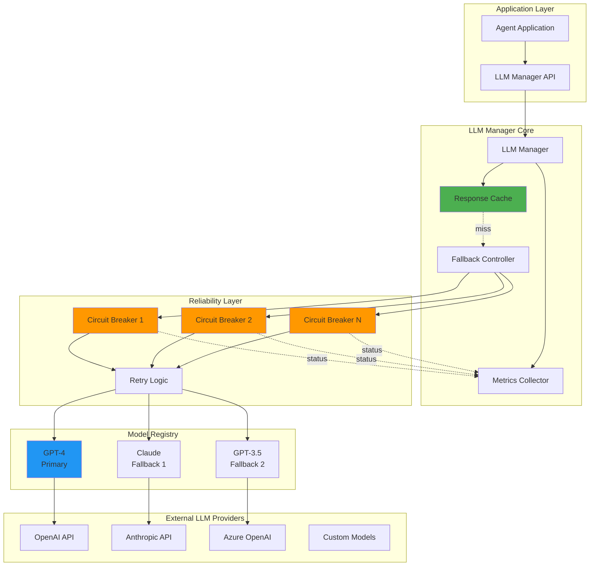
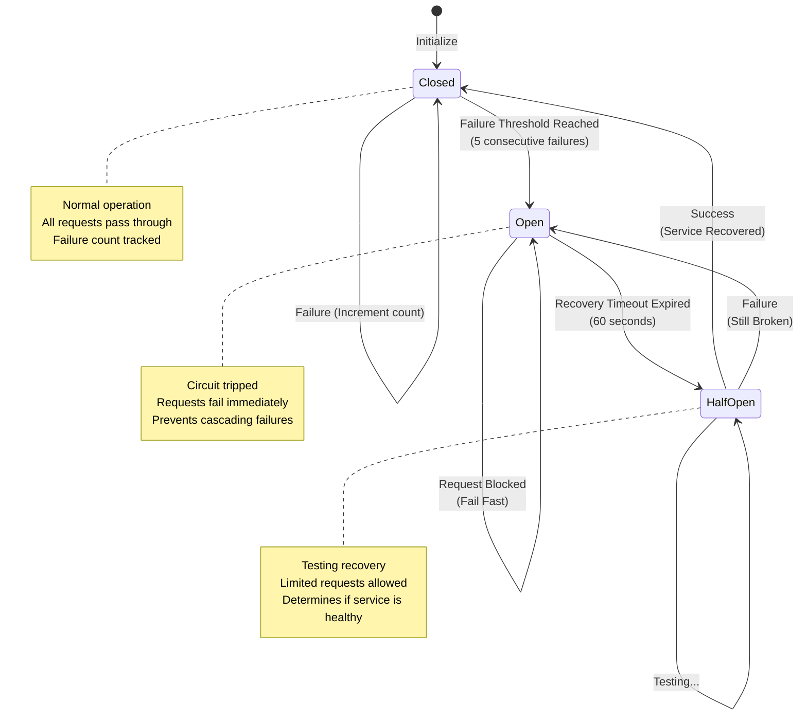
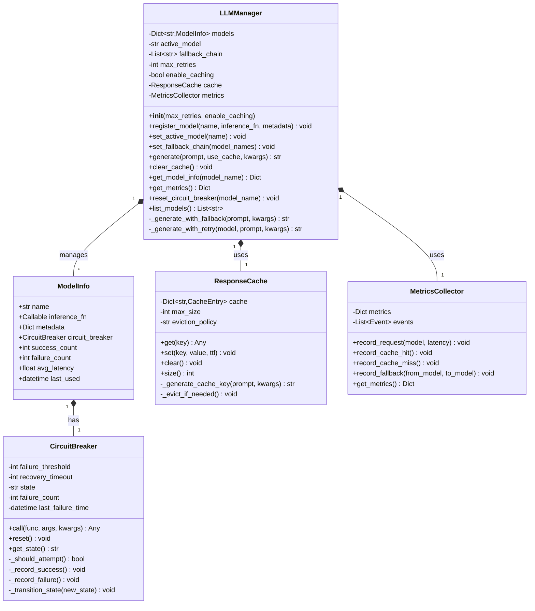
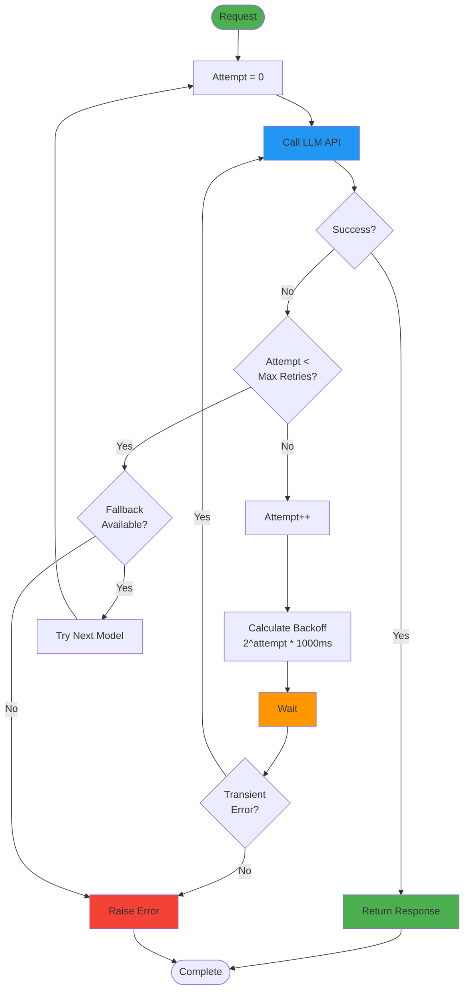

# LLM Integration

<div class="annotate" markdown>

**Enterprise-grade LLM integration with reliability patterns**

Connect to **18+ LLM providers** with intelligent fallbacks and monitoring across **400+ modules**

</div>

!!! success "Enterprise ML/AI"
    Part of **237 enterprise modules** with **14 ML/AI infrastructure features** including model gateway, prompt management, and A/B testing. See [Enterprise Documentation](enterprise.md).

---

## Quick Navigation

<div class="grid cards" markdown>

- :material-robot:{ .lg } **Supported Models**

    OpenAI, Anthropic, Azure, and more

    [:octicons-arrow-right-24: View Models](#key-classes)

- :material-shield-check:{ .lg } **Reliability**

    Circuit breakers and retry logic

    [:octicons-arrow-right-24: Learn More](#low-level-design-lld)

- :material-cached:{ .lg } **Caching**

    Response caching for performance

    [:octicons-arrow-right-24: Configure](#advanced-features)

- :material-book-open:{ .lg } **Examples**

    Integration patterns

    [:octicons-arrow-right-24: View Examples](#real-world-example)

</div>

## Overview

The `llms` module provides enterprise-grade integration with Large Language Models (LLMs) featuring reliability patterns, monitoring, and intelligent fallback mechanisms. It abstracts away the complexity of model management while providing advanced features like circuit breakers, retry logic, response caching, and performance tracking.

!!! tip "Enterprise ML/AI"

    The framework includes **14 ML/AI infrastructure modules** with LLM gateway, prompt management, model versioning, and A/B testing.

## :art: High-Level Design (HLD)

### LLM Integration Architecture



## :gear: Key Classes

### LLMManager

Enhanced LLM Manager with reliability and monitoring features.

**Constructor:**
```python
LLMManager(
    max_retries: int = 3, # Maximum retry attempts
    enable_caching: bool = True # Enable response caching
)
```

**Methods:**

- `register_model(name, inference_fn, metadata=None)` - Register an LLM model
- `set_active_model(name)` - Set the active model
- `set_fallback_chain(model_names)` - Configure fallback chain for model failures
- `generate(prompt, use_cache=True, **kwargs)` - Generate response with retry and fallback
- `clear_cache()` - Clear response cache
- `get_model_info(model_name)` - Get model information and statistics
- `get_metrics()` - Get overall performance metrics
- `reset_circuit_breaker(model_name)` - Manually reset circuit breaker
- `list_models()` - List all registered models

### CircuitBreaker

Circuit breaker pattern to prevent cascading failures.

**Constructor:**
```python
CircuitBreaker(
    failure_threshold: int = 5, # Failures before opening circuit
    recovery_timeout: int = 60 # Seconds before attempting recovery
)
```

**States:**
- `closed` - Normal operation
- `open` - Circuit tripped, blocking calls
- `half-open` - Testing if service recovered

**Methods:**
- `call(func, *args, **kwargs)` - Execute function with circuit breaker protection

#### Circuit Breaker State Machine



## :wrench: Low-Level Design (LLD)

### LLM Manager Class Diagram



### Request Flow with Fallback

```mermaid
sequenceDiagram
    participant App
    participant LLMMgr as LLM Manager
    participant Cache
    participant CB1 as Circuit Breaker<br/>(GPT-4)
    participant GPT4 as GPT-4 API
    participant CB2 as Circuit Breaker<br/>(Claude)
    participant Claude as Claude API
    participant Metrics

    App->>LLMMgr: generate(prompt)
    activate LLMMgr

    LLMMgr->>Cache: check(prompt)
    alt Cache Hit
        Cache-->>LLMMgr: cached_response
        LLMMgr->>Metrics: record_cache_hit()
        LLMMgr-->>App: return response
    else Cache Miss
        Cache-->>LLMMgr: None
        LLMMgr->>Metrics: record_cache_miss()

        LLMMgr->>CB1: call(gpt4_fn, prompt)
        activate CB1

        alt Circuit Closed
            CB1->>GPT4: generate(prompt)
            alt Success
                GPT4-->>CB1: response
                CB1->>CB1: record_success()
                CB1-->>LLMMgr: response
                LLMMgr->>Cache: store(prompt, response)
                LLMMgr->>Metrics: record_success("gpt-4")
                LLMMgr-->>App: return response
            else API Error
                GPT4-->>CB1: Error
                CB1->>CB1: record_failure()
                CB1-->>LLMMgr: CircuitBreakerError
                deactivate CB1

                Note over LLMMgr: Fallback to Claude
                LLMMgr->>Metrics: record_fallback("gpt-4", "claude")

                LLMMgr->>CB2: call(claude_fn, prompt)
                activate CB2
                CB2->>Claude: generate(prompt)
                Claude-->>CB2: response
                CB2->>CB2: record_success()
                CB2-->>LLMMgr: response
                deactivate CB2

                LLMMgr->>Cache: store(prompt, response)
                LLMMgr->>Metrics: record_success("claude")
                LLMMgr-->>App: return response
            end
        else Circuit Open
            CB1-->>LLMMgr: CircuitOpenError
            deactivate CB1
            Note over LLMMgr: Immediate fallback
            LLMMgr->>CB2: call(claude_fn, prompt)
            CB2->>Claude: generate(prompt)
            Claude-->>CB2: response
            CB2-->>LLMMgr: response
            LLMMgr-->>App: return response
        end
    end

    deactivate LLMMgr
```

## Basic Usage

### Registering and Using Models

```python
import logging

logger = logging.getLogger(__name__)

from agenticaiframework.llms import LLMManager

# Initialize LLM manager
llm_manager = LLMManager(
    max_retries=3,
    enable_caching=True
)

# Define model inference functions
def openai_gpt4(prompt: str, kwargs: dict) -> str:
    # Your OpenAI API call here
    return "Generated response from GPT-4"

def claude_opus(prompt: str, kwargs: dict) -> str:
    # Your Anthropic API call here
    return "Generated response from Claude"

# Register models with metadata
llm_manager.register_model(
    name="gpt-4",
    inference_fn=openai_gpt4,
    metadata={
        "provider": "openai",
        "max_tokens": 8192,
        "cost_per_1k_tokens": 0.03
    }
)

llm_manager.register_model(
    name="claude-opus",
    inference_fn=claude_opus,
    metadata={
        "provider": "anthropic",
        "max_tokens": 4096,
        "cost_per_1k_tokens": 0.015
    }
)

# Set active model
llm_manager.set_active_model("gpt-4")

# Generate response
response = llm_manager.generate(
    prompt="Explain quantum computing in simple terms.",
    temperature=0.7,
    max_tokens=500
)
logger.info(response)
```

### Configuring Fallback Chain

```python
# Set fallback chain for reliability
llm_manager.set_fallback_chain(["gpt-4", # Primary
    "claude-opus", # Fallback 1
    "gpt-3.5" # Fallback 2
])

# If gpt-4 fails, automatically tries claude-opus, then gpt-3.5
response = llm_manager.generate("Analyze this data...")
```

### Response Caching

```python
# Enable caching for repeated queries
llm_manager = LLMManager(enable_caching=True)

# First call - hits the API
response1 = llm_manager.generate("What is AI?", use_cache=True)

# Second call - returns cached response
response2 = llm_manager.generate("What is AI?", use_cache=True)

# Clear cache when needed
llm_manager.clear_cache()
```

### Retry Logic with Exponential Backoff



## Advanced Features

### Circuit Breaker Pattern

The circuit breaker prevents cascading failures by temporarily blocking calls to failing models:

```python
import logging

logger = logging.getLogger(__name__)

# Circuit breaker is automatic per model
llm_manager.register_model("unreliable-model", inference_fn)

# After 5 failures, circuit breaker opens
for i in range(10):
    try:
        response = llm_manager.generate("Test prompt")
    except Exception as e:
        logger.info(f"Request failed: {e}")

# Manually reset if needed
llm_manager.reset_circuit_breaker("unreliable-model")

# Check circuit breaker state
info = llm_manager.get_model_info("unreliable-model")
logger.info(f"Circuit breaker state: {info['circuit_breaker_state']}")
```

### Performance Monitoring

```python
import logging

logger = logging.getLogger(__name__)

# Get overall metrics
metrics = llm_manager.get_metrics()
logger.info(f"Total requests: {metrics['total_requests']}")
logger.info(f"Success rate: {metrics['success_rate']:.2%}")
logger.info(f"Cache hit rate: {metrics['cache_hit_rate']:.2%}")
logger.info(f"Total tokens: {metrics['total_tokens']}")
logger.info(f"Total retries: {metrics['total_retries']}")

# Get model-specific information
model_info = llm_manager.get_model_info("gpt-4")
logger.info(f"Requests: {model_info['stats']['requests']}")
logger.info(f"Successes: {model_info['stats']['successes']}")
logger.info(f"Failures: {model_info['stats']['failures']}")
logger.info(f"Average latency: {model_info['stats']['avg_latency']:.3f}s")
logger.info(f"Circuit state: {model_info['circuit_breaker_state']}")
```

### Retry with Exponential Backoff

Automatic retry with exponential backoff is built-in:

```python
# Configure retry attempts
llm_manager = LLMManager(max_retries=5)

# Automatic retry on failure with backoff:
# Attempt 1: immediate
# Attempt 2: wait 1s
# Attempt 3: wait 2s
# Attempt 4: wait 4s
# Attempt 5: wait 8s
response = llm_manager.generate("Process this request")
```

## Integration with Agents

```python
import logging

logger = logging.getLogger(__name__)

from agenticaiframework import Agent
from agenticaiframework.llms import LLMManager

# Create LLM manager
llm_manager = LLMManager()
llm_manager.register_model("gpt-4", openai_gpt4)
llm_manager.set_active_model("gpt-4")

# Create agent with LLM
agent = Agent(
    name="AIAssistant",
    role="General Assistant",
    capabilities=["conversation", "analysis"],
    config={"llm_manager": llm_manager}
)

# Agent can use LLM for reasoning
def agent_task(query: str):
    response = llm_manager.generate(
        prompt=f"As an AI assistant, respond to: {query}"
    )
    return response

agent.start()
result = agent.execute_task(agent_task, "What is machine learning?")
logger.info(result)
```

## Real-World Example

### Multi-Model System with Fallback

```python
import logging

logger = logging.getLogger(__name__)

from agenticaiframework.llms import LLMManager
import os

# Initialize manager
llm = LLMManager(max_retries=3, enable_caching=True)

# Register multiple providers
def openai_inference(prompt: str, kwargs: dict) -> str:
    import openai
    openai.api_key = os.getenv("OPENAI_API_KEY")
    response = openai.ChatCompletion.create(
        model="gpt-4",
        messages=[{"role": "user", "content": prompt}],
        **kwargs
    )
    return response.choices[0].message.content

def anthropic_inference(prompt: str, kwargs: dict) -> str:
    import anthropic
    client = anthropic.Anthropic(api_key=os.getenv("ANTHROPIC_API_KEY"))
    message = client.messages.create(
        model="claude-3-opus-20240229",
        max_tokens=kwargs.get("max_tokens", 1024),
        messages=[{"role": "user", "content": prompt}]
    )
    return message.content[0].text

# Register models
llm.register_model("gpt-4", openai_inference, {
    "provider": "openai",
    "max_tokens": 8192
})

llm.register_model("claude-opus", anthropic_inference, {
    "provider": "anthropic",
    "max_tokens": 4096
})

# Configure fallback
llm.set_active_model("gpt-4")
llm.set_fallback_chain(["gpt-4", "claude-opus"])

# Use with automatic fallback
response = llm.generate(
    prompt="Analyze the impact of AI on society",
    temperature=0.7,
    max_tokens=1000
)

# Monitor performance
metrics = llm.get_metrics()
logger.info(f"Success rate: {metrics['success_rate']:.2%}")
logger.info(f"Cache hit rate: {metrics['cache_hit_rate']:.2%}")
```

## Best Practices

### 1. Configure Fallback Chains

Always configure fallback models for production systems:

```python
llm.set_fallback_chain(["primary-model",
    "backup-model-1",
    "backup-model-2"
])
```

### 2. Enable Caching for Repeated Queries

```python
# Enable caching to reduce API calls
llm = LLMManager(enable_caching=True)

# Use cache for similar queries
response = llm.generate(prompt, use_cache=True)
```

### 3. Monitor Performance Metrics

```python
import logging

logger = logging.getLogger(__name__)

# Regularly check metrics
metrics = llm.get_metrics()
if metrics['success_rate'] < 0.95:
    logger.info("WARNING: Low success rate detected")
    # Take action (alert, fallback, etc.)
```

### 4. Handle Circuit Breaker States

```python
# Check circuit breaker before critical operations
info = llm.get_model_info("model-name")
if info['circuit_breaker_state'] == 'open':
    # Circuit is open, use alternative approach
    llm.reset_circuit_breaker("model-name")
```

### 5. Secure API Keys

```python
import os

# Never hardcode API keys
def secure_inference(prompt: str, kwargs: dict) -> str:
    api_key = os.getenv("API_KEY")
    if not api_key:
        raise ValueError("API key not configured")
    # Use api_key for inference
    return "response"
```

## Use Cases

- **Conversational AI agents** - Multi-turn conversations with context
- **Content generation** - Articles, summaries, creative writing
- **Code generation** - Automated code creation and completion
- **Data analysis** - Natural language queries on structured data
- **Document processing** - Extraction, summarization, translation
- **Customer support** - Automated response generation

## Related Documentation
- [Agents Module](agents.md) - Agent system integration
- [Prompts Module](prompts.md) - Prompt management and rendering
- [Security Module](security.md) - Securing LLM interactions
- [Monitoring Module](monitoring.md) - Performance tracking
- [Best Practices](best-practices.md) - Production recommendations
