---
tags:
  - mcp-tools
  - tools
  - integration
  - protocol
---

# 🔧 MCP Tools Module

<div class="annotate" markdown>

**Model Context Protocol integration for external systems**

Extend agent capabilities with standardized tool interfaces

</div>

## 🎯 Quick Navigation

<div class="grid cards" markdown>

-   :material-toolbox:{ .lg } **Tool Registry**
    
    Register and manage tools
    
    [:octicons-arrow-right-24: Learn More](#key-classes-and-functions)

-   :material-creation:{ .lg } **Create Tools**
    
    Build custom MCP tools
    
    [:octicons-arrow-right-24: Create](#example-usage)

-   :material-api:{ .lg } **Integrations**
    
    Connect to external APIs
    
    [:octicons-arrow-right-24: Integrate](#mcp-architecture)

-   :material-book-open:{ .lg } **Examples**
    
    Tool implementation patterns
    
    [:octicons-arrow-right-24: View Examples](#use-cases)

</div>

## 📖 Overview

!!! success "Enterprise Tools"
    
    MCP Tools work alongside **35+ built-in tools** and **18 enterprise integration connectors** for comprehensive capabilities.

!!! abstract "What is MCP?"
    
    Model Context Protocol (MCP) provides a standardized way for AI agents to interact with external systems, APIs, and resources. The MCP Tools module enables dynamic tool discovery and execution.

<div class="grid" markdown>

:material-puzzle:{ .lg } **Tool Definition**
:   Create reusable tool interfaces

:material-database:{ .lg } **Tool Registry**
:   Centralized tool management

:material-play:{ .lg } **Dynamic Execution**
:   Runtime tool invocation

:material-shield-check:{ .lg } **Validation**
:   Input/output validation

</div>

## 🏛️ MCP Architecture

```mermaid
graph TB
    subgraph "Agents"
        A1[Agent 1]
        A2[Agent 2]
        AN[Agent N]
    end
    
    subgraph "MCP Layer"
        REG[Tool Registry<br/>📚 Registry]
        EXE[Tool Executor<br/>▶️ Executor]
        VAL[Validator<br/>✔️ Validator]
    end
    
    subgraph "External Tools"
        API[APIs<br/>🌐 Weather, News]
        DB[Databases<br/>📦 SQL, NoSQL]
        SYS[System<br/>💻 File, Process]
        CUSTOM[Custom Tools<br/>🔧 Domain-Specific]
    end
    
    A1 & A2 & AN --> REG
    REG --> EXE
    EXE --> VAL
    VAL --> API & DB & SYS & CUSTOM
    
    style REG fill:#e3f2fd,stroke:#1976d2,stroke-width:2px
    style EXE fill:#f3e5f5,stroke:#7b1fa2,stroke-width:2px
    style VAL fill:#e8f5e9,stroke:#388e3c,stroke-width:2px
```



## Key Classes and Functions
- **MCPTool** — Base class for defining a new MCP tool.
- **ToolRegistry** — Manages registration and discovery of available tools.
- **execute_tool(name, **kwargs)** — Executes a registered tool by name.
- **list_tools()** — Returns a list of all available tools.
- **load_tools_from_config(config_path)** — Loads tool definitions from a configuration file.

## Example Usage
```python
from agenticaiframework.mcp_tools import MCPTool, ToolRegistry

# Define a custom tool
class WeatherTool(MCPTool):
    name = "get_weather"
    description = "Fetches weather information for a given city."

    def run(self, city: str):
        return f"Weather in {city}: Sunny, 25°C"

# Register the tool
registry = ToolRegistry()
registry.register(WeatherTool())

# Execute the tool
result = registry.execute_tool("get_weather", city="San Francisco")
print(result)
```

## Use Cases
- Integrating with external APIs (weather, finance, news, etc.).
- Automating system operations (file management, database queries).
- Extending AI agent capabilities with domain-specific tools.
- Enabling dynamic tool discovery and execution.

## Best Practices
- Keep tool interfaces simple and well-documented.
- Validate input parameters to prevent errors.
- Use secure authentication for tools that access sensitive data.
- Organize tools into logical categories for easier discovery.

## Related Documentation
- [Processes Module](processes.md)
- [Knowledge Module](knowledge.md)
- [Monitoring Module](monitoring.md)
