---
tags:
  - memory
  - core-modules
  - storage
  - retrieval
---

# Memory Module

The Memory module provides sophisticated memory management capabilities for AI agents, enabling them to store, retrieve, and organize information across different time scales and contexts. This module supports various memory types, persistence mechanisms, and intelligent retrieval strategies.

## Overview

The Memory module enables agents to:

- **Store Information**: Persist data across agent sessions and interactions
- **Retrieve Context**: Access relevant historical information for decision-making
- **Organize Knowledge**: Structure information hierarchically and semantically
- **Manage Capacity**: Handle memory limits and optimize storage usage
- **Share Context**: Enable memory sharing between agents when appropriate
- **Learn Patterns**: Identify and remember important behavioral patterns

## Core Components

### MemoryEntry Class

The `MemoryEntry` class represents a single memory item with metadata and TTL support.

#### Constructor

```python
MemoryEntry(
    key: str,
    value: Any,
    ttl: int = None,
    priority: int = 0,
    metadata: Dict[str, Any] = None
)
```

**Parameters:**

- **`key`** *(str)*: Unique identifier for the memory entry
- **`value`** *(Any)*: The data to store
- **`ttl`** *(int)*: Time-to-live in seconds (None for no expiration)
- **`priority`** *(int)*: Priority level for eviction (higher = more important)
- **`metadata`** *(Dict[str, Any])*: Additional metadata

### MemoryManager Class

The `MemoryManager` provides multi-tier memory storage with automatic consolidation.

#### Constructor

```python
MemoryManager(
    short_term_limit: int = 100,
    long_term_limit: int = 1000,
    enable_logging: bool = True
)
```

**Parameters:**

- **`short_term_limit`** *(int)*: Maximum items in short-term memory (default: 100)
- **`long_term_limit`** *(int)*: Maximum items in long-term memory (default: 1000)
- **`enable_logging`** *(bool)*: Enable logging of memory operations

#### Core Methods

```python
def store(key: str, value: Any, memory_type: str = "short_term", 
          ttl: int = None, priority: int = 0, metadata: Dict[str, Any] = None) -> None
def retrieve(key: str) -> Any
def search(query: str) -> List[Dict[str, Any]]
def consolidate() -> None
def get_stats() -> Dict[str, Any]
def clear_short_term() -> None
def clear_long_term() -> None
def clear_external() -> None
def clear_all() -> None
```

### MemoryManager Class

The `MemoryManager` orchestrates multiple memory instances and provides advanced memory operations.

#### Key Methods

```python
def create_memory(name: str, config: Dict[str, Any]) -> Memory
def get_memory(name: str) -> Optional[Memory]
def list_memories() -> List[str]
def transfer_memory(source: str, target: str, keys: List[str]) -> None
def backup_memory(name: str, backup_path: str) -> None
def restore_memory(name: str, backup_path: str) -> None
```


## :art: Low-Level Design (LLD)

### Memory Architecture

!!! info "Multi-Tier Memory System"
    
    The memory system uses a three-tier architecture for optimal performance:


### Memory Class Diagram


### Memory Consolidation Flow


### Memory Retrieval Strategy

```mermaid
sequenceDiagram
    participant App
    participant MemMgr as Memory Manager
    participant Cache
    participant STM as Short-Term
    participant LTM as Long-Term
    participant EXT as External
    participant Index as Search Index
    
    App->>MemMgr: retrieve(key)
    activate MemMgr
    
    MemMgr->>Cache: check(key)
    alt Cache Hit
        Cache-->>MemMgr: value
        MemMgr-->>App: return value
    else Cache Miss
        Cache-->>MemMgr: None
        
        MemMgr->>STM: retrieve(key)
        alt STM Hit
            STM-->>MemMgr: value
            MemMgr->>Cache: store(key, value)
            MemMgr-->>App: return value
        else STM Miss
            STM-->>MemMgr: None
            
            MemMgr->>LTM: retrieve(key)
            alt LTM Hit
                LTM-->>MemMgr: value
                MemMgr->>Cache: store(key, value)
                MemMgr->>STM: promote(key, value)
                MemMgr-->>App: return value
            else LTM Miss
                LTM-->>MemMgr: None
                
                MemMgr->>EXT: retrieve(key)
                alt EXT Hit
                    EXT-->>MemMgr: value
                    MemMgr->>LTM: store(key, value)
                    MemMgr->>Cache: store(key, value)
                    MemMgr-->>App: return value
                else Not Found
                    EXT-->>MemMgr: None
                    MemMgr-->>App: KeyNotFound
                end
            end
        end
    end
    
    deactivate MemMgr
```



## Memory Types

### Short-Term Memory

Short-term memory stores temporary information with automatic expiration.

```python
from agenticaiframework.memory import Memory

# Create short-term memory
short_term = Memory(
    capacity=1000,
    memory_type="short_term",
    persistence=False
)

# Store with TTL (time to live)
short_term.store("current_task", "data_processing", ttl=3600)  # 1 hour
short_term.store("user_context", {"name": "Alice", "session": "abc123"}, ttl=1800)  # 30 minutes

# Retrieve while valid
task = short_term.retrieve("current_task")
print(f"Current task: {task}")

# Automatic cleanup of expired items
short_term.cleanup()
```

### Long-Term Memory

Long-term memory provides persistent storage for important information.

```python
# Create long-term memory with persistence
long_term = Memory(
    capacity=50000,
    memory_type="long_term",
    persistence=True,
    storage_path="/data/agent_memory"
)

# Store important information
long_term.store(
    "user_preferences",
    {
        "language": "english",
        "timezone": "UTC-8",
        "communication_style": "formal"
    },
    tags=["user", "preferences", "config"]
)

# Store learned patterns
long_term.store(
    "successful_strategies",
    {
        "data_processing": ["parallel_approach", "batch_size_100"],
        "user_interaction": ["clarify_ambiguity", "provide_examples"]
    },
    tags=["learning", "strategies", "optimization"]
)

# Retrieve with semantic search
strategies = long_term.search("data processing optimization")
```

### Working Memory

Working memory combines short-term and long-term memory for active processing.

```python
class WorkingMemory(Memory):
    def __init__(self, short_term_capacity: int = 100, long_term_capacity: int = 10000):
        self.short_term = Memory(capacity=short_term_capacity, memory_type="short_term")
        self.long_term = Memory(
            capacity=long_term_capacity,
            memory_type="long_term",
            persistence=True
        )
        self.active_context = {}
    
    def store_context(self, key: str, value: Any, importance: float = 0.5):
        """Store context based on importance"""
        if importance > 0.8:
            # High importance -> long-term storage
            self.long_term.store(key, value, tags=["important", "context"])
        else:
            # Lower importance -> short-term storage
            self.short_term.store(key, value, ttl=3600)
    
    def get_active_context(self, max_items: int = 20):
        """Get most relevant context for current processing"""
        recent_items = []
        
        # Get recent short-term items
        for key in self.short_term.keys():
            value = self.short_term.retrieve(key)
            if value:
                recent_items.append({"key": key, "value": value, "source": "short_term"})
        
        # Get relevant long-term items
        if len(recent_items) < max_items:
            remaining = max_items - len(recent_items)
            long_term_items = self.long_term.search("recent context", limit=remaining)
            recent_items.extend(long_term_items)
        
        return recent_items[:max_items]

# Usage
working_memory = WorkingMemory()

# Store different types of information
working_memory.store_context("current_user", "Alice", importance=0.9)
working_memory.store_context("temporary_calculation", 42, importance=0.3)
working_memory.store_context("learned_pattern", "user_prefers_detailed_explanations", importance=0.8)

# Get active context for processing
context = working_memory.get_active_context()
```

## Advanced Memory Features

### Semantic Search

```python
class SemanticMemory(Memory):
    def __init__(self, **kwargs):
        super().__init__(**kwargs)
        self.embeddings = {}
        self.index = None
    
    def store_with_embedding(self, key: str, value: Any, embedding: List[float] = None):
        """Store item with semantic embedding"""
        self.store(key, value)
        
        if embedding:
            self.embeddings[key] = embedding
        else:
            # Generate embedding (simplified - would use actual embedding model)
            self.embeddings[key] = self.generate_embedding(str(value))
        
        self.update_index()
    
    def semantic_search(self, query: str, limit: int = 10, similarity_threshold: float = 0.7):
        """Search using semantic similarity"""
        query_embedding = self.generate_embedding(query)
        
        similarities = []
        for key, embedding in self.embeddings.items():
            similarity = self.calculate_similarity(query_embedding, embedding)
            if similarity >= similarity_threshold:
                similarities.append({
                    "key": key,
                    "value": self.retrieve(key),
                    "similarity": similarity
                })
        
        # Sort by similarity and return top results
        similarities.sort(key=lambda x: x["similarity"], reverse=True)
        return similarities[:limit]
    
    def generate_embedding(self, text: str) -> List[float]:
        """Generate text embedding (simplified implementation)"""
        # In real implementation, would use transformer models or embedding APIs
        import hashlib
        hash_value = int(hashlib.md5(text.encode()).hexdigest(), 16)
        # Convert to normalized vector
        vector_size = 128
        embedding = [(hash_value >> i) & 1 for i in range(vector_size)]
        return [float(x) for x in embedding]
    
    def calculate_similarity(self, embedding1: List[float], embedding2: List[float]) -> float:
        """Calculate cosine similarity between embeddings"""
        import math
        
        dot_product = sum(a * b for a, b in zip(embedding1, embedding2))
        magnitude1 = math.sqrt(sum(a * a for a in embedding1))
        magnitude2 = math.sqrt(sum(a * a for a in embedding2))
        
        if magnitude1 == 0 or magnitude2 == 0:
            return 0.0
        
        return dot_product / (magnitude1 * magnitude2)

# Usage
semantic_memory = SemanticMemory(capacity=5000)

# Store information with semantic capabilities
semantic_memory.store_with_embedding(
    "python_best_practices",
    "Use descriptive variable names, follow PEP 8, write unit tests"
)

semantic_memory.store_with_embedding(
    "javascript_optimization",
    "Minimize DOM manipulation, use event delegation, optimize loops"
)

# Search semantically
results = semantic_memory.semantic_search("coding guidelines", limit=5)
for result in results:
    print(f"Found: {result['key']} (similarity: {result['similarity']:.2f})")
```

### Hierarchical Memory

```python
class HierarchicalMemory:
    def __init__(self):
        self.levels = {
            "immediate": Memory(capacity=50, memory_type="short_term"),
            "recent": Memory(capacity=500, memory_type="short_term"),
            "important": Memory(capacity=5000, memory_type="long_term", persistence=True),
            "learned": Memory(capacity=10000, memory_type="long_term", persistence=True)
        }
        self.promotion_rules = {
            "immediate_to_recent": lambda item: item.get("access_count", 0) > 3,
            "recent_to_important": lambda item: item.get("importance_score", 0) > 0.8,
            "important_to_learned": lambda item: item.get("validation_count", 0) > 5
        }
    
    def store(self, key: str, value: Any, level: str = "immediate", metadata: Dict = None):
        """Store item at specified memory level"""
        if level not in self.levels:
            level = "immediate"
        
        # Prepare item with metadata
        item = {
            "value": value,
            "timestamp": time.time(),
            "access_count": 0,
            "importance_score": 0.5,
            "validation_count": 0,
            **(metadata or {})
        }
        
        self.levels[level].store(key, item)
    
    def retrieve(self, key: str) -> Any:
        """Retrieve item from any level, promoting if necessary"""
        # Search all levels
        for level_name, memory in self.levels.items():
            item = memory.retrieve(key)
            if item:
                # Update access count
                item["access_count"] = item.get("access_count", 0) + 1
                item["last_accessed"] = time.time()
                
                # Store updated item
                memory.store(key, item)
                
                # Check for promotion
                self.check_promotion(key, item, level_name)
                
                return item["value"]
        
        return None
    
    def check_promotion(self, key: str, item: Dict, current_level: str):
        """Check if item should be promoted to higher level"""
        level_order = ["immediate", "recent", "important", "learned"]
        current_index = level_order.index(current_level)
        
        if current_index < len(level_order) - 1:
            next_level = level_order[current_index + 1]
            promotion_rule = f"{current_level}_to_{next_level}"
            
            if promotion_rule in self.promotion_rules:
                if self.promotion_rules[promotion_rule](item):
                    # Promote to next level
                    self.levels[next_level].store(key, item)
                    print(f"Promoted {key} from {current_level} to {next_level}")
    
    def consolidate_memory(self):
        """Consolidate memory across levels"""
        # Move frequently accessed items up
        for level_name, memory in self.levels.items():
            for key in list(memory.keys()):
                item = memory.retrieve(key)
                if item:
                    self.check_promotion(key, item, level_name)
        
        # Clean up expired items
        for memory in self.levels.values():
            memory.cleanup()

# Usage
hierarchical_memory = HierarchicalMemory()

# Store at different levels
hierarchical_memory.store("temp_calculation", 42, level="immediate")
hierarchical_memory.store("user_preference", "detailed_explanations", level="recent", 
                         metadata={"importance_score": 0.9})
hierarchical_memory.store("proven_strategy", "batch_processing_optimal", level="important")

# Retrieve and promote through access
result = hierarchical_memory.retrieve("user_preference")  # Will increase access count

# Consolidate memory periodically
hierarchical_memory.consolidate_memory()
```

### Memory Compression

```python
import json
import gzip

class CompressedMemory(Memory):
    def __init__(self, compression_threshold: int = 1000, **kwargs):
        super().__init__(**kwargs)
        self.compression_threshold = compression_threshold
        self.compressed_items = {}
    
    def store(self, key: str, value: Any, **kwargs):
        """Store with automatic compression for large items"""
        serialized = json.dumps(value)
        
        if len(serialized) > self.compression_threshold:
            # Compress large items
            compressed_data = gzip.compress(serialized.encode('utf-8'))
            self.compressed_items[key] = True
            super().store(key, compressed_data, **kwargs)
        else:
            # Store normally
            super().store(key, value, **kwargs)
    
    def retrieve(self, key: str) -> Any:
        """Retrieve with automatic decompression"""
        data = super().retrieve(key)
        
        if key in self.compressed_items:
            # Decompress
            decompressed = gzip.decompress(data).decode('utf-8')
            return json.loads(decompressed)
        else:
            return data
    
    def get_compression_stats(self):
        """Get compression statistics"""
        total_items = self.size
        compressed_items = len(self.compressed_items)
        
        return {
            "total_items": total_items,
            "compressed_items": compressed_items,
            "compression_ratio": compressed_items / max(1, total_items),
            "compression_threshold": self.compression_threshold
        }

# Usage
compressed_memory = CompressedMemory(compression_threshold=500)

# Store large data structure (will be compressed)
large_data = {"data": [i for i in range(1000)], "metadata": "large dataset"}
compressed_memory.store("large_dataset", large_data)

# Store small data (will not be compressed)
small_data = {"status": "active", "count": 5}
compressed_memory.store("small_data", small_data)

# Retrieve works transparently
retrieved_large = compressed_memory.retrieve("large_dataset")
retrieved_small = compressed_memory.retrieve("small_data")

# Check compression stats
stats = compressed_memory.get_compression_stats()
print(f"Compression ratio: {stats['compression_ratio']:.2%}")
```

## Memory Persistence

### File-Based Persistence

```python
import json
import os
from pathlib import Path

class PersistentMemory(Memory):
    def __init__(self, storage_path: str, auto_save: bool = True, **kwargs):
        super().__init__(**kwargs)
        self.storage_path = Path(storage_path)
        self.auto_save = auto_save
        self.load_from_disk()
    
    def load_from_disk(self):
        """Load memory from disk"""
        if self.storage_path.exists():
            try:
                with open(self.storage_path, 'r') as f:
                    data = json.load(f)
                    for key, value in data.items():
                        super().store(key, value)
                print(f"Loaded {len(data)} items from {self.storage_path}")
            except Exception as e:
                print(f"Error loading memory: {e}")
    
    def save_to_disk(self):
        """Save memory to disk"""
        try:
            # Ensure directory exists
            self.storage_path.parent.mkdir(parents=True, exist_ok=True)
            
            # Prepare data for serialization
            data = {}
            for key in self.data.keys():
                value = super().retrieve(key)
                if self.is_serializable(value):
                    data[key] = value
            
            # Save to file
            with open(self.storage_path, 'w') as f:
                json.dump(data, f, indent=2, default=self.json_serializer)
            
            print(f"Saved {len(data)} items to {self.storage_path}")
            
        except Exception as e:
            print(f"Error saving memory: {e}")
    
    def store(self, key: str, value: Any, **kwargs):
        """Store with automatic save"""
        super().store(key, value, **kwargs)
        if self.auto_save:
            self.save_to_disk()
    
    def is_serializable(self, obj):
        """Check if object is JSON serializable"""
        try:
            json.dumps(obj, default=self.json_serializer)
            return True
        except (TypeError, ValueError):
            return False
    
    def json_serializer(self, obj):
        """Custom JSON serializer for complex objects"""
        if hasattr(obj, '__dict__'):
            return obj.__dict__
        elif hasattr(obj, 'isoformat'):  # datetime objects
            return obj.isoformat()
        else:
            return str(obj)

# Usage
persistent_memory = PersistentMemory(
    storage_path="/data/agent_memory.json",
    auto_save=True,
    capacity=10000
)

# Store data (automatically saved)
persistent_memory.store("configuration", {"version": "1.0", "features": ["nlp", "vision"]})
persistent_memory.store("user_history", [{"action": "query", "timestamp": "2024-01-01"}])

# Memory persists across sessions
```

### Database Persistence

```python
import sqlite3
import pickle
from typing import Optional

class DatabaseMemory(Memory):
    def __init__(self, db_path: str, table_name: str = "memory", **kwargs):
        super().__init__(persistence=True, **kwargs)
        self.db_path = db_path
        self.table_name = table_name
        self.init_database()
        self.load_from_database()
    
    def init_database(self):
        """Initialize database table"""
        with sqlite3.connect(self.db_path) as conn:
            conn.execute(f'''
                CREATE TABLE IF NOT EXISTS {self.table_name} (
                    key TEXT PRIMARY KEY,
                    value BLOB,
                    timestamp REAL,
                    ttl INTEGER,
                    tags TEXT,
                    access_count INTEGER DEFAULT 0
                )
            ''')
            conn.commit()
    
    def load_from_database(self):
        """Load memory from database"""
        with sqlite3.connect(self.db_path) as conn:
            cursor = conn.execute(f'SELECT key, value FROM {self.table_name}')
            for key, value_blob in cursor.fetchall():
                try:
                    value = pickle.loads(value_blob)
                    super().store(key, value)
                except Exception as e:
                    print(f"Error loading key {key}: {e}")
    
    def store(self, key: str, value: Any, ttl: int = None, tags: List[str] = None, **kwargs):
        """Store in both memory and database"""
        super().store(key, value, ttl=ttl, tags=tags, **kwargs)
        
        # Store in database
        value_blob = pickle.dumps(value)
        tags_str = json.dumps(tags) if tags else None
        
        with sqlite3.connect(self.db_path) as conn:
            conn.execute(f'''
                INSERT OR REPLACE INTO {self.table_name} 
                (key, value, timestamp, ttl, tags, access_count) 
                VALUES (?, ?, ?, ?, ?, 0)
            ''', (key, value_blob, time.time(), ttl, tags_str))
            conn.commit()
    
    def retrieve(self, key: str) -> Any:
        """Retrieve and update access count"""
        value = super().retrieve(key)
        
        if value is not None:
            # Update access count in database
            with sqlite3.connect(self.db_path) as conn:
                conn.execute(f'''
                    UPDATE {self.table_name} 
                    SET access_count = access_count + 1 
                    WHERE key = ?
                ''', (key,))
                conn.commit()
        
        return value
    
    def cleanup(self):
        """Cleanup expired items from both memory and database"""
        super().cleanup()
        
        # Cleanup database
        with sqlite3.connect(self.db_path) as conn:
            current_time = time.time()
            conn.execute(f'''
                DELETE FROM {self.table_name} 
                WHERE ttl IS NOT NULL AND timestamp + ttl < ?
            ''', (current_time,))
            conn.commit()
    
    def get_memory_analytics(self):
        """Get comprehensive memory analytics"""
        with sqlite3.connect(self.db_path) as conn:
            cursor = conn.execute(f'''
                SELECT 
                    COUNT(*) as total_items,
                    AVG(access_count) as avg_access_count,
                    MAX(access_count) as max_access_count,
                    COUNT(CASE WHEN tags IS NOT NULL THEN 1 END) as tagged_items
                FROM {self.table_name}
            ''')
            stats = cursor.fetchone()
            
            return {
                "total_items": stats[0],
                "average_access_count": stats[1],
                "max_access_count": stats[2],
                "tagged_items": stats[3],
                "database_path": self.db_path
            }

# Usage
db_memory = DatabaseMemory(db_path="/data/agent_memory.db")

# Store with tags and TTL
db_memory.store(
    "user_session",
    {"user_id": "12345", "preferences": {"theme": "dark"}},
    ttl=3600,
    tags=["session", "user", "temporary"]
)

# Get analytics
analytics = db_memory.get_memory_analytics()
print(f"Memory contains {analytics['total_items']} items")
```

## Memory Sharing and Synchronization

### Shared Memory

```python
import threading
from typing import Dict, Set

class SharedMemory:
    def __init__(self):
        self.memories: Dict[str, Memory] = {}
        self.access_permissions: Dict[str, Set[str]] = {}
        self.lock = threading.RLock()
    
    def create_shared_memory(self, name: str, config: Dict[str, Any], allowed_agents: List[str] = None):
        """Create shared memory accessible by specified agents"""
        with self.lock:
            memory = Memory(**config)
            self.memories[name] = memory
            self.access_permissions[name] = set(allowed_agents or [])
            return memory
    
    def grant_access(self, memory_name: str, agent_name: str):
        """Grant access to specific agent"""
        with self.lock:
            if memory_name in self.access_permissions:
                self.access_permissions[memory_name].add(agent_name)
    
    def revoke_access(self, memory_name: str, agent_name: str):
        """Revoke access from specific agent"""
        with self.lock:
            if memory_name in self.access_permissions:
                self.access_permissions[memory_name].discard(agent_name)
    
    def access_memory(self, memory_name: str, agent_name: str) -> Optional[Memory]:
        """Get memory if agent has access"""
        with self.lock:
            if (memory_name in self.memories and 
                agent_name in self.access_permissions.get(memory_name, set())):
                return self.memories[memory_name]
            return None
    
    def synchronize_memories(self, source_name: str, target_name: str, keys: List[str] = None):
        """Synchronize data between memories"""
        with self.lock:
            source = self.memories.get(source_name)
            target = self.memories.get(target_name)
            
            if source and target:
                if keys:
                    # Sync specific keys
                    for key in keys:
                        value = source.retrieve(key)
                        if value is not None:
                            target.store(key, value)
                else:
                    # Sync all keys
                    for key in source.keys():
                        value = source.retrieve(key)
                        target.store(key, value)

# Usage
shared_mem = SharedMemory()

# Create shared memory for team collaboration
team_memory = shared_mem.create_shared_memory(
    "team_knowledge",
    {"capacity": 5000, "persistence": True},
    allowed_agents=["agent_1", "agent_2", "agent_3"]
)

# Agent accesses shared memory
agent_memory = shared_mem.access_memory("team_knowledge", "agent_1")
if agent_memory:
    agent_memory.store("shared_insight", "parallel processing is optimal for large datasets")
```

### Memory Federation

```python
class MemoryFederation:
    def __init__(self):
        self.nodes: Dict[str, Memory] = {}
        self.replication_rules = {}
        self.sync_schedule = {}
    
    def add_node(self, name: str, memory: Memory, replication_factor: int = 1):
        """Add memory node to federation"""
        self.nodes[name] = memory
        self.replication_rules[name] = replication_factor
    
    def federated_store(self, key: str, value: Any, primary_node: str = None, **kwargs):
        """Store data across federated nodes"""
        if primary_node and primary_node in self.nodes:
            # Store in primary node
            self.nodes[primary_node].store(key, value, **kwargs)
            
            # Replicate based on replication factor
            replication_factor = self.replication_rules.get(primary_node, 1)
            if replication_factor > 1:
                replica_nodes = self.select_replica_nodes(primary_node, replication_factor - 1)
                for node_name in replica_nodes:
                    self.nodes[node_name].store(f"replica_{key}", value, **kwargs)
        else:
            # Store in all nodes
            for node_name, memory in self.nodes.items():
                memory.store(key, value, **kwargs)
    
    def federated_retrieve(self, key: str, preferred_nodes: List[str] = None) -> Any:
        """Retrieve data from federated nodes"""
        search_nodes = preferred_nodes or list(self.nodes.keys())
        
        for node_name in search_nodes:
            if node_name in self.nodes:
                # Try direct key
                value = self.nodes[node_name].retrieve(key)
                if value is not None:
                    return value
                
                # Try replica key
                replica_value = self.nodes[node_name].retrieve(f"replica_{key}")
                if replica_value is not None:
                    return replica_value
        
        return None
    
    def select_replica_nodes(self, primary_node: str, count: int) -> List[str]:
        """Select nodes for replication"""
        available_nodes = [name for name in self.nodes.keys() if name != primary_node]
        return available_nodes[:count]
    
    def synchronize_federation(self):
        """Synchronize data across all nodes"""
        all_keys = set()
        
        # Collect all keys from all nodes
        for memory in self.nodes.values():
            all_keys.update(memory.keys())
        
        # Sync each key
        for key in all_keys:
            if not key.startswith("replica_"):
                primary_value = None
                primary_node = None
                
                # Find the most recent version
                for node_name, memory in self.nodes.items():
                    value = memory.retrieve(key)
                    if value is not None:
                        primary_value = value
                        primary_node = node_name
                        break
                
                # Replicate to other nodes if needed
                if primary_value is not None:
                    self.federated_store(key, primary_value, primary_node)

# Usage
federation = MemoryFederation()

# Add nodes with different replication factors
federation.add_node("primary", Memory(capacity=10000), replication_factor=3)
federation.add_node("backup1", Memory(capacity=5000), replication_factor=1)
federation.add_node("backup2", Memory(capacity=5000), replication_factor=1)

# Store with replication
federation.federated_store("critical_data", {"important": "information"}, primary_node="primary")

# Retrieve from federated memory
data = federation.federated_retrieve("critical_data")
```

## Integration with Other Modules

### Agent Memory Integration

```python
from agenticaiframework.agents import Agent

class MemoryEnabledAgent(Agent):
    def __init__(self, name: str, role: str, capabilities: List[str], config: Dict):
        super().__init__(name, role, capabilities, config)
        
        # Initialize different memory types
        self.working_memory = WorkingMemory()
        self.long_term_memory = PersistentMemory(
            storage_path=f"/data/{name}_memory.json",
            capacity=10000
        )
        self.semantic_memory = SemanticMemory(capacity=5000)
        
        # Load existing memories
        self.load_agent_memories()
    
    def load_agent_memories(self):
        """Load agent-specific memories"""
        # Load previous configurations
        config = self.long_term_memory.retrieve("agent_config")
        if config:
            self.config.update(config)
        
        # Load learned behaviors
        behaviors = self.long_term_memory.retrieve("learned_behaviors")
        if behaviors:
            self.learned_behaviors = behaviors
    
    def remember(self, key: str, value: Any, memory_type: str = "working", **kwargs):
        """Store information in appropriate memory"""
        if memory_type == "working":
            importance = kwargs.get("importance", 0.5)
            self.working_memory.store_context(key, value, importance)
        elif memory_type == "long_term":
            self.long_term_memory.store(key, value, **kwargs)
        elif memory_type == "semantic":
            self.semantic_memory.store_with_embedding(key, value)
    
    def recall(self, key: str, memory_type: str = None) -> Any:
        """Retrieve information from memory"""
        if memory_type == "working":
            return self.working_memory.short_term.retrieve(key) or \
                   self.working_memory.long_term.retrieve(key)
        elif memory_type == "long_term":
            return self.long_term_memory.retrieve(key)
        elif memory_type == "semantic":
            return self.semantic_memory.retrieve(key)
        else:
            # Search all memories
            for memory in [self.working_memory.short_term, 
                          self.working_memory.long_term,
                          self.long_term_memory]:
                result = memory.retrieve(key)
                if result is not None:
                    return result
            return None
    
    def search_memories(self, query: str, limit: int = 10):
        """Search across all memories"""
        results = []
        
        # Search semantic memory
        semantic_results = self.semantic_memory.semantic_search(query, limit=limit//2)
        results.extend(semantic_results)
        
        # Search long-term memory
        long_term_results = self.long_term_memory.search(query, limit=limit//2)
        results.extend(long_term_results)
        
        return results[:limit]
    
    def consolidate_memories(self):
        """Consolidate memories across types"""
        # Move important working memory to long-term
        active_context = self.working_memory.get_active_context()
        for item in active_context:
            if item.get("importance", 0) > 0.8:
                self.long_term_memory.store(
                    item["key"],
                    item["value"],
                    tags=["consolidated", "important"]
                )
        
        # Update learned behaviors
        self.remember(
            "learned_behaviors",
            getattr(self, "learned_behaviors", {}),
            memory_type="long_term"
        )
    
    def execute_with_memory(self, task_callable, *args, **kwargs):
        """Execute task with memory context"""
        # Retrieve relevant context
        context = self.working_memory.get_active_context()
        
        # Execute with context
        result = self.execute_task(task_callable, context, *args, **kwargs)
        
        # Remember the execution
        self.remember(
            f"execution_{task_callable.__name__}_{int(time.time())}",
            {
                "result": result,
                "args": str(args),
                "kwargs": str(kwargs),
                "timestamp": time.time()
            },
            memory_type="working",
            importance=0.6
        )
        
        return result

# Usage
memory_agent = MemoryEnabledAgent(
    name="MemoryBot",
    role="Knowledge Management Assistant",
    capabilities=["memory_management", "information_retrieval"],
    config={"memory_consolidation_interval": 3600}
)

# Agent uses memory during operations
memory_agent.remember("user_preference", "detailed_explanations", memory_type="long_term")
memory_agent.remember("current_task", "data_analysis", memory_type="working", importance=0.7)

# Agent recalls information
preference = memory_agent.recall("user_preference")
task = memory_agent.recall("current_task")

# Agent searches memories
search_results = memory_agent.search_memories("user preferences and settings")

# Periodic memory consolidation
memory_agent.consolidate_memories()
```

## Best Practices

### Memory Design Principles

1. **Appropriate Storage**: Use the right memory type for the right data
2. **Efficient Retrieval**: Implement indexing and search capabilities
3. **Memory Hygiene**: Regular cleanup and consolidation
4. **Privacy Awareness**: Respect data sensitivity and access controls
5. **Performance Optimization**: Balance storage needs with retrieval speed

### Memory Optimization

```python
class OptimizedMemory(Memory):
    def __init__(self, **kwargs):
        super().__init__(**kwargs)
        self.access_patterns = {}
        self.optimization_enabled = True
    
    def retrieve(self, key: str) -> Any:
        """Optimized retrieval with pattern tracking"""
        result = super().retrieve(key)
        
        if self.optimization_enabled and result is not None:
            # Track access patterns
            self.access_patterns[key] = self.access_patterns.get(key, 0) + 1
            
            # Optimize frequently accessed items
            if self.access_patterns[key] > 10:
                self.optimize_item(key, result)
        
        return result
    
    def optimize_item(self, key: str, value: Any):
        """Optimize frequently accessed items"""
        # Move to faster storage tier
        # Precompute expensive operations
        # Cache serialized forms
        pass
    
    def get_access_statistics(self):
        """Get memory access statistics"""
        total_accesses = sum(self.access_patterns.values())
        most_accessed = max(self.access_patterns.items(), key=lambda x: x[1]) if self.access_patterns else ("None", 0)
        
        return {
            "total_accesses": total_accesses,
            "unique_keys_accessed": len(self.access_patterns),
            "most_accessed_key": most_accessed[0],
            "most_accessed_count": most_accessed[1],
            "access_patterns": dict(sorted(self.access_patterns.items(), key=lambda x: x[1], reverse=True)[:10])
        }
```

### Error Handling and Recovery

```python
class ResilientMemory(Memory):
    def __init__(self, backup_interval: int = 3600, **kwargs):
        super().__init__(**kwargs)
        self.backup_interval = backup_interval
        self.last_backup = time.time()
        self.error_count = 0
        self.max_errors = 10
    
    def store(self, key: str, value: Any, **kwargs):
        """Store with error handling and automatic backup"""
        try:
            super().store(key, value, **kwargs)
            self.check_backup_needed()
        except Exception as e:
            self.handle_error(e, "store", key=key, value=value)
    
    def retrieve(self, key: str) -> Any:
        """Retrieve with error handling"""
        try:
            return super().retrieve(key)
        except Exception as e:
            self.handle_error(e, "retrieve", key=key)
            return None
    
    def handle_error(self, error: Exception, operation: str, **context):
        """Handle memory errors"""
        self.error_count += 1
        
        print(f"Memory error in {operation}: {error}")
        print(f"Context: {context}")
        
        if self.error_count >= self.max_errors:
            print("Too many memory errors, initiating emergency backup")
            self.emergency_backup()
    
    def check_backup_needed(self):
        """Check if backup is needed"""
        if time.time() - self.last_backup > self.backup_interval:
            self.create_backup()
    
    def create_backup(self):
        """Create memory backup"""
        try:
            backup_data = {}
            for key in self.keys():
                backup_data[key] = self.retrieve(key)
            
            backup_path = f"/backup/memory_backup_{int(time.time())}.json"
            with open(backup_path, 'w') as f:
                json.dump(backup_data, f, default=str)
            
            self.last_backup = time.time()
            print(f"Memory backup created: {backup_path}")
            
        except Exception as e:
            print(f"Backup failed: {e}")
    
    def emergency_backup(self):
        """Emergency backup and reset"""
        self.create_backup()
        self.error_count = 0
        print("Emergency backup completed, error count reset")
```

## Troubleshooting

### Common Issues

1. **Memory Leaks**: Monitor memory usage and implement proper cleanup
2. **Performance Degradation**: Use indexing and optimize access patterns
3. **Data Corruption**: Implement validation and backup strategies
4. **Concurrency Issues**: Use proper locking and thread-safe operations

### Debugging Tools

```python
class DebuggableMemory(Memory):
    def __init__(self, debug_mode: bool = False, **kwargs):
        super().__init__(**kwargs)
        self.debug_mode = debug_mode
        self.operation_log = []
    
    def store(self, key: str, value: Any, **kwargs):
        if self.debug_mode:
            self.log_operation("store", key=key, value_type=type(value).__name__)
        super().store(key, value, **kwargs)
    
    def retrieve(self, key: str) -> Any:
        result = super().retrieve(key)
        if self.debug_mode:
            self.log_operation("retrieve", key=key, found=result is not None)
        return result
    
    def log_operation(self, operation: str, **details):
        log_entry = {
            "operation": operation,
            "timestamp": time.time(),
            **details
        }
        self.operation_log.append(log_entry)
        
        # Keep log size manageable
        if len(self.operation_log) > 1000:
            self.operation_log = self.operation_log[-500:]
    
    def get_debug_info(self):
        return {
            "total_operations": len(self.operation_log),
            "recent_operations": self.operation_log[-10:],
            "memory_stats": self.get_stats()
        }
```

This comprehensive Memory module documentation provides all the tools and patterns needed to implement sophisticated memory management in AI agents, from basic storage to advanced features like semantic search, persistence, and federation.
        self.data = {}

    def store(self, key, value):
        self.data[key] = value
        self._save()

    def retrieve(self, key):
        return self.data.get(key)

    def clear(self):
        self.data.clear()
        self._save()

    def _save(self):
        with open(self.storage_path, "w") as f:
            f.write(str(self.data))
```


## Best Practices

- Use in-memory storage for short-lived agents.
- Use persistent storage for long-running agents or when data must survive restarts.
- Avoid storing sensitive data unless encrypted.


## Related Documentation
- [Agents Module](agents.md)
- [Hub Module](hub.md)
- [Processes Module](processes.md)
