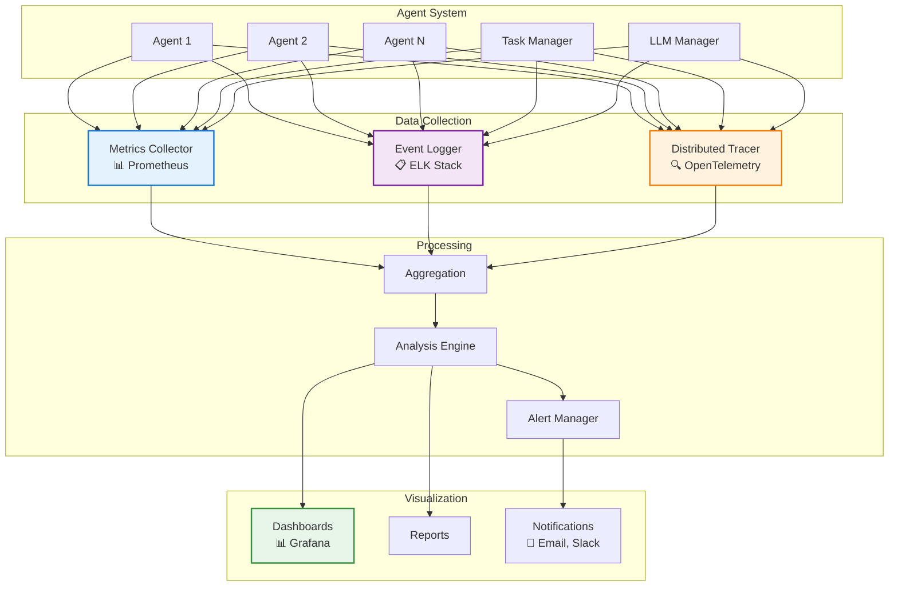

---
tags:
  - monitoring
  - observability
  - metrics
  - logging
---

# 📊 Monitoring Module

<div class="annotate" markdown>

**Production-grade observability for AI agent systems**

Track, log, and analyze performance with comprehensive monitoring

</div>

## 🎯 Quick Navigation

<div class="grid cards" markdown>

-   :material-chart-line:{ .lg } **Metrics**
    
    Performance and usage tracking
    
    [:octicons-arrow-right-24: View Metrics](#metrics-collection)

-   :material-text-box:{ .lg } **Logging**
    
    Structured event logging
    
    [:octicons-arrow-right-24: Configure](#event-logging)

-   :material-bell-alert:{ .lg } **Alerts**
    
    Automated alerting system
    
    [:octicons-arrow-right-24: Setup](#alerts)

-   :material-chart-timeline:{ .lg } **Tracing**
    
    Distributed tracing
    
    [:octicons-arrow-right-24: Learn More](#distributed-tracing)

</div>

## 📖 Overview

!!! abstract "What is the Monitoring Module?"
    
    The Monitoring module provides comprehensive tools for tracking, logging, and analyzing the performance and behavior of AI agents. It enables developers to observe system health, detect anomalies, and optimize workflows.

<div class="grid" markdown>

:material-speedometer:{ .lg } **Performance Metrics**
:   Track latency, throughput, and resource usage

:material-file-document:{ .lg } **Event Logging**
:   Record agent decisions and actions

:material-bell:{ .lg } **Alerting**
:   Automated notifications for critical events

:material-chart-box:{ .lg } **Analytics**
:   Visualize trends and patterns

</div>

## 🏛️ Monitoring Architecture



## Key Classes and Functions
- **Monitor** — Base class for implementing custom monitoring logic.
- **MetricsCollector** — Collects and stores performance metrics.
- **EventLogger** — Logs significant events and actions taken by agents.
- **alert_on_condition(condition, message)** — Sends alerts when specific conditions are met.
- **generate_report()** — Produces a summary report of monitored metrics.

## Example Usage
```python
from agenticaiframework.monitoring import MetricsCollector, EventLogger

# Initialize monitoring tools
metrics = MetricsCollector()
logger = EventLogger()

# Record metrics
metrics.record("response_time", 120)  # in milliseconds

# Log events
logger.log("Agent started processing request.")

# Generate a report
report = metrics.generate_report()
print(report)
```

## Use Cases
- Tracking API response times and error rates.
- Logging agent decisions for auditing.
- Detecting performance degradation over time.
- Sending alerts for critical system failures.

## Best Practices
- Use consistent metric names for easier aggregation.
- Store logs securely and ensure they are tamper-proof.
- Set up automated alerts for high-priority issues.
- Regularly review monitoring data to identify optimization opportunities.

## Related Documentation
- [Guardrails Module](guardrails.md)
- [Processes Module](processes.md)
- [Tasks Module](tasks.md)
