---
tags:
  - orchestration
  - supervision
  - teams
  - patterns
  - coordination
---

# 🎭 Orchestration

<div class="annotate" markdown>

**Agent coordination and orchestration patterns**

Sequential, parallel, hierarchical orchestration with Erlang/OTP-style supervision

</div>

## 🎯 Quick Navigation

<div class="grid cards" markdown>

-   :material-transit-connection-variant:{ .lg } **Patterns**
    
    Orchestration patterns
    
    [:octicons-arrow-right-24: Learn](#orchestration-patterns)

-   :material-shield-check:{ .lg } **Supervision**
    
    Agent supervision
    
    [:octicons-arrow-right-24: Supervise](#agent-supervisor)

-   :material-account-group:{ .lg } **Teams**
    
    Agent collaboration
    
    [:octicons-arrow-right-24: Collaborate](#agent-teams)

-   :material-engine:{ .lg } **Engine**
    
    Central orchestration
    
    [:octicons-arrow-right-24: Execute](#orchestration-engine)

</div>

## 📊 Overview

!!! abstract "Orchestration Framework"
    
    The Orchestration module provides powerful patterns for coordinating multiple agents, including sequential pipelines, parallel execution, hierarchical delegation, and fault-tolerant supervision.

### Architecture

```mermaid
graph TB
    subgraph "Orchestration Engine"
        ENGINE[OrchestrationEngine<br/>🎛️ Central Control]
    end
    
    subgraph "Patterns"
        SEQ[Sequential<br/>➡️]
        PAR[Parallel<br/>⇉]
        HIER[Hierarchical<br/>🏛️]
        CHOR[Choreography<br/>🎭]
    end
    
    subgraph "Supervision"
        SUP[AgentSupervisor<br/>👁️]
        RESTART[Restart Strategy]
        ESCALATE[Escalation]
    end
    
    subgraph "Teams"
        TEAM[AgentTeam<br/>👥]
        ROLE[Role Assignment]
        HANDOFF[Agent Handoff]
    end
    
    subgraph "Agents"
        A1[Agent 1]
        A2[Agent 2]
        A3[Agent 3]
        A4[Agent 4]
    end
    
    ENGINE --> SEQ & PAR & HIER & CHOR
    SEQ & PAR & HIER --> SUP
    SUP --> TEAM
    TEAM --> A1 & A2 & A3 & A4
    
    style ENGINE fill:#e3f2fd,stroke:#1976d2
    style SUP fill:#fff3e0,stroke:#f57c00
    style TEAM fill:#e8f5e9,stroke:#43a047
```



---

## 🔄 Orchestration Patterns

Define how agents coordinate and communicate.

### Sequential Pattern

```python
from agenticaiframework.orchestration import (
    OrchestrationPattern,
    SequentialOrchestration
)

# Create sequential pipeline
pipeline = SequentialOrchestration(
    name="document_processing",
    steps=[
        {"agent": "extractor", "input_key": "document"},
        {"agent": "analyzer", "input_key": "extracted_data"},
        {"agent": "summarizer", "input_key": "analysis"},
        {"agent": "formatter", "input_key": "summary"}
    ]
)

# Execute pipeline
result = await pipeline.execute(
    input_data={"document": document_content}
)
```

### Parallel Pattern

```python
from agenticaiframework.orchestration import ParallelOrchestration

# Execute agents in parallel
parallel = ParallelOrchestration(
    name="multi_analysis",
    branches=[
        {"agent": "sentiment_analyzer", "input_key": "text"},
        {"agent": "entity_extractor", "input_key": "text"},
        {"agent": "topic_classifier", "input_key": "text"}
    ],
    aggregator="result_merger"  # Optional agent to merge results
)

# All branches execute simultaneously
results = await parallel.execute(
    input_data={"text": input_text}
)
# results = {"sentiment": ..., "entities": ..., "topics": ...}
```

### Hierarchical Pattern

```python
from agenticaiframework.orchestration import HierarchicalOrchestration

# Create hierarchical delegation
hierarchy = HierarchicalOrchestration(
    name="research_team",
    root_agent="research_director",
    delegation_rules=[
        {
            "parent": "research_director",
            "children": ["data_researcher", "web_researcher"],
            "condition": "task.requires_research"
        },
        {
            "parent": "research_director",
            "children": ["analyst", "writer"],
            "condition": "task.requires_report"
        }
    ]
)

# Director delegates to appropriate children
result = await hierarchy.execute(
    input_data={"task": "Research AI trends and write report"}
)
```

### Choreography Pattern

```python
from agenticaiframework.orchestration import ChoreographyOrchestration

# Event-driven choreography
choreography = ChoreographyOrchestration(
    name="order_processing",
    agents=["order_validator", "inventory_checker", "payment_processor", "shipper"],
    event_handlers={
        "order.received": "order_validator",
        "order.validated": "inventory_checker",
        "inventory.confirmed": "payment_processor",
        "payment.processed": "shipper"
    }
)

# Agents react to events
await choreography.emit_event("order.received", order_data)
```

---

## 👁️ Agent Supervisor

Erlang/OTP-style fault-tolerant supervision.

### Basic Usage

```python
from agenticaiframework.orchestration import (
    AgentSupervisor,
    SupervisionStrategy,
    RestartPolicy
)

# Create supervisor
supervisor = AgentSupervisor(
    name="agent_pool_supervisor",
    strategy=SupervisionStrategy.ONE_FOR_ONE,
    restart_policy=RestartPolicy(
        max_restarts=5,
        within_seconds=60
    )
)

# Add agents to supervise
supervisor.add_child("worker_1", worker_agent_1)
supervisor.add_child("worker_2", worker_agent_2)
supervisor.add_child("worker_3", worker_agent_3)

# Start supervision
await supervisor.start()
```

### Supervision Strategies

```python
from agenticaiframework.orchestration import SupervisionStrategy

# ONE_FOR_ONE: Restart only failed agent
SupervisionStrategy.ONE_FOR_ONE

# ONE_FOR_ALL: Restart all agents if one fails
SupervisionStrategy.ONE_FOR_ALL

# REST_FOR_ONE: Restart failed and all started after it
SupervisionStrategy.REST_FOR_ONE

# SIMPLE_ONE_FOR_ONE: Dynamic child management
SupervisionStrategy.SIMPLE_ONE_FOR_ONE
```

### Restart Policies

```python
from agenticaiframework.orchestration import RestartPolicy, RestartType

# Configure restart behavior
policy = RestartPolicy(
    type=RestartType.PERMANENT,  # Always restart
    max_restarts=5,              # Max restart attempts
    within_seconds=60,           # Time window
    backoff_type="exponential",  # Backoff strategy
    initial_delay_ms=100,        # Initial delay
    max_delay_ms=30000           # Max delay
)

# Restart types
RestartType.PERMANENT   # Always restart
RestartType.TRANSIENT   # Restart only on abnormal exit
RestartType.TEMPORARY   # Never restart
```

### Handling Failures

```python
# Custom failure handler
@supervisor.on_failure
async def handle_agent_failure(
    agent_name: str,
    error: Exception,
    restart_count: int
):
    print(f"Agent {agent_name} failed: {error}")
    
    if restart_count > 3:
        # Escalate to human
        await notify_operator(agent_name, error)
    
    # Return True to allow restart, False to stop
    return restart_count < 5

# Escalation handler
@supervisor.on_max_restarts
async def handle_max_restarts(agent_name: str):
    print(f"Max restarts reached for {agent_name}")
    await supervisor.remove_child(agent_name)
    await deploy_replacement_agent(agent_name)
```

### Supervisor Trees

```python
# Hierarchical supervision
root_supervisor = AgentSupervisor(
    name="root",
    strategy=SupervisionStrategy.ONE_FOR_ONE
)

# Child supervisors
processing_supervisor = AgentSupervisor(
    name="processing",
    strategy=SupervisionStrategy.ONE_FOR_ALL
)
processing_supervisor.add_child("parser", parser_agent)
processing_supervisor.add_child("transformer", transformer_agent)

io_supervisor = AgentSupervisor(
    name="io",
    strategy=SupervisionStrategy.ONE_FOR_ONE
)
io_supervisor.add_child("reader", reader_agent)
io_supervisor.add_child("writer", writer_agent)

# Add child supervisors to root
root_supervisor.add_supervisor("processing", processing_supervisor)
root_supervisor.add_supervisor("io", io_supervisor)

await root_supervisor.start()
```

---

## 👥 Agent Teams

Collaborative agent teams with role assignment.

### Basic Usage

```python
from agenticaiframework.orchestration import (
    AgentTeam,
    AgentRole,
    TeamConfig
)

# Create team
team = AgentTeam(
    name="research_team",
    config=TeamConfig(
        max_members=5,
        communication_style="structured",
        decision_making="consensus"
    )
)

# Define roles
researcher_role = AgentRole(
    name="researcher",
    description="Conducts research and gathers information",
    capabilities=["web_search", "document_analysis"],
    max_agents=2
)

analyst_role = AgentRole(
    name="analyst",
    description="Analyzes data and provides insights",
    capabilities=["data_analysis", "visualization"],
    max_agents=1
)

writer_role = AgentRole(
    name="writer",
    description="Creates reports and documentation",
    capabilities=["writing", "formatting"],
    max_agents=1
)

# Add roles to team
team.add_role(researcher_role)
team.add_role(analyst_role)
team.add_role(writer_role)
```

### Assign Agents to Roles

```python
# Assign agents to roles
team.assign_agent(research_agent_1, role="researcher")
team.assign_agent(research_agent_2, role="researcher")
team.assign_agent(analyst_agent, role="analyst")
team.assign_agent(writer_agent, role="writer")

# Or auto-assign based on capabilities
team.auto_assign_agents([
    research_agent_1,
    research_agent_2,
    analyst_agent,
    writer_agent
])
```

### Team Execution

```python
# Execute team task
result = await team.execute_task(
    task="Research AI trends and create comprehensive report",
    coordinator="researcher"  # Lead agent
)

# With workflow
result = await team.execute_workflow(
    workflow=[
        {"role": "researcher", "action": "gather_data"},
        {"role": "analyst", "action": "analyze_data"},
        {"role": "writer", "action": "create_report"}
    ],
    input_data={"topic": "AI trends 2024"}
)
```

### Agent Handoffs

```python
from agenticaiframework.orchestration import AgentHandoff

# Define handoff rules
team.configure_handoffs([
    AgentHandoff(
        from_role="researcher",
        to_role="analyst",
        trigger="research_complete",
        data_transform=lambda data: {"research_data": data}
    ),
    AgentHandoff(
        from_role="analyst",
        to_role="writer",
        trigger="analysis_complete",
        data_transform=lambda data: {"analysis": data}
    )
])

# Handoffs happen automatically during execution
```

### Team Communication

```python
# Enable team communication
team.enable_communication(
    channel="team_chat",
    protocol="structured"
)

# Agents can communicate
@researcher_agent.on_message
async def handle_message(msg):
    if msg.type == "question":
        response = await generate_response(msg.content)
        await team.broadcast(
            from_agent="researcher",
            message=response
        )

# Team discussions
discussion = await team.discuss(
    topic="Should we include prediction models?",
    participants=["analyst", "writer"],
    max_rounds=3
)
```

---

## 🎛️ Orchestration Engine

Central orchestration control.

### Basic Usage

```python
from agenticaiframework.orchestration import (
    OrchestrationEngine,
    EngineConfig
)

# Create engine
engine = OrchestrationEngine(
    config=EngineConfig(
        max_concurrent_workflows=100,
        default_timeout_seconds=300,
        enable_tracing=True
    )
)

# Register agents
engine.register_agent("classifier", classifier_agent)
engine.register_agent("processor", processor_agent)
engine.register_agent("responder", responder_agent)

# Register patterns
engine.register_pattern("sequential", sequential_pattern)
engine.register_pattern("parallel", parallel_pattern)
```

### Execute Workflows

```python
# Define workflow
workflow = {
    "name": "customer_support",
    "steps": [
        {
            "id": "classify",
            "agent": "classifier",
            "input": {"message": "$input.message"}
        },
        {
            "id": "process",
            "agent": "processor",
            "input": {"category": "$classify.category"},
            "condition": "$classify.category != 'spam'"
        },
        {
            "id": "respond",
            "agent": "responder",
            "input": {
                "category": "$classify.category",
                "processed": "$process.result"
            }
        }
    ]
}

# Execute
result = await engine.execute(
    workflow=workflow,
    input_data={"message": "Help with my order"}
)
```

### Dynamic Routing

```python
# Configure dynamic routing
engine.configure_routing(
    rules=[
        {
            "condition": "input.priority == 'high'",
            "pattern": "parallel",
            "agents": ["fast_processor", "backup_processor"]
        },
        {
            "condition": "input.type == 'complex'",
            "pattern": "hierarchical",
            "root": "coordinator"
        },
        {
            "condition": "default",
            "pattern": "sequential",
            "agents": ["standard_processor"]
        }
    ]
)

# Routing happens automatically
result = await engine.execute(
    input_data={"priority": "high", "task": "urgent_analysis"}
)
```

### Workflow State Management

```python
# Long-running workflows with state persistence
workflow_id = await engine.start_workflow(
    workflow=workflow,
    input_data=data,
    persist_state=True
)

# Check status
status = await engine.get_workflow_status(workflow_id)
print(f"Status: {status.state}")
print(f"Current step: {status.current_step}")
print(f"Progress: {status.progress}%")

# Resume workflow
await engine.resume_workflow(workflow_id)

# Cancel workflow
await engine.cancel_workflow(workflow_id, reason="User requested")
```

---

## 🎯 Complete Example

```python
from agenticaiframework import Agent
from agenticaiframework.orchestration import (
    OrchestrationEngine,
    AgentSupervisor,
    AgentTeam,
    SequentialOrchestration,
    ParallelOrchestration,
    SupervisionStrategy,
    AgentRole,
    RestartPolicy
)

# Create specialized agents
classifier = Agent(
    name="Classifier",
    model="gpt-4o-mini",
    instructions="Classify incoming requests"
)

researcher = Agent(
    name="Researcher",
    model="gpt-4",
    instructions="Research topics thoroughly"
)

analyst = Agent(
    name="Analyst",
    model="gpt-4",
    instructions="Analyze data and provide insights"
)

writer = Agent(
    name="Writer",
    model="gpt-4",
    instructions="Write clear, concise reports"
)

reviewer = Agent(
    name="Reviewer",
    model="gpt-4",
    instructions="Review and improve content"
)

# Set up supervision
supervisor = AgentSupervisor(
    name="research_supervisor",
    strategy=SupervisionStrategy.ONE_FOR_ONE,
    restart_policy=RestartPolicy(max_restarts=3, within_seconds=60)
)
supervisor.add_child("researcher", researcher)
supervisor.add_child("analyst", analyst)

# Create team
research_team = AgentTeam(name="research_team")
research_team.add_role(AgentRole(name="researcher", max_agents=2))
research_team.add_role(AgentRole(name="analyst", max_agents=1))
research_team.add_role(AgentRole(name="writer", max_agents=1))
research_team.assign_agent(researcher, role="researcher")
research_team.assign_agent(analyst, role="analyst")
research_team.assign_agent(writer, role="writer")

# Create orchestration engine
engine = OrchestrationEngine()

# Register components
engine.register_agent("classifier", classifier)
engine.register_team("research_team", research_team)
engine.register_agent("reviewer", reviewer)
engine.register_supervisor("supervisor", supervisor)

# Define complex workflow
research_workflow = {
    "name": "comprehensive_research",
    "steps": [
        {
            "id": "classify",
            "agent": "classifier",
            "input": {"request": "$input.query"}
        },
        {
            "id": "research",
            "team": "research_team",
            "input": {
                "topic": "$input.query",
                "category": "$classify.category"
            },
            "workflow": [
                {"role": "researcher", "action": "gather_info"},
                {"role": "analyst", "action": "analyze"},
                {"role": "writer", "action": "draft"}
            ]
        },
        {
            "id": "review",
            "agent": "reviewer",
            "input": {"draft": "$research.draft"},
            "max_iterations": 2
        }
    ]
}

# Execute
async def run_research(query: str):
    # Start supervisor
    await supervisor.start()
    
    try:
        result = await engine.execute(
            workflow=research_workflow,
            input_data={"query": query}
        )
        return result
    finally:
        await supervisor.stop()

# Usage
result = await run_research(
    "Analyze the impact of AI on healthcare in 2024"
)
print(f"Final Report:\n{result['review']['final_report']}")
```

---

## 📋 Pattern Selection Guide

| Use Case | Pattern | When to Use |
|----------|---------|-------------|
| **Pipeline** | Sequential | Linear data transformation |
| **Multi-source** | Parallel | Independent data gathering |
| **Complex tasks** | Hierarchical | Delegation and sub-tasks |
| **Event-driven** | Choreography | Reactive systems |
| **Fault-tolerance** | Supervision | Production reliability |
| **Collaboration** | Teams | Multi-agent cooperation |

---

## 🎯 Best Practices

!!! tip "Orchestration Guidelines"
    
    1. **Start simple** - Begin with sequential, add complexity as needed
    2. **Use supervision** - Always supervise production agents
    3. **Define clear roles** - Explicit role definitions improve team performance
    4. **Handle failures** - Plan for agent failures and retries
    5. **Monitor workflows** - Enable tracing for visibility

!!! warning "Common Pitfalls"
    
    - Avoid circular dependencies in hierarchical patterns
    - Set appropriate timeouts for parallel execution
    - Don't over-complicate simple workflows
    - Test failure scenarios in development

---

## 📚 Related Documentation

- [Agents](agents.md) - Agent configuration
- [Processes](processes.md) - Process management
- [Communication](communication.md) - Agent communication
- [Monitoring](monitoring.md) - Workflow monitoring
