---
tags:
  - processes
  - workflows
  - orchestration
  - multi-agent
---

# 🔄 Processes Module

<div class="annotate" markdown>

**Orchestrate multi-agent workflows with powerful coordination patterns**

Sequential, hierarchical, consensus, and parallel execution

</div>

## 🎯 Quick Navigation

<div class="grid cards" markdown>

-   :material-format-list-numbered:{ .lg } **Sequential**
    
    Execute tasks one after another
    
    [:octicons-arrow-right-24: Learn More](#process-architecture)

-   :material-file-tree:{ .lg } **Hierarchical**
    
    Manager-worker coordination
    
    [:octicons-arrow-right-24: Learn More](#key-functions)

-   :material-vote:{ .lg } **Consensus**
    
    Vote and decide together
    
    [:octicons-arrow-right-24: Learn More](#example-usage)

-   :material-flash:{ .lg } **Parallel**
    
    Run tasks concurrently
    
    [:octicons-arrow-right-24: Learn More](#use-cases)

</div>

## 📖 Overview

!!! abstract "What are Processes?"
    
    Processes define how multiple agents coordinate and execute workflows. The framework supports four powerful orchestration patterns:

<div class="grid" markdown>

:material-format-list-numbered:{ .lg } **Sequential Process**
:   Tasks execute one after another in a defined order

:material-file-tree:{ .lg } **Hierarchical Process**
:   Manager agent delegates tasks to worker agents

:material-vote:{ .lg } **Consensus Process**
:   Multiple agents vote or reach agreement on decisions

:material-flash:{ .lg } **Parallel Process**
:   Tasks execute simultaneously for maximum throughput

</div>

## 🏛️ Process Architecture

```mermaid
graph TB
    subgraph "Process Types"
        SEQ[Sequential<br/>🔢 One by One]
        HIE[Hierarchical<br/>🏛️ Manager-Worker]
        CON[Consensus<br/>🗳️ Vote & Decide]
        PAR[Parallel<br/>⚡ All Together]
    end
    
    subgraph "Use Cases"
        U1[Pipeline Processing]
        U2[Team Coordination]
        U3[Decision Making]
        U4[Bulk Operations]
    end
    
    SEQ --> U1
    HIE --> U2
    CON --> U3
    PAR --> U4
    
    style SEQ fill:#e3f2fd,stroke:#1976d2,stroke-width:2px
    style HIE fill:#f3e5f5,stroke:#7b1fa2,stroke-width:2px
    style CON fill:#fff3e0,stroke:#f57c00,stroke-width:2px
    style PAR fill:#e8f5e9,stroke:#388e3c,stroke-width:2px
```




## Key Functions

### `run_process(name, params)`
Run a registered process by name with the given parameters.

### `run_process_async(func)`
Run a process asynchronously, useful for I/O-bound or long-running tasks.


## Example Usage

### Running a Synchronous Process
```python
from agenticaiframework.processes import run_process

def greet():
    return "Hello, World!"

result = run_process(greet)
print(result)  # Output: Hello, World!
```

### Running an Asynchronous Process
```python
import asyncio
from agenticaiframework.processes import run_process_async

async def async_task():
    return "Completed async task"

result = asyncio.run(run_process_async(async_task))
print(result)
```


## Use Cases

- **Data Processing Pipelines** — Chain multiple processes for ETL workflows.
- **Parallel Execution** — Run multiple processes concurrently.
- **Background Tasks** — Offload long-running tasks to asynchronous processes.


## Best Practices

- Keep processes modular and reusable.
- Avoid blocking operations in asynchronous processes.
- Use descriptive names for registered processes.


## Related Documentation
- [Hub Module](hub.md)
- [Agents Module](agents.md)
- [Memory Module](memory.md)
