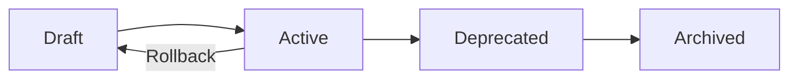

# Prompts

<div class="annotate" markdown>

**Comprehensive prompt management with security and versioning**

Create, manage, and render safe prompts for LLMs across **400+ modules**

</div>

!!! success "Enterprise ML/AI"
    Part of **237 enterprise modules** with **14 ML/AI infrastructure features** including prompt versioning and A/B testing. See [Enterprise Documentation](enterprise.md).

---

## Quick Navigation

<div class="grid cards" markdown>

- :material-file-document-edit:{ .lg } **Templates**

    Create reusable prompt templates

    [:octicons-arrow-right-24: Create](#core-components)

- :material-shield-lock:{ .lg } **Security**

    Injection detection and sanitization

    [:octicons-arrow-right-24: Secure](#best-practices)

- :material-source-branch:{ .lg } **Versioning**

    Full lifecycle version control

    [:octicons-arrow-right-24: Manage](#prompt-versioning)

- :material-library:{ .lg } **Library**

    Reusable prompt components

    [:octicons-arrow-right-24: Browse](#promptlibrary)

</div>

## Overview

!!! tip "Enterprise ML/AI"

    Prompt management is part of **14 ML/AI infrastructure modules** including LLM gateway, model versioning, and A/B testing.

!!! abstract "What is the Prompts Module?"

    The Prompts module provides comprehensive prompt management with security features, version control, and safe rendering for Large Language Models (LLMs).

<div class="grid" markdown>

:material-code-braces:{ .lg } **Template Variables**
: Dynamic placeholder substitution

:material-shield-alert:{ .lg } **Injection Prevention**
: Detect and block prompt injections

:material-tag-multiple:{ .lg } **Metadata Support**
: Tags, descriptions, and versioning

:material-history:{ .lg } **Version History**
: Track prompt changes over time

</div>

## Core Components

### Prompt Class

The `Prompt` class represents a prompt template with security and versioning features.

#### Constructor

```python
Prompt(
    template: str,
    metadata: dict[str, Any] = None,
    enable_security: bool = True
)
```

**Parameters:**

- **`template`** *(str)*: The prompt template with `{variable}` placeholders
- **`metadata`** *(dict[str, Any])*: Additional metadata (tags, description, etc.)
- **`enable_security`** *(bool)*: Enable injection detection and sanitization

#### Methods

```python
def render(**kwargs) -> str
def render_safe(**kwargs) -> str
def update_template(new_template: str) -> None
```

**Example:**

```python
import logging

logger = logging.getLogger(__name__)

from agenticaiframework.prompts import Prompt

# Create a prompt with security enabled
prompt = Prompt(
    template="Hello {name}, your task is: {task}",
    metadata={"category": "greeting", "version": "1.0"},
    enable_security=True
)

# Render with variables
result = prompt.render(name="Alice", task="analyze data")
logger.info(result)

# Safe rendering with automatic sanitization
safe_result = prompt.render_safe(
    name="Bob",
    task="<script>alert('xss')</script>"
)
logger.info(safe_result) # Script tags removed
```

### PromptManager Class

The `PromptManager` manages a collection of prompts with security and versioning.

#### Constructor

```python
PromptManager(enable_security: bool = True)
```

#### Key Methods

```python
def register_prompt(prompt: Prompt) -> None
def get_prompt(prompt_id: str) -> Prompt | None
def render_prompt(prompt_id: str, **kwargs) -> str
def list_prompts() -> list[str]
def delete_prompt(prompt_id: str) -> None
```

**Example:**

```python
import logging

logger = logging.getLogger(__name__)

from agenticaiframework.prompts import Prompt, PromptManager

# Create manager with security enabled
manager = PromptManager(enable_security=True)

# Register multiple prompts
greeting_prompt = Prompt(
    template="Welcome {user}! How can I help you today?",
    metadata={"type": "greeting"}
)
manager.register_prompt(greeting_prompt)

task_prompt = Prompt(
    template="Task: {task}\nContext: {context}\nOutput format: {format}",
    metadata={"type": "task"}
)
manager.register_prompt(task_prompt)

# Render by ID
result = manager.render_prompt(
    greeting_prompt.id,
    user="Alice"
)
logger.info(result)

# List all prompts
prompts = manager.list_prompts()
logger.info(f"Registered prompts: {len(prompts)}")
```

---

## Prompt Versioning

The Prompt Versioning module provides enterprise-grade version control for prompts with semantic versioning, lifecycle management, and full audit trails.

### PromptVersionManager

Manages versioned prompts with full lifecycle support.

```python
import logging

logger = logging.getLogger(__name__)

from agenticaiframework.prompt_versioning import (
    PromptVersionManager,
    PromptVersion,
    PromptStatus,
    prompt_version_manager
)

# Create manager with persistent storage
manager = PromptVersionManager(storage_path="/path/to/prompts")

# Create a new prompt (starts at v1.0.0)
prompt = manager.create_prompt(
    name="customer_support",
    template="Hello {customer_name}, I'm here to help with {issue}. {instructions}",
    created_by="admin",
    tags=["support", "customer-facing"]
)

logger.info(f"Created: {prompt.name} v{prompt.version}") # v1.0.0
```

#### Version Lifecycle



#### Creating New Versions

```python
import logging

logger = logging.getLogger(__name__)

# Create a new version with semantic versioning
new_version = manager.create_version(
    prompt_id=prompt.prompt_id,
    template="Hi {customer_name}! I'll assist you with {issue}. {instructions}",
    version_bump="minor", # major, minor, or patch
    created_by="developer",
    changelog="Improved greeting tone"
)

logger.info(f"New version: v{new_version.version}") # v1.1.0
```

#### Activation and Rollback

```python
import logging

logger = logging.getLogger(__name__)

# Activate a version (makes it the default)
manager.activate(
    prompt_id=prompt.prompt_id,
    version="1.1.0",
    activated_by="admin"
)

# Rollback to a previous version
rolled_back = manager.rollback(
    prompt_id=prompt.prompt_id,
    target_version="1.0.0",
    rolled_back_by="admin"
)
logger.info(f"Rolled back, new version: v{rolled_back.version}") # v1.1.1
```

#### Rendering Prompts

```python
# Render the active version
result = manager.render(
    prompt_id=prompt.prompt_id,
    variables={
        "customer_name": "Alice",
        "issue": "billing",
        "instructions": "I'll look into this right away."
    }
)

# Render a specific version
result_v1 = manager.render(
    prompt_id=prompt.prompt_id,
    variables={"customer_name": "Bob", "issue": "shipping", "instructions": ""},
    version="1.0.0"
)
```

#### Audit Trail

```python
import logging

logger = logging.getLogger(__name__)

# Get audit log for a prompt
audit_log = manager.get_audit_log(prompt_id=prompt.prompt_id, limit=50)

for entry in audit_log:
    logger.info(f"{entry['action']} by {entry['actor']} at {entry['timestamp']}")
```

### PromptLibrary

Library for reusable prompt components with template inheritance.

```python
from agenticaiframework.prompt_versioning import PromptLibrary, prompt_library

# Register reusable components
prompt_library.register_component(
    name="system_header",
    content="You are a helpful AI assistant. Be concise and accurate.",
    category="system",
    description="Standard system message header"
)

prompt_library.register_component(
    name="safety_footer",
    content="Remember: Never share sensitive information. If unsure, ask for clarification.",
    category="safety",
    description="Safety guidelines footer"
)

prompt_library.register_component(
    name="code_assistant_base",
    content="You are a coding assistant specializing in {language}. {context}",
    category="code",
    description="Base template for code assistants"
)
```

#### Composing Prompts

```python
# Compose multiple components
full_prompt = prompt_library.compose(
    components=["system_header", "code_assistant_base", "safety_footer"],
    separator="\n\n"
)
```

#### Template Inheritance

```python
# Extend a base component
python_prompt = prompt_library.extend(
    base_component="code_assistant_base",
    extensions={
        "replace_language": "Python",
        "replace_context": "Focus on clean, PEP8-compliant code.",
        "suffix": "Include type hints where appropriate."
    }
)
```

#### Search and Discovery

```python
# Search components
results = prompt_library.search("code")

# List by category
code_components = prompt_library.list_by_category("code")

# Get all categories
categories = prompt_library.get_categories()
```

### PromptStatus Enum

| Status | Description |
|--------|-------------|
| `DRAFT` | Newly created, not yet activated |
| `ACTIVE` | Currently in use (default for rendering) |
| `DEPRECATED` | Replaced by newer version |
| `ARCHIVED` | No longer in use |

---

## Use Cases
- Creating consistent prompts for chatbots and virtual assistants.
- Dynamically generating prompts based on user input or context.
- Optimizing prompts for specific LLM providers.
- Managing large prompt libraries for enterprise applications.
- **Version-controlled prompt updates with rollback capability.**
- **A/B testing different prompt versions.**
- **Audit compliance for regulated industries.**

## Best Practices
- Keep prompts concise and clear to avoid ambiguity.
- Use placeholders for dynamic values to improve reusability.
- Test prompts with different LLMs to ensure compatibility.
- Store prompts in version-controlled files for maintainability.
- **Use semantic versioning: major for breaking changes, minor for features, patch for fixes.**
- **Always add changelog messages when creating new versions.**
- **Use PromptLibrary for reusable components to ensure consistency.**

## Related Documentation
- [LLMs Module](llms.md)
- [Knowledge Module](knowledge.md)
- [Agents Module](agents.md)
- [Evaluation Module](evaluation.md) - A/B testing prompts
