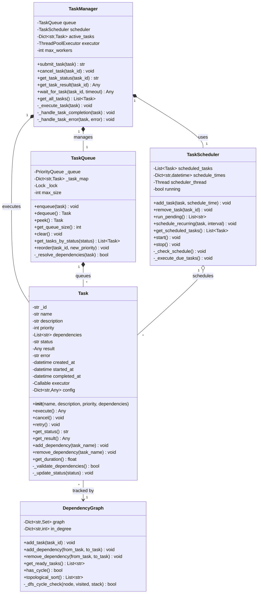
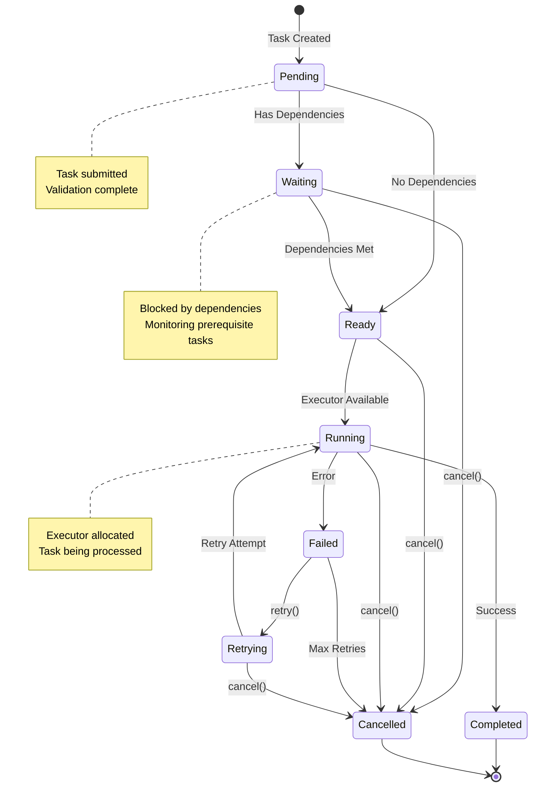
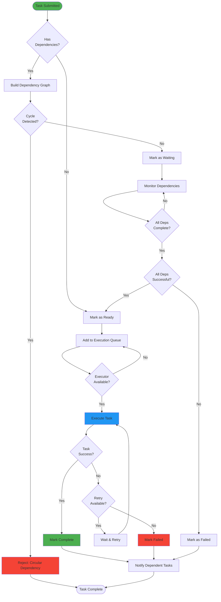
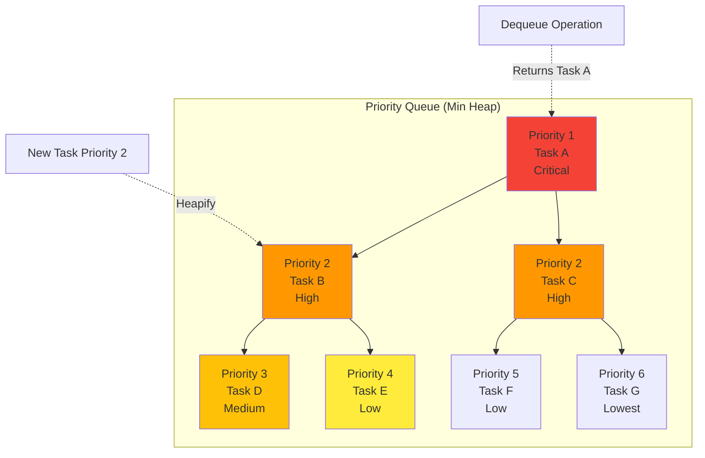

# :material-checkbox-marked-circle: Tasks Module

<div class="annotate" markdown>

The Tasks module provides a comprehensive framework for defining, scheduling, and executing work units within the AgenticAI Framework. It enables sophisticated workflow management, task coordination, and progress tracking for AI agents.

</div>


## :sparkles: Overview

!!! abstract "What are Tasks?"
    
    Tasks are the fundamental work units that agents execute. They provide structure, tracking, and coordination capabilities.

<div class="grid" markdown>

:material-file-document-edit:{ .lg } **Task Definition**
:   Create structured units of work with metadata and execution logic

:material-clock-outline:{ .lg } **Scheduling**
:   Execute tasks at specific times, intervals, or based on conditions

:material-playlist-check:{ .lg } **Queue Management**
:   Handle task prioritization, dependencies, and execution order

:material-chart-line:{ .lg } **Progress Tracking**
:   Monitor task status, results, and performance metrics

:material-alert-circle:{ .lg } **Error Handling**
:   Implement retries, fallbacks, and error recovery strategies

:material-workflow:{ .lg } **Workflow Orchestration**
:   Coordinate complex multi-step processes seamlessly

</div>


## :gear: Core Components

### :material-checkbox-outline: Task Class

The `Task` class represents a single unit of work with comprehensive metadata and execution capabilities.

!!! info "Constructor"

    ```python
    Task(
        name: str,
        description: str = "",
        priority: int = 1,
        dependencies: List[str] = None,
        config: Dict[str, Any] = None
    )
    ```

**Parameters:**

| Parameter | Type | Default | Description |
|-----------|------|---------|-------------|
| `name` | `str` | *required* | Unique identifier for the task |
| `description` | `str` | `""` | Human-readable description |
| `priority` | `int` | `1` | Priority level (1=highest, 10=lowest) |
| `dependencies` | `List[str]` | `None` | Prerequisite task names |
| `config` | `Dict[str, Any]` | `None` | Task-specific configuration |

#### Properties

| Property | Type | Description |
|----------|------|-------------|
| `id` | str | Auto-generated unique identifier |
| `name` | str | Task name |
| `description` | str | Task description |
| `status` | str | Current status (pending, running, completed, failed) |
| `priority` | int | Task priority level |
| `dependencies` | List[str] | Required predecessor tasks |
| `result` | Any | Task execution result |
| `error` | str | Error message if task failed |
| `created_at` | datetime | Task creation timestamp |
| `started_at` | datetime | Task execution start time |
| `completed_at` | datetime | Task completion time |
| `duration` | float | Execution duration in seconds |

#### Core Methods

```python
def execute() -> Any
def cancel() -> None
def retry() -> None
def get_status() -> str
def get_result() -> Any
def add_dependency(task_name: str) -> None
def remove_dependency(task_name: str) -> None
```


## :art: Low-Level Design (LLD)

### Task Management Class Diagram



### Task Execution State Machine



### Dependency Resolution Flow



### Task Priority Queue Visualization



### TaskScheduler Class

The `TaskScheduler` manages task execution timing and coordination.

#### Key Methods

```python
def add_task(task: Task, schedule_time: datetime = None) -> None
def remove_task(task_id: str) -> None
def run_pending() -> List[str]
def schedule_recurring(task: Task, interval: timedelta) -> None
def get_scheduled_tasks() -> List[Task]
```

#### Scheduling Timeline

```mermaid
gantt
    title Task Scheduling Timeline
    dateFormat HH:mm
    axisFormat %H:%M
    
    section High Priority
    Task A (P1)     :done, t1, 09:00, 10m
    Task B (P2)     :done, t2, 09:12, 15m
    
    section Medium Priority
    Task C (P5)     :done, t3, 09:30, 20m
    Task D (P5)     :active, t4, 09:52, 25m
    
    section Low Priority
    Task E (P8)     :crit, t5, 10:20, 10m
    Task F (P9)     :t6, 10:32, 15m
    
    section Recurring
    Hourly Task     :milestone, m1, 09:00, 0m
    Hourly Task     :milestone, m2, 10:00, 0m
    Hourly Task     :milestone, m3, 11:00, 0m
```



### TaskQueue Class

The `TaskQueue` provides advanced queue management with prioritization and dependency resolution.

#### Key Methods

```python
def enqueue(task: Task) -> None
def dequeue() -> Optional[Task]
def peek() -> Optional[Task]
def get_queue_size() -> int
def clear() -> None
def get_tasks_by_status(status: str) -> List[Task]
```

### TaskManager Class

The `TaskManager` provides high-level task orchestration and lifecycle management.

#### Key Methods

```python
def create_task(name: str, **kwargs) -> Task
def execute_task(task_id: str) -> Any
def list_tasks(status: str = None) -> List[Task]
def get_task(task_id: str) -> Optional[Task]
def cancel_task(task_id: str) -> None
def retry_task(task_id: str) -> None
```

## Creating and Managing Tasks

### Basic Task Creation

```python
from agenticaiframework.tasks import Task, TaskManager

# Create task manager
manager = TaskManager()

# Create a simple task
task = manager.create_task(
    name="data_processing",
    description="Process incoming data files",
    priority=1,
    config={
        "input_path": "/data/raw",
        "output_path": "/data/processed",
        "batch_size": 100
    }
)

# Execute the task
result = manager.execute_task(task.id)
print(f"Task result: {result}")
```

### Advanced Task Configuration

```python
# Create task with dependencies and custom execution logic
class DataProcessingTask(Task):
    def execute(self):
        """Custom execution logic"""
        input_path = self.config.get("input_path")
        batch_size = self.config.get("batch_size", 50)
        
        # Implement processing logic
        processed_items = []
        for batch in self.get_data_batches(input_path, batch_size):
            processed_batch = self.process_batch(batch)
            processed_items.extend(processed_batch)
        
        return {
            "processed_count": len(processed_items),
            "items": processed_items,
            "status": "completed"
        }
    
    def get_data_batches(self, path, batch_size):
        """Load data in batches"""
        # Implementation for loading data
        pass
    
    def process_batch(self, batch):
        """Process a single batch"""
        # Implementation for processing
        pass

# Create and configure advanced task
advanced_task = DataProcessingTask(
    name="advanced_data_processing",
    description="Advanced data processing with custom logic",
    priority=1,
    dependencies=["data_validation", "schema_check"],
    config={
        "input_path": "/data/raw",
        "output_path": "/data/processed",
        "batch_size": 100,
        "validation_rules": ["not_null", "type_check"],
        "processing_mode": "parallel"
    }
)
```

### Task Dependencies

```python
# Create tasks with dependencies
validation_task = manager.create_task(
    name="data_validation",
    description="Validate input data",
    priority=1
)

transformation_task = manager.create_task(
    name="data_transformation", 
    description="Transform validated data",
    priority=2,
    dependencies=["data_validation"]
)

analysis_task = manager.create_task(
    name="data_analysis",
    description="Analyze transformed data",
    priority=3,
    dependencies=["data_transformation"]
)

# Execute tasks in dependency order
manager.execute_workflow([validation_task, transformation_task, analysis_task])
```

## Task Scheduling

### Time-Based Scheduling

```python
from agenticaiframework.tasks import TaskScheduler
from datetime import datetime, timedelta

scheduler = TaskScheduler()

# Schedule task for specific time
future_time = datetime.now() + timedelta(hours=2)
scheduler.add_task(data_task, schedule_time=future_time)

# Schedule recurring task
scheduler.schedule_recurring(
    task=backup_task,
    interval=timedelta(hours=24)  # Run daily
)

# Run pending tasks
executed_tasks = scheduler.run_pending()
print(f"Executed {len(executed_tasks)} tasks")
```

### Conditional Scheduling

```python
class ConditionalScheduler(TaskScheduler):
    def add_conditional_task(self, task: Task, condition_func: Callable):
        """Add task that executes when condition is met"""
        self.conditional_tasks.append({
            "task": task,
            "condition": condition_func
        })
    
    def check_conditions(self):
        """Check and execute tasks whose conditions are met"""
        for item in self.conditional_tasks:
            if item["condition"]():
                self.add_task(item["task"])
                self.conditional_tasks.remove(item)

# Usage
def data_available():
    return os.path.exists("/data/new_files")

conditional_scheduler = ConditionalScheduler()
conditional_scheduler.add_conditional_task(
    process_new_data_task,
    data_available
)
```

### Cron-Style Scheduling

```python
class CronScheduler(TaskScheduler):
    def schedule_cron(self, task: Task, cron_expression: str):
        """Schedule task using cron expression"""
        # Parse cron expression and schedule accordingly
        schedule_info = self.parse_cron(cron_expression)
        self.cron_tasks.append({
            "task": task,
            "schedule": schedule_info
        })
    
    def parse_cron(self, expression: str):
        """Parse cron expression (simplified implementation)"""
        # Format: minute hour day month weekday
        parts = expression.split()
        return {
            "minute": parts[0] if len(parts) > 0 else "*",
            "hour": parts[1] if len(parts) > 1 else "*", 
            "day": parts[2] if len(parts) > 2 else "*",
            "month": parts[3] if len(parts) > 3 else "*",
            "weekday": parts[4] if len(parts) > 4 else "*"
        }

# Usage
cron_scheduler = CronScheduler()

# Run every day at 2:30 AM
cron_scheduler.schedule_cron(daily_report_task, "30 2 * * *")

# Run every Monday at 9:00 AM 
cron_scheduler.schedule_cron(weekly_backup_task, "0 9 * * 1")
```

## Queue Management

### Priority Queue

```python
from agenticaiframework.tasks import TaskQueue

# Create priority queue
queue = TaskQueue(queue_type="priority")

# Add tasks with different priorities
high_priority_task = Task("urgent_fix", priority=1)
medium_priority_task = Task("feature_update", priority=5)
low_priority_task = Task("cleanup", priority=9)

queue.enqueue(medium_priority_task)
queue.enqueue(high_priority_task)  # Will be processed first
queue.enqueue(low_priority_task)

# Process tasks in priority order
while queue.get_queue_size() > 0:
    task = queue.dequeue()
    print(f"Processing: {task.name} (priority: {task.priority})")
    task.execute()
```

### FIFO Queue

```python
# Create FIFO (First In, First Out) queue
fifo_queue = TaskQueue(queue_type="fifo")

# Add tasks in order
tasks = [
    Task("step_1", description="Initialize system"),
    Task("step_2", description="Load configuration"),  
    Task("step_3", description="Start processing")
]

for task in tasks:
    fifo_queue.enqueue(task)

# Process in order
while fifo_queue.get_queue_size() > 0:
    task = fifo_queue.dequeue()
    task.execute()
```

### Advanced Queue Operations

```python
class AdvancedTaskQueue(TaskQueue):
    def __init__(self):
        super().__init__()
        self.failed_tasks = []
        self.completed_tasks = []
    
    def process_with_retry(self, max_retries: int = 3):
        """Process tasks with automatic retry on failure"""
        while self.get_queue_size() > 0:
            task = self.dequeue()
            
            for attempt in range(max_retries + 1):
                try:
                    result = task.execute()
                    self.completed_tasks.append(task)
                    break
                except Exception as e:
                    if attempt == max_retries:
                        task.error = str(e)
                        task.status = "failed"
                        self.failed_tasks.append(task)
                        print(f"Task {task.name} failed after {max_retries} retries")
                    else:
                        print(f"Task {task.name} failed (attempt {attempt + 1}), retrying...")
                        time.sleep(2 ** attempt)  # Exponential backoff
    
    def get_statistics(self):
        """Get queue processing statistics"""
        return {
            "pending": self.get_queue_size(),
            "completed": len(self.completed_tasks),
            "failed": len(self.failed_tasks),
            "total_processed": len(self.completed_tasks) + len(self.failed_tasks)
        }
```

## Workflow Management

### Sequential Workflows

```python
class SequentialWorkflow:
    def __init__(self, name: str):
        self.name = name
        self.tasks = []
        self.current_step = 0
        self.status = "not_started"
    
    def add_task(self, task: Task):
        """Add task to workflow"""
        self.tasks.append(task)
    
    def execute(self):
        """Execute tasks sequentially"""
        self.status = "running"
        results = []
        
        for i, task in enumerate(self.tasks):
            self.current_step = i
            try:
                result = task.execute()
                results.append(result)
                print(f"Completed step {i + 1}: {task.name}")
            except Exception as e:
                print(f"Workflow failed at step {i + 1}: {task.name}")
                self.status = "failed"
                return {"status": "failed", "error": str(e), "step": i + 1}
        
        self.status = "completed"
        return {"status": "completed", "results": results}

# Usage
workflow = SequentialWorkflow("data_pipeline")
workflow.add_task(Task("extract_data"))
workflow.add_task(Task("transform_data"))
workflow.add_task(Task("load_data"))

result = workflow.execute()
```

### Parallel Workflows

```python
import asyncio
from concurrent.futures import ThreadPoolExecutor

class ParallelWorkflow:
    def __init__(self, name: str, max_workers: int = 4):
        self.name = name
        self.tasks = []
        self.max_workers = max_workers
        self.status = "not_started"
    
    def add_task(self, task: Task):
        """Add task to parallel workflow"""
        self.tasks.append(task)
    
    def execute_parallel(self):
        """Execute tasks in parallel using threads"""
        self.status = "running"
        
        with ThreadPoolExecutor(max_workers=self.max_workers) as executor:
            # Submit all tasks
            future_to_task = {
                executor.submit(task.execute): task for task in self.tasks
            }
            
            results = {}
            for future in concurrent.futures.as_completed(future_to_task):
                task = future_to_task[future]
                try:
                    result = future.result()
                    results[task.name] = result
                    print(f"Completed: {task.name}")
                except Exception as e:
                    results[task.name] = {"error": str(e)}
                    print(f"Failed: {task.name} - {e}")
        
        self.status = "completed"
        return results
    
    async def execute_async(self):
        """Execute tasks asynchronously"""
        self.status = "running"
        
        async def run_task(task):
            try:
                # Convert synchronous task to async
                loop = asyncio.get_event_loop()
                result = await loop.run_in_executor(None, task.execute)
                return task.name, result
            except Exception as e:
                return task.name, {"error": str(e)}
        
        # Run all tasks concurrently
        task_coroutines = [run_task(task) for task in self.tasks]
        results = await asyncio.gather(*task_coroutines)
        
        self.status = "completed"
        return dict(results)

# Usage
parallel_workflow = ParallelWorkflow("batch_processing", max_workers=8)
parallel_workflow.add_task(Task("process_batch_1"))
parallel_workflow.add_task(Task("process_batch_2"))
parallel_workflow.add_task(Task("process_batch_3"))

# Execute with threads
results = parallel_workflow.execute_parallel()

# Or execute asynchronously
# results = asyncio.run(parallel_workflow.execute_async())
```

### Conditional Workflows

```python
class ConditionalWorkflow:
    def __init__(self, name: str):
        self.name = name
        self.steps = []
        self.status = "not_started"
    
    def add_step(self, task: Task, condition: Callable = None):
        """Add conditional step to workflow"""
        self.steps.append({
            "task": task,
            "condition": condition or (lambda: True)
        })
    
    def add_branch(self, condition: Callable, true_task: Task, false_task: Task = None):
        """Add branching logic to workflow"""
        self.steps.append({
            "type": "branch",
            "condition": condition,
            "true_task": true_task,
            "false_task": false_task
        })
    
    def execute(self, context: Dict = None):
        """Execute workflow with conditional logic"""
        self.status = "running"
        context = context or {}
        results = []
        
        for step in self.steps:
            if step.get("type") == "branch":
                # Handle branching
                if step["condition"](context):
                    if step["true_task"]:
                        result = step["true_task"].execute()
                        results.append(result)
                        context["last_result"] = result
                else:
                    if step["false_task"]:
                        result = step["false_task"].execute()
                        results.append(result)
                        context["last_result"] = result
            else:
                # Handle conditional task
                if step["condition"](context):
                    result = step["task"].execute()
                    results.append(result)
                    context["last_result"] = result
                    print(f"Executed: {step['task'].name}")
                else:
                    print(f"Skipped: {step['task'].name} (condition not met)")
        
        self.status = "completed"
        return {"status": "completed", "results": results, "context": context}

# Usage
conditional_workflow = ConditionalWorkflow("smart_processing")

# Add conditional steps
conditional_workflow.add_step(
    Task("validate_input"),
    condition=lambda ctx: ctx.get("input_available", True)
)

# Add branching
conditional_workflow.add_branch(
    condition=lambda ctx: ctx.get("data_size", 0) > 1000,
    true_task=Task("parallel_processing"),
    false_task=Task("sequential_processing")
)

conditional_workflow.add_step(
    Task("generate_report"),
    condition=lambda ctx: ctx.get("last_result", {}).get("status") == "success"
)

# Execute with context
result = conditional_workflow.execute({"input_available": True, "data_size": 1500})
```

## Error Handling and Recovery

### Retry Mechanisms

```python
class RetryableTask(Task):
    def __init__(self, name: str, max_retries: int = 3, backoff_factor: float = 2.0, **kwargs):
        super().__init__(name, **kwargs)
        self.max_retries = max_retries
        self.backoff_factor = backoff_factor
        self.retry_count = 0
    
    def execute_with_retry(self):
        """Execute task with automatic retry logic"""
        for attempt in range(self.max_retries + 1):
            try:
                self.retry_count = attempt
                result = self.execute()
                return result
            except Exception as e:
                if attempt == self.max_retries:
                    self.status = "failed"
                    self.error = f"Failed after {self.max_retries} retries: {str(e)}"
                    raise e
                else:
                    wait_time = self.backoff_factor ** attempt
                    print(f"Task {self.name} failed (attempt {attempt + 1}), retrying in {wait_time}s...")
                    time.sleep(wait_time)

# Usage
retryable_task = RetryableTask(
    name="api_call",
    description="Call external API",
    max_retries=5,
    backoff_factor=1.5
)

try:
    result = retryable_task.execute_with_retry()
except Exception as e:
    print(f"Task ultimately failed: {e}")
```

### Circuit Breaker Pattern

```python
class CircuitBreakerTask(Task):
    def __init__(self, name: str, failure_threshold: int = 5, recovery_timeout: int = 60, **kwargs):
        super().__init__(name, **kwargs)
        self.failure_threshold = failure_threshold
        self.recovery_timeout = recovery_timeout
        self.failure_count = 0
        self.last_failure_time = None
        self.state = "closed"  # closed, open, half-open
    
    def execute_with_circuit_breaker(self):
        """Execute task with circuit breaker pattern"""
        if self.state == "open":
            if time.time() - self.last_failure_time > self.recovery_timeout:
                self.state = "half-open"
                print(f"Circuit breaker for {self.name} moving to half-open state")
            else:
                raise Exception(f"Circuit breaker open for task {self.name}")
        
        try:
            result = self.execute()
            
            if self.state == "half-open":
                self.state = "closed"
                self.failure_count = 0
                print(f"Circuit breaker for {self.name} closed - service recovered")
            
            return result
            
        except Exception as e:
            self.failure_count += 1
            self.last_failure_time = time.time()
            
            if self.failure_count >= self.failure_threshold:
                self.state = "open"
                print(f"Circuit breaker for {self.name} opened due to {self.failure_count} failures")
            
            raise e

# Usage
cb_task = CircuitBreakerTask(
    name="external_service_call",
    failure_threshold=3,
    recovery_timeout=30
)
```

## Performance Monitoring

### Task Metrics

```python
class MetricsTask(Task):
    def __init__(self, name: str, **kwargs):
        super().__init__(name, **kwargs)
        self.metrics = {
            "execution_count": 0,
            "total_duration": 0,
            "min_duration": float('inf'),
            "max_duration": 0,
            "error_count": 0,
            "last_execution": None
        }
    
    def execute_with_metrics(self):
        """Execute task while collecting performance metrics"""
        start_time = time.time()
        self.metrics["last_execution"] = start_time
        
        try:
            result = self.execute()
            duration = time.time() - start_time
            
            # Update metrics
            self.metrics["execution_count"] += 1
            self.metrics["total_duration"] += duration
            self.metrics["min_duration"] = min(self.metrics["min_duration"], duration)
            self.metrics["max_duration"] = max(self.metrics["max_duration"], duration)
            
            return result
            
        except Exception as e:
            duration = time.time() - start_time
            self.metrics["error_count"] += 1
            self.metrics["total_duration"] += duration
            raise e
    
    def get_performance_stats(self):
        """Get comprehensive performance statistics"""
        if self.metrics["execution_count"] == 0:
            return {"status": "no_executions"}
        
        avg_duration = self.metrics["total_duration"] / self.metrics["execution_count"]
        error_rate = self.metrics["error_count"] / self.metrics["execution_count"]
        
        return {
            "execution_count": self.metrics["execution_count"],
            "average_duration": avg_duration,
            "min_duration": self.metrics["min_duration"],
            "max_duration": self.metrics["max_duration"],
            "error_rate": error_rate,
            "total_duration": self.metrics["total_duration"],
            "last_execution": self.metrics["last_execution"]
        }
```

### Resource Monitoring

```python
import psutil

class ResourceMonitoringTask(MetricsTask):
    def execute_with_monitoring(self):
        """Execute task while monitoring system resources"""
        # Capture initial resource state
        initial_memory = psutil.virtual_memory().used
        initial_cpu = psutil.cpu_percent()
        
        start_time = time.time()
        
        try:
            result = self.execute_with_metrics()
            
            # Capture final resource state
            final_memory = psutil.virtual_memory().used
            final_cpu = psutil.cpu_percent()
            duration = time.time() - start_time
            
            # Calculate resource usage
            memory_delta = final_memory - initial_memory
            
            # Store resource metrics
            self.resource_metrics = {
                "duration": duration,
                "memory_used": memory_delta,
                "peak_memory": psutil.virtual_memory().used,
                "cpu_usage": final_cpu,
                "timestamp": start_time
            }
            
            return result
            
        except Exception as e:
            # Capture resource state even on failure
            duration = time.time() - start_time
            self.resource_metrics = {
                "duration": duration,
                "memory_used": psutil.virtual_memory().used - initial_memory,
                "peak_memory": psutil.virtual_memory().used,
                "cpu_usage": psutil.cpu_percent(),
                "timestamp": start_time,
                "error": str(e)
            }
            raise e
    
    def get_resource_stats(self):
        """Get resource usage statistics"""
        return getattr(self, 'resource_metrics', {})
```

## Integration with Other Modules

### Agent Integration

```python
from agenticaiframework.agents import Agent

class TaskExecutingAgent(Agent):
    def __init__(self, name: str, role: str, capabilities: List[str], config: Dict):
        super().__init__(name, role, capabilities, config)
        self.task_queue = TaskQueue()
        self.task_history = []
    
    def assign_task(self, task: Task):
        """Assign task to agent"""
        self.task_queue.enqueue(task)
        print(f"Task {task.name} assigned to agent {self.name}")
    
    def process_tasks(self):
        """Process all queued tasks"""
        while self.task_queue.get_queue_size() > 0:
            task = self.task_queue.dequeue()
            
            try:
                print(f"Agent {self.name} executing task: {task.name}")
                result = task.execute()
                task.status = "completed"
                task.result = result
                
            except Exception as e:
                task.status = "failed"
                task.error = str(e)
                print(f"Task {task.name} failed: {e}")
            
            self.task_history.append(task)
    
    def get_task_summary(self):
        """Get summary of completed tasks"""
        completed = [t for t in self.task_history if t.status == "completed"]
        failed = [t for t in self.task_history if t.status == "failed"]
        
        return {
            "total_tasks": len(self.task_history),
            "completed": len(completed),
            "failed": len(failed),
            "success_rate": len(completed) / max(1, len(self.task_history))
        }

# Usage
agent = TaskExecutingAgent(
    name="TaskProcessor",
    role="Task Execution Specialist",
    capabilities=["task_execution", "data_processing"],
    config={}
)

# Assign tasks to agent
agent.assign_task(Task("process_data_batch_1"))
agent.assign_task(Task("process_data_batch_2"))
agent.assign_task(Task("generate_report"))

# Process all tasks
agent.process_tasks()

# Get summary
summary = agent.get_task_summary()
print(f"Agent processed {summary['total_tasks']} tasks with {summary['success_rate']:.2%} success rate")
```

### Memory Integration

```python
from agenticaiframework.memory import MemoryManager

class MemoryAwareTask(Task):
    def __init__(self, name: str, **kwargs):
        super().__init__(name, **kwargs)
        self.memory = MemoryManager()
    
    def execute_with_memory(self):
        """Execute task with memory context"""
        # Retrieve relevant context from memory
        context = self.memory.retrieve(f"context_{self.name}")
        
        # Execute task with context
        result = self.execute()
        
        # Store result in memory for future tasks
        self.memory.store(f"result_{self.name}", result)
        
        # Store execution metadata
        self.memory.store(f"execution_time_{self.name}", time.time())
        
        return result
    
    def get_memory_context(self, keys: List[str]):
        """Retrieve specific keys from memory"""
        context = {}
        for key in keys:
            value = self.memory.retrieve(key)
            if value is not None:
                context[key] = value
        return context
```

## Best Practices

### Task Design Principles

1. **Single Responsibility**: Each task should have one clear, well-defined purpose
2. **Idempotency**: Tasks should produce the same result when executed multiple times
3. **Statelessness**: Tasks should not rely on external state that could change
4. **Error Transparency**: Tasks should provide clear error messages and recovery guidance
5. **Resource Efficiency**: Tasks should be mindful of memory and CPU usage

### Performance Optimization

```python
class OptimizedTask(Task):
    def __init__(self, name: str, **kwargs):
        super().__init__(name, **kwargs)
        self.cache = {}
        self.cache_enabled = kwargs.get("cache_enabled", True)
        self.cache_ttl = kwargs.get("cache_ttl", 3600)  # 1 hour
    
    def execute_with_cache(self, *args, **kwargs):
        """Execute task with result caching"""
        if not self.cache_enabled:
            return self.execute(*args, **kwargs)
        
        # Create cache key
        cache_key = self.create_cache_key(args, kwargs)
        
        # Check cache
        if cache_key in self.cache:
            cache_entry = self.cache[cache_key]
            if time.time() - cache_entry["timestamp"] < self.cache_ttl:
                return cache_entry["result"]
            else:
                # Cache expired, remove entry
                del self.cache[cache_key]
        
        # Execute and cache result
        result = self.execute(*args, **kwargs)
        self.cache[cache_key] = {
            "result": result,
            "timestamp": time.time()
        }
        
        return result
    
    def create_cache_key(self, args, kwargs):
        """Create cache key from arguments"""
        import hashlib
        key_data = f"{self.name}_{str(args)}_{str(kwargs)}"
        return hashlib.md5(key_data.encode()).hexdigest()
    
    def clear_cache(self):
        """Clear task cache"""
        self.cache.clear()
```

### Error Handling Best Practices

```python
class RobustTask(Task):
    def __init__(self, name: str, **kwargs):
        super().__init__(name, **kwargs)
        self.error_handlers = {}
        self.fallback_function = kwargs.get("fallback_function")
    
    def register_error_handler(self, error_type: type, handler: Callable):
        """Register specific error handler"""
        self.error_handlers[error_type] = handler
    
    def execute_with_error_handling(self):
        """Execute task with comprehensive error handling"""
        try:
            return self.execute()
            
        except Exception as e:
            # Try specific error handler
            for error_type, handler in self.error_handlers.items():
                if isinstance(e, error_type):
                    try:
                        return handler(e, self)
                    except Exception as handler_error:
                        print(f"Error handler failed: {handler_error}")
            
            # Try fallback function
            if self.fallback_function:
                try:
                    return self.fallback_function(e, self)
                except Exception as fallback_error:
                    print(f"Fallback function failed: {fallback_error}")
            
            # Re-raise original exception if no handler worked
            raise e
    
    def create_fallback_result(self, error: Exception):
        """Create a safe fallback result"""
        return {
            "status": "completed_with_errors",
            "error": str(error),
            "fallback_used": True,
            "partial_result": None
        }

# Usage with error handling
def handle_connection_error(error, task):
    print(f"Handling connection error for {task.name}: {error}")
    # Implement retry logic or alternative approach
    return task.create_fallback_result(error)

def handle_validation_error(error, task):
    print(f"Handling validation error for {task.name}: {error}")
    # Implement data cleaning or user notification
    return {"status": "validation_failed", "error": str(error)}

robust_task = RobustTask(
    name="api_data_fetch",
    fallback_function=lambda e, t: {"status": "fallback", "data": []}
)

robust_task.register_error_handler(ConnectionError, handle_connection_error)
robust_task.register_error_handler(ValueError, handle_validation_error)
```

## Troubleshooting

### Common Issues and Solutions

1. **Task Dependencies Not Resolving**
   ```python
   # Check dependency graph for cycles
   def check_dependency_cycles(tasks):
       visited = set()
       rec_stack = set()
       
       def has_cycle(task_name):
           if task_name in rec_stack:
               return True
           if task_name in visited:
               return False
           
           visited.add(task_name)
           rec_stack.add(task_name)
           
           task = get_task_by_name(task_name)
           for dep in task.dependencies:
               if has_cycle(dep):
                   return True
           
           rec_stack.remove(task_name)
           return False
       
       for task in tasks:
           if has_cycle(task.name):
               print(f"Dependency cycle detected involving task: {task.name}")
               return True
       return False
   ```

2. **Memory Leaks in Long-Running Tasks**
   ```python
   def monitor_memory_usage(task):
       initial_memory = psutil.virtual_memory().used
       
       result = task.execute()
       
       final_memory = psutil.virtual_memory().used
       memory_increase = final_memory - initial_memory
       
       if memory_increase > 100 * 1024 * 1024:  # 100MB threshold
           print(f"Warning: Task {task.name} used {memory_increase / 1024 / 1024:.2f}MB")
       
       return result
   ```

3. **Task Timeout Issues**
   ```python
   import signal
   
   class TimeoutTask(Task):
       def execute_with_timeout(self, timeout_seconds: int = 300):
           def timeout_handler(signum, frame):
               raise TimeoutError(f"Task {self.name} timed out after {timeout_seconds} seconds")
           
           # Set timeout
           signal.signal(signal.SIGALRM, timeout_handler)
           signal.alarm(timeout_seconds)
           
           try:
               result = self.execute()
               signal.alarm(0)  # Cancel timeout
               return result
           except Exception as e:
               signal.alarm(0)  # Cancel timeout
               raise e
   ```

### Debugging Tools

```python
class DebugTask(Task):
    def __init__(self, name: str, debug_mode: bool = False, **kwargs):
        super().__init__(name, **kwargs)
        self.debug_mode = debug_mode
        self.debug_info = []
    
    def debug_execute(self):
        """Execute task with comprehensive debugging"""
        if not self.debug_mode:
            return self.execute()
        
        # Capture execution context
        context = {
            "task_name": self.name,
            "start_time": time.time(),
            "memory_before": psutil.virtual_memory().used,
            "config": self.config.copy()
        }
        
        self.debug_info.append(f"Starting task {self.name}")
        self.debug_info.append(f"Config: {context['config']}")
        
        try:
            result = self.execute()
            
            context["end_time"] = time.time()
            context["duration"] = context["end_time"] - context["start_time"]
            context["memory_after"] = psutil.virtual_memory().used
            context["memory_used"] = context["memory_after"] - context["memory_before"]
            context["result_size"] = len(str(result))
            
            self.debug_info.append(f"Task completed in {context['duration']:.2f}s")
            self.debug_info.append(f"Memory used: {context['memory_used'] / 1024 / 1024:.2f}MB")
            self.debug_info.append(f"Result size: {context['result_size']} characters")
            
            return result
            
        except Exception as e:
            context["error"] = str(e)
            context["end_time"] = time.time()
            context["duration"] = context["end_time"] - context["start_time"]
            
            self.debug_info.append(f"Task failed after {context['duration']:.2f}s")
            self.debug_info.append(f"Error: {context['error']}")
            
            raise e
    
    def get_debug_report(self):
        """Get comprehensive debug report"""
        return {
            "task_name": self.name,
            "debug_info": self.debug_info,
            "config": self.config,
            "status": self.status
        }
```

This comprehensive Tasks module documentation provides everything needed to effectively use tasks within the AgenticAI Framework, from basic concepts to advanced patterns and troubleshooting techniques.
