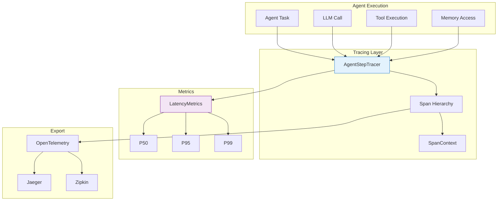

# Distributed Tracing

<div class="annotate" markdown>

**Distributed tracing and latency metrics for AI agents**

Track agent execution, measure performance, and debug complex workflows across **400+ modules**

</div>

!!! success "Enterprise Observability"
    Part of **237 enterprise modules** with **16 observability features** including APM integration, real-time dashboards, and alerting. See [Enterprise Documentation](enterprise.md).

---

## Quick Navigation

<div class="grid cards" markdown>

- :material-timeline:{ .lg } **Agent Step Tracing**

    Track execution flow with spans

    [:octicons-arrow-right-24: Learn More](#agent-step-tracer)

- :material-speedometer:{ .lg } **Latency Metrics**

    Percentile-based performance tracking

    [:octicons-arrow-right-24: Measure](#latency-metrics)

- :material-share-variant:{ .lg } **Context Propagation**

    Trace across distributed systems

    [:octicons-arrow-right-24: Propagate](#context-propagation)

- :material-export:{ .lg } **Export & Integration**

    OpenTelemetry compatible

    [:octicons-arrow-right-24: Export](#export-traces)

</div>

## Overview

!!! success "Enterprise Observability"

    Part of **16 observability modules** including distributed tracing, metrics collection, log aggregation, alerting, and APM.

!!! abstract "Tracing Architecture"

    The Tracing module provides OpenTelemetry-compatible distributed tracing for AI agent applications. Track every step of agent execution with detailed spans, measure latency percentiles, and export traces to your observability platform.

### Architecture



---

## Agent Step Tracer

The `AgentStepTracer` provides step-by-step execution tracking with span hierarchy.

### Basic Usage

```python
from agenticaiframework.tracing import AgentStepTracer, tracer

# Use global tracer instance
tracer = AgentStepTracer()

# Start a trace for an agent task
with tracer.start_trace("agent_task", agent_id="agent-001") as trace:
    # Track individual steps
    with tracer.start_span("llm_call", trace_id=trace.trace_id) as span:
        response = llm.generate("What is AI?")
        span.set_attribute("model", "gpt-4")
        span.set_attribute("tokens", 150)

    with tracer.start_span("tool_execution", trace_id=trace.trace_id) as span:
        result = tool.execute()
        span.set_attribute("tool_name", "web_search")
        span.set_status("success")
```

### Span Hierarchy

Create nested spans for complex operations:

```python
from agenticaiframework.tracing import tracer, Span

# Root span
with tracer.start_trace("workflow") as root:

    # Child span 1
    with tracer.start_span("data_collection", parent=root) as collect:
        # Grandchild spans
        with tracer.start_span("fetch_api", parent=collect):
            api_data = fetch_from_api()

        with tracer.start_span("query_database", parent=collect):
            db_data = query_database()

    # Child span 2
    with tracer.start_span("data_processing", parent=root) as process:
        result = process_data(api_data, db_data)
        process.set_attribute("records_processed", len(result))
```

### Span Attributes

Add metadata to spans:

```python
with tracer.start_span("llm_inference") as span:
    # Standard attributes
    span.set_attribute("model.name", "gpt-4")
    span.set_attribute("model.provider", "openai")
    span.set_attribute("input.tokens", 500)
    span.set_attribute("output.tokens", 150)
    span.set_attribute("temperature", 0.7)

    # Custom attributes
    span.set_attribute("custom.request_id", "req-123")
    span.set_attribute("custom.user_id", "user-456")

    # Set status
    try:
        result = llm.generate(prompt)
        span.set_status("success")
        span.set_attribute("output.length", len(result))
    except Exception as e:
        span.set_status("error", str(e))
        span.record_exception(e)
        raise
```

### Events and Annotations

Record events within spans:

```python
with tracer.start_span("agent_decision") as span:
    # Add events
    span.add_event("thinking_started", {"context_size": 4096})

    # Processing...
    decision = agent.think()

    span.add_event("thinking_completed", {
        "decision": decision.type,
        "confidence": decision.confidence
    })

    # Add annotations
    span.annotate("Decision based on 3 context items")
```

---

## Latency Metrics

Track and analyze operation latencies with percentile calculations.

### Recording Latencies

```python
from agenticaiframework.tracing import LatencyMetrics, latency_metrics

# Use global instance
metrics = LatencyMetrics()

# Record individual latencies
metrics.record("llm_inference", 1.23) # seconds
metrics.record("llm_inference", 0.98)
metrics.record("llm_inference", 1.45)

# Record with context
metrics.record("tool_execution", 0.5, {
    "tool": "web_search",
    "agent": "researcher"
})
```

### Percentile Calculations

```python
import logging

logger = logging.getLogger(__name__)

# Get percentiles for an operation
percentiles = metrics.get_percentiles("llm_inference")
logger.info(f"P50: {percentiles['p50']:.3f}s")
logger.info(f"P95: {percentiles['p95']:.3f}s")
logger.info(f"P99: {percentiles['p99']:.3f}s")

# Get all statistics
stats = metrics.get_stats("llm_inference")
logger.info(f"Count: {stats['count']}")
logger.info(f"Mean: {stats['mean']:.3f}s")
logger.info(f"Min: {stats['min']:.3f}s")
logger.info(f"Max: {stats['max']:.3f}s")
logger.info(f"Std Dev: {stats['std']:.3f}s")
```

### Time Windows

Analyze latencies over time periods:

```python
import logging

logger = logging.getLogger(__name__)

# Get metrics for last hour
hourly_stats = metrics.get_stats(
    "llm_inference",
    time_window="1h"
)

# Get metrics for last 24 hours
daily_stats = metrics.get_stats(
    "llm_inference",
    time_window="24h"
)

# Compare periods
comparison = metrics.compare_periods(
    "llm_inference",
    period1="1h",
    period2="24h"
)
logger.info(f"Latency change: {comparison['p50_change']:.2%}")
```

### Alerts and Thresholds

Set up latency alerts:

```python
import logging

logger = logging.getLogger(__name__)

# Configure thresholds
metrics.set_threshold("llm_inference", p95=2.0, p99=5.0)

# Check for violations
violations = metrics.check_thresholds("llm_inference")
if violations:
    for v in violations:
        logger.info(f"Alert: {v['metric']} {v['percentile']} exceeded threshold")
```

---

## Context Propagation

Propagate trace context across service boundaries.

### SpanContext

```python
from agenticaiframework.tracing import SpanContext

# Create context
context = SpanContext(
    trace_id="abc123",
    span_id="span456",
    trace_flags=1,
    trace_state={"tenant": "acme"}
)

# Serialize for transmission
headers = context.to_headers()
# {'traceparent': '00-abc123-span456-01', 'tracestate': 'tenant=acme'}

# Reconstruct from headers
received_context = SpanContext.from_headers(headers)
```

### Cross-Service Tracing

```python
# Service A: Start trace and propagate
with tracer.start_trace("api_request") as trace:
    # Create context for downstream call
    context = trace.get_context()

    # Make HTTP call with trace context
    response = httpx.post(
        "https://service-b/process",
        headers=context.to_headers(),
        json=data
    )

# Service B: Continue trace
def handle_request(request):
    # Extract context from headers
    context = SpanContext.from_headers(request.headers)

    # Continue the trace
    with tracer.continue_trace(context, "process_data"):
        result = process(request.json)

    return result
```

### Async Context Propagation

```python
import asyncio
from agenticaiframework.tracing import tracer

async def async_workflow():
    with tracer.start_trace("async_workflow") as trace:
        # Context automatically propagates to async tasks
        tasks = [async_step_1(trace.context),
            async_step_2(trace.context),
            async_step_3(trace.context)
        ]
        results = await asyncio.gather(*tasks)
    return results

async def async_step_1(parent_context):
    with tracer.continue_trace(parent_context, "step_1"):
        await asyncio.sleep(0.1)
        return "Step 1 complete"
```

---

## Export Traces

Export traces to external observability platforms.

### OpenTelemetry Export

```python
from agenticaiframework.tracing import tracer

# Configure OTLP exporter
tracer.configure_export(
    exporter="otlp",
    endpoint="http://collector:4317",
    headers={"Authorization": "Bearer token"}
)

# Traces automatically exported
with tracer.start_trace("exported_trace"):
    # Your code here
    pass
```

### Jaeger Export

```python
# Configure Jaeger exporter
tracer.configure_export(
    exporter="jaeger",
    agent_host="localhost",
    agent_port=6831,
    service_name="my-agent-service"
)
```

### Zipkin Export

```python
# Configure Zipkin exporter
tracer.configure_export(
    exporter="zipkin",
    endpoint="http://zipkin:9411/api/v2/spans"
)
```

### Custom Export

```python
# Export to custom backend
def custom_exporter(spans):
    for span in spans:
        # Send to your backend
        send_to_backend({
            "trace_id": span.trace_id,
            "span_id": span.span_id,
            "name": span.name,
            "duration": span.duration,
            "attributes": span.attributes
        })

tracer.configure_export(
    exporter="custom",
    export_function=custom_exporter
)
```

---

## Complete Example

```python
import logging

logger = logging.getLogger(__name__)

from agenticaiframework import Agent, AgentManager
from agenticaiframework.tracing import tracer, latency_metrics
import time

# Create agents
analyst = Agent(
    name="DataAnalyst",
    role="Analyzes data",
    capabilities=["analysis"],
    config={}
)

# Traced workflow
def analyze_data_workflow(data):
    with tracer.start_trace("data_analysis_workflow") as trace:
        trace.set_attribute("data.size", len(data))

        # Step 1: Data validation
        start = time.time()
        with tracer.start_span("validate_data", parent=trace) as span:
            validated = validate(data)
            span.set_attribute("valid_records", len(validated))
        latency_metrics.record("validation", time.time() - start)

        # Step 2: LLM analysis
        start = time.time()
        with tracer.start_span("llm_analysis", parent=trace) as span:
            analysis = analyst.analyze(validated)
            span.set_attribute("insights_count", len(analysis.insights))
            span.add_event("analysis_complete")
        latency_metrics.record("llm_analysis", time.time() - start)

        # Step 3: Generate report
        start = time.time()
        with tracer.start_span("generate_report", parent=trace) as span:
            report = generate_report(analysis)
            span.set_attribute("report.pages", report.page_count)
        latency_metrics.record("report_generation", time.time() - start)

        return report

# Execute and check metrics
result = analyze_data_workflow(my_data)

# Check performance
for operation in ["validation", "llm_analysis", "report_generation"]:
    stats = latency_metrics.get_percentiles(operation)
    logger.info(f"{operation}: P50={stats['p50']:.3f}s, P95={stats['p95']:.3f}s")
```

---

## Metrics Summary

| Metric | Description | Type |
|--------|-------------|------|
| `trace_count` | Total traces recorded | Counter |
| `span_count` | Total spans recorded | Counter |
| `span_duration` | Span duration distribution | Histogram |
| `active_spans` | Currently active spans | Gauge |
| `export_success` | Successful exports | Counter |
| `export_failure` | Failed exports | Counter |

---

## Best Practices

!!! tip "Tracing Guidelines"

    1. **Trace significant operations** - Don't trace every function call
    2. **Use meaningful span names** - `llm_inference` not `step1`
    3. **Add relevant attributes** - Include context for debugging
    4. **Set appropriate sampling** - Balance detail vs. overhead
    5. **Propagate context** - Maintain trace continuity across services

!!! warning "Performance Considerations"

    - Tracing adds overhead - use sampling in production
    - Large attribute values impact memory
    - Batch exports to reduce network calls
    - Clean up old traces to prevent memory leaks

---

## Related Documentation

- [Monitoring](monitoring.md) - System monitoring and alerts
- [Evaluation](evaluation.md) - Performance evaluation
- [Best Practices](best-practices.md) - Production guidelines
- [Deployment](deployment.md) - Production deployment
